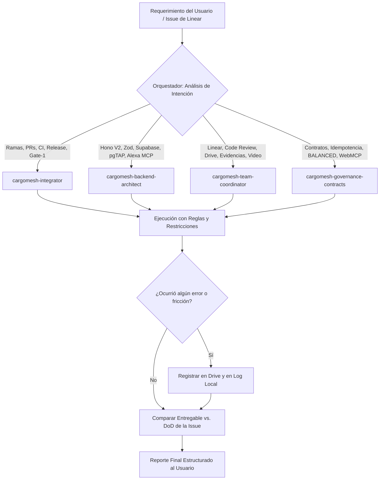

# CargoMesh Autonomous Orchestrator Skill

Esta skill gobierna la ejecución autónoma de Antigravity en CargoMesh V2. Actúa como el
director de operaciones que interpreta los requerimientos, selecciona las herramientas adecuadas,
hace cumplir las restricciones y valida el resultado final contra la tarea asignada.

---

## 🧭 1. Matriz de Enrutamiento Automático de Skills

El orquestador analiza las palabras clave e intención del requerimiento y activa en segundo plano
la skill correspondiente sin esperar a que el usuario la especifique:



| Tipo de Tarea | Patrones / Palabras Clave | Skill(s) Activadas |
|---|---|---|
| **Git / PR / CI** | ramas, PR, pull request, merge, checks, pgTAP runner, release, preflight, gate-1, gh | `cargomesh-integrator` |
| **Backend / DB** | Hono, endpoint, router, zValidator, Supabase, migración, pgTAP, test.sql, Alexa, /mcp, SSML | `cargomesh-backend-architect` |
| **Gestión / QA** | Linear, ticket, HAC-X, sprint, review, checklist, Drive, HAC-18, evidencias, video, guion | `cargomesh-team-coordinator` |
| **Contratos / Reglas** | draft_version, idempotencia, SHA-256, BALANCED score, Andes, Inca, Pacific, WebMCP provider | `cargomesh-governance-contracts` |

---

## 🔄 2. Ciclo de Vida de Ejecución del Orquestador

Para cada tarea o issue abordada, el orquestador sigue estrictamente estos 5 pasos:

### Paso 1: Lectura del Contexto de la Issue
- Extrae de la issue de Linear (o del prompt del usuario) las 5 secciones estándar:
  1. **Objetivo**
  2. **Herramientas requeridas**
  3. **Flujo sugerido**
  4. **Entrega Final (DoD)**
  5. **Checklist de avance**

### Paso 2: Validación de Restricciones y Ramas
- Verifica las restricciones antes de escribir código:
  - 🛑 **¿La rama base es `codex/c-mcp-contracts`?** (Si alguien intenta apuntar a `main`, se bloquea inmediatamente).
  - 🔒 **¿El merge está autorizado?** (Solo el Tech Lead / Integrador de ciclo en sesión Gate-1 puede autorizar merge a la base).
  - 🌿 **¿El agente está trabajando en la rama asignada al rol?** (Aislamiento de ramas).

### Paso 3: Ejecución Técnica
- Aplica los patrones de desarrollo de la skill seleccionada (`*-policy.ts` para pruebas rápidas, validación Zod, transacciones pgTAP aisladas, etc.).
- Ejecuta las verificaciones locales relevantes (`pnpm typecheck`, `npx supabase test db`, `pnpm test:release`).

### Paso 4: Cotejo vs. Objetivo (Cross-Check de Cierre)
- El orquestador redacta el **Resumen de lo Elaborado**:
  - Commits generados.
  - Archivos creados o modificados.
  - Métricas de prueba verificadas.
- Compara campo por campo el resumen contra el **Checklist de avance** y la **Entrega Final (DoD)** de la issue.
- Si falta algún punto del DoD, no marca la tarea como completa y ejecuta el ajuste pendiente.

### Paso 5: Registro Obligatorio de Incidentes (Friction Logging)
Si durante la ejecución se presenta **cualquier fallo de tooling, incompatibilidad de librerías, error de build o workaround no trivial**:
1. **Log en Drive:** Redacta y notifica el archivo para `02_Friction_Logs_Borradores/FL-XX.md` (evidencia clave para el bono del 10% del jurado).
2. **Log Local del Equipo:** Guarda copia en `docs/04-execution/friction-logs/FL-XX.md` para visibilidad inmediata del usuario y los agentes.

---

## 📋 3. Formato del Reporte de Salida del Orquestador

Al concluir cualquier interacción, el orquestador presenta un resumen estructurado:

```markdown
### 🤖 Orquestador CargoMesh: Reporte de Ejecución

- **Requerimiento / Issue:** [ID - Título]
- **Skill(s) Empleada(s):** [cargomesh-... activada automáticamente]
- **Rama Activa:** `[feat/...]` ➔ Base: `codex/c-mcp-contracts`
- **Estado de Restricciones:** ✅ Verificadas (Cero merges no autorizados, cero pushes a main)

#### 📝 Resumen de lo Elaborado:
- **Archivos modificados/creados:** `...`
- **Pruebas ejecutadas:** `[TypeScript 0 errores, X pgTAP ok, etc.]`
- **Cotejo vs DoD:** ✅ 100% cumplido contra la issue objetivo.

#### ⚠️ Registro de Incidentes (Friction Log):
- [Ninguno detectado / FL-XX registrado en Drive y docs/04-execution/friction-logs/]
```
