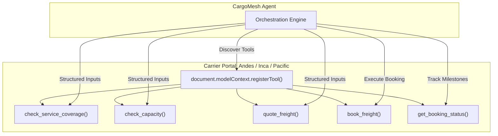

# CargoMesh ⬡

> **Agent-Native Autonomous Freight Orchestration for Cross-Border B2B Logistics**  
> *Built for the WebMCP Challenge 2026*

[](https://github.com/Chujutak2024/cargomesh)
[](https://nextjs.org/)
[](https://www.typescriptlang.org/)
[](https://supabase.com/)
[](https://tailwindcss.com/)

---

## 📖 Table of Contents
1. [Executive Summary](#-executive-summary)
2. [The Problem in B2B Freight](#-the-problem-in-b2b-freight)
3. [Why WebMCP? (The Agent-Native Shift)](#-why-webmcp-the-agent-native-shift)
4. [System Architecture & Lifecycle Flow](#-system-architecture--lifecycle-flow)
5. [Multi-Criteria Decision Engine](#-multi-criteria-decision-engine)
6. [International Cross-Border Golden Flows](#-international-cross-border-golden-flows)
7. [Database Design & Security Hardening](#-database-design--security-hardening)
8. [WebMCP Tool Contract](#-webmcp-tool-contract)
9. [Project Directory Structure](#-project-directory-structure)
10. [Getting Started & Local Setup](#-getting-started--local-setup)

---

## ⚡ Executive Summary

**CargoMesh** is an agent-native logistics control tower that automates commercial freight dispatch across South America (e.g., the **Lima, Peru → Santiago, Chile** international corridor). 

Instead of forcing enterprise shippers to manually search load boards, call dispatchers, or scrape fragmented portals, CargoMesh transforms commercial transport into an autonomous, intent-driven experience:

$$\text{Client Expresses Logistics Intent} \longrightarrow \text{WebMCP Discovery} \longrightarrow \text{Multi-Criteria Evaluation} \longrightarrow \text{Auto-Booking} \longrightarrow \text{Milestone Tracking}$$

CargoMesh coordinates directly with carrier web interfaces via **WebMCP** (`document.modelContext.registerTool`), evaluates hard constraints and historical reliability, executes binding bookings, and tracks shipments through international border crossings—escalating to human supervisors only when genuine exceptions arise.

---

## 🛑 The Problem in B2B Freight

Traditional freight procurement is burdened by three critical bottlenecks:
1. **Opaque & Fragmented Portals**: Every carrier maintains proprietary portals or dispatch desks. Shippers spend hours manually checking availability, entering identical data across 5+ sites, or relying on fragile browser scraping.
2. **Superficial Price-Only Decisions**: Shippers often select the lowest sticker price, only to incur catastrophic delays, customs penalties, and cargo abandonment due to poor carrier SLA.
3. **Cross-Border Bureaucracy**: International transit across Latin America requires strict customs coordination (e.g., Peru-Chile **MIC/DTA** transit manifests). Lack of verified carrier cross-border capabilities leads to border impoundment.

---

## 🌐 Why WebMCP? (The Agent-Native Shift)

WebMCP enables web applications to expose structured JavaScript tools directly to AI agents via the browser context.



### Key Advantages:
- **Zero DOM Scraping**: Eliminates brittle CSS selectors; agents interact via validated JSON Schemas.
- **Provider Autonomy**: Carriers retain control over dynamic pricing algorithms and fleet visibility.
- **Bi-directional Capability**: The carrier web app provides structured responses while displaying real-time inspection feedback for judges and human supervisors.

---

## 🏗️ System Architecture & Lifecycle Flow

CargoMesh implements a 6-stage autonomous dispatch pipeline:

```text
1. VALIDATE INTENT
   └─ Parse origin, destination, cargo category, weight, and hard constraints.
        ↓
2. DISCOVER CAPABILITIES (WebMCP)
   └─ Call check_service_coverage() & check_capacity() across registered carriers.
        ↓
3. COLLECT BINDING OFFERS (WebMCP)
   └─ Call quote_freight() for itemized pricing (Base Freight + Border Handling + Insurance).
        ↓
4. INGEST HISTORICAL METRICS
   └─ Query corridor SLA, on-time rate, average delay hours, and shipper history.
        ↓
5. MULTI-CRITERIA EVALUATION & EXPLAINABILITY
   └─ Compute weighted score (Cost, SLA, ETA, Availability, Route History, Soft Fit).
   └─ Run price anomaly detection & evaluate confidence threshold (>= 85%).
        ↓
6. AUTONOMOUS BOOKING & MILESTONE TRACKING
   └─ High Confidence → book_freight() via WebMCP.
   └─ Low Confidence / Anomaly → Escalate to Human Exception Queue.
   └─ Post-booking lifecycle tracking via get_booking_status().
```

---

## 🧠 Multi-Criteria Decision Engine

CargoMesh does not simply pick the cheapest quote. It calculates a multi-dimensional weighted score:

$$\text{Total Score} = w_c \cdot S_{\text{cost}} + w_r \cdot S_{\text{reliability}} + w_e \cdot S_{\text{eta}} + w_a \cdot S_{\text{availability}} + w_h \cdot S_{\text{history}} + \text{Bonus}_{\text{pref}} - \text{Penalties}$$

### Policy Weights:

| Optimization Strategy | Cost ($w_c$) | Reliability ($w_r$) | ETA ($w_e$) | Availability ($w_a$) | Route History ($w_h$) | Client History ($w_k$) |
|:---|:---:|:---:|:---:|:---:|:---:|:---:|
| **BALANCED (Default)** | **25%** | **25%** | **20%** | **10%** | **10%** | **10%** |
| **LOWEST COST** | 50% | 20% | 10% | 10% | 5% | 5% |
| **MOST RELIABLE** | 5% | 45% | 10% | 5% | 20% | 15% |
| **FASTEST TRANSIT** | 5% | 20% | 45% | 20% | 5% | 5% |

### Anomaly & Confidence Gates:
- **Price Anomaly Detection**: Flags quotes deviating $> \pm 35\%$ from historical corridor averages.
- **Confidence Gate**: Requires confidence score $\ge 85\%$ for auto-booking; otherwise prompts human review.

---

## 🏆 International Cross-Border Golden Flows

CargoMesh demonstrates three core end-to-end evaluation scenarios:

### 🌟 Golden Flow 1: Autonomous Cross-Border FTL (Happy Path)
- **Shipper**: ACME Mining Corp
- **Corridor**: Lima, Peru (Callao Hub) $\rightarrow$ Santiago, Chile (3,300 km Road FTL)
- **Cargo**: 8,000 kg, 12 crates (Mining Spare Parts), Non-refrigerated, Max Budget: $2,000 USD.
- **WebMCP Quotes**:
  - **Andes Freight**: **$1,760 USD** · 96% SLA · Scania R450 18t · Customs MIC/DTA included · **Score: 89 pts (WINNER)**.
  - **Inca Logistics**: $1,920 USD · 98% SLA · Volvo FH 24t · Premium rate · Score: 84 pts.
  - **Pacific Cargo**: $1,590 USD · 86% SLA · Freightliner 15t · 3.4h avg border delay · Score: 72 pts.
- **Outcome**: Auto-booked with reference `AND-BOOK-8821`. Tracked through border processing at Santa Rosa / Chacalluta.

### 🌟 Golden Flow 2: Soft Preference & Brand Affinity
- **Cargo**: High-precision hydraulic pump.
- **Preference**: Soft preference for Volvo FH heavy truck.
- **Outcome**: Engine awards +5 points to compatible Volvo carriers, balancing brand preference against total cost.

### 🌟 Golden Flow 3: Mechanical Breakdown & Human Exception Queue
- **Scenario**: In-transit breakdown at Panamericana Km 142.
- **Outcome**: WebMCP status updates to `DISRUPTED`. Request is pushed to `/exceptions` where an operator re-dispatches reserve capacity with a single click.

---

## 🗄️ Database Design & Security Hardening

PostgreSQL schema hosted on **Supabase** with **Row-Level Security (RLS)** and integrity `CHECK` constraints:

```
├── organizations                        # Shipper enterprises (ACME Mining)
├── organization_preferences             # Optimization strategies, budget caps, thresholds
├── users                                # Shipper operators and logistics managers
├── cargo_categories                     # General, Machinery, Food, Pharma, HAZMAT
├── carriers                             # Andes Freight, Inca Logistics, Pacific Cargo
├── carrier_services                     # FTL corridor coverage & operational limits
├── carrier_service_cargo_categories     # Category-level authorization
├── vehicles                             # Fleet units (Scania R450, Volvo FH, Freightliner)
├── carrier_metrics                      # Historical SLA, success rate, delay hours
├── freight_requests                     # Client logistics intention & constraints
├── carrier_offers                       # WebMCP itemized quotes & border coordination
├── bookings                             # Confirmed reservations & references
└── booking_events                       # Complete lifecycle milestone log
```

### Hardening Highlights:
- **Numeric Checks**: `cargo_weight_kg > 0`, `price >= 0`, `success_rate BETWEEN 0 AND 1.0`, `confidence_score BETWEEN 0 AND 100`.
- **Server-Side Mutation Model**: RLS policies enforce read access while mutations run through authenticated server-side handlers.

---

## 🛠️ WebMCP Tool Contract

Carriers register tools dynamically on their web interfaces:

| Tool Name | Scope | Description |
|:---|:---|:---|
| `check_service_coverage` | Provider | Verifies corridor (Lima $\rightarrow$ Santiago), transport mode (`ROAD`), and cross-border capability. |
| `check_capacity` | Provider | Queries real-time fleet availability in origin terminal with payload verification. |
| `quote_freight` | Provider | Emits binding FTL quotes with itemized breakdown (`base_freight`, `border_handling`, `insurance`). |
| `book_freight` | Provider | Executes immediate reservation with carrier reference (e.g., `AND-BOOK-8821`). |
| `get_booking_status` | Provider | Returns lifecycle status, current location, updated ETA, and milestone event timeline. |
| `evaluate_offers` | Internal | Runs multi-criteria scoring algorithm and generates natural language explainability. |

---

## 📁 Project Directory Structure

```
cargomesh/
├── docs/                                # Project planning, design specs & architecture notes
│   └── CargoMesh_Planeacion_WebMCP_v4.md
├── mockups/                             # Standalone HTML UX contract mockups (7 screens)
│   ├── cargomesh_home_mockup.html
│   ├── cargomesh_request_form_mockup.html
│   ├── cargomesh_dispatch_status_mockup.html
│   ├── cargomesh_result_mockup.html
│   ├── cargomesh_tracking_mockup.html
│   ├── cargomesh_exceptions_mockup.html
│   └── cargomesh_providers_mockup.html
├── src/
│   ├── app/                             # Next.js 14 App Router (15 routes)
│   │   ├── page.tsx                     # B2B Home Dashboard & quick request
│   │   ├── freight-request/new/         # 4-step intent capture wizard
│   │   ├── dispatch/[id]/               # Live 6-step agent pipeline & JSON inspector
│   │   ├── result/[id]/                 # Winner card, explainability & trade-offs
│   │   ├── tracking/[id]/               # Cross-border milestone tracker
│   │   ├── exceptions/                  # Human-in-the-Loop exception queue
│   │   ├── providers/[carrier]/         # Carrier WebMCP inspection pages
│   │   └── api/                         # Route handlers for dispatch, disruption & seed
│   ├── features/                        # Domain logic & state
│   │   ├── decision-engine/             # Heuristic scoring, anomaly detection, confidence
│   │   ├── demo/                        # Judge mode & golden flow context
│   │   ├── freight/                     # Types, domain entities & in-memory store
│   │   └── providers/                   # Mock carrier data & corridor metrics
│   └── webmcp/                          # WebMCP tools, polyfill & provider adapters
├── supabase/                            # PostgreSQL migrations & seed data
│   ├── migrations/
│   │   ├── 001_initial_schema.sql       # 12 core tables & foreign keys
│   │   └── 002_cross_border_tracking.sql# booking_events, cross-border fields & RLS
│   └── seed.sql                         # Deterministic international seed
├── package.json
├── tailwind.config.ts                   # Warm Editorial design system
└── tsconfig.json
```

---

## 🚀 Getting Started & Local Setup

### Prerequisites
- Node.js 18+
- `pnpm` (recommended) or `npm`

### Installation
```bash
# 1. Clone repository
git clone https://github.com/Chujutak2024/cargomesh.git
cd cargomesh

# 2. Install dependencies
pnpm install

# 3. Configure environment variables (optional for local mock store)
cp .env.example .env.local

# 4. Start development server
pnpm dev
```

Open [http://localhost:3000](http://localhost:3000) to launch the CargoMesh Dashboard.

### Build Verification
```bash
pnpm build
```
*Expected: 15/15 routes compiled with 0 TypeScript/SSR errors.*

---

## 👥 Hackathon Team & Credits

- **Cristhian Chujutalli** — *Lead Architecture & Full-Stack Engineering*
- **Built for**: Google WebMCP Challenge 2026
- **License**: MIT License
