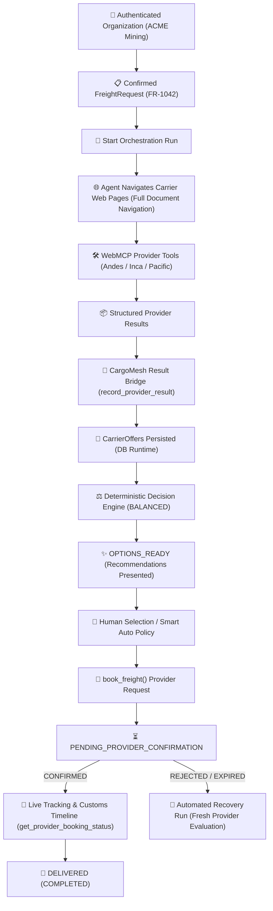
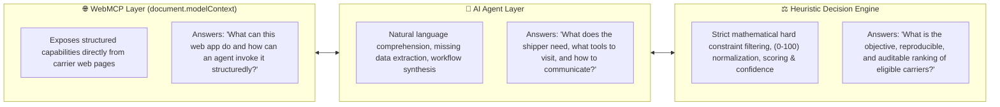

# CargoMesh ⬡

> **Autonomous Agentic Freight Orchestration for Cross-Border B2B Logistics**  
> *Technical Specification v5.5.0 — Google WebMCP Challenge 2026*

[](https://github.com/Chujutak2024/cargomesh)
[](docs/CargoMesh_Planeacion_WebMCP_FINAL.md)
[](https://github.com/Chujutak2024/cargomesh)
[](https://supabase.com/)

---

## 📑 Specification Metadata

| Parameter | Specification Value |
|:---|:---|
| **Project Name** | **CargoMesh Network** |
| **Document Version** | `v5.5.0` *(B2B Organization + Cargo Profile Alignment)* |
| **Root Commercial Entity** | `FreightRequest` *(Dedicated B2B Freight Demand)* |
| **Core Protocol** | **WebMCP Browser-Native API** (`document.modelContext.registerTool`) |
| **Transport Mode & Service** | **ROAD / FTL** *(Full Truckload, Dedicated Capacity)* |
| **Demo Corridor** | **Callao / Lima, Peru $\longrightarrow$ Santiago, Chile** *(International Cross-Border Pan-American Corridor)* |
| **Operational Currency** | **USD ($)** |

---

## 📖 Table of Contents
1. [Executive Summary & Official North Star](#-executive-summary--official-north-star)
2. [Canonical Transparency Declaration & Causality Rule](#-canonical-transparency-declaration--causality-rule)
3. [Architectural Triad & Strict Separation of Concerns](#-architectural-triad--strict-separation-of-concerns)
4. [The Four Data Classes](#-the-four-data-classes)
5. [Transactional Decoupling & The Result Bridge](#-transactional-decoupling--the-result-bridge)
6. [Deterministic Decision Engine & Balanced Formulas](#-deterministic-decision-engine--balanced-formulas)
7. [Decision Confidence Score & Anomaly Guard](#-decision-confidence-score--anomaly-guard)
8. [International Golden Flow Scenario Matrix](#-international-golden-flow-scenario-matrix)
9. [Database Schema Architecture (15 Domain + 2 Observability Tables)](#-database-schema-architecture-15-domain--2-observability-tables)
10. [WebMCP Tool Contract Specification](#-webmcp-tool-contract-specification)
11. [73-Point Acceptance Test Summary](#-73-point-acceptance-test-summary)
12. [Repository Structure Map](#-repository-structure-map)

---

## ⚡ Executive Summary & Official North Star

**CargoMesh** is an agent-native B2B freight orchestration platform. Unlike e-commerce marketplaces (which start with a product, purchase, and consumer delivery), CargoMesh operates on **pre-existing B2B cargo** that needs heavy freight transport from origin to destination without monolithic human intermediation.

### The Official North Star:
> *"An authenticated enterprise creates a `FreightRequest`; the AI agent navigates participating carrier websites via WebMCP, retrieves real structured responses from deterministic provider fixtures, CargoMesh validates and persists those results into its database, the customer selects an eligible alternative, the carrier confirms or rejects the booking, and the system maintains operational continuity through live milestone tracking or automated recovery."*



---

## 🛡️ Canonical Transparency Declaration & Causality Rule

### 1.1 Canonical Declaration of Transparency
> **"Carrier base data and responses are deterministic demo fixtures residing in carrier web pages. WebMCP tool execution, structured result transfer, database persistence, mathematical scoring, human selection, booking lifecycle, provider acknowledgement, and recovery mechanisms are 100% real."**

### 1.2 Strict Causality Rule (Anti-Fake Demo)
In CargoMesh, the database seed initializes **only the baseline environment** (organization account, active member, cargo categories, carriers, services, and historical metrics).

**The runtime commercial tables start completely empty for `FR-1042`:**
```text
carrier_offers       = EMPTY
freight_decisions    = EMPTY
bookings             = EMPTY
booking_events       = EMPTY
orchestration_runs   = EMPTY
orchestration_events = EMPTY
```
These entities are **born strictly and exclusively** through the real runtime execution of the agent browsing carrier web pages and invoking WebMCP tools.

---

## 🏛️ Architectural Triad & Strict Separation of Concerns

To prevent Large Language Model hallucinations in mission-critical commercial logistics, CargoMesh enforces a strict three-tier decoupled architecture:



---

## 📦 The Four Data Classes

CargoMesh strictly segregates data origin and mutability into 4 isolated classes:

```text
1. BOOTSTRAP DATA
   └── Registered Organization, Members, Organization Cargo Profiles, Cargo Categories, Carrier Profiles, Services, Historical Corridor Metrics.

2. DEMO SCENARIO
   └── Controlled initial state of FreightRequest FR-1042 (Callao/Lima, PE → Santiago, CL, 8,000 kg FTL, PENDING).

3. PROVIDER FIXTURES
   └── Deterministic browser-side responses residing in Andes Freight, Inca Logistics, and Pacific Cargo pages.

4. RUNTIME DATA
   └── Dynamically generated database rows: carrier_offers, freight_decisions, bookings, booking_events, orchestration_events.
```

---

## 🔄 Transactional Decoupling & The Result Bridge

### 2.3 Transactional Decoupling Formula
$$\text{recommended\_offer\_id} \neq \text{selected\_offer\_id} \neq \text{book\_freight()} \neq \text{get\_provider\_booking\_status() == CONFIRMED}$$

- `recommended_offer_id`: Computed deterministically by the Heuristic Engine.
- `selected_offer_id`: Explicit commercial choice made by the authorized human shipper (or authorized policy).
- `book_freight()`: Formal submission of a booking intent to the provider via WebMCP.
- `get_provider_booking_status() == CONFIRMED`: Binding carrier acknowledgement that locks dedicated transport.

### 3.2 Idempotent Ingestion: The Result Bridge (`record_provider_result`)
WebMCP returns structured data to the agent in memory. CargoMesh implements a secure server-side bridge function `record_provider_result` to persist results:
- Validates correlation between `orchestration_run_id`, `carrier_id`, and `schema_version`.
- Guarantees strict idempotency via `tool_call_id UNIQUE` and `UNIQUE(orchestration_run_id, carrier_id, provider_offer_reference)`.
- Simultaneously writes `orchestration_events` (for judge observability) and `carrier_offers` (for commercial evaluation).

---

## 🧮 Deterministic Decision Engine & Balanced Formulas

### 3.3 Canonical Normalization Formulas (BALANCED Strategy P0)

$$\text{Final Score} = \text{round}\left( 0.25 \cdot S_{\text{cost}} + 0.25 \cdot S_{\text{reliability}} + 0.20 \cdot S_{\text{eta}} + 0.10 \cdot S_{\text{availability}} + 0.10 \cdot S_{\text{route}} + 0.10 \cdot S_{\text{history}}, 0 \right)$$

| Dimension | Weight | Canonical Normalization Formula | Operational Meaning |
|:---|:---:|:---|:---|
| **Cost Score** ($S_{\text{cost}}$) | **25%** | $\frac{\text{lowest\_eligible\_price}}{\text{candidate\_price}} \times 100$ | Cheapest eligible carrier receives 100 pts. |
| **Reliability Score** ($S_{\text{reliability}}$) | **25%** | $\text{success\_rate} = \frac{\text{successful\_trips}}{\text{completed\_trips}} \times 100$ | Derived directly from verified historical trip logs. |
| **ETA Score** ($S_{\text{eta}}$) | **20%** | $\frac{\text{best\_transit\_hours}}{\text{candidate\_transit\_hours}} \times 100$ | Fastest transit time receives 100 pts. |
| **Availability Score** ($S_{\text{availability}}$) | **10%** | $\text{AVAILABLE\_IN\_WINDOW} = 90 \;\vert\; \text{LIMITED\_WINDOW} = 60$ | Carrier fleet certainty class in origin hub. |
| **Route Experience** ($S_{\text{route}}$) | **10%** | $\min(100, \text{completed\_route\_operations})$ | 1 point per completed operation, capped at 100. |
| **Organization History** ($S_{\text{history}}$) | **10%** | $\text{org\_success\_rate} \;\vert\; 50 \text{ (neutral fallback)}$ | Neutral score (50) when no prior shipper history exists. |

---

## 🎯 Decision Confidence Score & Anomaly Guard

### 3.4 Decision Confidence Formula
$$\text{Decision Confidence} = 0.25 \cdot \text{Completeness} + 0.20 \cdot \text{Certainty} + 0.20 \cdot \text{Evidence} + 0.15 \cdot \text{Separation} + 0.20 \cdot \text{Safety}$$

- **Data Completeness (100 pts)**: Verified presence of all mandatory request and provider fields.
- **Constraint Certainty (100 pts)**: 100% of applicable hard constraints verified as `PASS`.
- **Historical Evidence (96 pts)**: $\min(100, \text{operations}) \times \frac{\text{success\_rate}}{100} = 100 \times 0.96 = 96$.
- **Candidate Separation (25.46 pts)**: $\min\left(100, \frac{\text{Top Score} - \text{Second Score}}{20} \times 100\right) = \frac{89.2949 - 84.2031}{20} \times 100 = 25.46$.
- **Anomaly Safety (100 pts)**: Price deviation $\le +30\%$ against historical average.
- **Golden Flow Decision Confidence Result**:
  $$0.25(100) + 0.20(100) + 0.20(96) + 0.15(25.46) + 0.20(100) = \mathbf{88.02} \longrightarrow \mathbf{88 / 100}$$

### Price Anomaly Guard:
$$\text{price\_deviation\_pct} = \frac{\text{quote\_price} - \text{historical\_avg}}{\text{historical\_avg}} \times 100$$
If $\text{price\_deviation\_pct} > +30\% \implies \text{requires\_review} = \text{true}$, blocking autonomous execution.

---

## 🏆 International Golden Flow Scenario Matrix

**Corridor**: Callao / Lima, Peru $\longrightarrow$ Santiago, Chile (3,300 km Road FTL)  
**Cargo**: 10 Pallets $\times$ 800 kg = 8,000 kg (Mining Spare Parts), Budget: $2,000 USD, Strategy: `BALANCED`.

| Carrier Candidate | Vehicle / Capacity | WebMCP Quote & Transit | Historical SLA | Availability Class | Raw Score $\rightarrow$ Display Score |
|:---|:---|:---|:---|:---|:---:|
| 🥇 **Andes Freight** | **Scania R450 (18,000 kg)** | **$1,760 USD · 31h** | **100 trips · 96% SLA** | **AVAILABLE (90)** | **$89.29 \longrightarrow \mathbf{89}$ (WINNER)** |
| 🥈 **Inca Logistics** | Volvo FH (24,000 kg) | $1,920 USD · 29h | 50 trips · 98% SLA | AVAILABLE (90) | $84.20 \longrightarrow \mathbf{84}$ |
| 🥉 **Pacific Cargo** | Freightliner (15,000 kg) | $1,590 USD · 60h | 50 trips · 86% SLA | LIMITED (60) | $72.17 \longrightarrow \mathbf{72}$ |

---

## 🗄️ Database Schema Architecture (15 Domain + 2 Observability Tables)

```
cargomesh/
├── Business Domain Tables (15):
│   ├── organizations                    # Shipper corporate profiles & verified emails
│   ├── organization_members             # Authorized members & Supabase Auth bindings
│   ├── organization_preferences         # Default strategies, thresholds, auto-recovery flags
│   ├── organization_cargo_profiles      # Frequent cargo templates and suggested vehicle classes
│   ├── cargo_categories                 # Standardized cargo taxonomy (General, Machinery, etc.)
│   ├── freight_requests                 # Core freight intent, weights, dimensions & status
│   ├── carriers                         # Registered transport providers (Andes, Inca, Pacific)
│   ├── carrier_services                 # Corridor coverage, mode, capacity & customs support
│   ├── carrier_service_cargo_categories # Authorized category compatibility map
│   ├── vehicles                         # Fleet units (Scania R450, Volvo FH, Freightliner)
│   ├── carrier_metrics                  # Global & organization-specific SLA statistics
│   ├── carrier_offers                   # WebMCP runtime offers (born during orchestration)
│   ├── freight_decisions                # Immutable evaluation snapshots & ranking versions
│   ├── bookings                         # Binding reservations & provider references
│   └── booking_events                   # Append-only milestone timeline with provider_event_id dedupe
│
└── Technical Observability Tables (2):
    ├── orchestration_runs               # Execution run tracker (INITIAL, RECOVERY)
    └── orchestration_events             # Raw WebMCP tool invocations, inputs, outputs & latencies
```

---

## 🛠️ WebMCP Tool Contract Specification

All carrier WebMCP tools implement a strict common envelope:
- **Success**: `{ "ok": true, "data": { ... } }`
- **Technical Failure**: `{ "ok": false, "error": { "code": "...", "message": "...", "retryable": true } }`
- **Commercial Rejection / Expiration**: Returns `{ "ok": true, "data": { "provider_booking_status": "REJECTED" } }` *(Commercial rejections are valid business responses, not execution crashes)*.

### Provider Tools:
1. `check_service_coverage`: Verifies corridor support (`Callao/Lima -> Santiago`), transport mode (`ROAD`), and cross-border capability.
2. `check_capacity`: Confirms origin terminal fleet readiness and payload capability.
3. `quote_freight`: Emits deterministic quote with itemized breakdown and customs notes.
4. `book_freight`: Submits binding booking intent and returns `provider_reference` (e.g., `AND-BOOK-8821`).
5. `get_provider_booking_status`: Returns current lifecycle state (`CONFIRMED`, `IN_TRANSIT`, `DELIVERED`, `REJECTED`, `EXPIRED`) and tracking events.

---

## ✅ 73-Point Acceptance Test Summary

The v5.5.0 Technical Contract includes an exhaustive **73-point WebMCP Acceptance Test**, plus B2B identity and cargo-profile preconditions, covering:
- **1–6**: Real Supabase Auth demo session, active membership, RLS validation, and empty runtime tables.
- **7–21**: Full document navigation across `/providers/andes`, `/providers/inca`, `/providers/pacific`, real WebMCP tool calls, and idempotent `record_provider_result` insertions.
- **22–42**: Exact mathematical replication of BALANCED subscores (Andes 89, Inca 84, Pacific 72), Decision Confidence (88/100), immutable `FreightDecision v1`, and `OPTIONS_READY` halt.
- **43–58**: Human selection click, `book_freight()` submission, separate CargoMesh UUID vs `provider_reference`, `PENDING_PROVIDER_CONFIRMATION`, carrier confirmation via `get_provider_booking_status`, and tracking event deduplication.
- **59–70**: Resilient recovery scenario (`REJECTED` / `EXPIRED`), creation of `orchestration_run` (RECOVERY), versioned `FreightDecision v2`, and deterministic tie-breaking.
- **71–73**: Server-scoped demo reset and zero `service_role` exposure in client bundles.

---

## 📁 Repository Structure Map

```text
cargomesh/
├── docs/                                      # Master documentation & technical contracts
│   ├── CargoMesh_Planeacion_WebMCP_FINAL.md   # General product & WebMCP master contract (v5.5.0)
│   ├── CargoMesh_Supabase_Schema_Contract.md  # Database architecture & RLS specification
│   ├── CargoMesh_Supabase_Data_Contract.md    # Data classification, bootstrap inventory & alignment
│   ├── CargoMesh_Mockups_Requeridos.md        # Consolidated UX architecture & screen flow
│   └── CargoMesh_Mockups_WebMCP_Ajustes.md    # WebMCP evidence requirements & judge activity drawer
├── mockups/                                   # Standalone UX/UI HTML mockups & provider pages
├── supabase/                                  # Database migrations, seed, tests, and config
│   ├── config.toml                            # Local Supabase stack configuration
│   ├── migrations/                            # 11 synchronized migrations (including baseline legacy)
│   ├── current_public_schema.sql              # Schema reference dump
│   ├── database.types.ts                      # Generated TypeScript database types
│   ├── seed.sql                               # Demo Auth user & ACME OWNER seed
│   ├── tests/                                 # Automated pgTAP database test suite
│   └── snippets/                              # Standalone validation scripts
├── frontend/                                  # 🚀 React / Next.js 15 App (B2B UI, Stepper, Tracking, Judge Drawer)
│   ├── src/app/                               # App Router (Dashboard, Auth, Carrier Portals)
│   ├── src/components/                        # Modular UI components
│   └── package.json                           # Next.js 15, React 19, Tailwind CSS, Supabase SSR
├── backend/                                   # 🐍 Python / FastAPI Service (OpenAI Agent & WebMCP Core)
│   ├── app/                                   # Agent tools, scoring engine, services, API routes
│   ├── requirements.txt                       # FastAPI, OpenAI, Supabase, Pydantic, Httpx
│   └── tests/                                 # Pytest suite
├── .gitignore                                 # Git security exclusions (.env, node_modules, temp files)
└── README.md                                  # Executive technical specification (This document)
```

---

## ⚖️ North Star Anti-Scope Creep Filter

> **"Does this modification directly demonstrate how WebMCP enables an AI agent to turn customer logistics intent into an autonomous, explainable, and recoverable transport operation?"**  
> If the answer is **no**, it is excluded from the hackathon core.
