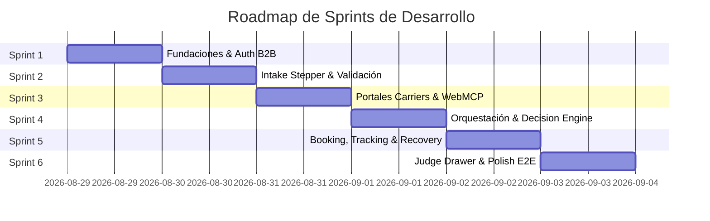

# CargoMesh — Product & Sprint Backlog (WebMCP Challenge 2026)

> **Versión:** 1.0.0  
> **Estado:** Activo / Listo para asignación y desarrollo por sprints  
> **Alineación:** `docs/00-master/CargoMesh_Planeacion_WebMCP_FINAL.md` v5.5.0  
> **Catálogo de Requisitos:** `docs/01-requirements/CargoMesh_Catalogo_Requisitos.md`

---

## 🧭 Definición de Hecho (Definition of Done - DoD)

Para considerar una Historia de Usuario o Tarea como **`[✅ Completado]`**, debe cumplir:
1. **Código:** Implementado en `frontend/` o `backend/` con tipado estricto (TypeScript / Pydantic).
2. **Causalidad:** Cumplir la regla de causalidad estricta (datos de runtime nacen de la ejecución real).
3. **Seguridad:** Respetar las políticas RLS y no exponer credenciales `service_role` en el cliente.
4. **Verificación:** Probado interactivamente y con pruebas unitarias o de integración pasando.

---

## 🏃 Resumen de Épicas y Sprints

---

## 📦 ÉPICA 1: Fundaciones, Autenticación y Contexto B2B (Sprint 1)
**Objetivo:** Permitir el acceso con sesión de Supabase Auth, cargar la organización dinámica y sus políticas de despacho.

### `[US-01]` Autenticación Demo y Carga de Tenant
* **Requisitos:** `RF-01`, `RF-02`, `RNF-02`
* **Prioridad:** 🔴 Alta (Habilita el resto de la aplicación)
* **Tareas Técnicas:**
  * [ ] `🎨 Frontend`: Diseñar pantalla de Login en `frontend/src/app/(auth)/login` con botón "Acceso Demo ACME Mining" y formulario estándar.
  * [ ] `🎨 Frontend`: Implementar cliente Supabase SSR en `frontend/src/lib/supabase/` para Server Components y Client Components.
  * [ ] `🎨 Frontend`: Crear contexto global de sesión y organización (`useOrganizationContext`) que resuelva dinámicamente `organization_id` sin hardcodeo.
  * [ ] `🗄️ Supabase`: Verificar que el token JWT del usuario `carlos.mendoza@acmemining.pe` devuelva la membresía `OWNER` activa.

### `[US-02]` Preferencias y Perfiles de Carga de la Organización
* **Requisitos:** `RF-03`, `RF-04`
* **Prioridad:** 🟡 Media
* **Tareas Técnicas:**
  * [ ] `🎨 Frontend`: Crear vista de perfil corporativo y políticas de despacho (estrategia `BALANCED`, umbral $\ge 85\%$).
  * [ ] `🐍 Backend`: Crear endpoint `/api/v1/organization/preferences` para consultar políticas vigentes.
  * [ ] `🐍 Backend`: Exponer servicio de plantillas habituales de carga (`organization_cargo_profiles`).

---

## 📦 ÉPICA 2: Captura e Intake de Carga Logística (Sprint 2)
**Objetivo:** Implementar el formulario interactivo de 5 pasos para registrar una solicitud de flete con normalización unitizada.

### `[US-03]` Stepper de Intake de 5 Pasos
* **Requisitos:** `RF-05A`, `RF-05B`
* **Prioridad:** 🔴 Alta
* **Tareas Técnicas:**
  * [ ] `🎨 Frontend`: Construir componente Stepper interactivo en `frontend/src/components/stepper/` con estados visuales por paso.
  * [ ] `🎨 Frontend`: Paso 1 (Organización & Solicitante con datos autocompletados).
  * [ ] `🎨 Frontend`: Paso 2 (Ruta Callao/Lima $\rightarrow$ Santiago con selector de cruce fronterizo).
  * [ ] `🎨 Frontend`: Paso 3 (Selector de perfiles frecuentes y tipo de embalaje: Pallets, Maquinaria, etc.).
  * [ ] `🎨 Frontend`: Paso 4 (Ventana de recojo, presupuesto $2,000 USD y documentos requeridos).
  * [ ] `🎨 Frontend`: Paso 5 (Resumen consolidado y pre-check de integridad).

### `[US-04]` Normalización Matemática y Validación de Reglas de Dominio
* **Requisitos:** `RF-06`, `RF-07`, `RNF-03`
* **Prioridad:** 🔴 Alta
* **Tareas Técnicas:**
  * [ ] `🎨 Frontend`: Implementar hook reactivo `useUnitizedIntake` que recalcule peso y volumen total en tiempo real ($10 \times 800\text{ kg} = 8,000\text{ kg}$, $18\text{ m³}$).
  * [ ] `🐍 Backend`: Implementar validador de esquemas Pydantic para `FreightRequestCreate` con validaciones duras (valores $>0$, fechas coherentes).
  * [ ] `🗄️ Supabase`: Insertar la solicitud `FR-1042` en estado `PENDING` respetando RLS del tenant.

---

## 📦 ÉPICA 3: Portales de Transportistas y WebMCP Tools (Sprint 3)
**Objetivo:** Desarrollar las páginas independientes de carriers que exponen herramientas estructuradas bajo el estándar WebMCP.

### `[US-05]` Portales Web Extensibles de Carriers
* **Requisitos:** `RF-08`, `RF-09`
* **Prioridad:** 🔴 Alta
* **Tareas Técnicas:**
  * [ ] `🎨 Frontend`: Crear layout base y páginas para transportistas en `frontend/src/app/providers/[carrier]/page.tsx` (`andes`, `inca`, `pacific`).
  * [ ] `🎨 Frontend`: Conectar cada portal con Supabase para renderizar la flota activa, corredores habilitados y métricas SLA reales del transportista.
  * [ ] `🎨 Frontend`: Implementar registro formal de herramientas WebMCP en el navegador (`document.modelContext.registerTool` o adaptador WebMCP).

### `[US-06]` Fixtures y Cotizaciones Deterministas
* **Requisitos:** `RF-10`, `RNF-03`
* **Prioridad:** 🔴 Alta
* **Tareas Técnicas:**
  * [ ] `🎨 Frontend`: Implementar handlers deterministas en las tools de cada portal:
    * **Andes:** $1,760 USD · 31h · Scania R450 18t · 96% SLA.
    * **Inca:** $1,920 USD · 29h · Volvo FH 24t · 98% SLA.
    * **Pacific:** $1,590 USD · 60h · Freightliner 15t · 86% SLA.
  * [ ] `🎨 Frontend`: Exponer tools `check_service_coverage`, `check_capacity` y `quote_freight` con respuestas JSON estructuradas.

---

## 📦 ÉPICA 4: Orquestación Agent-Native & Decision Engine (Sprint 4)
**Objetivo:** Agente de IA que navega los portales, extrae ofertas vía WebMCP, calcula el ranking multicriterio y presenta las opciones al usuario.

### `[US-07]` Agente WebMCP Runner & Result Bridge
* **Requisitos:** `RF-11`, `RF-12`, `RNF-01`, `RNF-04`
* **Prioridad:** 🔴 Alta
* **Tareas Técnicas:**
  * [ ] `🐍 Backend`: Implementar servicio de orquestación en `backend/app/agent/` que gestione el ciclo de vida de `orchestration_runs`.
  * [ ] `🐍 Backend`: Implementar cliente de navegación / ejecución WebMCP que invoque secuencialmente las tools de los portales.
  * [ ] `🐍 Backend`: Construir el **Result Bridge** que valida el schema de la oferta e inserta en `carrier_offers` y `orchestration_events` usando `tool_call_id` único.

### `[US-08]` Decision Engine Heurístico y Snapshots Inmutables
* **Requisitos:** `RF-13`, `RF-14`, `RF-15`, `RNF-03`
* **Prioridad:** 🔴 Alta
* **Tareas Técnicas:**
  * [ ] `🐍 Backend`: Implementar motor de scoring multicriterio en `backend/app/engine/` con la fórmula canónica BALANCED (6 dimensiones).
  * [ ] `🐍 Backend`: Implementar cálculo de Decision Confidence Score (88/100) y detector de anomalías de precio (>+30%).
  * [ ] `🐍 Backend`: Persistir snapshot inmutable en `freight_decisions` (`v1`) con ranking completo y subscores.

### `[US-09]` Interfaz Reactiva de Despacho (`/dispatch/[id]`)
* **Requisitos:** `RF-16`
* **Prioridad:** 🔴 Alta
* **Tareas Técnicas:**
  * [ ] `🎨 Frontend`: Crear vista reactiva `/dispatch/[id]` que muestre el progreso de consulta por carrier (`EVALUATING` $\rightarrow$ `OPTIONS_READY`).
  * [ ] `🎨 Frontend`: Renderizar tarjetas de opciones con precios, tiempos, unidades, badges de recomendación y botón de selección.
  * [ ] `🎨 Frontend`: Implementar sección expandible de explicabilidad: *"¿Por qué CargoMesh recomienda Andes Freight?"* con subscores y radar chart.

---

## 📦 ÉPICA 5: Booking, Tracking y Circuito de Recuperación (Sprint 5)
**Objetivo:** Formalizar la reserva con el carrier seleccionado, gestionar la confirmación, timeline de seguimiento y re-evaluación ante fallos.

### `[US-10]` Selección Humana y Solicitud de Booking
* **Requisitos:** `RF-17`, `RF-18`
* **Prioridad:** 🔴 Alta
* **Tareas Técnicas:**
  * [ ] `🎨 Frontend`: Registrar el clic de selección del usuario y enviar la solicitud de reserva al backend.
  * [ ] `🐍 Backend`: Invocar tool `book_freight()` en el portal del transportista seleccionado.
  * [ ] `🎨 Frontend`: Mostrar pantalla limpia de espera (`PENDING_PROVIDER_CONFIRMATION`) con temporizador de 15 minutos.

### `[US-11]` Confirmación y Timeline de Seguimiento
* **Requisitos:** `RF-19`
* **Prioridad:** 🔴 Alta
* **Tareas Técnicas:**
  * [ ] `🐍 Backend`: Consultar `get_provider_booking_status()` y registrar evento `CONFIRMED` en `booking_events`.
  * [ ] `🎨 Frontend`: Transicionar vista a `/tracking/[id]` mostrando hito aduanero `BORDER_PROCESSING` (Santa Rosa / Chacalluta), unidad, placas y precintos.

### `[US-12]` Circuito de Recuperación Operacional (Recovery Run)
* **Requisitos:** `RF-20`
* **Prioridad:** 🔴 Alta
* **Tareas Técnicas:**
  * [ ] `🎨 Frontend`: Implementar modal contextual de recuperación ante rechazo (`REJECTED`) o vencimiento (`EXPIRED`).
  * [ ] `🐍 Backend`: Ejecutar automáticamente una corrida `RECOVERY` en `orchestration_runs`, re-evaluando carriers y emitiendo `FreightDecision v2`.
  * [ ] `🎨 Frontend`: Presentar la alternativa óptima (Inca Logistics) para confirmar reemplazo con un solo clic.

---

## 📦 ÉPICA 6: Observabilidad en Vivo & Panel para Jueces (Sprint 6)
**Objetivo:** Brindar a los jueces una ventana transparente a la causalidad de WebMCP, herramientas de simulación de fixtures y reset de demo.

### `[US-13]` Judge Activity Drawer Universal
* **Requisitos:** `RF-21`
* **Prioridad:** 🔴 Alta
* **Tareas Técnicas:**
  * [ ] `🎨 Frontend`: Construir componente `JudgeDrawer` flotante accesible mediante atajo o botón `🧪 Judge Mode`.
  * [ ] `🎨 Frontend`: Conectar stream en tiempo real de `orchestration_events` (timestamps, latencias en ms, tool names).
  * [ ] `🎨 Frontend`: Visor de payloads JSON con formateo y copia rápida para inspección de entradas y salidas.

### `[US-14]` Controles de Fixture y Reset de Demostración
* **Requisitos:** `RF-22`, `RNF-05`
* **Prioridad:** 🔴 Alta
* **Tareas Técnicas:**
  * [ ] `🎨 Frontend`: Implementar panel de simulación en el Judge Drawer para alternar el fixture del carrier (`ACCEPT / REJECT / NO_RESPONSE`).
  * [ ] `🐍 Backend`: Implementar endpoint seguro `/api/v1/demo/reset` que restaure `FR-1042` a `PENDING` y limpie las tablas de runtime.

---

## 🗺️ Matriz de Trazabilidad: Requisitos vs. Historias de Usuario

| Requisito | Descripción Resumida | Historia de Usuario | Prioridad Hackathon |
|---|---|:---:|:---:|
| **RF-01** | Autenticación de Usuario Demo | `US-01` | 🟢 Baja (Seed) |
| **RF-02** | Contexto Multitenant Dinámico | `US-01` | 🟡 Media |
| **RF-03** | Gobernanza y Políticas | `US-02` | 🟡 Media |
| **RF-04** | Perfiles Habituales de Carga | `US-02` | 🟡 Media |
| **RF-05A/B** | Stepper de Intake & Carga Unitizada | `US-03` | 🔴 Alta (P0) |
| **RF-06** | Normalización Matemática | `US-04` | 🔴 Alta (P0) |
| **RF-07** | Validación de Restricciones Duras | `US-04` | 🔴 Alta (P0) |
| **RF-08** | Portales Extensibles de Carriers | `US-05` | 🟡 Media |
| **RF-09** | Exposición WebMCP en Navegador | `US-05` | 🔴 Alta (P0) |
| **RF-10** | Cotización Determinista en Carriers | `US-06` | 🔴 Alta (P0) |
| **RF-11** | Ciclo de Vida de Orquestación | `US-07` | 🔴 Alta (P0) |
| **RF-12** | Result Bridge Idempotente | `US-07` | 🔴 Alta (P0) |
| **RF-13** | Scoring Multicriterio BALANCED | `US-08` | 🔴 Alta (P0) |
| **RF-14** | Decision Confidence (88/100) | `US-08` | 🔴 Alta (P0) |
| **RF-15** | Snapshots Inmutables de Decisión | `US-08` | 🔴 Alta (P0) |
| **RF-16** | Vista `/dispatch` y Explicabilidad | `US-09` | 🔴 Alta (P0) |
| **RF-17** | Selección Humana de Oferta | `US-10` | 🔴 Alta (P0) |
| **RF-18** | Envío de Booking a Carrier | `US-10` | 🔴 Alta (P0) |
| **RF-19** | Confirmación y Tracking Timeline | `US-11` | 🔴 Alta (P0) |
| **RF-20** | Circuito de Recuperación (Recovery) | `US-12` | 🔴 Alta (P0) |
| **RF-21** | Judge Activity Drawer en Vivo | `US-13` | 🔴 Alta (P0) |
| **RF-22** | Inyección de Fixtures y Reset | `US-14` | 🔴 Alta (P0) |
