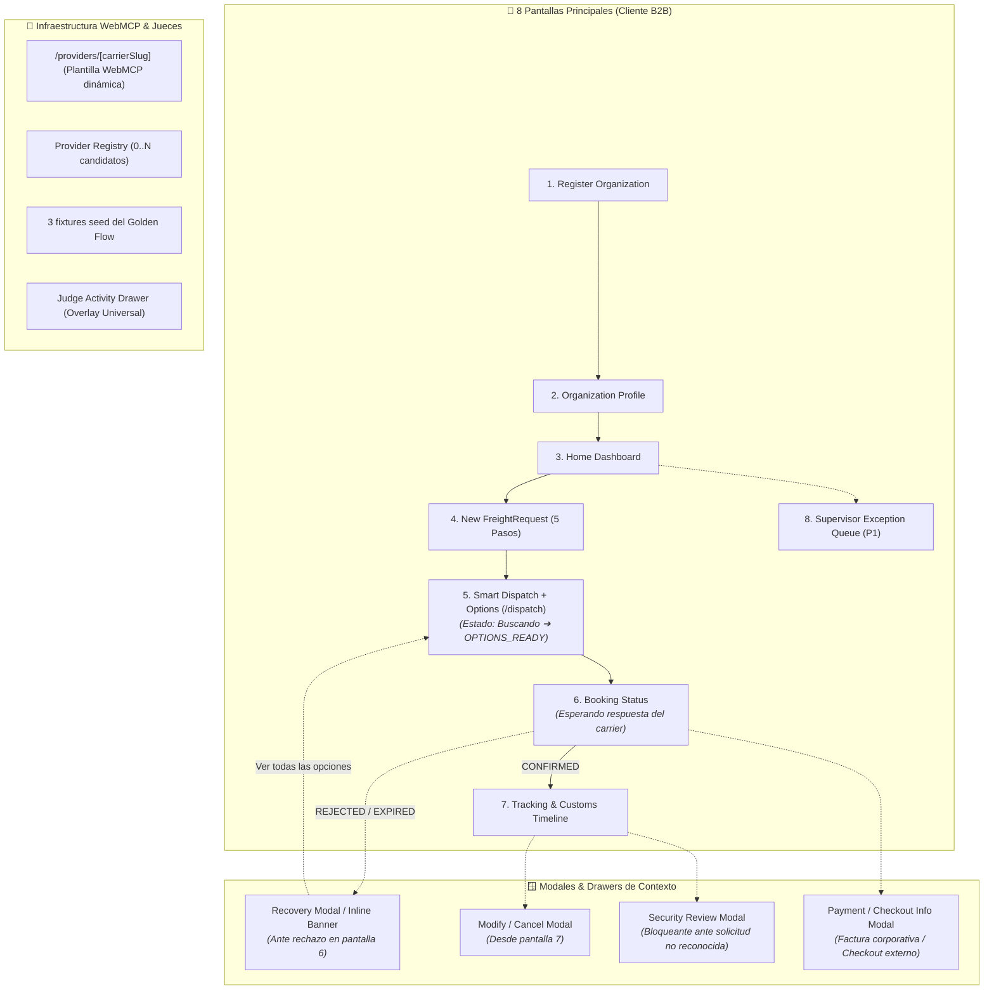

# CargoMesh — Arquitectura UX y Mockups Requeridos

> **Versión:** 2.1 (Consolidada y Alineada al Contrato Técnico v5.6.0)
> **Propósito:** Definir la estructura real de navegación de producto, reduciendo la fragmentación de pantallas mediante la fusión de estados en vistas reactivas, modales de contexto y un Drawer de Jueces desacoplado de la experiencia del cliente.

---

## 🧭 Principio Rector de Arquitectura UX

En un producto B2B real, **cada estado del contrato técnico no es una pantalla web independiente**. 

La arquitectura UX de CargoMesh se estructura en:
1. **8 Pantallas Principales de Navegación del Cliente**
2. **4 Modales / Drawers de Contexto Operacional**
3. **Infraestructura WebMCP de Carriers y Panel Técnico para Jueces**

---

## 📋 1. Las 8 Pantallas Principales del Cliente

### 1. 🟡 Register Organization
- **Ruta:** `/register`
- **Propósito:** Alta y onboarding inicial de la empresa.
- **Contenido:**
  - Razón social de la empresa (`Legal company name`).
  - País de operación (`Country`).
  - Identificador empresarial dinámico según país (ej. RUC en PE, RUT en CL, Tax ID).
  - Correo corporativo (aún en estado *Pendiente de validación*, no "verificado" antes del alta).
  - Teléfono corporativo y cuenta del miembro administrador inicial.
- **Lenguaje:** 100% corporativo B2B.

---

### 2. 🟡 Organization Profile
- **Ruta:** `/organization/profile`
- **Propósito:** Vista de la cuenta corporativa verificada y gobernanza.
- **Contenido:**
  - Empresa (`ACME Mining Corp S.A.`).
  - País (`Perú`) e Identificador empresarial (`20491827361`).
  - Identidad sintética de evaluación (`demo.operator@cargomesh.test`), separada de cualquier cuenta hospedada real.
  - Miembros e invitados con roles canónicos (`OWNER`, `REQUESTER`, `SUPERVISOR`) y estados `INVITED / ACTIVE`.
  - Acción `Invitar representante`, ejecutada desde servidor mediante Supabase Auth.
  - Políticas de despacho por defecto: Estrategia `BALANCED`, umbral de auto-booking `Confidence ≥ 85%`.
  - Modo de facturación: Cuenta Corporativa / Facturación Mensual (Net 30).
  - Perfiles logísticos habituales: categoría, unidad de carga, requisitos recurrentes y clase de vehículo sugerida.

---

### 3. 🟡 Home Dashboard
- **Ruta:** `/`
- **Propósito:** Panel general de operaciones B2B.
- **Contenido:**
  - Resumen de actividad: Solicitudes pendientes, envíos activos, tasa de cumplimiento SLA (97.4%).
  - Tabla de despachos con `FR-1042` lista para iniciar búsqueda.
  - **Lenguaje de cliente:** Botón de acción **"Buscar opciones de transporte"** (en lugar de términos técnicos como *"Orquestar WebMCP ⚡"*).
  - Enlaces de demo técnica (`Carriers WebMCP`, `Ir a Golden Flow`) relegados al Judge Drawer.

---

### 4. 🔴 New FreightRequest (Formulario Real de 5 Pasos)
- **Ruta:** `/freight-request/new`
- **Propósito:** Captura e intake guiado de una nueva solicitud de transporte.
- **Estructura del Stepper Interactivo:**
  1. **Paso 1 — Organización & Solicitante:** Datos autocompletados de ACME Mining y CargoMesh Demo Operator.
  2. **Paso 2 — Origen & Destino:** Dirección de recojo (Callao/Lima), dirección de entrega (Santiago), contactos de entrega y paso fronterizo habilitado (Santa Rosa / Chacalluta).
  3. **Paso 3 — Carga:** Sugerencia desde el perfil `Repuestos y maquinaria minera`; captura dinámica por peso total, unidades, paquetes, pallets, lotes o sacos; cantidad, peso y dimensiones por unidad; normalización visible a peso/volumen total. Golden Flow: 10 pallets $\times$ 800 kg = 8,000 kg y 18 m³, con `TRACTOR_TRAILER` como preferencia pendiente de validación WebMCP.
  4. **Paso 4 — Programación & Políticas:** Ventana de recojo programada, presupuesto máximo de **$2,000 USD**, estrategia **BALANCED**, documentos adjuntos (Factura Comercial y Packing List).
  5. **Paso 5 — Revisión & Confirmación:** Resumen consolidado. Mensaje de pre-check: *"✓ Solicitud completa y lista para evaluación"* (sin afirmar indebidamente que las hard constraints del carrier pasaron antes de consultar WebMCP).
- **CTA Final:** **"Confirmar y buscar opciones de transporte →"**

---

### 5. 🔴 Smart Dispatch + Carrier Selection (/dispatch)
*Fusión integral de los estados de búsqueda y selección (antiguas pantallas 5 y 6 en una sola vista reactiva).*
- **Ruta:** `/dispatch/[id]`
- **Propósito:** Vista única que evoluciona en vivo desde la consulta a carriers hasta la presentación de ofertas y selección humana.
- **Estados de la Vista:**
  - **Estado A — Buscando Opciones (Live Dispatching):**
    - Indicador de estado: *"Buscando opciones de transporte en tiempo real..."*
    - Progreso generado desde los carriers descubiertos. Golden Flow: Andes Freight (*Consultando...*), Inca Logistics (*Consultando...*), Pacific Cargo (*Pendiente...*).
  - **Estado B — Opciones Listas (OPTIONS_READY):**
    - Despliegue de `0..N` tarjetas de transportistas elegibles. En el Golden Flow aparecen:
      1. **Andes Freight:** **$1,760 USD** · 31h · Scania R450 18t · 96% SLA · **89 pts** · Badge `★ Recomendado por CargoMesh` · Botón `Seleccionar Andes Freight`.
      2. **Inca Logistics:** **$1,920 USD** · 29h · Volvo FH 24t · 98% SLA · **84 pts** · Botón `Seleccionar Inca Logistics`.
      3. **Pacific Cargo:** **$1,590 USD** · 60h · Freightliner 15t · 86% SLA · **72 pts** · Botón `Seleccionar Pacific Cargo`.
  - **Sección de Explicabilidad:**
    - Título: **"¿Por qué CargoMesh recomienda Andes Freight?"** (corrigiendo el tiempo verbal, ya que aún no ha sido seleccionado).
    - Botón expandible **"Ver análisis técnico"** que despliega el desglose de subscores BALANCED y el Decision Confidence (**88/100**).
- **Regla dura:** La vista se detiene en `OPTIONS_READY` a la espera del clic de selección del usuario.

---

### 6. 🔴 Booking Status (Estado de Confirmación)
*Antigua pantalla 7 simplificada como vista limpia de cliente.*
- **Ruta:** `/booking/[id]/status`
- **Propósito:** Vista de espera mientras el transportista seleccionado revisa y confirma la solicitud.
- **Contenido:**
  - Título: **"Solicitud enviada a Andes Freight"**
  - Estado: `● Esperando confirmación del transportista`
  - Cronómetro de plazo: `Tiempo restante: 14:32` (deadline de 15 minutos).
  - Resumen del flete: `$1,760 USD · Callao/Lima → Santiago · Scania R450 18t`.
  - Mini-timeline del proceso:
    `[✓ Carrier seleccionado] ➔ [✓ Solicitud enviada] ➔ [● Esperando respuesta] ➔ [○ Reserva confirmada]`
- **Nota UX:** Los controles de simulación de fixture (`CONFIRMED`, `REJECTED`, `EXPIRED`) y JSON payloads pertenecen exclusivamente al **Judge Drawer**, manteniendo la pantalla del cliente 100% limpia.

---

### 7. 🔴 Tracking & Customs Timeline
- **Ruta:** `/tracking/[id]`
- **Propósito:** Seguimiento en vivo del despacho una vez alcanzado el estado `CONFIRMED`.
- **Contenido:**
  - Estado actual: `BORDER_PROCESSING` (Trámite Fronterizo MIC/DTA).
  - Datos de viaje: Referencia de reserva `AND-BOOK-8821`, unidad Scania R450 placa `AND-TRK-101`, precinto aduanero `AND-SL-9081`.
  - Timeline de hitos alimentada por `booking_events` reales:
    `CONFIRMED ➔ PICKUP_SCHEDULED ➔ PICKED_UP ➔ IN_TRANSIT ➔ BORDER_PROCESSING (Santa Rosa/Chacalluta) ➔ CUSTOMS_CLEARED ➔ DELIVERED`.
  - Los eventos aduaneros y documentales se presentan como **información reportada por el carrier** (quien asume la gestión física en frontera).
  - Acciones: `Descargar Manifiesto MIC/DTA`, `Modificar o Cancelar Reserva (abre modal)`.

---

### 8. 🔵 Supervisor Exception Queue (P1)
- **Ruta:** `/supervisor/exceptions`
- **Propósito:** Bandeja de supervisión operacional para gestionar excepciones (anomalías de precio >+30%, baja confianza <85%, revisiones de seguridad).

---

## 🪟 2. Los 4 Modales / Drawers de Contexto

### 1. 🔴 Recovery Notification & Inline Re-evaluation
- **Activación:** Dentro de la pantalla de Booking Status cuando Andes Freight rechaza la reserva (`REJECTED`) o vence el plazo (`EXPIRED`).
- **Comportamiento:**
  - Aparece un banner/modal contextual:  
    `⚠️ Andes Freight no pudo confirmar disponibilidad (Unidad en mantenimiento). CargoMesh está revalidando las demás opciones en vivo...`
  - Segundos después actualiza:  
    `✓ Reemplazo recomendado encontrado: Inca Logistics ($1,920 USD · 29h · 98% SLA).`
  - Acciones: `[Continuar con Inca Logistics ($1,920)]` o `[Ver todas las opciones actualizadas]`.
  - Si el usuario pulsa *Ver todas las opciones*, regresa a la pantalla de Dispatch mostrando la corrida `RECOVERY · Decision v2` con las alternativas refrescadas.

---

### 2. 🔵 Modify / Cancel Modal (P1)
- **Activación:** Modal compacto o side-drawer accesible desde la pantalla de Tracking.
- **Comportamiento:**
  - Consulta en vivo la herramienta `get_booking_change_options()` de Andes Freight.
  - Presenta las 3 opciones dinámicas:
    1. Reprogramar recojo (+24h): **$0 USD**
    2. Mantener en espera en terminal (hasta 4h): **$0 USD**
    3. Cancelar reserva antes de estiba: **$120 USD** (Penalidad contractual)

---

### 3. 🔵 Security Review Modal (P1)
- **Activación:** Modal bloqueante que se abre al pulsar *"No reconozco esta solicitud"*.
- **Comportamiento:**
  - Informa que se ha activado `SECURITY_REVIEW`.
  - Congela de inmediato todas las automatizaciones y despachos vinculados.
  - Registra la notificación para el operador demo autorizado (`demo.operator@cargomesh.test`).

---

### 4. 🟡 Payment / Checkout Info Modal
- **Activación:** Modal informativo disponible en perfil o confirmación de booking.
- **Comportamiento:**
  - Refleja que ACME Mining opera mediante Cuenta Corporativa / Facturación mensual (Net 30).
  - Declara explícitamente que CargoMesh no captura tarjetas de crédito.
  - Si un transportista no afiliado requiriera checkout directo, abre ventana segura hacia la pasarela del carrier.

---

## 🧪 3. Infraestructura WebMCP & Panel de Jueces

### Páginas Reales de Carriers (WebMCP Endpoints)
Los fixtures alojados por CargoMesh se renderizan con la plantilla `/providers/[carrierSlug]`. Cada navegación carga un documento y registra únicamente las tools del carrier actual. Las tres instancias de la demo son:
- `/providers/andes` — Registra tools de Andes Freight (`quote_freight`, `book_freight`, etc.) con fixture de Scania R450 ($1,760 USD).
- `/providers/inca` — Registra tools de Inca Logistics con fixture de Volvo FH ($1,920 USD).
- `/providers/pacific` — Registra tools de Pacific Cargo con fixture de Freightliner ($1,590 USD).

Un transportista adicional se incorpora mediante el Provider Registry y su `provider_url`, sin crear ramas nuevas en dispatch, scoring o booking.

---

### Judge Activity Drawer (Overlay Universal)
- **Activación:** Drawer lateral superpuesto disponible sobre cualquier pantalla del producto mediante atajo o botón flotante `🧪 Judge Mode`.
- **Contenido Técnico:**
  - Stream en tiempo real de `orchestration_events` con timestamps y duración en ms.
  - Visor de payloads JSON (`tool_call_id`, inputs, outputs de `record_provider_result`).
  - **Controles de Fixture para Jueces:**
    - `Set Provider Fixture: ACCEPT / REJECT / NO_RESPONSE`
    - `Start Orchestration Run`
    - `Reset Demo Environment` (Restaura FR-1042 a PENDING y vacía tablas runtime).
- **Regla de causalidad:** Los botones de fixture solo configuran la respuesta futura de la página del carrier; nunca modifican directamente el estado de las tablas de CargoMesh.

---

## 📊 Matriz Comparativa: Antes vs. Nueva Arquitectura

| Aspecto | Enfoque Anterior (15 HTMLs Rígidos) | Nueva Arquitectura Consolidada |
|:---|:---|:---|
| **Número de Páginas** | 15 páginas separadas y desconectadas | **8 pantallas principales** + 4 modales contextuales |
| **Smart Dispatch & Ofertas** | Pantalla 5 (consola técnica) $\rightarrow$ Pantalla 6 (ofertas) | **1 sola pantalla `/dispatch` reactiva** (Buscando $\rightarrow$ `OPTIONS_READY`) |
| **Formulario Intake** | Solo mostraba el paso 5 de confirmación | **Formulario interactivo completo de 5 pasos** con pre-check real |
| **Booking Status** | Mezclaba controles de demo, JSON y simulación | **Vista limpia de cliente** (cronómetro de 15m y mini-timeline) |
| **Recovery** | Pantalla separada desconectada del flujo | **Modal / Banner contextual** en Booking Status $\rightarrow$ Dispatch v2 |
| **Modificar / Seguridad** | Páginas enteras artificiales | **Modales contextuales** sobre Tracking y Booking |
| **Páginas de Carriers** | Una sola página con tabs simuladas | **Plantilla dinámica** `/providers/[carrierSlug]` + URLs externas registradas; tres instancias seed en la demo |
| **Herramientas de Juez** | Repartidas e incrustadas en la UI de cliente | **Judge Activity Drawer universal desacoplado** |
