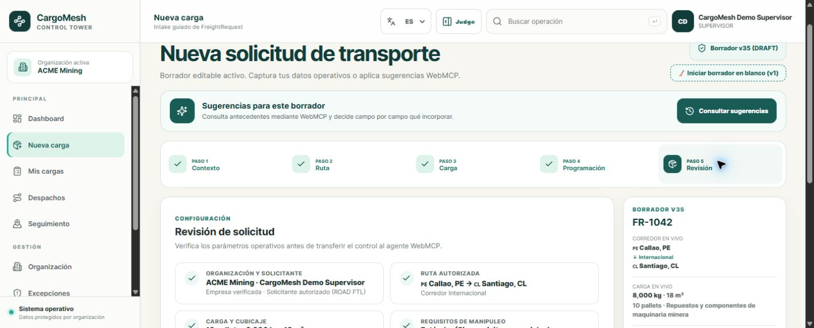
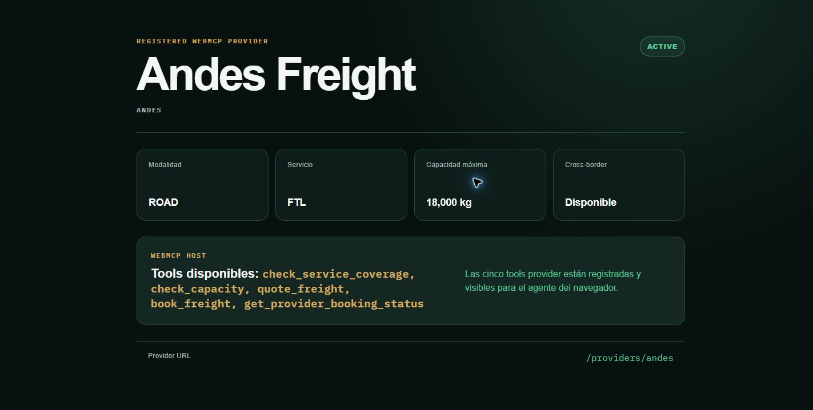
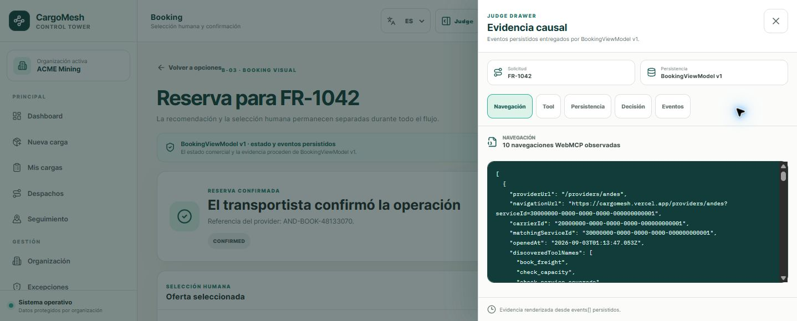
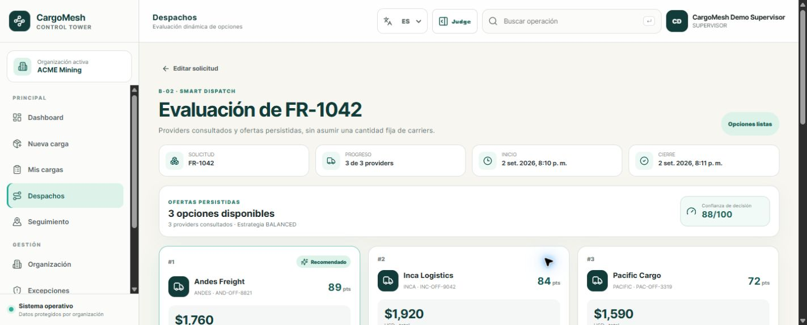
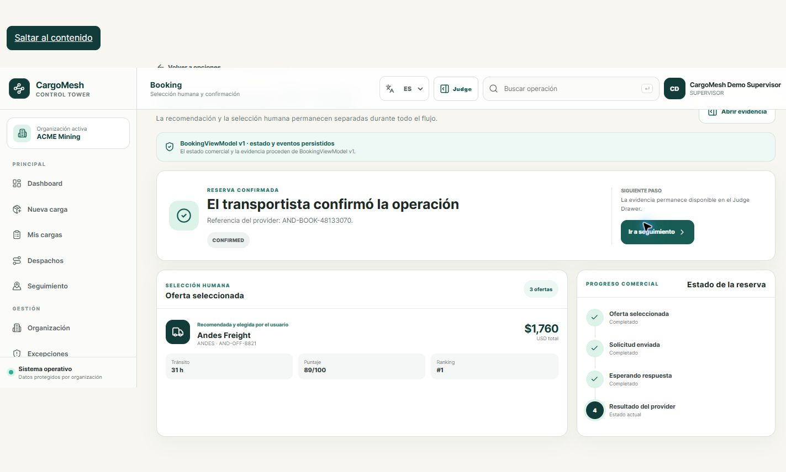
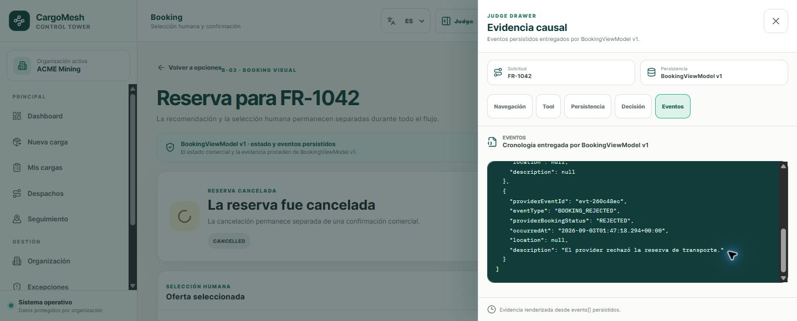
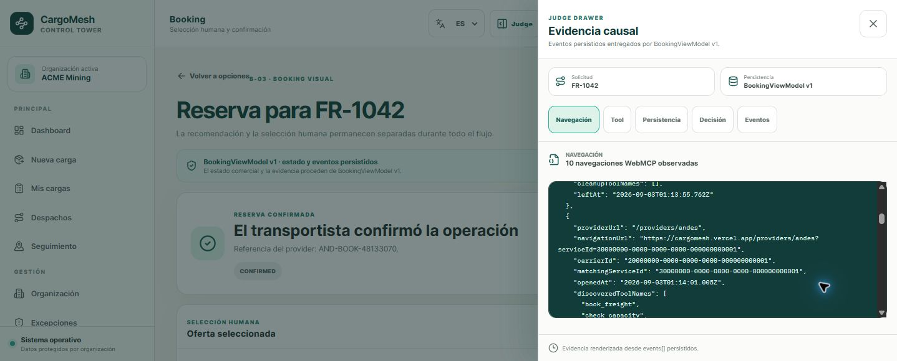

# CargoMesh Devpost Screenshot Capture Plan

Status: REL-02 capture slots only
Evidence source: final public HTTPS deployment and exact deployed Git SHA

This directory intentionally contains no fabricated screenshots. Add each image
only after the corresponding flow passes in a clean WebMCP-compatible browser.
Before committing an image, redact email addresses, cookies, tokens,
authorization references, private user identifiers, and any Supabase secret.

## Capture standards

- Use PNG at 16:9 or a clean crop that remains legible at Devpost width.
- Prefer 1440×900 or 1920×1080 for desktop evidence.
- Keep the CargoMesh page, relevant status, and proof point visible together.
- Use the public HTTPS origin; localhost images must be labeled as local evidence
  and must not replace final UAT evidence.
- Record the deployed SHA and run/booking correlation separately in the evidence
  handoff. Do not place credentials in filenames or image metadata.
- Do not stage runtime IDs that belong to another organization or user.

## Required seven-shot list

| # | Target filename | Required scene | Evidence that must be visible | Redaction / acceptance check |
|---:|---|---|---|---|
| 1 | `01-intake-fr1042.png` | FR-1042 freight intake | Callao, Peru → Santiago, Chile; ROAD/FTL; 8,000 kg; 18 m³; authenticated request context | No credentials; persisted values rather than browser-generated dates |
| 2 | `02-provider-tools-production.png` | Public provider portal | The five provider tool names registered through `document.modelContext` and the exact provider path | Companion UAT transcript records the URL with discovered `serviceId`; no access tokens or cookies |
| 3 | `03-judge-drawer-webmcp-trace.png` | Judge Drawer trace | `providerUrl`, `matchingServiceId`, coverage → capacity → quote, sanitized envelopes, and timestamps | Inputs/outputs correlate to one run; no `service_role` or authorization secret |
| 4 | `04-balanced-ranking.png` | BALANCED ranking | Andes 89, Inca 84, Pacific 72, confidence 88, and the Andes explanation | Show that the collection is dynamic `0..N`; do not imply scores come from an LLM |
| 5 | `05-confirmed-booking.png` | Confirmed booking | Explicit ASSISTED selection, stable provider reference, `CONFIRMED`, and persisted event timeline | Hide server-issued authorization reference; no duplicate booking |
| 6 | `06-recovery-andes-to-inca.png` | Andes → Inca recovery | Andes `REJECTED`, eligible `recoveryOfferIds`, explicit Inca selection, USD 1,920 / 29 h, and new booking | Show a separate controlled contingency; do not portray auto-booking |
| 7 | `07-provider-cleanup.png` | Provider cleanup verification | Empty list of the five provider tools after leaving the provider document | Other page-owned CargoMesh tools may remain; only abandoned provider tools must be absent |

## Placeholder snippets

The image references remain commented until their PNG files exist. After each
capture is reviewed, remove the surrounding HTML comment and reuse the same
Markdown in the root README or Devpost draft.

```markdown


<!--  -->
<!--  -->
<!--  -->
<!--  -->
<!--  -->
```

## Devpost-ready captions

1. **Canonical intake:** A persisted cross-border freight request becomes the
   input to orchestration; no offer or booking is preloaded.
2. **Browser-native tools:** The active carrier page exposes five typed tools to
   the authorized browser agent through `document.modelContext`.
3. **Auditable execution:** The Judge Drawer connects provider navigation,
   `matchingServiceId`, tool inputs, envelopes, timestamps, and persistence.
4. **Deterministic decision:** BALANCED explains the reproducible `89 / 84 / 72`
   ranking and confidence `88` without an LLM-generated score.
5. **Transactional booking:** User selection, server authorization, provider
   booking request, and provider confirmation remain separate states.
6. **Recoverable logistics:** A real commercial rejection remains visible and
   the user selects a valid alternative using a new authorization and booking.
7. **Isolated providers:** Leaving a provider document aborts registration and
   removes its tools before the next candidate is processed.

## Completion checklist

- [ ] Capture all seven images from the final HTTPS deployment (intake and provider tools captures complete).
- [ ] Verify every image against the exact deployed SHA.
- [ ] Redact secrets and personal information.
- [ ] Confirm that text remains readable after Devpost compression.
- [ ] Replace the commented placeholders only after A+C approve the evidence.
- [ ] Reference the approved files from the final README and Devpost draft.
