# CargoMesh — Línea de tiempo y guía de implementación

> Guía de orientación para el equipo. Complementa el [Team Execution Checklist](CargoMesh_Team_Execution_Checklist.md): el checklist registra PRs y criterios de cierre; este documento explica cómo encajan los módulos y qué se construye después.

## 1. Foto del proyecto

**Estado al 29 de agosto de 2026**

| Hito | Responsable | Estado real | Evidencia |
|---|---|---|---|
| Contrato y workspace (`SH-00`, `SH-01`) | C + A + B | Integrado en `main` | PR #1 |
| Página provider dinámica (`A-01`) | A | Integrado en `main` | PR #2 |
| Shell, login y dashboard (`B-01`) | B | En corrección: hay enlaces que devuelven 404 | PR #4 |
| `quote_freight` WebMCP (`A-02`) | A | En revisión, compatible con C-01 | PR #5 |
| Discovery y seguridad (`C-01`) | C | En revisión cruzada | PR #6 |
| Primer corte vertical (`INT-01`) | A + C | Aún no inicia | Depende de A-02 + C-01 integrados |

## 2. Arquitectura que estamos construyendo

```mermaid
flowchart LR
    U[Usuario de una organización] --> B[B: Login, dashboard e intake]
    B --> DB[(Supabase + RLS)]
    DB --> C[C: discovery seguro]
    C --> CP[CandidateProvider 0..N]
    CP --> A[A: página provider WebMCP]
    A --> Q[ProviderQuote]
    Q --> RB[C: Result Bridge]
    RB --> O[(CarrierOffer)]
    O --> DE[C: Decision Engine BALANCED]
    DE --> R[FreightRanking]
    R --> B2[B: cards, selección y Judge Drawer]
    B2 --> BK[A: book_freight]
    BK --> C2[C: booking, eventos y recovery]
```



La regla que evita una demo falsa es:

```text
Discovery no contiene precios → WebMCP cotiza → Result Bridge persiste → Engine rankea → UI muestra.
```

Por eso un `CandidateProvider` solo identifica **a quién consultar** y con qué servicio; no contiene precio, ETA ni disponibilidad comercial runtime.

## 3. Línea de tiempo detallada

### Fase 0 — Producto, contrato y límites

**Objetivo:** definir qué es CargoMesh antes de escribir pantallas o queries.

| Se definió | Decisión |
|---|---|
| Modelo de negocio | B2B: una organización crea cargas y sus miembros autorizados las operan. |
| Marketplace | La plataforma trabaja con `0..N` carriers registrados. Andes, Inca y Pacific son fixtures, no reglas. |
| Rol de WebMCP | La web del carrier expone herramientas; CargoMesh no inventa cotizaciones. |
| Separación | A implementa provider/WebMCP, B UI, C datos/seguridad/integración. |

**Resultado:** ADR-001 y contratos compartidos. Esto evita que cada integrante invente un flujo distinto.

### Fase 1 — Base de datos y escenario demo

**Objetivo:** dejar una fuente de verdad reproducible en Supabase.

```text
organizations
  └─ organization_members ── auth.users
  └─ freight_requests

carriers
  └─ carrier_services
       └─ carrier_service_cargo_categories

runtime: orchestration_runs → carrier_offers → freight_decisions → bookings
```

**Qué ya se hizo:** migraciones, datos Golden Flow, categorías, servicios, vehículos, métricas y tablas runtime.

**Cómo se cambia esta capa:**

1. Crear una migración en `supabase/migrations/` si cambia esquema, índice, constraint, RLS, función SQL o seed reproducible.
2. Ejecutar el lint/reset/test local de Supabase según corresponda.
3. Regenerar `frontend/src/types/database.types.ts` si el esquema expone columnas nuevas al frontend.
4. Documentar el contrato que afecte a A, B o C.

No se crea una migración para cambiar lógica React/TypeScript; una migración existe solo cuando la persistencia debe cambiar.

### Fase 2 — Seguridad y RLS

**Objetivo:** impedir que un miembro de una empresa consulte datos de otra.

```text
Sesión Supabase válida
  → usuario autenticado
  → organization_members ACTIVE
  → RLS permite solo filas de su organization_id
```

**Patrón de C:**

| Caso | Resultado esperado |
|---|---|
| Sin sesión | `401` |
| Sesión sin membresía | `403` |
| Miembro de otra organización | no obtiene la `FreightRequest` |
| Miembro correcto | puede leer y operar su solicitud |

`SUPABASE_SERVICE_ROLE_KEY` solo puede existir en módulos `server-only`. Nunca en componentes, rutas cliente ni bundles estáticos.

### Fase 3 — Workspace y contratos congelados

**Objetivo:** permitir trabajo paralelo sin reescrituras.

Contratos principales:

```ts
CandidateProvider      // resultado de discovery, sin datos comerciales
ProviderPageConfig     // configuración de una página provider
ProviderToolEnvelope<T>// éxito/error normalizado de una tool WebMCP
ProviderQuote          // cotización generada por WebMCP
CarrierOffer           // oferta ya persistida por C
FreightRanking         // decisión BALANCED que B renderiza
```

**Regla:** un cambio de contrato requiere revisar sus consumidores. Si afecta otro owner, se declara antes en PR/handoff.

### Fase 4 — A-01: provider dinámico

**Objetivo:** una sola plantilla sirve a cualquier carrier registrado.

```text
/providers/[carrierSlug]
  → slug válido
  → carrierCode
  → ProviderPageConfig
  → página provider
```

No existen carpetas, `if` ni `switch` particulares para Andes, Inca o Pacific. La diferencia comercial queda en configuración/fixture de datos.

### Fase 5 — B-01: shell y dashboard mínimo

**Objetivo:** dar al jurado una entrada B2B clara antes de conectar datos reales.

| Pantalla | Qué muestra ahora | Qué mostrará después |
|---|---|---|
| `/login` | Entrada a la demo | OAuth/Supabase real |
| `/dashboard` | Métricas y `FreightRequest` desde fixture UI | Solicitudes de la organización autenticada |
| `RequestTable` | Colección variable y estado vacío | Datos/props de la query organization-scoped |

**Pendiente inmediato:** los enlaces a intake, dispatch, tracking y detalle no deben llevar a 404 mientras sus módulos no existan.

### Fase 6 — C-01: discovery seguro

**Objetivo:** transformar una `FreightRequest` autorizada en candidatos navegables.

```text
get_candidate_provider_pages(freightRequestId)
  → valida sesión y membresía
  → carga FreightRequest bajo RLS
  → busca carriers ACTIVE + WebMCP
  → evalúa servicios/categorías compatibles
  → CandidateProvider[0..N]
```

El matching considera:

- origen/destino, país y región;
- modo de transporte, tipo de servicio y cross-border;
- peso, volumen y categoría;
- refrigeración y rango de temperatura;
- carga peligrosa, frágil o sobredimensionada.

Los `provider_url` válidos pueden ser:

```text
/providers/<slug>                 # fixture interno seguro
https://carrier.example/...        # provider externo HTTP(S)
```

Se rechazan rutas inseguras, `//host`, `javascript:`, `data:` y valores vacíos.

### Fase 7 — A-02: cotización WebMCP

**Objetivo:** la página del provider expone `quote_freight` al agente del navegador.

```text
ProviderPageConfig
  → document.modelContext.registerTool(quote_freight)
  → input snake_case validado
  → ProviderToolEnvelope<ProviderQuote>
```

La cotización contiene precio, ETA, capacidad disponible, disponibilidad y vigencia. Es el primer momento en que esos datos comerciales existen.

### Fase 8 — INT-01: primer flujo vertical real

**Objetivo:** demostrar al jurado el puente entre C y A.

```text
FreightRequest
  → C discovery
  → CandidateProvider con matchingServiceId
  → /providers/<slug>?serviceId=<matchingServiceId>
  → A carga exactamente ese carrier_service
  → quote_freight
  → JSON observable
```

**Trabajo concreto:**

1. Integrar A-02 y C-01 en `main`.
2. A lee `serviceId` y lo pasa a `getProviderPageConfig(carrierSlug, serviceId)`.
3. La consulta provider valida `carrier_services.id`, `carrier_id`, `active` y `provider_service_code`; nunca usa el primer servicio como fallback.
4. C adapta `CandidateDiscoveryOutput` al input de `quote_freight`.
5. Grabar o capturar discovery, navegación, `getTools()` y respuesta de `quote_freight`.

### Fase 9 — C-02/B-02/INT-02: persistir y decidir

**Objetivo:** convertir respuestas WebMCP en alternativas comparables.

```text
ProviderQuote
  → record_provider_result (idempotente)
  → CarrierOffer
  → BALANCED sobre 0..N ofertas
  → FreightRanking
  → cards en /dispatch
```

La idempotencia evita duplicar una oferta si el mismo `tool_call_id` se reintenta. B muestra cero, una o N alternativas sin asumir que existen tres carriers.

### Fase 10 — Booking, recovery y release

**Objetivo:** cerrar el ciclo comercial demostrable.

```text
Selección humana
  → book_freight
  → PENDING_PROVIDER_CONFIRMATION
  → CONFIRMED | REJECTED | EXPIRED
  → tracking o recovery con carriers restantes
```

Al final C implementa reset seguro de datos runtime, A expone tools de booking/estado y B muestra selección, confirmación y Judge Drawer.

## 4. Recetas de trabajo

### Cuando se crea un módulo TypeScript

1. Definir input/output y owner.
2. Ubicarlo en la frontera adecuada (`features/providers`, `features/discovery`, `features/freight-ui`, `lib/supabase`, etc.).
3. Añadir pruebas unitarias de cero, uno y N cuando el módulo procesa colecciones.
4. Verificar que no importe secretos ni datos de otro owner.
5. Entregar PR pequeño con handoff.

### Cuando se crea una pantalla

1. B recibe tipos o props, no hace consultas privilegiadas.
2. Soporta carga, vacío, error y colección variable.
3. No escribe IDs demo ni reglas de carrier dentro del componente.
4. Comprueba navegación, foco, teclado y móvil.
5. Solo muestra acciones que tengan ruta o flujo disponible.

### Cuando se modifica Supabase/RLS

1. C crea migración versionada y revisa impacto en tipos.
2. Se prueba acceso anónimo, usuario sin membresía, miembro externo y miembro correcto.
3. El cliente de sesión se usa para datos organization-scoped.
4. El admin client queda aislado para operaciones administrativas server-only.
5. Se actualiza la documentación del esquema si cambia el contrato.

### Cuando se integra una tarea

```text
Rama del owner → PR → revisión cruzada → merge main
→ verificación desde main → checklist [x] → registro/handoff
```

Una rama terminada no es una tarea terminada: solo se marca completa después de merge y verificación en `main`.

## 5. Próximos pasos en orden

1. A aprueba la última corrección de C-01; C integra PR #6 y verifica `main`.
2. C aprueba e integra A-02 (PR #5) después de su revisión final.
3. B corrige los destinos 404 de B-01; C realiza segunda revisión de PR #4.
4. A + C abren la rama de `INT-01` y conectan `matchingServiceId` con `quote_freight`.
5. Tras una evidencia WebMCP visible, iniciar C-02 y B-02 en paralelo.

## 6. Cómo leer esta guía durante la hackathon

- **“¿Qué construyo?”**: leer la fase y su objetivo.
- **“¿Dónde lo pongo?”**: revisar el owner y la receta correspondiente.
- **“¿Qué datos puedo usar?”**: seguir la arquitectura; discovery no puede producir precio y UI no puede saltarse RLS.
- **“¿Cuándo marco terminado?”**: volver al checklist y seguir el flujo de PR → merge → verificación.

El norte no cambia: cada evidencia vista por el jurado debe mostrar una cadena causal real desde la solicitud B2B hasta la respuesta WebMCP, persistencia, decisión y booking.
