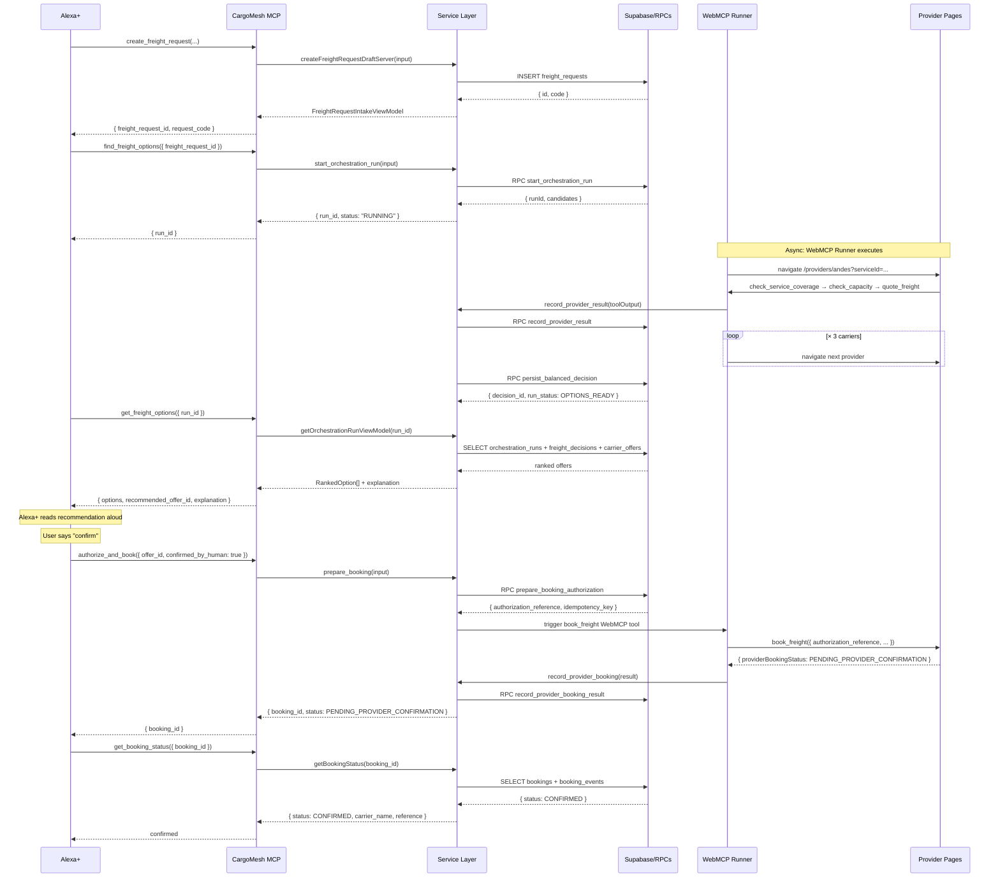

# CargoMesh Architecture V2

## Target Architecture Overview

```
┌───────────────────────────────────────────────────────────────────────┐
│                         CargoMesh V2                                  │
│                                                                       │
│  ┌─────────────────┐   ┌──────────────────────────────────────────┐  │
│  │  Enterprise UI  │   │           Alexa+                         │  │
│  │  (Next.js/React)│   │                                          │  │
│  └────────┬────────┘   └───────────────┬──────────────────────────┘  │
│           │                            │                              │
│           │ HTTP                       │ MCP (Streamable HTTP)        │
│           ▼                            ▼                              │
│  ┌─────────────────────────────────────────────────────────────┐     │
│  │                   Hono API Layer                            │     │
│  │  /api/v2/*  (strangler alongside existing /api/*)           │     │
│  │  Auth middleware → Service dispatch → Response envelope     │     │
│  └──────────────────────────┬──────────────────────────────────┘     │
│                             │                                         │
│  ┌──────────────────────────▼──────────────────────────────────┐     │
│  │                   Service Layer                             │     │
│  │  freight/     orchestration/    decision/                   │     │
│  │  booking/     discovery/        recovery/                   │     │
│  │  auth/        recommendations/                              │     │
│  │                                                             │     │
│  │  ← These are the SAME functions already in features/        │     │
│  │    Re-exported or moved, not rewritten                      │     │
│  └──────────────────────────┬──────────────────────────────────┘     │
│                             │                                         │
│  ┌──────────────────────────▼──────────────────────────────────┐     │
│  │                   Domain / Shared Schemas                   │     │
│  │  Zod schemas, TypeScript types, domain error classes        │     │
│  └──────────────────────────┬──────────────────────────────────┘     │
│                             │                                         │
│  ┌──────────────────────────▼──────────────────────────────────┐     │
│  │                   Supabase / RPCs                           │     │
│  │  17 tables · 8 stored procedures · 22 RLS policies          │     │
│  │  Session client (anon) · Admin client (service_role)         │     │
│  └─────────────────────────────────────────────────────────────┘     │
│                                                                       │
│  ┌─────────────────────────────────────────────────────────────┐     │
│  │          CargoMesh Orchestration (separate concern)         │     │
│  │                                                             │     │
│  │  WebMCP Runner → Provider Pages → Carrier WebMCP Tools      │     │
│  │  check_service_coverage / check_capacity / quote_freight    │     │
│  │  book_freight / get_provider_booking_status                 │     │
│  └─────────────────────────────────────────────────────────────┘     │
└───────────────────────────────────────────────────────────────────────┘
```

## Layer Responsibilities

### Next.js (Web Application)

**Owns:** React UI, Server Components, page routing (App Router), static assets, CSS modules, i18n, provider WebMCP host pages.

**Does:** Renders the enterprise and carrier UI. Calls Hono API routes (V2) or existing Next.js API routes (legacy, during migration). Hosts `/providers/[carrierSlug]` for carrier WebMCP tool registration.

**Does NOT:** Contain business logic. Does not duplicate service functions. Does not call Supabase RPCs directly from page components (goes through the service layer).

**Dependency direction:** Next.js pages → Hono API → Service Layer (or legacy Next.js API routes → feature functions during migration).

### Hono API Layer

**Owns:** HTTP route definitions, request parsing, auth middleware, response serialization, error mapping to HTTP status codes.

**Does:**  
- Receives an HTTP request  
- Validates auth via `requireAuthenticatedMember()` (shared)  
- Parses and validates input (Zod)  
- Calls ONE service function  
- Serializes the result into the standard response envelope  
- Maps domain errors to HTTP status codes  

**Does NOT:**  
- Contain business logic  
- Query Supabase directly (except via the auth middleware which is shared)  
- Know about WebMCP, provider navigation, or carrier scoring  
- Duplicate error handling already in service functions  

**Files:** `frontend/src/server/hono/` (TARGET — does not exist yet)

### Service Layer

**Owns:** All CargoMesh business logic. The existing `features/` directory already IS the service layer. V2 formalizes this and makes it importable by both Hono routes and MCP tools.

**Does:**  
- Validates input semantics (beyond schema: business rules)  
- Enforces access control (via `requireAuthenticatedMember`)  
- Calls Supabase queries and RPCs  
- Returns typed domain results  
- Throws typed domain errors (not HTTP errors)  

**Current locations (authoritative, do not move unless migrating a vertical):**  
- `frontend/src/features/auth/` — `requireAuthenticatedMember`, route guards  
- `frontend/src/features/freight-requests/` — draft creation, intake, execution intent, manual intake  
- `frontend/src/features/discovery/` — `get_candidate_provider_pages`  
- `frontend/src/features/orchestration/` — `start_orchestration_run`, view model  
- `frontend/src/features/result-bridge/` — `record_provider_result`  
- `frontend/src/features/decision-engine/` — `evaluate_offers`, `evaluateBalancedOffers`  
- `frontend/src/features/booking/` — `prepare_booking`, `record_provider_booking`, `record_provider_booking_status`, `prepare_booking_recovery`, `reset_demo_booking_runtime`  
- `frontend/src/features/webmcp-runner/` — orchestration runner, provider runner  
- `frontend/src/features/recommendations/` — D1 recommendation draft  
- `frontend/src/features/providers/` — WebMCP tool registrations  

**Target location (after migration):** Service functions will live in `frontend/src/server/services/` as thin wrappers or re-exports that standardize the interface without duplicating logic.

### Domain / Shared Schemas

**Owns:** TypeScript types, Zod schemas, domain error classes shared across Hono, MCP, and service functions.

**Does NOT:** Import from `server-only` packages. Does not contain Supabase client code.

**Current state:** Partially exists as `contracts.ts` files within each feature module. V2 consolidates shared cross-cutting schemas into `frontend/src/shared/schemas/` and `frontend/src/shared/types/`.

### Supabase / RPC Layer

**Owns:** Postgres schema (17 tables), 8 stored procedures, 22 RLS policies, seed data, pgTAP tests.

**Does NOT:** Change during V2 migration except for additive changes (new columns, new tests). All existing migrations are frozen.

**The two client modes:**  
- **Session client** (`createServerSupabaseClient`) — uses the authenticated user's JWT, enforces RLS. Used for reads visible to the user.  
- **Admin client** (`createAdminClient`) — uses `SUPABASE_SERVICE_ROLE_KEY`, bypasses RLS. Used only for privileged RPCs (`start_orchestration_run`, `persist_balanced_decision`, booking bridge calls).

### MCP Layer

**Owns:** 6 MCP tool definitions, Streamable HTTP transport handler, tool input/output schemas, `confirmed_by_human` authorization gate.

**Does:** Receives MCP tool calls from Alexa+, validates input, calls the service layer (same functions as Hono routes), returns MCP-formatted results.

**Does NOT:** Contain business logic. Does not call Supabase directly. Does not duplicate service function logic.

**Files:** `frontend/src/mcp/` (TARGET — does not exist yet)

### WebMCP Provider Runtime

**Owns:** The browser-based orchestration runner that navigates to `/providers/[carrierSlug]` pages and invokes the 5 low-level carrier tools (`check_service_coverage`, `check_capacity`, `quote_freight`, `book_freight`, `get_provider_booking_status`).

**Does NOT change in V2.** This subsystem is entirely preserved as-is. The Alexa+/MCP layer does not call provider tools directly — it calls `find_freight_options` on the MCP server, which triggers the WebMCP runner.

## Dependency Direction Rules

```
Forbidden dependencies (must never exist):
─────────────────────────────────────────

Service Layer  →  Hono API Layer        ✗ (circular)
Service Layer  →  MCP Layer             ✗ (circular)
Domain types   →  Service Layer         ✗ (domain is leaf)
Supabase RPC   →  Service Layer         ✗ (DB knows nothing about app)
Next.js pages  →  MCP Layer             ✗ (UI doesn't call MCP)

Allowed dependencies:
─────────────────────

Next.js pages      →  Service Layer            ✓ (Server Components only)
Next.js pages      →  Hono API routes          ✓ (via HTTP fetch)
Hono API routes    →  Service Layer            ✓ (the primary path)
MCP tools          →  Service Layer            ✓ (same as Hono)
Service Layer      →  Supabase clients         ✓
Service Layer      →  Domain types             ✓
Hono middleware    →  lib/supabase/auth.ts      ✓ (shared auth)
MCP tools          →  lib/supabase/auth.ts      ✓ (shared auth)
```

## Mermaid: Golden Flow Data Flow



## Current Architecture (V1 — Baseline)

The current application is a single Next.js 15 App Router application. All API logic lives in Next.js Route Handlers under `src/app/api/`. Route handlers are thin: they call feature functions and map errors to HTTP responses. Feature functions in `src/features/` contain the actual business logic.

**What already works well (do not change):**
- Feature module structure in `src/features/` is already a de-facto service layer
- Supabase client separation (session / admin) is correct and well-tested
- `requireAuthenticatedMember()` is a clean auth boundary
- RPC pattern (admin client calls privileged Supabase RPCs) is correct
- All 147 pgTAP tests pass; all TypeScript tests pass; production build is clean

**What V2 adds without breaking what works:**
- Hono API layer as an alternative HTTP interface to the same feature functions
- MCP server as an agent interface to the same feature functions
- Shared Zod schemas extracted so both Hono and MCP validate consistently
- Target folder structure that makes ownership explicit
