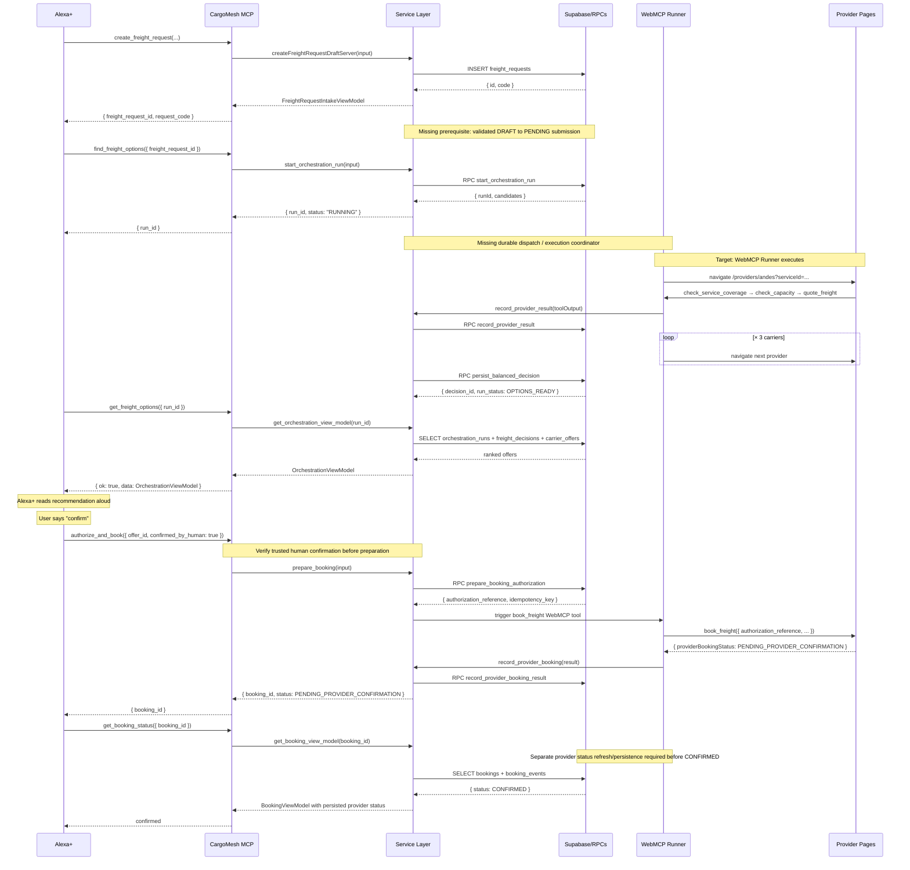

# CargoMesh Architecture V2

## Target Architecture Overview

Status: Hono bootstrap/draft creation and MCP local read/creation adapters exist; M2 requires permanent migration application and an authenticated MCP smoke test; local SQL checks passed. Remote execution/auth adapters remain proposed. See [MCP_TOOL_CONTRACTS.md](./MCP_TOOL_CONTRACTS.md) for verified contracts and blockers.

```text
Enterprise UI -> Hono REST --\
                             -> Shared services -> Core -> Supabase/RPC
Agent client  -> MCP -------/                        |
                                                    -> WebMCP executor -> Providers
```

MCP must not call Hono over HTTP in the same process. The browser executor is a separate execution boundary whose remote dispatch and durable reconciliation are not implemented.

## Layer Responsibilities

### Next.js (Web Application)

**Owns:** React UI, Server Components, page routing (App Router), static assets, CSS modules, i18n, provider WebMCP host pages.

**Does:** Renders the enterprise and carrier UI. Calls Hono API routes (V2) or existing Next.js API routes (legacy, during migration). Hosts `/providers/[carrierSlug]` for carrier WebMCP tool registration.

**Does NOT:** Contain business logic. Does not duplicate service functions. Does not call Supabase RPCs directly from page components (goes through the service layer).

**Dependency direction:** Next.js pages → Hono API → Service Layer (or legacy Next.js API routes → feature functions during migration).

### Hono API Layer

**Owns:** HTTP route definitions, request parsing, auth middleware, response serialization, error mapping to HTTP status codes.

**Does:**  
- Receives an HTTP request  
- Validates auth via `requireAuthenticatedMember()` (shared)  
- Parses and validates input (Zod)  
- Calls ONE service function  
- Serializes the result into the standard response envelope  
- Maps domain errors to HTTP status codes  

**Does NOT:**  
- Contain business logic  
- Query Supabase directly (except via the auth middleware which is shared)  
- Know about WebMCP, provider navigation, or carrier scoring  
- Duplicate error handling already in service functions  

**Files:** `cargomesh/src/server/hono/` (bootstrap and draft creation exist; remaining verticals are planned)

### Service Layer

**Owns:** Authenticated use cases and persistence in `cargomesh/src/server/services/<domain>/`. Both Hono and MCP import these services directly. Pure domain contracts, calculations and browser workflows remain organized by feature in `cargomesh/src/features/`.

**Does:**  
- Validates input semantics (beyond schema: business rules)  
- Enforces access control (via `requireAuthenticatedMember`)  
- Calls Supabase queries and RPCs  
- Returns typed domain results  
- Throws typed domain errors (not HTTP errors)  

**Current locations:**
- `cargomesh/src/server/services/` — freight requests, discovery, orchestration, result bridge, evaluation, booking, recommendations and server view loaders.
- `cargomesh/src/server/auth/` — authenticated member resolution and page guards.
- `cargomesh/src/server/db/supabase/` — server session and administrative clients.
- `cargomesh/src/server/hono/` and `cargomesh/src/server/mcp/` — independent transports using the same services.
- `cargomesh/src/features/decision-engine/` — pure deterministic BALANCED calculations.
- `cargomesh/src/features/webmcp-runner/` and `cargomesh/src/features/providers/` — browser executor and provider tool runtime.

These are direct file relocations, not duplicate implementations or re-export wrappers. Next.js route entry points stay in `src/app/`. The application directory remains `cargomesh/` to preserve the existing deployment root. See the [backend layout guide](../../cargomesh/src/server/README.md). `pnpm check:architecture` checks browser/server and transport/service dependency boundaries.

### Domain / Shared Schemas

**Owns:** TypeScript types, Zod schemas, domain error classes shared across Hono, MCP, and service functions.

**Does NOT:** Import from `server-only` packages. Does not contain Supabase client code.

**Current state:** Partially exists as `contracts.ts` files within each feature module. V2 consolidates shared cross-cutting schemas into `cargomesh/src/shared/schemas/` and `cargomesh/src/shared/types/`.

### Supabase / RPC Layer

**Owns:** Postgres schema (17 tables), 8 stored procedures, 22 RLS policies, seed data, pgTAP tests.

**Does NOT:** Change during V2 migration except for additive changes (new columns, new tests). All existing migrations are frozen.

**The two client modes:**  
- **Session client** (`createServerSupabaseClient`) — uses the authenticated user's JWT, enforces RLS. Used for reads visible to the user.  
- **Admin client** (`createAdminClient`) — uses `SUPABASE_SERVICE_ROLE_KEY`, bypasses RLS. Used only for privileged RPCs (`start_orchestration_run`, `persist_balanced_decision`, booking bridge calls).

### MCP Layer

**Owns:** 6 MCP tool definitions, Streamable HTTP transport handler, tool input/output schemas, verified human approval gate (a caller boolean is insufficient).

**Does:** Receives MCP tool calls from Alexa+, validates input, calls the service layer (same functions as Hono routes), returns MCP-formatted results.

**Does NOT:** Contain business logic. Does not call Supabase directly. Does not duplicate service function logic.

**Files:** `cargomesh/src/server/mcp/` (local read and creation implemented; remaining tools planned)

### WebMCP Provider Runtime

**Owns:** The browser-based orchestration runner that navigates to `/providers/[carrierSlug]` pages and invokes the 5 low-level carrier tools (`check_service_coverage`, `check_capacity`, `quote_freight`, `book_freight`, `get_provider_booking_status`).

**Does NOT change in V2.** This subsystem is entirely preserved as-is. The Alexa+/MCP layer does not call provider tools directly — it calls `find_freight_options` on the MCP server, whose future shared coordinator must dispatch a WebMCP executor. Run creation alone does not trigger the runner.

## Dependency Direction Rules

```
Forbidden dependencies (must never exist):
─────────────────────────────────────────

Service Layer  →  Hono API Layer        ✗ (circular)
Service Layer  →  MCP Layer             ✗ (circular)
Domain types   →  Service Layer         ✗ (domain is leaf)
Supabase RPC   →  Service Layer         ✗ (DB knows nothing about app)
Next.js pages  →  MCP Layer             ✗ (UI doesn't call MCP)

Allowed dependencies:
─────────────────────

Next.js pages      →  Service Layer            ✓ (Server Components only)
Next.js pages      →  Hono API routes          ✓ (via HTTP fetch)
Hono API routes    →  Service Layer            ✓ (the primary path)
MCP tools          →  Service Layer            ✓ (same as Hono)
Service Layer      →  Supabase clients         ✓
Service Layer      →  Domain types             ✓
Hono middleware    →  server/auth/member.ts      ✓ (shared auth)
MCP tools          →  server/auth/member.ts      ✓ (shared auth)
```

## Mermaid: Target Golden Flow Data Flow (not implemented)



## Historical Architecture (V1 — Baseline)

The current application is a single Next.js 15 App Router application. All API logic lives in Next.js Route Handlers under `src/app/api/`. Route handlers are thin: they call feature functions and map errors to HTTP responses. Feature functions in `src/features/` contain the actual business logic.

**What already works well (do not change):**
- Server services are grouped by domain in `src/server/services/`; pure rules and client workflows remain in `src/features/`
- Supabase client separation (session / admin) is correct and well-tested
- `requireAuthenticatedMember()` is a clean auth boundary
- RPC pattern (admin client calls privileged Supabase RPCs) is correct
- Historic baseline reports pgTAP/TypeScript/build passing; this documentation change does not rerun or certify that baseline

**What V2 adds without breaking what works:**
- Hono API layer as an alternative HTTP interface to the same feature functions
- MCP server as an agent interface to the same feature functions
- Shared Zod schemas extracted so both Hono and MCP validate consistently
- Target folder structure that makes ownership explicit
