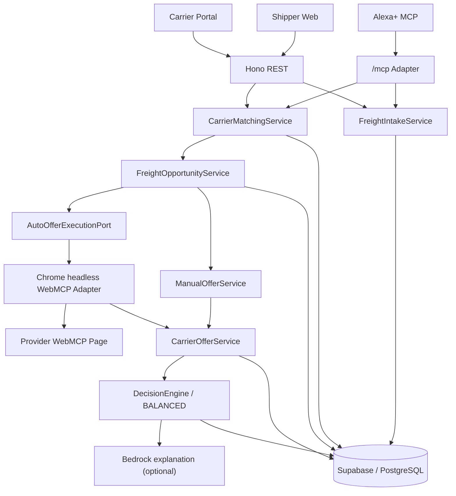
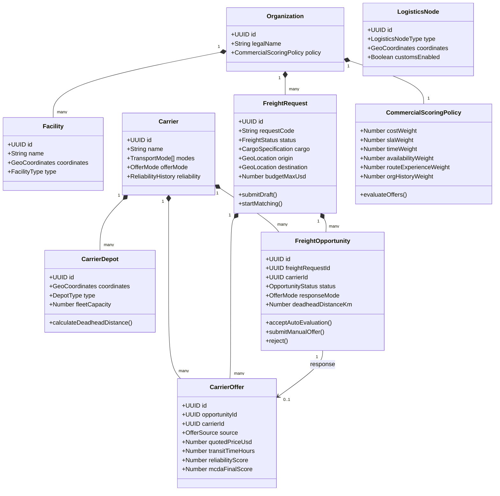
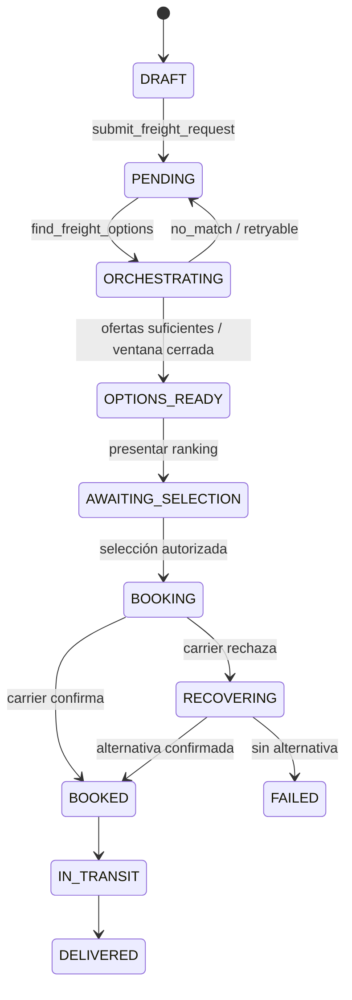
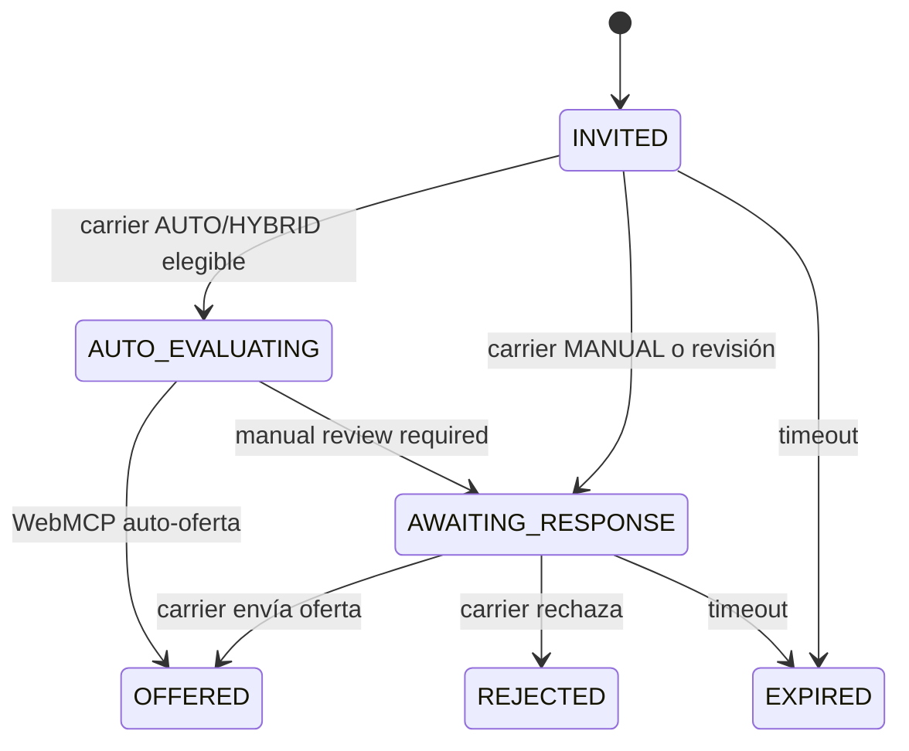
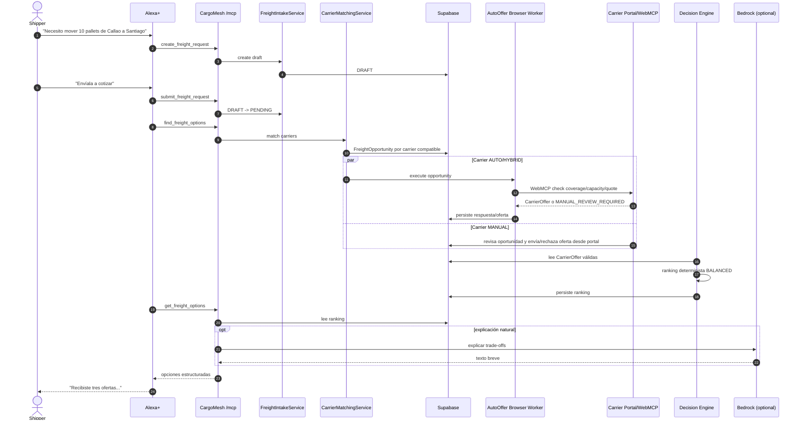

# CargoMesh V2 — Especificación de Dominio, Clases y Persistencia del Backend
## Arquitectura Hexagonal, Máquina de Estados y Mapeo Objeto-Relacional (TypeScript ⟷ Supabase)

> **Estado documental:** este archivo describe la **arquitectura objetivo V2**. Las capacidades que aún no existen en el código deben tratarse como `TARGET/PLANNED`; el flujo MCP ya validado y los componentes existentes no deben reescribirse solo para coincidir con este documento.

> 📚 **Suite Documental de Arquitectura V2:**  
> • **Blueprint Maestro:** [CARGOMESH_V2_EVOLUTION_BLUEPRINT.md](./CARGOMESH_V2_EVOLUTION_BLUEPRINT.md)  
> • **Esquema de Base de Datos:** [DATABASE_SCHEMA_V2_PROPOSAL.md](./DATABASE_SCHEMA_V2_PROPOSAL.md)  
> • **Diagramas de Dominio y Persistencia:** [BACKEND_DOMAIN_AND_PERSISTENCE_DIAGRAMS.md](./BACKEND_DOMAIN_AND_PERSISTENCE_DIAGRAMS.md) *(Este documento)*  
> • **Taxonomía de Carga y Precios USD:** [CARGO_DIMENSIONS_AND_TAXONOMY_V2.md](./CARGO_DIMENSIONS_AND_TAXONOMY_V2.md)  
> • **Plan Operativo y Sprints:** [MASTER_BACKLOG.md](./MASTER_BACKLOG.md)

---

## 🧭 1. Arquitectura de Dominio Corregida

CargoMesh V2 usa DDD + Ports & Adapters. El principio fundamental es separar:

- **canales de entrada:** Hono REST y MCP/Alexa+;
- **casos de uso:** intake, matching, oportunidades, ofertas, ranking y booking;
- **dominio:** FreightRequest, FreightOpportunity, CarrierOffer, Carrier, Route;
- **infraestructura:** Supabase, geocodificación/ruteo, portal carrier y WebMCP.



El browser worker es un **adaptador de infraestructura** para carriers `AUTO/HYBRID`; no forma parte de Alexa+ ni del núcleo de dominio.

## 🧱 2. Modelo de Dominio



### Regla de ownership comercial

`CarrierOffer` pertenece al carrier:

- `MANUAL_PORTAL`: una persona del carrier envía el precio.
- `WEBMCP_AUTO`: la política automática del sistema carrier lo calcula y envía.

CargoMesh puede calcular benchmarks y elegibilidad, pero **no crea una oferta comercial final unilateralmente**.

## ⚙️ 3. Máquinas de Estado

### `FreightRequest`

Se conserva la máquina compatible con el flujo actual:



`ORCHESTRATING` significa que CargoMesh está identificando carriers, publicando oportunidades y recolectando respuestas. No implica que CargoMesh calcule por sí mismo todas las ofertas.

### `FreightOpportunity`



Esta segunda máquina captura el comportamiento estilo inDrive sin contaminar el lifecycle principal del FreightRequest.

## 🔄 4. Secuencia End-to-End: Alexa+ / Web → Marketplace → Ranking



### Distancia y recomendación

El carrier más cercano no gana automáticamente. La proximidad/deadhead afecta:

- costo;
- ETA;
- disponibilidad;
- probabilidad de aceptar;
- experiencia/presencia en el corredor.

El Decision Engine combina esas consecuencias con las demás dimensiones de la política.

## 🗺️ 5. Mapeo Objeto-Relacional Corregido

| Tipo de dominio | Persistencia | Rol |
|---|---|---|
| `Organization` | `organizations` | Shipper / tenant |
| `Facility` | `facilities` | Sedes del shipper |
| `FreightRequest` | `freight_requests` | Necesidad logística publicada |
| `Carrier` | `carriers` | Empresa transportista |
| `CarrierDepot` | `carrier_depots` | Base/patio propio; deadhead |
| `LogisticsNode` | `logistics_nodes` | Puerto, aeropuerto, terminal, aduana, cross-dock |
| `FreightOpportunity` | `freight_opportunities` | Invitación de un request a un carrier |
| `CarrierOffer` | `carrier_offers` | Respuesta comercial manual o WebMCP auto |
| `CommercialScoringPolicy` | `commercial_scoring_policies` | Pesos del Decision Engine |
| `RouteCorridor` / legs | `route_corridors` / `route_legs` | Ruta nacional/internacional/multimodal |

### Invariante principal

```text
FreightRequest ≠ CarrierOffer
```

Una solicitud expresa la necesidad del shipper. Una oferta expresa la propuesta del carrier. `FreightOpportunity` es el puente entre ambas.

## 🛡️ 6. Reglas de Transaccionalidad e Idempotencia en Base de Datos

1. **Concurrencia Optimista Estricta:**  
   Toda actualización de estado en `freight_requests` exige comprobar:
   ```sql
   WHERE id = $target_id AND draft_version = $expected_draft_version
   ```
   Si no coincide, la base de datos aborta y Hono/MCP devuelve `409 STALE_DRAFT`.
2. **Deduplicación Criptográfica:**  
   La llave única `(organization_id, requested_by_member_id, creation_idempotency_key)` garantiza que llamadas duplicadas de Alexa ante reconexiones de red no generen fletes duplicados; devuelven el registro existente con `replayed: true`.
3. **Compuerta Financiera:**  
   Si el campo `quoted_price_usd > 5000.00` y el `requested_by_member_id` tiene rol `REQUESTER`, la transacción marca automáticamente `approval_status = 'PENDING_SUPERVISOR_APPROVAL'`, impidiendo la emisión del `confirmationReference` hasta que el supervisor firme en la web.