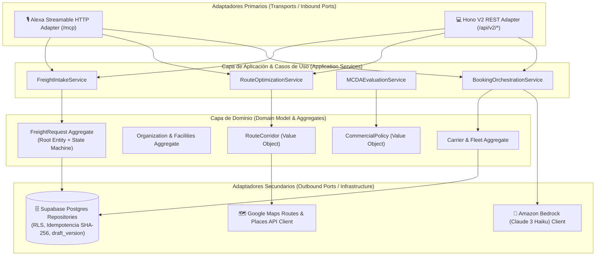
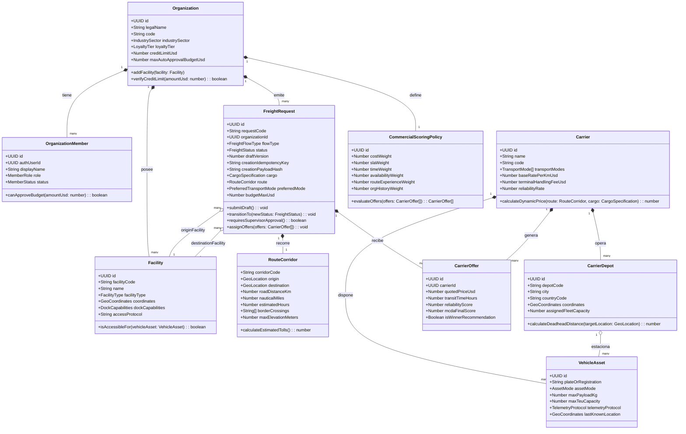
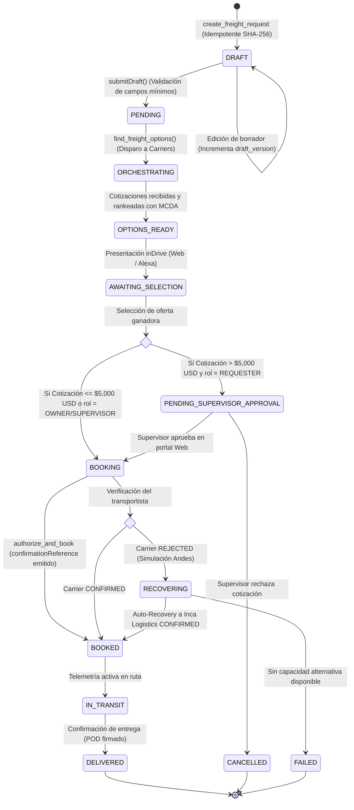
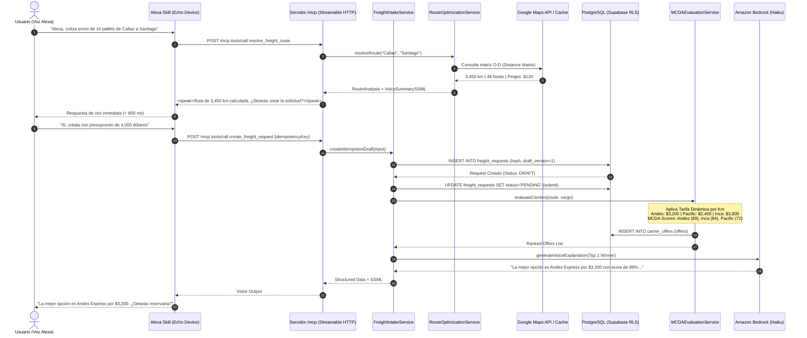

# CargoMesh V2 — Especificación de Dominio, Clases y Persistencia del Backend
## Arquitectura Hexagonal, Máquina de Estados y Mapeo Objeto-Relacional (TypeScript ⟷ Supabase)

---

## 🧭 1. Visión General de la Arquitectura de Persistencia

CargoMesh V2 adopta un enfoque de **Diseño Guiado por el Dominio (DDD) y Arquitectura Hexagonal (Ports & Adapters)**. La lógica de negocio, las reglas comerciales de flete, la tarificación paramétrica y los algoritmos MCDA residen en el **Núcleo de Dominio (Domain Core)**, completamente desacoplados de los adaptadores de transporte (Hono V2 y Servidor MCP de Alexa) y del motor de persistencia (Supabase / PostgreSQL 15).



---

## 🧱 2. Diagrama de Clases del Dominio (Domain Class Diagram)

Este diagrama modela las entidades de negocio, sus atributos, métodos operativos y relaciones en TypeScript:



---

## ⚙️ 3. Diagrama de Máquina de Estados (Lifecycle de `FreightRequest`)

El ciclo de vida de una solicitud de carga está estrictamente gobernado para evitar estados inconsistentes, garantizando la concurrencia optimista (`draft_version`):



---

## 🔄 4. Diagrama de Secuencia de Persistencia (Flujo Dual: Alexa ➔ Backend ➔ DB)

Este diagrama detalla cómo se ejecuta una solicitud por comando de voz en Alexa, pasando por las validaciones criptográficas de base de datos hasta el motor MCDA:



---

## 🗺️ 5. Mapeo Objeto-Relacional (TypeScript ⟷ Tablas de PostgreSQL)

Para que el equipo mantenga tipado estricto de extremo a extremo, este es el contrato de correspondencia:

| Clase / Tipo en TypeScript | Tabla en Supabase | Llave Primaria / Única | Invariante de Negocio |
|---|---|---|---|
| `Organization` | `public.organizations` | `id (UUID)` / `code (UNIQUE)` | Moneda base `USD` o `PEN`. Tiers: `STANDARD`, `GOLD`, `PLATINUM`. |
| `Facility` | `public.facilities` | `id (UUID)` / `(organization_id, facility_code)` | Coordenadas GPS válidas (`numeric(10,7)`). Vinculada a Google Maps Place ID. |
| `OrganizationMember` | `public.organization_members` | `id (UUID)` / `(organization_id, auth_user_id)` | Roles estrictos: `OWNER`, `SUPERVISOR`, `REQUESTER`. |
| `FreightRequest` | `public.freight_requests` | `id (UUID)` / `code (UNIQUE)` | Deduplicación SHA-256 (`creation_idempotency_key`), control optimista (`draft_version`). |
| `RouteCorridor` | `public.route_corridors` | `id (UUID)` / `corridor_code (UNIQUE)` | Distancia carretera en km, millas náuticas, peajes y polilínea GeoJSON. |
| `Carrier` | `public.carriers` | `id (UUID)` / `code (UNIQUE)` | Modos `['ROAD', 'MARITIME', 'RAIL', 'AIR']`, tarifa paramétrica por km. |
| `CarrierDepot` | `public.carrier_depots` | `id (UUID)` / `(carrier_id, depot_code)` | Patios físicos en Perú y Chile para cálculo de *deadhead*. |
| `VehicleAsset` | `public.vehicles` | `id (UUID)` / `code (UNIQUE)` | Activos terrestres, marítimos, ferroviarios y telemetría activa. |
| `CommercialScoringPolicy` | `public.commercial_scoring_policies` | `id (UUID)` | Suma de los 6 pesos de ponderación = exactamente `1.000`. |
| `CarrierOffer` | `public.carrier_offers` | `id (UUID)` | Ofertas rankeadas estilo inDrive con desglose MCDA. |

---

## 🛡️ 6. Reglas de Transaccionalidad e Idempotencia en Base de Datos

1. **Concurrencia Optimista Estricta:**  
   Toda actualización de estado en `freight_requests` exige comprobar:
   ```sql
   WHERE id = $target_id AND draft_version = $expected_draft_version
   ```
   Si no coincide, la base de datos aborta y Hono/MCP devuelve `409 STALE_DRAFT`.
2. **Deduplicación Criptográfica:**  
   La llave única `(organization_id, requested_by_member_id, creation_idempotency_key)` garantiza que llamadas duplicadas de Alexa ante reconexiones de red no generen fletes duplicados; devuelven el registro existente con `replayed: true`.
3. **Compuerta Financiera:**  
   Si el campo `quoted_price_usd > 5000.00` y el `requested_by_member_id` tiene rol `REQUESTER`, la transacción marca automáticamente `approval_status = 'PENDING_SUPERVISOR_APPROVAL'`, impidiendo la emisión del `confirmationReference` hasta que el supervisor firme en la web.
