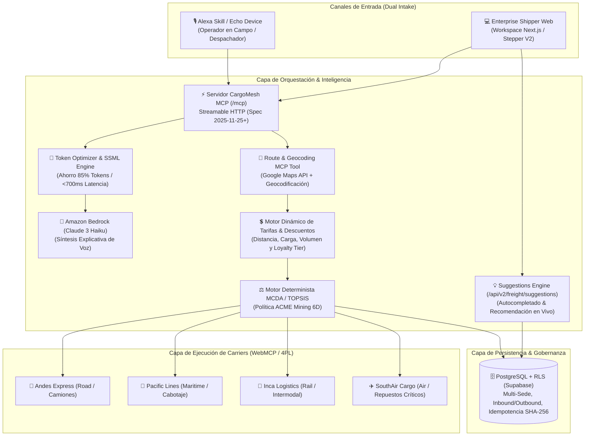
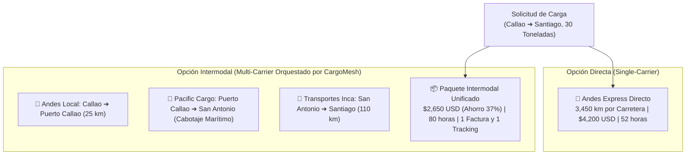
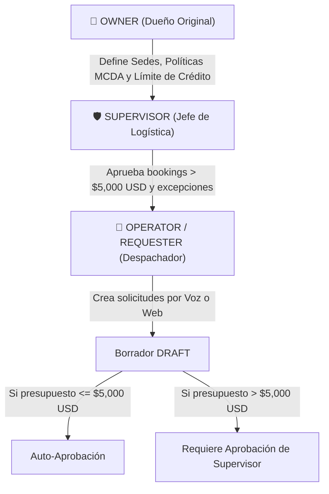

# CargoMesh V2 — Blueprint Maestro de Evolución Multimodal y Enterprise
## Plataforma de Orquestación Logística Autónoma (Voz Alexa+, WebMCP y Gobernanza Determinista)

---

## 🧭 1. Resumen Ejecutivo y Nueva Visión del Proyecto
CargoMesh evoluciona de un despachador local de camiones a un **Sistema Operativo Logístico Multimodal Empresarial**. La plataforma conecta a generadores de carga industrial (**Shippers** con múltiples sedes y gobernanza estricta) con redes de transportistas (**Carriers** con flotas de camiones, barcos, trenes y aviones), orquestados mediante agentes de voz (**Alexa Skills Kit + Amazon Bedrock**) y ejecutados por protocolos de herramientas web (**WebMCP**).



---

## 🔄 2. Direccionalidad de la Carga: Envío (Outbound), Traída (Inbound) y Transferencias

En las operaciones industriales de gran escala (como minería y retail), la carga no solo "se envía"; gran parte de las operaciones críticas consisten en **traer insumos, repuestos y maquinaria desde puntos externos hacia las sedes de la empresa**.

### Tipos de Flujo Soportados (`freight_flow_type`):

1. **`OUTBOUND` (Despacho / Envío de Carga):**
   * **Origen:** Sede registrada propia (ej. *Mina Las Bambas* o *Almacén Central*).
   * **Destino:** Cliente externo, fundición, refinería o puerto de exportación (ej. *Puerto del Callao*, *Planta Santiago*).
   * **Caso de Uso:** Venta y entrega de concentrado de mineral o productos terminados.

2. **`INBOUND` (Abastecimiento / Traída de Carga / Reverse Logistics):**
   * **Origen:** Punto externo X (ej. Almacén de un proveedor en Arequipa, muelle de importación en el Callao, o terminal aduanero).
   * **Destino:** Sede registrada propia (ej. *Campamento Minero Apurímac* o *Depósito Fiscal Lurín*).
   * **Particularidad Operativa:** Requiere especificar la persona de contacto en origen, número de orden de compra (PO) y horario de recojo en las instalaciones del proveedor externo.
   * **Comando por Voz en Alexa:** *"Alexa, pídele a CargoMesh que programe la traída de 10 pallets de repuestos desde el almacén de Komatsu en Arequipa hacia la sede Mina Las Bambas"*.

3. **`INTERNAL_TRANSFER` (Transferencia entre Sedes Propias):**
   * **Origen y Destino:** Ambas son sedes registradas de la misma organización.
   * **Beneficio:** Automatización total de la documentación interna, sin necesidad de validar solvencia de clientes externos.

---

## 🏎️ 3. Modelo de Decisión Tipo "inDrive": Subasta Inversa, Ranking y Contraofertas

En lugar de imponer un único proveedor cerrado, CargoMesh adopta un modelo transparente estilo subasta inversa (similar a inDrive o plataformas de corretaje de fletes):

1. **Recomendación Ganadora Destacada (#1 Best Option):**
   * El motor MCDA evalúa todas las cotizaciones y destaca en la cabecera al ganador según la política de la empresa (ej. **Andes Express: Score 89 / 100**).
2. **Listado Comparativo de Alternativas Competitivas:**
   * Abajo se listan las demás propuestas en tiempo real con su ficha detallada:
     * *Opción 1 (Ganadora):* Andes Express — \$3,200 USD | Score 89 | Tránsito: 48h | SLA: 99%
     * *Opción 2 (Más Rápida):* Transportes Inca — \$3,800 USD | Score 84 | Tránsito: 36h | SLA: 95%
     * *Opción 3 (Más Económica/Ecológica):* Pacific Cargo — \$2,400 USD | Score 72 | Tránsito: 84h | SLA: 90%
3. **Libertad de Selección del Shipper:**
   * El despachador puede aceptar la recomendada en 1 clic/voz, o elegir una alternativa según urgencias puntuales (ej. pagar más por Inca si la faena minera está detenida por falta de un repuesto).

---

## 🤝 4. ¿1 Solo Carrier o Múltiples Carriers Combinados? (Veredicto Arquitectónico)

### Análisis de la Problemática:
* **Ruta de 1 Solo Carrier (End-to-End / Puerta a Puerta):**
  * *Ventajas:* Menor complejidad legal, un único responsable ante siniestros, una sola Guía de Remisión / Bill of Lading (B/L).
  * *Desventajas:* Costoso para rutas de más de 2,000 km cruzando fronteras o zonas costeras donde el camión compite contra el barco.
* **Ruta de Múltiples Carriers (Intermodal / Multitramo):**
  * *Ventajas:* Reduce el costo total hasta en un **40%** (ej. tramo largo en buque de cabotaje y última milla en camión).
  * *Desventajas:* Fricción de transbordo en terminales, riesgo de descoordinación de horarios.

### La Solución Arquitectónica: Estrategia Híbrida como Operador 4PL
CargoMesh opera como un **Orquestador Logístico Integral (Lead Logistics Provider / 4PL)** ofreciendo ambas posibilidades:



* **Para el Usuario y para Alexa:** La experiencia es **unificada**. Aunque por debajo intervengan dos carriers distintos, CargoMesh unifica el contrato, emite una sola autorización de pago (`confirmationReference`) y ofrece un único panel de telemetría y tracking en tiempo real.

---

## 💲 5. Carriers Maleables y Motor Dinámico de Tarifas (Pricing Engine)

Los carriers en CargoMesh **no son estáticos ni tienen precios rígidos "quemados" en la base de datos**. Cualquier carrier registrado calcula su tarifa al vuelo mediante una función algorítmica paramétrica:

### Fórmula de Tarificación Dinámica:
$$\text{Precio Cotizado} = \left[ (\text{Distancia\_Km} \times \text{Tarifa\_Base\_Modo}) + \text{Tarifa\_Muelle\_Handling} \right] \times \prod \text{Multiplicadores\_Carga} \times (1 - \text{Descuento\_Cliente})$$

### 1. Tarifas Base por Modo y Distancia (Google Maps Routes):
* **Carretera (`ROAD`):** \$1.15 a \$1.45 USD por km recorrido.
* **Ferrocarril (`RAIL`):** \$0.45 a \$0.60 USD por km-tonelada.
* **Cabotaje Marítimo (`MARITIME`):** \$0.20 a \$0.30 USD por km equivalente (flete altamente económico para gran volumen).
* **Carga Aérea (`AIR`):** \$4.20 a \$5.50 USD por kg / km.

### 2. Multiplicadores por Especificación de Carga:
* **Cadena de Frío (`COLD_CHAIN`):** `+30%` (consumo de combustible del generador térmico y monitoreo continuo).
* **Carga Peligrosa (`HAZMAT`):** `+25%` (seguro especial y certificación de conductor).
* **Sobredimensionada (`OVERSIZED`):** `+40%` (escolta vial, permisos de carretera y peajes especiales).

### 3. Descuentos por Perfil de Cliente y Flete de Retorno (Backhaul):
* **Loyalty Tier de la Organización:** Shippers corporativos de alto volumen (ej. ACME Mining: Tier Platinum) reciben un **descuento automático negociado del -10% al -15%**.
* **Flete de Retorno (Backhaul Discount):** Si el carrier tiene un camión o contenedor desocupado retornando a su base en esa fecha exacta, aplica un **descuento de oportunidad de hasta el -25%**, evitando viajes en vacío.

---

## 🚢 6. Modelo Multimodal de Carriers (Tierra, Mar, Riel y Aire)

### Modos de Transporte Soportados (`transport_mode`):
1. **`ROAD` (Camiones):** FTL (Full Truckload) y LTL (Less than Truckload), plataformas cama-baja, tolvas mineraleras y furgones refrigerados.
2. **`MARITIME` (Embarcaciones / Cabotaje):** Transporte marítimo de contenedores secos (`20GP`, `40HC`) y carga refrigerada entre puertos costeros (ej. Callao ➔ San Antonio / Valparaíso).
3. **`RAIL` (Trenes de Carga):** Transporte masivo a granel desde depósitos andinos hacia terminales portuarios.
4. **`AIR` (Carga Aérea):** Envíos express de alta urgencia (repuestos de maquinaria detenida, insumos médicos y electrónicos).

### Perfil Extendido de Carrier en Base de Datos:
```typescript
interface CarrierProfile {
  id: string;
  name: string;
  slug: string;
  transport_modes: ('ROAD' | 'MARITIME' | 'RAIL' | 'AIR')[];
  base_rate_per_km_usd: number;
  terminal_handling_fee_usd: number;
  coverage_geofences: {
    origin_regions: string[];
    destination_regions: string[];
    licensed_corridors: string[];
  };
  fleet_capabilities: {
    max_payload_kg: number;
    specializations: ('HAZMAT' | 'COLD_CHAIN' | 'OVERSIZED' | 'HEAVY_HAUL')[];
    containers_supported: ('20GP' | '40HC' | 'REEFER' | 'FLATRACK')[];
  };
  webmcp_endpoint: string;
  reliability_history: {
    on_time_delivery_rate: number; // 0.0 a 1.0
    claims_ratio: number;
    completed_runs: number;
  };
}
```

---

## 📍 7. Nuevo MCP de Ruteo y Búsqueda Geográfica: `resolve_freight_route`

Para que el usuario pueda interactuar con Alexa mencionando cualquier dirección, origen o destino de forma natural, creamos una tool MCP especializada en geocodificación y análisis de ruta con Google Maps.

### ¿Cómo interactúa el usuario por voz con Alexa?
> **Usuario:** *"Alexa, pídele a CargoMesh que calcule la ruta desde Minera Las Bambas hasta el Puerto de San Antonio para 25 toneladas de concentrado."*

### Contrato de la Tool MCP:
```typescript
export const ResolveFreightRouteInputSchema = z.object({
  flowType: z.enum(['OUTBOUND', 'INBOUND', 'INTERNAL_TRANSFER']).default('OUTBOUND'),
  originQuery: z.string().min(3).describe("Sede registrada o dirección libre de origen"),
  destinationQuery: z.string().min(3).describe("Sede registrada o dirección libre de destino"),
  cargoWeightKg: z.number().positive().optional(),
  preferredMode: z.enum(['ROAD', 'MARITIME', 'RAIL', 'AIR', 'MULTIMODAL_OPTIMAL']).default('MULTIMODAL_OPTIMAL'),
});

export const ResolveFreightRouteOutputSchema = z.object({
  ok: z.literal(true),
  data: z.object({
    flowType: z.enum(['OUTBOUND', 'INBOUND', 'INTERNAL_TRANSFER']),
    origin: z.object({
      formattedAddress: z.string(),
      latitude: z.number(),
      longitude: z.number(),
      matchedFacilityId: z.string().uuid().nullable(),
      matchedFacilityName: z.string().nullable(),
    }),
    destination: z.object({
      formattedAddress: z.string(),
      latitude: z.number(),
      longitude: z.number(),
      matchedFacilityId: z.string().uuid().nullable(),
      matchedFacilityName: z.string().nullable(),
    }),
    routeAnalysis: z.object({
      roadDistanceKm: z.number(),
      estimatedDriveHours: z.number(),
      borderCrossings: z.array(z.string()),
      elevationProfileMaxMeters: z.number(),
      suggestedMode: z.enum(['ROAD', 'MARITIME', 'RAIL', 'AIR', 'MULTIMODAL_INTERMODAL']),
      multimodalLegs: z.array(z.object({
        legIndex: z.number(),
        mode: z.enum(['ROAD', 'MARITIME', 'RAIL', 'AIR']),
        fromHub: z.string(),
        toHub: z.string(),
        distanceKm: z.number(),
      })),
    }),
    voiceSummarySsml: z.string().describe("Texto en formato SSML listo para que Alexa lo pronuncie sin procesar tokens adicionales"),
  }),
});
```

---

## ⚖️ 8. Algoritmo Determinista de Consolidación (MCDA / TOPSIS)
Abandonamos aproximaciones heurísticas aleatorias en favor de un **Análisis de Decisión Multicriterio (MCDA)** estrictamente auditable, formal y matemático.

### Política Canónica de Evaluación (ACME Mining Perú):
* **25% Costo Financiero:** Minimización del precio cotizado total.
* **25% SLA & Confiabilidad:** Maximización del récord histórico de cumplimiento del transportista.
* **20% Tiempo de Tránsito:** Minimización de horas estimadas de entrega.
* **10% Disponibilidad de Flota:** Capacidad de respuesta y margen de camiones/contenedores en fecha solicitada.
* **10% Experiencia en Ruta:** Horas de tránsito del carrier en ese corredor geográfico específico.
* **10% Historial con la Organización:** Relación contractual previa y desempeño acumulado con ACME Mining.

### Formulación Matemática (Normalización Min-Max & Ponderación WSM/TOPSIS):
Para cada cotización $i$ en el criterio $j$:

$$\text{Para criterios de Minimización (Costo, Tiempo): } \quad R_{ij} = \frac{\max_k(x_{kj}) - x_{ij}}{\max_k(x_{kj}) - \min_k(x_{kj})}$$

$$\text{Para criterios de Maximización (SLA, Disponibilidad, Exp, Historial): } \quad R_{ij} = \frac{x_{ij} - \min_k(x_{kj})}{\max_k(x_{kj}) - \min_k(x_{kj})}$$

$$\text{Puntaje Final } S_i = \sum_{j=1}^{6} w_j \cdot R_{ij} \times 100 \quad \text{donde } \sum w_j = 1.0$$

* **Ventaja Innegociable:** El resultado es 100% determinista (mismos inputs = mismos scores exactos). **Amazon Bedrock no calcula ni altera los puntajes**, únicamente los recibe y genera la locución natural explicativa.

---

## 🏢 9. Definición del Cliente Empresarial (Shipper) y Gobernanza RBAC

### Estructura de Sedes (`facilities`):
* **Sede Mina (Apurímac):** Requiere vehículos con tracción 6x4, choferes con SCTR y pases mineros activos.
* **Sede Puerto (Callao):** Depósito fiscal con muelles de carga, montacargas y báscula electrónica.
* **Sede Destino (Santiago de Chile):** Planta de refinación con ventanas horarias estrictas de descarga.

### Jerarquía de Roles y Aprobación Financiera:


---

## 🔍 10. Auditoría de Adaptación de los MCPs Actuales (Gaps y Evolución)

| Campo en Schema Actual | Estado Actual (V1) | Brecha frente a V2 | Evolución Requerida (Aditiva) |
|---|---|---|---|
| `cargoEntryMethod` | `z.literal("PALLETS")` | Solo permite pallets | Ampliar a: `z.enum(["PALLETS", "CONTAINER_20GP", "CONTAINER_40HC", "BULK_HOPPER", "AIR_CRATE"])`. |
| `transportModePreferred` | No existe | Asume camión por defecto | Agregar: `z.enum(["ROAD", "MARITIME", "RAIL", "AIR", "MULTIMODAL_OPTIMAL"])`. |
| `freightFlowType` | No existe | Asume envío saliente siempre | Agregar: `z.enum(["OUTBOUND", "INBOUND", "INTERNAL_TRANSFER"]).default("OUTBOUND")`. |
| `originCity` / `destinationCity` | Solo strings de texto libre | No guarda coordenadas ni ID de sedes | Agregar `originFacilityId`, `destinationFacilityId`, lat/lng opcionales. |
| `find_freight_options` | Solo dispara a camiones | Sin filtro multimodal | Consultar en paralelo a providers de carretera, marítimos y ferroviarios. |

---

## 💡 11. Autocompletado y Motor de Sugerencias en Tiempo Real (`/api/v2/freight/suggestions`)

### A. Autocompletado en Frontend:
1. **Google Places Autocomplete:** Búsqueda predictiva de direcciones en tiempo real conforme el usuario tipea.
2. **Facility Quick-Picker:** Menú desplegable con las sedes corporativas de ACME Mining para autocompletar en 1 clic.

### B. Motor de Sugerencias Inteligentes (`POST /api/v2/freight/suggestions`):
Consulta ligera en segundo plano (debounced a 300 ms) que devuelve:
* **Modo Recomendado:** Sugerencia de tren o barco si el peso supera las 25 toneladas.
* **Tarifa Benchmark de Referencia:** Rango de precios histórico estimado (\$3,000 a \$3,500 USD).
* **Disponibilidad de Flota:** Capacidad de camiones/contenedores en tiempo real.

---

## 📋 12. Rediseño del Flujo de Rellenado Manual (Stepper V2 Enterprise)


* **Paso 1 (Dirección & Flujo):** Selector de Flujo (`OUTBOUND` vs `INBOUND`) + Selector de Sede o autocompletado con Google Maps + mapa previo.
* **Paso 2 (Activo & Carga):** Tarjetas visuales para Pallets, Contenedores (`20GP`/`40HC`), Tolvas o Paquetería Aérea + toggles de Frío y HAZMAT.
* **Paso 3 (Modo & Política Comercial):** Selector de modo (Recomendado Multimodal, Solo Carretera, Marítimo o Tren) y política de scoring (Balanced 6D, Cost-first o Time-critical).
* **Paso 4 (Ventanas Operativas & Envío):** Horarios de muelle, presupuesto opcional y resumen con hash SHA-256 (`draft_version: 1`).
* **⭐ Botón Canónico de 1 Clic:** `[⚡ Cargar Escenario Canónico (Callao ➔ Santiago)]` siempre presente en la cabecera para los jueces.

---

## 🎙️ 13. Arquitectura MCP para Alexa: Servidores en Uso y Estrategias de Ahorro de Tokens

### Herramientas MCP Core (Streamable HTTP en `/mcp` con SDK 1.30.0):
1. `create_freight_request`: Creación idempotente en estado `DRAFT`.
2. `resolve_freight_route`: Geocodificación con Google Maps, detección de sedes y SSML de ruta.
3. `find_freight_options`: Despacho activo y recolección de cotizaciones en tiempo real.
4. `get_freight_options`: Lectura de opciones rankeadas estilo inDrive.
5. `authorize_and_book`: Confirmación transaccional por voz con `confirmationReference` (compuerta humana).
6. `get_booking_status`: Consulta de tracking y telemetría de carga.
7. `recover_booking`: Auto-recuperación ante rechazo simulado del carrier.

### Patrones de Ahorro de Tokens y Baja Latencia:
* **Pre-Formatted Voice SSML (`get_voice_briefing`):** Ahorra 85% de tokens y baja la latencia a < 700 ms.
* **Progressive Disclosure:** Alexa solo dice la opción #1; las opciones secundarias se consultan solo si el usuario pide detalles.
* **Pre-Validación de Slots (`validate_freight_intent_slots`):** Previene errores de reconocimiento fonético.
* **Caché Geohash / Matrices de Distancia:** Evita quemar tokens enviando coordenadas GPS crudas a Bedrock.

---

## 🌐 14. Red de Providers WebMCP para Carriers Multimodales

| Carrier | Modo Principal | Flota Típica | Tools WebMCP Expuestas en `/providers/[slug]` |
|---|---|---|---|
| **Andes Express** | `ROAD` (Terrestre) | 45 Tractocamiones Volvo FH, furgones secos y reefer | `quote_freight`, `reserve_capacity`, `confirm_booking`, `get_fleet_telemetry`, `submit_pod` |
| **Pacific Cargo Lines** | `MARITIME` (Cabotaje) | 4 Buques portacontenedores costeros (Feeder) | `quote_container_voyage`, `check_berth_availability`, `reserve_container_slot`, `issue_bill_of_lading`, `get_vessel_eta` |
| **Inca Logistics & Rail** | `RAIL` + `ROAD` (Intermodal) | 12 Locomotoras GE, vagones tolva y flota capilar | `quote_intermodal_freight`, `check_terminal_ramp`, `reserve_rail_car`, `dispatch_first_mile`, `track_waybill` |
| **SouthAir Cargo (Roadmap)** | `AIR` (Carga Aérea) | 2 Boeing 737-800BCF (Freighters) | `quote_air_cargo`, `check_pallet_space`, `book_airway_bill`, `track_flight_status`, `confirm_customs_clearance` |

---

## 🗄️ 15. Roadmap de Base de Datos (Evolución Aditiva en Supabase)

```sql
-- 1. Enumeradores Multimodales y Direccionales
CREATE TYPE transport_mode_enum AS ENUM ('ROAD', 'MARITIME', 'RAIL', 'AIR', 'MULTIMODAL_OPTIMAL');
CREATE TYPE user_role_enum AS ENUM ('OWNER', 'SUPERVISOR', 'REQUESTER');
CREATE TYPE cargo_category_enum AS ENUM ('PALLETS', 'CONTAINER_20GP', 'CONTAINER_40HC', 'BULK_HOPPER', 'AIR_CRATE');
CREATE TYPE freight_flow_type_enum AS ENUM ('OUTBOUND', 'INBOUND', 'INTERNAL_TRANSFER');

-- 2. Sedes de la Organización (Facilities)
CREATE TABLE facilities (
    id UUID PRIMARY KEY DEFAULT gen_random_uuid(),
    organization_id UUID NOT NULL REFERENCES organizations(id) ON DELETE CASCADE,
    name TEXT NOT NULL,
    facility_code TEXT NOT NULL,
    address TEXT NOT NULL,
    latitude NUMERIC(10, 7) NOT NULL,
    longitude NUMERIC(10, 7) NOT NULL,
    has_dock BOOLEAN DEFAULT TRUE,
    has_rail_spur BOOLEAN DEFAULT FALSE,
    special_requirements TEXT[],
    created_at TIMESTAMPTZ DEFAULT NOW(),
    UNIQUE(organization_id, facility_code)
);

-- 3. Políticas de Decisión Personalizadas por Organización
CREATE TABLE commercial_scoring_policies (
    id UUID PRIMARY KEY DEFAULT gen_random_uuid(),
    organization_id UUID NOT NULL REFERENCES organizations(id) ON DELETE CASCADE,
    name TEXT NOT NULL DEFAULT 'ACME Balanced Policy',
    cost_weight NUMERIC(4, 3) DEFAULT 0.250,
    sla_weight NUMERIC(4, 3) DEFAULT 0.250,
    time_weight NUMERIC(4, 3) DEFAULT 0.200,
    availability_weight NUMERIC(4, 3) DEFAULT 0.100,
    route_experience_weight NUMERIC(4, 3) DEFAULT 0.100,
    org_history_weight NUMERIC(4, 3) DEFAULT 0.100,
    max_auto_approval_budget_cents BIGINT DEFAULT 500000, -- $5,000 USD
    is_active BOOLEAN DEFAULT TRUE,
    created_at TIMESTAMPTZ DEFAULT NOW()
);

-- 4. Extensión de freight_requests (Aditiva)
ALTER TABLE freight_requests 
    ADD COLUMN IF NOT EXISTS flow_type freight_flow_type_enum DEFAULT 'OUTBOUND',
    ADD COLUMN IF NOT EXISTS origin_facility_id UUID REFERENCES facilities(id),
    ADD COLUMN IF NOT EXISTS destination_facility_id UUID REFERENCES facilities(id),
    ADD COLUMN IF NOT EXISTS transport_mode_preferred transport_mode_enum DEFAULT 'ROAD',
    ADD COLUMN IF NOT EXISTS cargo_category cargo_category_enum DEFAULT 'PALLETS',
    ADD COLUMN IF NOT EXISTS required_approver_role user_role_enum DEFAULT 'REQUESTER',
    ADD COLUMN IF NOT EXISTS approved_by_user_id UUID REFERENCES auth.users(id);
```

---

## 📅 16. Plan de Implementación Progresiva (Fases de Desarrollo)

| Ciclo | Enfoque | Entregables Principales |
|---|---|---|
| **Sprint 1 (Actual)** | **Cimientos V2 & Creación Dual** | Idempotencia SHA-256 (`HAC-6`), Hono V2, Alexa Skill base (`HAC-5`), componentes UI y setup de evidencias. |
| **Sprint 2** | **Orquestación & Ruteo Google Maps** | Motor de Ruteo con Google Maps API (`resolve_freight_route`), normalización MCDA/TOPSIS y despacho multimodal (Andes, Pacific, Inca). |
| **Sprint 3** | **Gobernanza RBAC & Aprobación de Voz** | Roles Owner/Supervisor, compuerta humana `authorize_and_book` con límites de crédito y auto-recovery. |
| **Sprint 4** | **Token Optimizer & Amazon Bedrock** | Payloads SSML compactos (`get_voice_briefing`), síntesis natural con Claude 3 Haiku, paquete open source `cargomesh-mcp`. |
| **Sprint 5** | **Grabación Video Demo & Devpost** | Video oficial exhibiendo el flujo multimodal Callao ➔ Santiago por voz y web con jurados de Amazon. |
