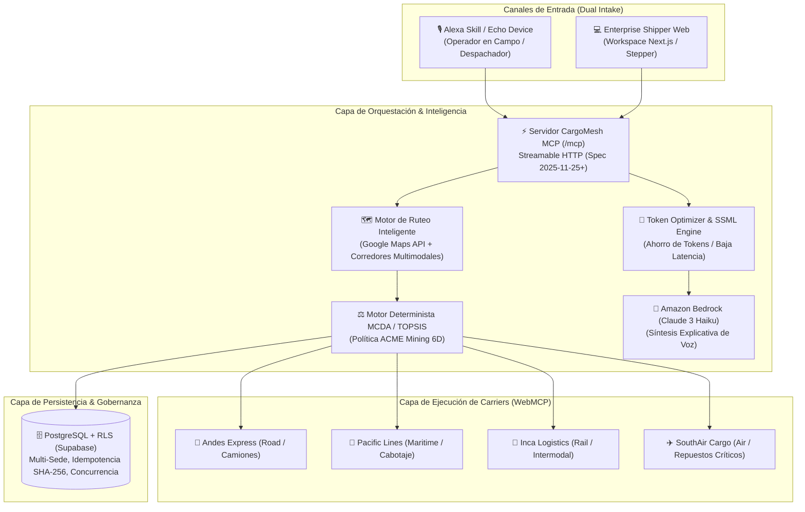
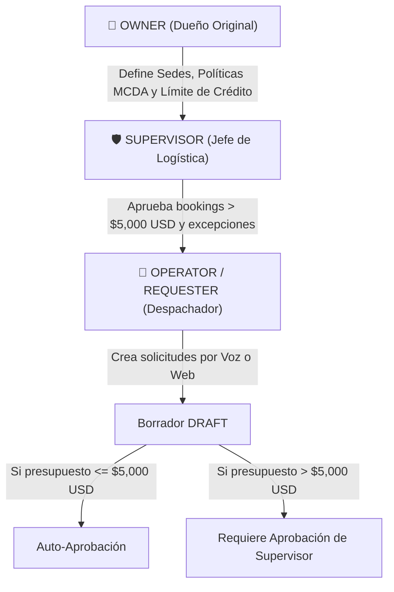

# CargoMesh V2 — Blueprint Maestro de Evolución Multimodal y Enterprise
## Plataforma de Orquestación Logística Autónoma (Voz Alexa+, WebMCP y Gobernanza Determinista)

---

## 🧭 1. Resumen Ejecutivo y Nueva Visión del Proyecto
CargoMesh evoluciona de un despachador local de camiones a un **Sistema Operativo Logístico Multimodal Empresarial**. La plataforma conecta a generadores de carga industrial (**Shippers** con múltiples sedes y gobernanza estricta) con redes de transportistas (**Carriers** con flotas de camiones, barcos, trenes y aviones), orquestados mediante agentes de voz (**Alexa Skills Kit + Amazon Bedrock**) y ejecutados por protocolos de herramientas web (**WebMCP**).



---

## 🚢 2. Modelo Multimodal de Carriers (Tierra, Mar, Riel y Aire)

En la logística industrial (especialmente minería y manufactura), los fletes rara vez son 100% en camión. CargoMesh modela los carriers como entidades de transporte multimodal:

### Modos de Transporte Soportados (`transport_mode`):
1. **`ROAD` (Camiones):** FTL (Full Truckload) y LTL (Less than Truckload), plataformas cama-baja, tolvas mineraleras y furgones refrigerados.
2. **`MARITIME` (Embarcaciones / Cabotaje):** Transporte marítimo de contenedores secos (`20GP`, `40HC`) y carga refrigerada entre puertos costeros (ej. Callao ➔ San Antonio / Valparaíso).
3. **`RAIL` (Trenes de Carga):** Transporte masivo a granel desde depósitos andinos hacia terminales portuarios.
4. **`AIR` (Carga Aérea):** Envíos express de alta urgencia (repuestos de maquinaria detenida, insumos médicos y electrónicos).

### Perfil Extendido de Carrier en Base de Datos:
```typescript
interface CarrierProfile {
  id: string;
  name: string;
  slug: string;
  transport_modes: ('ROAD' | 'MARITIME' | 'RAIL' | 'AIR')[];
  coverage_geofences: {
    origin_regions: string[];
    destination_regions: string[];
    licensed_corridors: string[];
  };
  fleet_capabilities: {
    max_payload_kg: number;
    specializations: ('HAZMAT' | 'COLD_CHAIN' | 'OVERSIZED' | 'HEAVY_HAUL')[];
    containers_supported: ('20GP' | '40HC' | 'REEFER' | 'FLATRACK')[];
  };
  webmcp_endpoint: string;
  reliability_history: {
    on_time_delivery_rate: number; // 0.0 a 1.0
    claims_ratio: number;
    completed_runs: number;
  };
}
```

---

## 🗺️ 3. Ruteo Inteligente con Google Maps API y Corredores Multimodales

La búsqueda de fletes deja de ser una comparación de distancia lineal para convertirse en un **Optimizador de Ruta por Carrier**:

1. **Ruteo Terrestre Dinámico (Google Maps Routes & Distance Matrix API):**
   * Calcula distancia real por carretera, tiempos de tránsito considerando restricciones de tráfico pesado, peajes y curvas topográficas en cruces cordilleranos (ej. Paso Los Libertadores).
2. **Corredores Multimodales (Hub-and-Spoke):**
   * Si una carga va de una mina en Apurímac a una fundición en Santiago:
     * **Tramo 1 (Carretera):** Mina Las Bambas ➔ Puerto del Callao (Google Maps API: 950 km).
     * **Tramo 2 (Marítimo):** Terminal Portuario Callao ➔ Puerto San Antonio (Ruta Náutica: 1,350 MN).
     * **Tramo 3 (Riel / Carretera):** Puerto San Antonio ➔ Parque Industrial Santiago (Google Maps API: 110 km).
3. **Búsqueda y Segmentación por Carrier:**
   * El motor evalúa si un solo carrier multimodal cubre el servicio completo ("End-to-End") o si se orquestan carriers complementarios con transbordo en Hubs certificados.

---

## ⚖️ 4. Algoritmo Determinista de Consolidación (MCDA / TOPSIS)
Abandonamos aproximaciones heurísticas aleatorias en favor de un **Análisis de Decisión Multicriterio (MCDA)** estrictamente auditable, formal y matemático.

### Política Canónica de Evaluación (ACME Mining Perú):
* **25% Costo Financiero:** Minimización del precio cotizado total.
* **25% SLA & Confiabilidad:** Maximización del récord histórico de cumplimiento del transportista.
* **20% Tiempo de Tránsito:** Minimización de horas estimadas de entrega.
* **10% Disponibilidad de Flota:** Capacidad de respuesta y margen de camiones/contenedores en fecha solicitada.
* **10% Experiencia en Ruta:** Horas de vuelo/tránsito del carrier en ese corredor geográfico específico.
* **10% Historial con la Organización:** Relación contractual previa y desempeño acumulado con ACME Mining.

### Formulación Matemática (Normalización Min-Max & Ponderación WSM/TOPSIS):
Para cada cotización $i$ en el criterio $j$:

$$\text{Para criterios de Minimización (Costo, Tiempo): } \quad R_{ij} = \frac{\max_k(x_{kj}) - x_{ij}}{\max_k(x_{kj}) - \min_k(x_{kj})}$$

$$\text{Para criterios de Maximización (SLA, Disponibilidad, Exp, Historial): } \quad R_{ij} = \frac{x_{ij} - \min_k(x_{kj})}{\max_k(x_{kj}) - \min_k(x_{kj})}$$

$$\text{Puntaje Final } S_i = \sum_{j=1}^{6} w_j \cdot R_{ij} \times 100 \quad \text{donde } \sum w_j = 1.0$$

* **Ventaja Innegociable:** El resultado es 100% determinista (mismos inputs = mismos scores exactos). **Amazon Bedrock no calcula ni altera los puntajes**, únicamente los recibe y genera la locución natural explicativa.

---

## 🏢 5. Definición del Cliente Empresarial (Shipper) y Gobernanza RBAC

El cliente ya no es un actor genérico en la web, sino una organización corporativa con sedes y niveles de autorización:

### Estructura de Sedes (`facilities`):
Una empresa como **ACME Mining Perú** posee sedes diferenciadas:
* **Sede Mina (Apurímac):** Requiere vehículos con tracción 6x4, choferes con SCTR y pases mineros activos.
* **Sede Puerto (Callao):** Depósito fiscal con muelles de carga, montacargas y báscula electrónica.
* **Sede Destino (Santiago de Chile):** Planta de refinación con ventanas horarias estrictas de descarga.

### Jerarquía de Roles y Aprobación Financiera:


---

## 🎙️ 6. Arquitectura MCP para Alexa: Servidores en Uso y Estrategias de Ahorro de Tokens

Para que la experiencia por voz sea instantánea y económica en tokens de LLM, el diseño separa el cómputo pesado de la síntesis de voz.

### A. Herramientas MCP en Uso Actual (Competencia Alexa):
Implementadas con `@modelcontextprotocol/sdk: 1.30.0` sobre Streamable HTTP en `/mcp`:

1. **`create_freight_request`:** Inicializa la solicitud con deduplicación criptográfica (SHA-256) e idempotencia en estado `DRAFT`.
2. **`find_freight_options`:** Dispara la orquestación hacia los carriers y recopila las cotizaciones en tiempo real.
3. **`get_freight_options`:** Retorna las ofertas rankeadas por el motor determinista BALANCED.
4. **`authorize_and_book`:** Ejecuta la reserva con compuerta humana vinculando el `confirmationReference`.
5. **`get_booking_status`:** Consulta el tracking y telemetría del flete activo.
6. **`recover_booking`:** Protocolo automático de recuperación ante rechazo simulado.

---

### B. Nuevos MCPs y Patrones de Optimización de Tokens para Alexa:

El envío masivo de JSON crudo a un modelo de lenguaje en Alexa causa latencia (2 a 4 segundos de silencio) y desperdicio de tokens. Diseñamos 4 patrones de optimización:

#### 1. Patrón "Pre-Formatted Voice SSML" (`get_voice_briefing`):
* **Problema:** Enviar 3 cotizaciones completas con JSON anidado gasta ~800 tokens de contexto y fuerza al LLM a leer todo para responder un párrafo.
* **Solución:** El backend genera un string SSML ultra-compacto listo para ser sintetizado por Alexa sin pasar por razonamientos redundantes:
  ```xml
  <speak>
    Encontré 3 cotizaciones para Callao a Santiago. 
    La mejor opción es <emphasis level="strong">Andes Express</emphasis> por 3,200 dólares, 
    con 89% de score por su récord de puntualidad. 
    ¿Deseas reservar Andes o escuchar la siguiente opción?
  </speak>
  ```
* **Ahorro:** Reduce el consumo de tokens de entrada en un **85%** y la latencia a menos de 700 ms.

#### 2. Patrón "Progressive Disclosure" (Divulgación Progresiva):
* Alexa **solo entrega la recomendación Top 1** por defecto.
* Las opciones 2 y 3 permanecen en el estado de sesión del backend.
* Solo si el usuario pregunta: *"¿Por qué no Inca?"* o *"¿Cuál es la segunda opción?"*, Alexa llama a `get_option_drilldown(rank: 2)`, cargando solo los datos necesarios en ese turno conversacional.

#### 3. Herramienta de Pre-Validación de Slots (`validate_freight_intent_slots`):
* Antes de crear una solicitud, valida si las ciudades de origen y destino tienen puertos o terminales activos.
* Evita fallos de base de datos y conversaciones truncadas en Alexa cuando el usuario pronuncia mal un destino.

#### 4. Caché de Matrices de Distancia (Geohash Caching):
* Almacena en memoria las distancias entre las sedes corporativas frecuentes (`Callao ➔ Santiago`, `Apurímac ➔ Callao`).
* Evita consultar repetidamente a Google Maps API y no inyecta coordenadas GPS crudas al contexto de Alexa.

---

## 🌐 7. Nuevos Providers WebMCP para Carriers Multimodales

La red de carriers en el navegador se amplía para demostrar la versatilidad multimodal:

| Carrier | Modo Principal | Flota Típica | Tools WebMCP Expuestas en `/providers/[slug]` |
|---|---|---|---|
| **Andes Express** | `ROAD` (Terrestre) | 45 Tractocamiones Volvo FH, furgones secos y reefer | `quote_freight`, `reserve_capacity`, `confirm_booking`, `get_fleet_telemetry`, `submit_pod` |
| **Pacific Cargo Lines** | `MARITIME` (Cabotaje) | 4 Buques portacontenedores costeros (Feeder) | `quote_container_voyage`, `check_berth_availability`, `reserve_container_slot`, `issue_bill_of_lading`, `get_vessel_eta` |
| **Inca Logistics & Rail** | `RAIL` + `ROAD` (Intermodal) | 12 Locomotoras GE, vagones tolva y flota capilar | `quote_intermodal_freight`, `check_terminal_ramp`, `reserve_rail_car`, `dispatch_first_mile`, `track_waybill` |
| **SouthAir Cargo (Roadmap)** | `AIR` (Carga Aérea) | 2 Boeing 737-800BCF (Freighters) | `quote_air_cargo`, `check_pallet_space`, `book_airway_bill`, `track_flight_status`, `confirm_customs_clearance` |

---

## 🗄️ 8. Roadmap de Base de Datos (Evolución Aditiva en Supabase)

Para no alterar las 147 pruebas pgTAP ni la concurrencia optimista existente, las nuevas entidades se introducen mediante migraciones DDL aditivas:

```sql
-- 1. Enumeradores Multimodales
CREATE TYPE transport_mode_enum AS ENUM ('ROAD', 'MARITIME', 'RAIL', 'AIR');
CREATE TYPE user_role_enum AS ENUM ('OWNER', 'SUPERVISOR', 'REQUESTER');
CREATE TYPE cargo_category_enum AS ENUM ('GENERAL', 'HAZMAT', 'COLD_CHAIN', 'OVERSIZED', 'MINERAL_BULK');

-- 2. Sedes de la Organización (Facilities)
CREATE TABLE facilities (
    id UUID PRIMARY KEY DEFAULT gen_random_uuid(),
    organization_id UUID NOT NULL REFERENCES organizations(id) ON DELETE CASCADE,
    name TEXT NOT NULL,
    facility_code TEXT NOT NULL,
    address TEXT NOT NULL,
    latitude NUMERIC(10, 7) NOT NULL,
    longitude NUMERIC(10, 7) NOT NULL,
    has_dock BOOLEAN DEFAULT TRUE,
    has_rail_spur BOOLEAN DEFAULT FALSE,
    special_requirements TEXT[],
    created_at TIMESTAMPTZ DEFAULT NOW(),
    UNIQUE(organization_id, facility_code)
);

-- 3. Políticas de Decisión Personalizadas por Organización
CREATE TABLE commercial_scoring_policies (
    id UUID PRIMARY KEY DEFAULT gen_random_uuid(),
    organization_id UUID NOT NULL REFERENCES organizations(id) ON DELETE CASCADE,
    name TEXT NOT NULL DEFAULT 'ACME Balanced Policy',
    cost_weight NUMERIC(4, 3) DEFAULT 0.250,
    sla_weight NUMERIC(4, 3) DEFAULT 0.250,
    time_weight NUMERIC(4, 3) DEFAULT 0.200,
    availability_weight NUMERIC(4, 3) DEFAULT 0.100,
    route_experience_weight NUMERIC(4, 3) DEFAULT 0.100,
    org_history_weight NUMERIC(4, 3) DEFAULT 0.100,
    max_auto_approval_budget_cents BIGINT DEFAULT 500000, -- $5,000 USD
    is_active BOOLEAN DEFAULT TRUE,
    created_at TIMESTAMPTZ DEFAULT NOW()
);

-- 4. Extensión de freight_requests (Aditiva)
ALTER TABLE freight_requests 
    ADD COLUMN IF NOT EXISTS origin_facility_id UUID REFERENCES facilities(id),
    ADD COLUMN IF NOT EXISTS destination_facility_id UUID REFERENCES facilities(id),
    ADD COLUMN IF NOT EXISTS transport_mode_preferred transport_mode_enum DEFAULT 'ROAD',
    ADD COLUMN IF NOT EXISTS cargo_category cargo_category_enum DEFAULT 'GENERAL',
    ADD COLUMN IF NOT EXISTS required_approver_role user_role_enum DEFAULT 'REQUESTER',
    ADD COLUMN IF NOT EXISTS approved_by_user_id UUID REFERENCES auth.users(id);
```

---

## 📅 9. Plan de Implementación Progresiva (Fases de Desarrollo)

| Ciclo | Enfoque | Entregables Principales |
|---|---|---|
| **Sprint 1 (Actual)** | **Cimientos V2 & Creación Dual** | Idempotencia SHA-256 (`HAC-6`), Hono V2, Alexa Skill base (`HAC-5`), componentes UI y setup de evidencias. |
| **Sprint 2** | **Orquestación & Ruteo Google Maps** | Motor de Ruteo con Google Maps API, normalización MCDA/TOPSIS y despacho a Andes, Pacific e Inca. |
| **Sprint 3** | **Gobernanza RBAC & Aprobación de Voz** | Roles Owner/Supervisor, compuerta humana `authorize_and_book` con límites de crédito y auto-recovery. |
| **Sprint 4** | **Token Optimizer & Amazon Bedrock** | Payloads SSML compactos, síntesis natural con Claude 3 Haiku, paquete open source `cargomesh-mcp`. |
| **Sprint 5** | **Grabación Video Demo & Devpost** | Video oficial exhibiendo el flujo multimodal Callao ➔ Santiago por voz y web con jurados de Amazon. |
