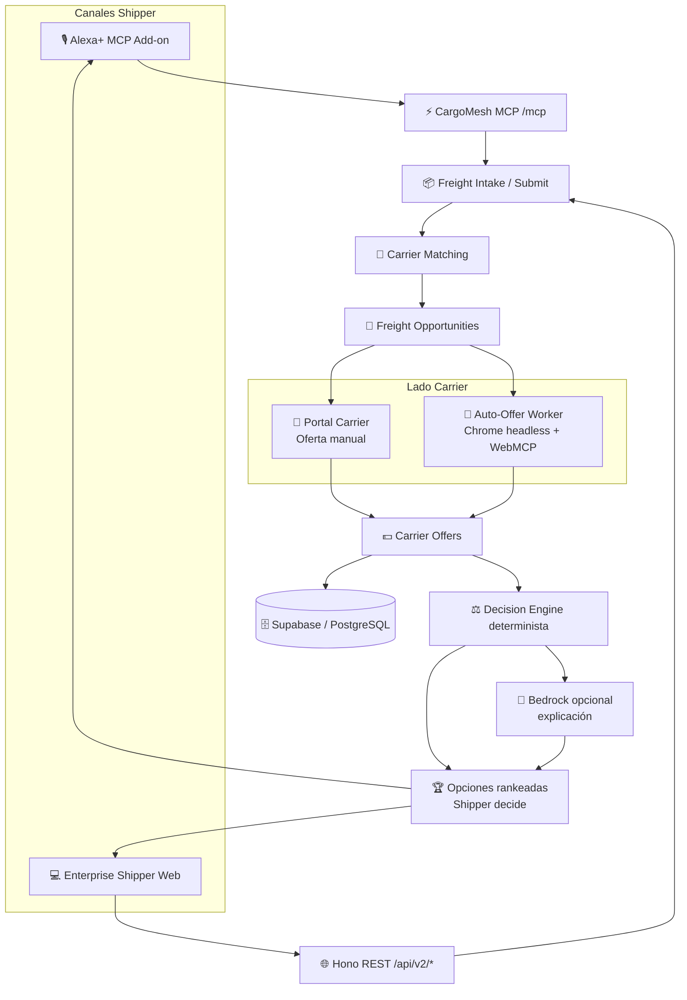
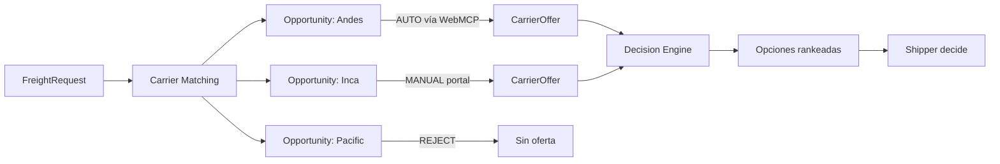
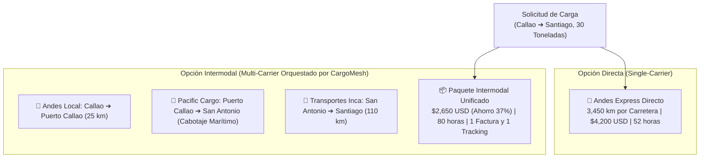
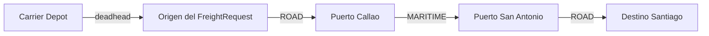
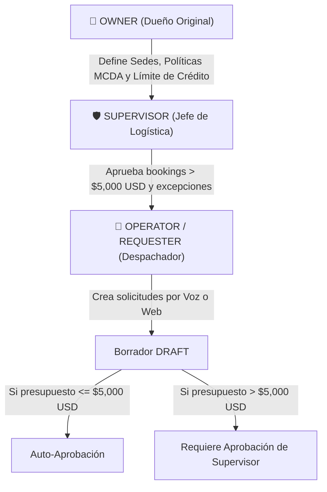

# CargoMesh V2 — Blueprint Maestro de Evolución Multimodal y Enterprise
## Marketplace Logístico Multimodal estilo inDrive (Alexa+, MCP, WebMCP y Gobernanza Determinista)

> **Estado documental:** este archivo describe la **arquitectura objetivo V2**. Las capacidades que aún no existen en el código deben tratarse como `TARGET/PLANNED`; el flujo MCP ya validado y los componentes existentes no deben reescribirse solo para coincidir con este documento.

> 📚 **Suite Documental de Arquitectura V2:**  
> • **Blueprint Maestro:** [CARGOMESH_V2_EVOLUTION_BLUEPRINT.md](./CARGOMESH_V2_EVOLUTION_BLUEPRINT.md) *(Este documento)*  
> • **Esquema de Base de Datos:** [DATABASE_SCHEMA_V2_PROPOSAL.md](./DATABASE_SCHEMA_V2_PROPOSAL.md)  
> • **Diagramas de Dominio y Persistencia:** [BACKEND_DOMAIN_AND_PERSISTENCE_DIAGRAMS.md](./BACKEND_DOMAIN_AND_PERSISTENCE_DIAGRAMS.md)  
> • **Taxonomía de Carga y Precios USD:** [CARGO_DIMENSIONS_AND_TAXONOMY_V2.md](./CARGO_DIMENSIONS_AND_TAXONOMY_V2.md)  
> • **Plan Operativo y Sprints:** [MASTER_BACKLOG.md](./MASTER_BACKLOG.md)

---

## 🧭 1. Resumen Ejecutivo y Visión Corregida del Proyecto

CargoMesh V2 es un **marketplace B2B de fletes multimodales estilo inDrive**. Un shipper publica una necesidad logística; CargoMesh identifica carriers compatibles; cada carrier decide si participa y puede **ofertar manualmente** desde su portal o **auto-ofertar** mediante sus reglas y tools WebMCP. CargoMesh no inventa la oferta comercial del carrier: recibe `CarrierOffer` válidas, las normaliza y las rankea con un motor determinista. El shipper conserva la decisión final.

La solución admite operaciones **nacionales e internacionales**, por lo que el matching considera no solo origen y destino, sino también patios y almacenes del carrier, puertos, aeropuertos, terminales ferroviarios, pasos fronterizos, capacidad, permisos, tipo de carga y distancia de posicionamiento (*deadhead*).

> ⚠️ **Separación arquitectónica clave**
>
> - **Alexa+** consume el servidor MCP de CargoMesh mediante Streamable HTTP en `/mcp`.
> - **Hono REST** y **MCP** son adaptadores de entrada hermanos que reutilizan la misma capa de servicios.
> - **WebMCP** es la interfaz de integración hacia el lado carrier para carriers con auto-oferta.
> - Alexa+ **no abre un navegador del usuario**. Cuando un carrier opera en modo auto-oferta WebMCP, CargoMesh puede usar internamente un **browser worker headless** para ejecutar la página provider y sus tools WebMCP.
> - El **Decision Engine** rankea ofertas ya emitidas por carriers; no genera cotizaciones por ellos.
> - **Amazon Bedrock** es opcional y se limita a explicar en lenguaje natural un resultado determinista ya calculado.



### Principio de negocio

```text
FreightRequest
    ↓
Carrier Matching
    ↓
FreightOpportunity
    ↓
Carrier decide
    ├─ MANUAL OFFER
    ├─ AUTO OFFER vía WebMCP
    └─ REJECT / IGNORE
    ↓
CarrierOffer
    ↓
Decision Engine
    ↓
Ranked Options
    ↓
Shipper selecciona
```

La automatización ayuda al carrier a responder más rápido, pero no convierte a CargoMesh en el dueño de su precio comercial.

## 🔄 2. Direccionalidad de la Carga: Envío (Outbound), Traída (Inbound) y Transferencias

En las operaciones industriales de gran escala (como minería y retail), la carga no solo "se envía"; gran parte de las operaciones críticas consisten en **traer insumos, repuestos y maquinaria desde puntos externos hacia las sedes de la empresa**.

### Tipos de Flujo Soportados (`freight_flow_type`):

1. **`OUTBOUND` (Despacho / Envío de Carga):**
   * **Origen:** Sede registrada propia (ej. *Mina Las Bambas* o *Almacén Central*).
   * **Destino:** Cliente externo, fundición, refinería o puerto de exportación (ej. *Puerto del Callao*, *Planta Santiago*).
   * **Caso de Uso:** Venta y entrega de concentrado de mineral o productos terminados.

2. **`INBOUND` (Abastecimiento / Traída de Carga / Reverse Logistics):**
   * **Origen:** Punto externo X (ej. Almacén de un proveedor en Arequipa, muelle de importación en el Callao, o terminal aduanero).
   * **Destino:** Sede registrada propia (ej. *Campamento Minero Apurímac* o *Depósito Fiscal Lurín*).
   * **Particularidad Operativa:** Requiere especificar la persona de contacto en origen, número de orden de compra (PO) y horario de recojo en las instalaciones del proveedor externo.
   * **Comando por Voz en Alexa:** *"Alexa, pídele a CargoMesh que programe la traída de 10 pallets de repuestos desde el almacén de Komatsu en Arequipa hacia la sede Mina Las Bambas"*.

3. **`INTERNAL_TRANSFER` (Transferencia entre Sedes Propias):**
   * **Origen y Destino:** Ambas son sedes registradas de la misma organización.
   * **Beneficio:** Automatización total de la documentación interna, sin necesidad de validar solvencia de clientes externos.

---

## 🏎️ 3. Modelo de Mercado Tipo inDrive: Oportunidades, Ofertas y Ranking

CargoMesh sigue un modelo de **subasta inversa B2B**. La solicitud del shipper no se convierte automáticamente en una cotización de cada carrier.

### Flujo correcto

1. El shipper crea y envía un `FreightRequest`.
2. CargoMesh resuelve la ruta y filtra carriers compatibles.
3. Para cada carrier compatible se crea una `FreightOpportunity`.
4. Cada carrier puede:
   - **MANUAL:** revisar la oportunidad en su portal y enviar/rechazar una oferta.
   - **AUTO:** aplicar su política automática y responder mediante WebMCP.
   - **HYBRID:** auto-ofertar solo en escenarios de bajo riesgo y mandar el resto a revisión humana.
5. Solo una respuesta comercial válida se materializa como `CarrierOffer`.
6. El Decision Engine rankea las ofertas recibidas.
7. El shipper puede aceptar la recomendada o escoger cualquier otra.



### Política de respuesta del carrier

Cada carrier define un `offer_mode`:

- **`MANUAL`**: toda oportunidad requiere intervención humana.
- **`AUTO`**: el sistema del carrier puede calcular y emitir una oferta automáticamente cuando se cumplen sus reglas.
- **`HYBRID`**: auto-oferta casos simples y envía a revisión casos sensibles, por ejemplo HAZMAT, carga sobredimensionada, montos altos o corredores no habituales.

### Recomendación

CargoMesh puede destacar una opción #1, pero la recomendación se basa en **ofertas realmente recibidas**. El ranking considera costo, SLA, tiempo, disponibilidad, experiencia en corredor e historial con la organización. La distancia al origen no se usa como un criterio aislado: influye en el *deadhead*, disponibilidad, ETA y costo de cada carrier.

> **Alexa+ no decide el carrier ganador.** Alexa presenta y explica el resultado del Decision Engine y conserva la libertad del shipper para escoger otra oferta.

## 🤝 4. ¿1 Solo Carrier o Múltiples Carriers Combinados? (Veredicto 4PL)

### Análisis de la Problemática:
* **Ruta de 1 Solo Carrier (End-to-End / Puerta a Puerta):** Menor complejidad legal, un único responsable ante siniestros, una sola Guía de Remisión / Bill of Lading (B/L).
* **Ruta de Múltiples Carriers (Intermodal / Multitramo):** Reduce el costo total hasta en un **40%** en distancias largas (ej. tramo largo en buque de cabotaje y tramos capilares en camión).

### La Solución de CargoMesh: Estrategia Híbrida como Operador 4PL
CargoMesh opera como un **Orquestador Logístico Integral (Lead Logistics Provider / 4PL)** ofreciendo ambas posibilidades:



* **Para el Usuario y para Alexa:** La experiencia es **unificada**. Aunque por debajo intervengan dos carriers distintos, CargoMesh unifica el contrato, emite una sola autorización de pago (`confirmationReference`) y ofrece un único panel de telemetría y tracking en tiempo real.

---

## 💲 5. Pricing, Benchmark y Auto-oferta del Carrier

CargoMesh distingue dos conceptos:

1. **Benchmark de CargoMesh:** estimación orientativa para que el shipper conozca un rango razonable.
2. **Oferta comercial del carrier:** precio que el carrier decide enviar. Puede provenir de una persona o de su política `AUTO/HYBRID`.

CargoMesh **no debe insertar una oferta final en nombre del carrier** solo porque conoce una tarifa base.

### Fórmula de referencia para auto-oferta

Una política automática puede considerar:

$$
\text{Precio Oferta} =
\left[
(\text{Distancia Cargada} + \text{Deadhead}) \times \text{Tarifa Base}
+ \text{Handling}
+ \text{Costos de Nodo}
+ \text{Costos Frontera/Aduana}
\right]
\times
\prod \text{Multiplicadores de Carga}
-
\text{Descuentos}
$$

Donde:

- **Distancia cargada:** trayecto origen → destino.
- **Deadhead:** distancia del activo/depot del carrier hasta el punto de recojo.
- **Costos de nodo:** puerto, aeropuerto, terminal ferroviario, almacén aduanero o cross-dock.
- **Frontera/aduana:** costos y demoras aplicables al corredor internacional.
- **Multiplicadores:** frío, HAZMAT, sobredimensionado, no apilable, seguro, etc.

### Reglas de auto-oferta

Ejemplo de carrier `HYBRID`:

```text
AUTO si:
- corredor soportado
- capacidad disponible
- deadhead <= 150 km
- carga GENERAL_DRY
- no HAZMAT
- margen mínimo cumplido

MANUAL_REVIEW si:
- HAZMAT / HEAVY_MACHINERY
- corredor nuevo
- monto por encima del umbral
- infraestructura especial
```

El resultado de `quote_freight` representa la decisión del **sistema del carrier**, no una tarifa impuesta por CargoMesh.

## 🚢 6. Carriers Multimodales, Oferta Manual/Automática e Infraestructura

### Modos de transporte objetivo

- `ROAD`
- `MARITIME`
- `RAIL`
- `AIR`
- combinaciones `MULTIMODAL`

### Perfil lógico del carrier

```typescript
interface CarrierProfile {
  id: string;
  name: string;
  slug: string;
  transportModes: ('ROAD' | 'MARITIME' | 'RAIL' | 'AIR')[];
  offerMode: 'MANUAL' | 'AUTO' | 'HYBRID';

  supportedCorridors: string[];
  specializations: ('HAZMAT' | 'COLD_CHAIN' | 'OVERSIZED' | 'HEAVY_HAUL')[];

  autoOfferPolicy?: {
    maxDeadheadKm?: number;
    maxAutoQuoteUsd?: number;
    requiresManualForHazmat: boolean;
    requiresManualForOversized: boolean;
  };

  reliabilityHistory: {
    onTimeDeliveryRate: number;
    claimsRatio: number;
    completedRuns: number;
  };
}
```

### Infraestructura física

Un carrier puede tener **depots propios** (patios, talleres, bases), pero una ruta internacional también atraviesa infraestructura que no necesariamente le pertenece. Por eso V2 distingue:

- **Carrier Depot:** base o patio del carrier.
- **Logistics Node:** puerto, aeropuerto de carga, terminal ferroviario, almacén aduanero, cross-dock, centro de distribución o puesto fronterizo.

Esta separación permite calcular:

- proximidad del carrier al origen;
- distancia *deadhead*;
- modos de transporte disponibles;
- compatibilidad con contenedores/reefer/HAZMAT;
- conectividad entre nodos para rutas internacionales e intermodales.

## 🗺️ 7. Ruteo Internacional, Distancia y Nodos Logísticos

El Golden Flow Callao → Santiago sigue siendo un escenario reproducible de demo, pero **no debe estar hardcodeado como regla de dominio**. Las solicitudes nacen de Alexa+ o de la web y pueden usar cualquier par de ubicaciones soportado.

El ruteo se divide en dos niveles:

1. **Ruta comercial de la carga:** origen → destino.
2. **Posicionamiento del carrier:** depot/activo → origen (*deadhead*).

Para operaciones internacionales y multimodales, el sistema puede incluir nodos como:

- `WAREHOUSE`
- `PORT_TERMINAL`
- `AIR_CARGO_TERMINAL`
- `RAIL_TERMINAL`
- `CUSTOMS_WAREHOUSE`
- `BORDER_POST`
- `CROSS_DOCK`
- `DISTRIBUTION_CENTER`



### Matching geográfico

El matching debe filtrar carriers por:

- cobertura del corredor;
- país(es) y permisos;
- distancia del depot/activo al origen;
- disponibilidad;
- compatibilidad de carga;
- acceso a puertos/aeropuertos/terminales requeridos;
- brokerage aduanero cuando aplique.

### Recomendación y distancia

La recomendación no debe ser “el carrier más cercano”. La distancia afecta el precio, ETA y disponibilidad. El Decision Engine utiliza esas variables junto con confiabilidad y experiencia. Alexa+ solo explica ese resultado.

## 📍 8. Nuevo MCP de Ruteo y Búsqueda Geográfica: `resolve_freight_route`

```typescript
export const ResolveFreightRouteInputSchema = z.object({
  flowType: z.enum(['OUTBOUND', 'INBOUND', 'INTERNAL_TRANSFER']).default('OUTBOUND'),
  originQuery: z.string().min(3).describe("Sede registrada o dirección libre de origen"),
  destinationQuery: z.string().min(3).describe("Sede registrada o dirección libre de destino"),
  cargoWeightKg: z.number().positive().optional(),
  preferredMode: z.enum(['ROAD', 'MARITIME', 'RAIL', 'AIR', 'MULTIMODAL_OPTIMAL']).default('MULTIMODAL_OPTIMAL'),
});

export const ResolveFreightRouteOutputSchema = z.object({
  ok: z.literal(true),
  data: z.object({
    flowType: z.enum(['OUTBOUND', 'INBOUND', 'INTERNAL_TRANSFER']),
    origin: z.object({
      formattedAddress: z.string(),
      latitude: z.number(),
      longitude: z.number(),
      matchedFacilityId: z.string().uuid().nullable(),
      matchedFacilityName: z.string().nullable(),
    }),
    destination: z.object({
      formattedAddress: z.string(),
      latitude: z.number(),
      longitude: z.number(),
      matchedFacilityId: z.string().uuid().nullable(),
      matchedFacilityName: z.string().nullable(),
    }),
    routeAnalysis: z.object({
      roadDistanceKm: z.number(),
      estimatedDriveHours: z.number(),
      borderCrossings: z.array(z.string()),
      elevationProfileMaxMeters: z.number(),
      suggestedMode: z.enum(['ROAD', 'MARITIME', 'RAIL', 'AIR', 'MULTIMODAL_INTERMODAL']),
      multimodalLegs: z.array(z.object({
        legIndex: z.number(),
        mode: z.enum(['ROAD', 'MARITIME', 'RAIL', 'AIR']),
        fromHub: z.string(),
        toHub: z.string(),
        distanceKm: z.number(),
      })),
    }),
    voiceSummarySsml: z.string().describe("Texto en formato SSML listo para que Alexa lo pronuncie sin procesar tokens adicionales"),
  }),
});
```

---

## ⚖️ 9. Decision Engine Determinista sobre Ofertas Reales

La política `BALANCED` conserva las seis dimensiones existentes:

- **25% Costo**
- **25% SLA / confiabilidad**
- **20% Tiempo de tránsito**
- **10% Disponibilidad**
- **10% Experiencia en ruta**
- **10% Historial con la organización**

El *deadhead* y la infraestructura del carrier se incorporan **antes o dentro de las métricas operativas**:

- mayor deadhead → mayor costo/ETA y potencial menor disponibilidad;
- depot cercano → mejor disponibilidad y menor reposicionamiento;
- falta de infraestructura compatible → carrier no elegible;
- experiencia/presencia en el corredor → mejor `route_experience`.

No se agrega una séptima ponderación por distancia en V2 inicial para no romper la política existente. Si en el futuro se desea, debe versionarse como una nueva `CommercialScoringPolicy`.

El motor solo evalúa `CarrierOffer` emitidas por carriers. **No crea ofertas ni modifica precios**.

Amazon Bedrock, cuando se integre, puede recibir el ranking y redactar una explicación; nunca calcula los scores ni autoriza el booking.

## 🏢 10. Definición del Cliente Empresarial (Shipper) y Gobernanza RBAC



---

## 🔍 11. Auditoría de Adaptación de los MCPs Actuales (Gaps y Evolución)

| Campo en Schema Actual | Estado Actual (V1) | Brecha frente a V2 | Evolución Requerida (Aditiva) |
|---|---|---|---|
| `cargoEntryMethod` | `z.literal("PALLETS")` | Solo permite pallets | Ampliar a: `z.enum(["PALLETS", "CONTAINER_20GP", "CONTAINER_40HC", "BULK_HOPPER", "AIR_CRATE"])`. |
| `transportModePreferred` | No existe | Asume camión por defecto | Agregar: `z.enum(["ROAD", "MARITIME", "RAIL", "AIR", "MULTIMODAL_OPTIMAL"])`. |
| `freightFlowType` | No existe | Asume envío saliente siempre | Agregar: `z.enum(["OUTBOUND", "INBOUND", "INTERNAL_TRANSFER"]).default("OUTBOUND")`. |
| `originCity` / `destinationCity` | Solo strings de texto libre | No guarda coordenadas ni ID de sedes | Agregar `originFacilityId`, `destinationFacilityId`, lat/lng opcionales. |
| `find_freight_options` | Solo dispara a camiones | Sin filtro multimodal | Consultar en paralelo a providers de carretera, marítimos y ferroviarios. |

---

## 💡 12. Autocompletado y Motor de Sugerencias en Tiempo Real (`/api/v2/freight/suggestions`)

1. **Google Places Autocomplete:** Búsqueda predictiva de direcciones en tiempo real conforme el usuario tipea.
2. **Facility Quick-Picker:** Menú desplegable con las sedes corporativas de ACME Mining para autocompletar en 1 clic.
3. **Motor de Sugerencias Inteligentes (`POST /api/v2/freight/suggestions`):**
   * *Modo Recomendado:* Sugerencia de tren o barco si el peso supera las 25 toneladas.
   * *Tarifa Benchmark de Referencia:* Rango de precios histórico estimado (\$3,000 a \$3,500 USD).
   * *Disponibilidad de Flota:* Capacidad de camiones/contenedores en tiempo real.

---

## 📋 13. Rediseño del Flujo de Rellenado Manual (Stepper V2 Enterprise)

* **Paso 1 (Dirección & Flujo):** Selector de Flujo (`OUTBOUND` vs `INBOUND`) + Selector de Sede o autocompletado con Google Maps + mapa previo.
* **Paso 2 (Activo & Carga):** Tarjetas visuales para Pallets, Contenedores (`20GP`/`40HC`), Tolvas o Paquetería Aérea + toggles de Frío y HAZMAT.
* **Paso 3 (Modo & Política Comercial):** Selector de modo (Recomendado Multimodal, Solo Carretera, Marítimo o Tren) y política de scoring (Balanced 6D, Cost-first o Time-critical).
* **Paso 4 (Ventanas Operativas & Envío):** Horarios de muelle, presupuesto opcional y resumen con hash SHA-256 (`draft_version: 1`).
* **⭐ Botón Canónico de 1 Clic:** `[⚡ Cargar Escenario Canónico (Callao ➔ Santiago)]` siempre presente en la cabecera para los jueces.

---

## 🎙️ 14. Servidor MCP para Alexa+

CargoMesh expone capacidades de aplicación mediante Streamable HTTP en `/mcp`. Alexa+ es un cliente MCP; no se implementa un Interaction Model clásico de ASK con intents/slots para este flujo.

### Tools MCP

**Implementadas / validadas en el flujo actual:**
1. `create_freight_request` — crea `DRAFT`.
2. `submit_freight_request` — valida y cambia `DRAFT → PENDING`.
3. `find_freight_options` — inicia matching/orquestación.
4. `get_freight_options` — consulta progreso y ofertas/ranking persistidos.

**Objetivo / roadmap:**
5. `resolve_freight_route` — resolución geográfica y nodos.
6. `authorize_and_book` — acción comercial con confirmación humana explícita.
7. `get_booking_status`.
8. `recover_booking`.

### Relación MCP ↔ marketplace

```text
Alexa+
  ↓
CargoMesh MCP
  ↓
FreightRequest / Matching
  ↓
FreightOpportunity
  ├─ Carrier manual portal
  └─ Carrier auto-offer WebMCP
  ↓
CarrierOffer
  ↓
Decision Engine
  ↓
get_freight_options
```

### Browser worker

Para carriers con `AUTO/HYBRID`, CargoMesh puede ejecutar sus páginas WebMCP mediante Chrome headless en infraestructura interna. Esto **no significa que Alexa dependa de un navegador del usuario**.

### Voz y Bedrock

- Alexa+ interpreta la conversación y selecciona tools MCP.
- El backend devuelve datos estructurados y concisos.
- Bedrock es opcional para explicar el ranking/trade-offs.
- Las acciones de booking/recovery siguen requiriendo confirmación humana cuando corresponda.

## 🗄️ 15. Roadmap de Base de Datos (Evolución Aditiva en Supabase)

```sql
-- 1. Enumeradores Multimodales, Direccionales y de Carga
CREATE TYPE preferred_transport_mode_enum AS ENUM ('ROAD', 'MARITIME', 'RAIL', 'AIR', 'MULTIMODAL_OPTIMAL');
CREATE TYPE user_role_enum AS ENUM ('OWNER', 'SUPERVISOR', 'REQUESTER');
CREATE TYPE freight_flow_type_enum AS ENUM ('OUTBOUND', 'INBOUND', 'INTERNAL_TRANSFER');
CREATE TYPE cargo_category_v2_enum AS ENUM ('MINING_BULK', 'HEAVY_MACHINERY', 'COLD_CHAIN', 'HAZMAT', 'HIGH_VALUE', 'GENERAL_DRY');
CREATE TYPE packaging_type_enum AS ENUM ('PALLET_STANDARD_WOOD', 'PALLET_EURO', 'CONTAINER_20GP', 'CONTAINER_40HC', 'BIG_BAG', 'DRUM_BARREL', 'WOODEN_CRATE');
CREATE TYPE carrier_offer_mode_enum AS ENUM ('MANUAL', 'AUTO', 'HYBRID');
CREATE TYPE freight_opportunity_status_enum AS ENUM ('INVITED', 'AUTO_EVALUATING', 'AWAITING_RESPONSE', 'OFFERED', 'REJECTED', 'EXPIRED');
CREATE TYPE carrier_offer_source_enum AS ENUM ('MANUAL_PORTAL', 'WEBMCP_AUTO');

-- 2. Sedes de la Organización (Facilities) - Ver DATABASE_SCHEMA_V2_PROPOSAL.md
CREATE TABLE facilities (
    id UUID PRIMARY KEY DEFAULT gen_random_uuid(),
    organization_id UUID NOT NULL REFERENCES organizations(id) ON DELETE CASCADE,
    name TEXT NOT NULL,
    facility_code TEXT NOT NULL,
    address TEXT NOT NULL,
    latitude NUMERIC(10, 7) NOT NULL,
    longitude NUMERIC(10, 7) NOT NULL,
    has_dock BOOLEAN DEFAULT TRUE,
    has_weighbridge BOOLEAN DEFAULT FALSE,
    has_rail_spur BOOLEAN DEFAULT FALSE,
    special_requirements TEXT[],
    created_at TIMESTAMPTZ DEFAULT NOW(),
    UNIQUE(organization_id, facility_code)
);

-- 3. Políticas de Decisión Personalizadas por Organización
CREATE TABLE commercial_scoring_policies (
    id UUID PRIMARY KEY DEFAULT gen_random_uuid(),
    organization_id UUID NOT NULL REFERENCES organizations(id) ON DELETE CASCADE,
    name TEXT NOT NULL DEFAULT 'ACME Balanced Policy',
    cost_weight NUMERIC(4, 3) DEFAULT 0.250,
    sla_weight NUMERIC(4, 3) DEFAULT 0.250,
    time_weight NUMERIC(4, 3) DEFAULT 0.200,
    availability_weight NUMERIC(4, 3) DEFAULT 0.100,
    route_experience_weight NUMERIC(4, 3) DEFAULT 0.100,
    org_history_weight NUMERIC(4, 3) DEFAULT 0.100,
    max_auto_approval_budget_cents BIGINT DEFAULT 500000, -- $5,000 USD
    is_active BOOLEAN DEFAULT TRUE,
    created_at TIMESTAMPTZ DEFAULT NOW()
);

-- 4. Extensión de freight_requests (Aditiva)
ALTER TABLE freight_requests 
    ADD COLUMN IF NOT EXISTS flow_type freight_flow_type_enum DEFAULT 'OUTBOUND',
    ADD COLUMN IF NOT EXISTS origin_facility_id UUID REFERENCES facilities(id),
    ADD COLUMN IF NOT EXISTS destination_facility_id UUID REFERENCES facilities(id),
    ADD COLUMN IF NOT EXISTS transport_mode_preferred preferred_transport_mode_enum DEFAULT 'ROAD',
    ADD COLUMN IF NOT EXISTS cargo_category_v2 cargo_category_v2_enum DEFAULT 'GENERAL_DRY',
    ADD COLUMN IF NOT EXISTS packaging_type packaging_type_enum DEFAULT 'PALLET_STANDARD_WOOD',
    ADD COLUMN IF NOT EXISTS total_cbm NUMERIC(10, 3),
    ADD COLUMN IF NOT EXISTS chargable_weight_kg NUMERIC(12, 2),
    ADD COLUMN IF NOT EXISTS is_stackable BOOLEAN DEFAULT TRUE,
    ADD COLUMN IF NOT EXISTS required_approver_role user_role_enum DEFAULT 'REQUESTER',
    ADD COLUMN IF NOT EXISTS approved_by_user_id UUID REFERENCES auth.users(id);
```

---

## 🛡️ 16. Auditoría de Huecos Críticos y Estrategia de Blindaje ante el Jurado

Para garantizar el máximo puntaje en la evaluación del jurado de Amazon Devpost ($190K Pool), identificamos y blindamos los 5 riesgos de arquitectura:

| Hueco / Riesgo Detectado | Consecuencia Potencial | Solución Técnica de Blindaje |
|---|---|---|
| **1. Scope Creep vs. Working Demo** | Penalización si los evaluadores ven maquetas sin terminar. | **Estrategia Vertical Slice:** El corredor *Callao ➔ Santiago* funciona 100% en vivo de punta a punta. Los carriers en vivo son Andes (Tierra) y Pacific (Mar). Cualquier modo adicional se etiqueta explícitamente como "Roadmap" cumpliendo la Honestidad Técnica. |
| **2. Latencia de Voz en Alexa (> 8 seg)** | Timeout sonoro de Alexa: *"There was a problem with the skill"*. | **Directiva Progressive Response:** Alexa reproduce un audio preliminar en 300 ms mientras el backend consulta Google Maps y cotiza. Además, distancias frecuentes se cachean en memoria y el fallback SSML responde en < 600 ms. |
| **3. Autenticación y RLS en Alexa** | Los jueces dudarán de cómo Alexa sabe qué permisos y sedes tiene el usuario. | **Bearer Token Mapeado a Organización:** La cabecera HTTP de la llamada MCP incluye el token vinculado a la organización `ACME Mining Peru` y al usuario `OWNER`. Se documenta el flujo de producción con Alexa Account Linking OAuth2. |
| **4. Desconexión Nube vs. Navegador** | Confusión sobre si Alexa requiere que el navegador del carrier esté abierto. | **Arquitectura Desacoplada:** Alexa+ llama al servidor MCP `/mcp`; no necesita un navegador de usuario. Los carriers `AUTO/HYBRID` pueden ser ejecutados por un browser worker headless interno que usa sus páginas WebMCP reales. La UI solo refleja estado y ofertas. |
| **5. Seguridad Financiera Verbal** | Descalificación si una IA gasta dinero sin consentimiento humano explícito. | **Compuerta Humana en 2 Pasos:** `authorize_and_book` exige confirmación verbal explícita vinculando un `confirmationReference` criptográfico. Si la cotización supera el límite del operador (> $5,000 USD), el sistema bloquea la auto-aprobación y exige firma de un `SUPERVISOR`. |
| **⭐ Multiplicador: Bono del +10%** | Pérdida de puntos extras por descuidar la categoría de feedback. | **3 Friction Logs Oficiales:** Registro detallado de incidentes y soluciones técnicas de AWS/MCP en `docs/04-execution/friction-logs/` (FL-01, FL-02, FL-03) para reclamar el bono máximo del jurado. |

---

## 📅 17. Plan de Implementación Progresiva (Fases de Desarrollo)

| Ciclo | Enfoque | Entregables Principales |
|---|---|---|
| **Sprint 1 (Actual)** | **Cimientos V2 & Creación Dual** | Idempotencia SHA-256 (`HAC-6`), Hono V2, Alexa+ MCP readiness (`HAC-5`), componentes UI y setup de evidencias. |
| **Sprint 2** | **Orquestación & Ruteo Google Maps** | Motor de Ruteo con Google Maps API (`resolve_freight_route`), normalización Decision Engine / MCDA y despacho multimodal (Andes, Pacific, Inca). |
| **Sprint 3** | **Gobernanza RBAC & Aprobación de Voz** | Roles Owner/Supervisor, compuerta humana `authorize_and_book` con límites de crédito y auto-recovery. |
| **Sprint 4** | **Token Optimizer & Amazon Bedrock** | Payloads SSML compactos (`get_voice_briefing`), síntesis natural con un modelo Bedrock seleccionado al momento de implementación, paquete open source `cargomesh-mcp`. |
| **Sprint 5** | **Grabación Video Demo & Devpost** | Video oficial exhibiendo el flujo multimodal Callao ➔ Santiago por voz y web con jurados de Amazon. |