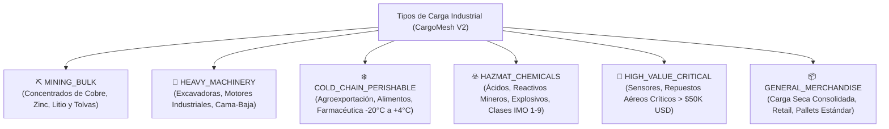

# CargoMesh V2 — Taxonomía Industrial de Cargas, Dimensiones y Modelo de Precios en USD
## Especificación de Tipos de Carga, Factor Volumétrico (CBM) y Recargos Dinámicos

---

## 🧭 1. El Problema en V1 vs. La Realidad Logística en V2

En la versión anterior (V1), las cargas estaban restringidas a 4 códigos genéricos (`MACHINERY`, `GENERAL`, `AGRICULTURAL`, `CONSTRUCTION`) y asumían que todo era un simple pallet de peso estático.

En la logística industrial real (especialmente minería, retail transfronterizo y química):
1. **El flete no solo se cobra por peso:** Se cobra por la relación entre **Peso Real vs. Peso Volumétrico (CBM)** según la regla internacional **W/M (Weight or Measurement)**.
2. **La apilabilidad es dinero:** Una carga liviana pero no apilable (`is_stackable: false`) ocupa todo el piso del camión o contenedor, impidiendo cargar otros bultos.
3. **El tipo de carga altera drásticamente el costo en dólares (USD):** Mover ácido sulfúrico (HAZMAT) o vacunas refrigeradas a -20°C cuesta entre 25% y 40% más que mover cajas secas, debido a seguros, combustible de generadores térmicos y choferes con certificaciones especiales.

---

## 📦 2. Nueva Taxonomía de Tipos de Carga (6 Categorías Industriales)

Reemplazamos las etiquetas genéricas por categorías alineadas con los estándares internacionales (IATA, IMO y regulaciones de aduanas Perú-Chile):



### Detalle de las 6 Categorías Industriales:

| Código de Categoría | Nombre en la Plataforma | Activo Típico de Transporte | Requerimientos Operativos | Multiplicador Base USD |
|---|---|---|---|---|
| **`MINING_BULK`** | Concentrados y Mineral a Granel | Tolvas herméticas 6x4, Vagón tolva ferroviario | Báscula de pesaje 60T, control de humedad (TML) | $\times 1.15$ (Desgaste severo) |
| **`HEAVY_MACHINERY`** | Maquinaria Pesada y Sobredimensionada | Plataforma Cama-baja (Lowboy) | Escolta vial, permisos de carretera por exceso de gálibo | $\times 1.40$ + Permisos (\$450 USD) |
| **`COLD_CHAIN`** | Perecibles y Cadena de Frío | Furgón / Contenedor Reefer con Thermo King | Monitoreo térmico continuo, generador gen-set | $\times 1.30$ (Combustible térmico) |
| **`HAZMAT`** | Materiales Peligrosos y Químicos | Cisternas o furgones con rombos IMO | Chofer con licencia A-IV, kit antiderrame, hoja MSDS | $\times 1.25$ a $\times 1.40$ (Riesgo/Seguro) |
| **`HIGH_VALUE`** | Repuestos Críticos y Alto Valor | Furgón blindado o Carga Aérea express | Precinto satelital GPS, escolta armada, seguro all-risk | $\times 1.20$ + Póliza Ad-Valorem |
| **`GENERAL_DRY`** | Mercadería General y Seca | Furgón estándar FTL o Contenedor 40HC | Paletizado estándar, montacargas tradicional | $\times 1.00$ (Tarifa Base) |

---

## 📏 3. Dimensiones Físicas, Cubicaje (CBM) y Peso Imputable (Chargable Weight)

Para evitar pérdidas financieras a los transportistas y cobrar precios justos en dólares, CargoMesh implementa el cálculo estándar de **Peso Imputable**:

### A. Metros Cúbicos (CBM):
$$\text{CBM} = \left( \frac{\text{Largo (cm)} \times \text{Ancho (cm)} \times \text{Alto (cm)}}{1,000,000} \right) \times \text{Cantidad de Bultos}$$

### B. Peso Volumétrico según el Modo de Transporte:
* **Transporte Carretero (Factor Terrestre):** $1 \text{ CBM} \approx 333 \text{ kg} \quad \left( \text{Peso Volumétrico} = \frac{\text{Largo} \times \text{Ancho} \times \text{Alto}}{3,000} \right)$
* **Carga Aérea (Factor IATA):** $1 \text{ CBM} \approx 167 \text{ kg} \quad \left( \text{Peso Volumétrico} = \frac{\text{Largo} \times \text{Ancho} \times \text{Alto}}{6,000} \right)$
* **Cabotaje Marítimo (Regla W/M):** $1 \text{ CBM} \approx 1,000 \text{ kg}$ ($1 \text{ Tonelada}$ métrica)

### C. Peso Imputable (Chargable Weight):
$$\text{Peso Imputable (kg)} = \max(\text{Peso Bruto Real (kg)}, \text{Peso Volumétrico (kg)})$$

---

## 🏷️ 4. Atributos Esenciales que se Incorporan a la Carga

La solicitud de flete en V2 incluye atributos operativos que antes faltaban:

1. **`packaging_type` (Tipo de Embalaje):**
   * `PALLET_STANDARD_WOOD`: Pallet de madera 120x100 cm.
   * `PALLET_EURO`: Pallet europeo 120x80 cm.
   * `CONTAINER_20GP`: Contenedor 20 pies seco.
   * `CONTAINER_40HC`: Contenedor 40 pies High Cube.
   * `BIG_BAG`: Bolsa industrial de 1 a 2 toneladas para mineral.
   * `DRUM_BARREL`: Cilindros de acero/plástico de 200 L para químicos.
   * `WOODEN_CRATE`: Caja de madera para maquinaria o repuestos delicados.

2. **`is_stackable` (Factor de Apilabilidad):**
   * `BOOLEAN`: Si es `FALSE`, la carga **no soporta peso encima**.
   * `max_stacking_tiers`: Si es apilable, indica cuántos niveles soporta (ej. 2 o 3 bultos de altura).
   * *Impacto en Precio:* Una carga **no apilable** aplica automáticamente un **recargo del +20%**, ya que anula la capacidad vertical del camión o buque.

3. **`declared_value_usd` (Valor Comercial Declarado en Dólares):**
   * Permite cotizar el seguro de carga obligatorio:  
     $$\text{Costo Seguro USD} = \text{declared\_value\_usd} \times 0.0035 \quad (0.35\% \text{ del valor de la mercadería})$$

4. **`hazmat_class` (Clasificación IMO para Materiales Peligrosos):**
   * Clase 1 (Explosivos), Clase 2 (Gases), Clase 3 (Líquidos Inflamables), Clase 8 (Corrosivos/Ácidos), Clase 9 (Misceláneos).
   * `un_number`: Código internacional de 4 dígitos de la ONU (ej. `UN 1830` para Ácido Sulfúrico).

---

## 💲 5. Matriz Dinámica de Precios en Dólares (USD Pricing Engine)

Todas las transacciones de CargoMesh se liquidan en **Dólares Americanos (USD)**. La cotización de cada carrier se calcula con la siguiente fórmula maestra:

$$\text{Precio Cotizado USD} = \left[ (\text{Distancia\_Km} \times \text{Tarifa\_Base\_Modo}) + \text{Tarifa\_Muelle} \right] \times M_{\text{modo}} \times M_{\text{carga}} \times M_{\text{apilabilidad}} \times (1 - D_{\text{cliente}}) + S_{\text{especiales}}$$

### Tabla de Multiplicadores y Recargos en Dólares:

| Factor Operativo | Condición | Impacto en el Precio en USD |
|---|---|---|
| **Tarifa Base Carretera** | Todos los fletes terrestres | \$1.20 a \$1.45 USD por km recorrido |
| **Tarifa Base Cabotaje** | Fletes marítimos en buque feeder | \$0.25 USD por km equivalente náutico |
| **Tarifa Base Riel** | Fletes intermodales en tren | \$0.50 USD por km-tonelada |
| **Cadena de Frío** | `requiresRefrigeration = true` | `+30%` sobre la tarifa base |
| **Material Peligroso** | `isHazardous = true` | `+25%` (Clases generales) o `+40%` (Explosivos/Ácidos) |
| **Sobredimensionado** | `isOversized = true` | `+40%` sobre la tarifa base + \$450 USD de escolta vial |
| **No Apilable** | `isStackable = false` | `+20%` por pérdida de volumen vertical en cabina |
| **Descuento Cliente Platinum**| Organización con contrato corporativo | `-12%` de descuento directo en la cotización |
| **Descuento Flete Retorno**| Backhaul de carrier disponible | Hasta `-25%` de descuento de oportunidad |

---

## 💻 6. Contrato TypeScript (Zod) Actualizado para Creación de Carga

```typescript
import { z } from "zod";

export const CargoCategoryCodeSchema = z.enum([
  "MINING_BULK",
  "HEAVY_MACHINERY",
  "COLD_CHAIN",
  "HAZMAT",
  "HIGH_VALUE",
  "GENERAL_DRY",
]);

export const PackagingTypeSchema = z.enum([
  "PALLET_STANDARD_WOOD",
  "PALLET_EURO",
  "CONTAINER_20GP",
  "CONTAINER_40HC",
  "BIG_BAG",
  "DRUM_BARREL",
  "WOODEN_CRATE",
]);

export const CargoDimensionsSpecificationSchema = z.object({
  categoryCode: CargoCategoryCodeSchema.default("GENERAL_DRY"),
  packagingType: PackagingTypeSchema.default("PALLET_STANDARD_WOOD"),
  
  // Conteo y unidades
  packageUnitsCount: z.number().int().positive().default(1),
  unitLengthCm: z.number().positive(),
  unitWidthCm: z.number().positive(),
  unitHeightCm: z.number().positive(),
  unitGrossWeightKg: z.number().positive(),
  totalGrossWeightKg: z.number().positive(),
  
  // Propiedades físicas y estiba
  isStackable: z.boolean().default(true),
  maxStackingTiers: z.number().int().min(1).default(1),
  
  // Control térmico y seguridad
  requiresRefrigeration: z.boolean().default(false),
  targetTemperatureCelsius: z.number().min(-30).max(25).nullable().optional(),
  
  // Peligrosidad
  isHazardous: z.boolean().default(false),
  hazmatClass: z.enum(["IMO_1", "IMO_2", "IMO_3", "IMO_4", "IMO_5", "IMO_6", "IMO_7", "IMO_8", "IMO_9"]).nullable().optional(),
  unNumber: z.string().regex(/^UN\d{4}$/).nullable().optional(),
  
  // Valor comercial para seguro en USD
  declaredValueUsd: z.number().positive().nullable().optional(),
});
```

---

## 🗄️ 7. Extensión de Base de Datos en Supabase (DDL SQL Aditivo)

```sql
-- 1. Nuevos Enumeradores de Carga y Empaque
CREATE TYPE cargo_category_v2_enum AS ENUM (
    'MINING_BULK',
    'HEAVY_MACHINERY',
    'COLD_CHAIN',
    'HAZMAT',
    'HIGH_VALUE',
    'GENERAL_DRY'
);

CREATE TYPE packaging_type_enum AS ENUM (
    'PALLET_STANDARD_WOOD',
    'PALLET_EURO',
    'CONTAINER_20GP',
    'CONTAINER_40HC',
    'BIG_BAG',
    'DRUM_BARREL',
    'WOODEN_CRATE'
);

-- 2. Extensión a freight_requests
ALTER TABLE public.freight_requests
    ADD COLUMN IF NOT EXISTS cargo_category_v2 cargo_category_v2_enum DEFAULT 'GENERAL_DRY',
    ADD COLUMN IF NOT EXISTS packaging_type packaging_type_enum DEFAULT 'PALLET_STANDARD_WOOD',
    ADD COLUMN IF NOT EXISTS total_cbm numeric(10, 3),
    ADD COLUMN IF NOT EXISTS chargable_weight_kg numeric(12, 2),
    ADD COLUMN IF NOT EXISTS is_stackable boolean DEFAULT TRUE,
    ADD COLUMN IF NOT EXISTS max_stacking_tiers integer DEFAULT 1,
    ADD COLUMN IF NOT EXISTS hazmat_class text,
    ADD COLUMN IF NOT EXISTS un_number text,
    ADD COLUMN IF NOT EXISTS declared_value_usd numeric(14, 2);
```

---

## 🎯 8. Conclusión: El Impacto ante el Jurado de Amazon

1. **Rigor Financiero:** Todas las transacciones cotizan y liquidan en **Dólares Americanos (USD)** con desglose transparente de sobrecostos operativos.
2. **Cubicaje Real:** El sistema no asume pesos ciegos; calcula el **Peso Imputable (CBM vs. Peso Real)**, demostrando que CargoMesh comprende la economía del transporte internacional.
3. **Especialización Industrial:** Al soportar concentrados mineros (`MINING_BULK`), tolvas, maquinaria sobredimensionada (`HEAVY_MACHINERY`) y químicos (`HAZMAT`), la plataforma se posiciona como una solución de misión crítica para grandes conglomerados mineros y comerciales.
