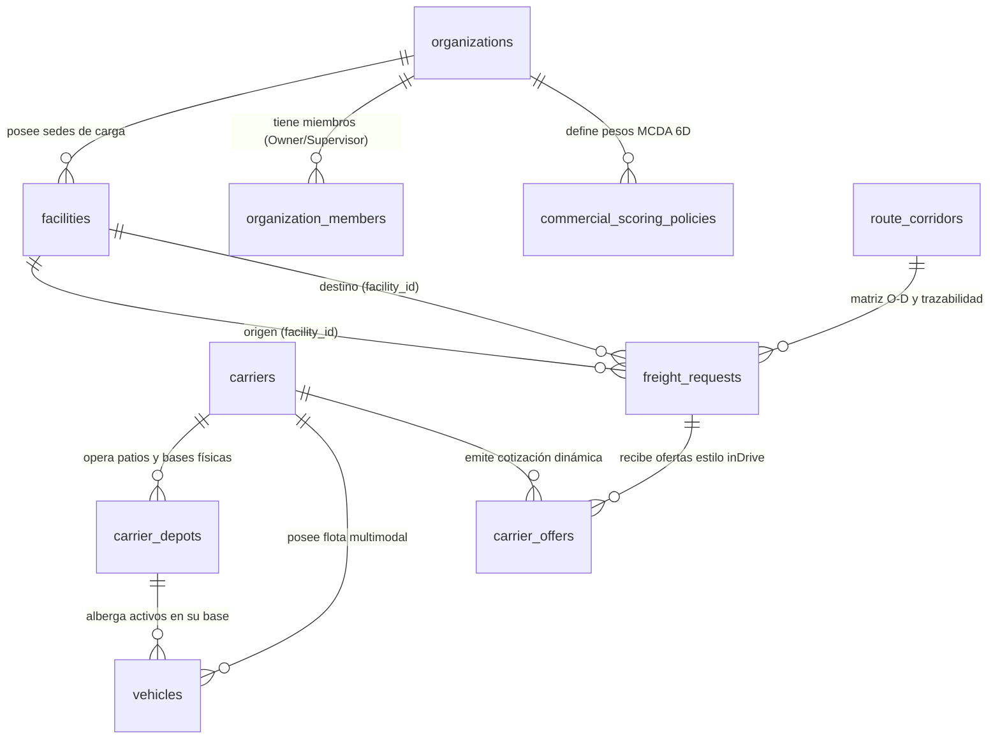

# CargoMesh V2 — Propuesta de Esquema de Base de Datos y Modelo de Datos Multimodal
## Documento Técnico de Evolución Aditiva en PostgreSQL (Supabase)

> 📚 **Suite Documental de Arquitectura V2:**  
> • **Blueprint Maestro:** [CARGOMESH_V2_EVOLUTION_BLUEPRINT.md](./CARGOMESH_V2_EVOLUTION_BLUEPRINT.md)  
> • **Esquema de Base de Datos:** [DATABASE_SCHEMA_V2_PROPOSAL.md](./DATABASE_SCHEMA_V2_PROPOSAL.md) *(Este documento)*  
> • **Diagramas de Dominio y Persistencia:** [BACKEND_DOMAIN_AND_PERSISTENCE_DIAGRAMS.md](./BACKEND_DOMAIN_AND_PERSISTENCE_DIAGRAMS.md)  
> • **Taxonomía de Carga y Precios USD:** [CARGO_DIMENSIONS_AND_TAXONOMY_V2.md](./CARGO_DIMENSIONS_AND_TAXONOMY_V2.md)  
> • **Plan Operativo y Sprints:** [MASTER_BACKLOG.md](./MASTER_BACKLOG.md)

---

## 🧭 1. Principio Rector: Evolución Aditiva (Cero Regresiones)

Para garantizar la integridad del sistema actual de CargoMesh:
* **No se destruye ni se reescribe ninguna de las 20 migraciones existentes.**
* Las 17 tablas de la base de datos, los 147 tests pgTAP, las 22 políticas RLS y la idempotencia criptográfica (`20260918120000_c_draft_creation_idempotency.sql`) permanecen **100% operativos y en verde**.
* Toda la nueva funcionalidad multimodal, multi-sede (clientes y transportistas), matriz de ruteo O-D y tarificación dinámica se introduce mediante **nuevas tablas satélite y columnas aditivas con valores por defecto (`DEFAULT`)**.

---

## 🏢 2. Módulo de Clientes (Shippers): Sedes Físicas y Gobernanza

Una empresa generadora de carga industrial (ej. **ACME Mining Perú**) opera múltiples instalaciones físicas con requerimientos operacionales y de acceso específicos.

### A. Tabla: `facilities` (Sedes y Almacenes del Cliente)
Permite al cliente registrar sus campamentos mineros, depósitos fiscales, muelles portuarios y plantas de refinación:

```sql
CREATE TYPE facility_type_enum AS ENUM (
    'MINE_SITE',           -- Campamento minero (ej. Las Bambas)
    'PORT_TERMINAL',        -- Terminal o depósito portuario (ej. APM Terminals Callao)
    'REFINERY_PLANT',       -- Planta de procesamiento o fundición (ej. Santiago)
    'CENTRAL_WAREHOUSE',    -- Almacén o centro de distribución logístico
    'SUPPLIER_DEPOT'        -- Almacén de proveedor externo (para flujos Inbound)
);

CREATE TABLE public.facilities (
    id UUID PRIMARY KEY DEFAULT gen_random_uuid(),
    organization_id UUID NOT NULL REFERENCES public.organizations(id) ON DELETE CASCADE,
    facility_code TEXT NOT NULL,
    name TEXT NOT NULL,
    facility_type facility_type_enum NOT NULL DEFAULT 'CENTRAL_WAREHOUSE',
    
    -- Georreferenciación oficial para Google Maps API
    formatted_address TEXT NOT NULL,
    city TEXT NOT NULL,
    region TEXT,
    country_code TEXT NOT NULL DEFAULT 'PE',
    latitude NUMERIC(10, 7) NOT NULL,
    longitude NUMERIC(10, 7) NOT NULL,
    geohash TEXT,
    google_place_id TEXT,

    -- Especificaciones de muelle y patio de maniobras
    has_loading_dock BOOLEAN NOT NULL DEFAULT TRUE,
    dock_bays_count INTEGER NOT NULL DEFAULT 2,
    has_weighbridge BOOLEAN NOT NULL DEFAULT FALSE,      -- Báscula para pesaje de camiones 60T
    has_rail_spur BOOLEAN NOT NULL DEFAULT FALSE,        -- Desvío ferroviario directo a la planta
    max_vehicle_length_meters NUMERIC(5, 2) DEFAULT 22.0,-- Capacidad para camiones bi-tren o camas-bajas
    
    -- Protocolos y requerimientos de acceso
    access_protocol TEXT NOT NULL DEFAULT 'STANDARD_WAREHOUSE', 
    -- 'MINING_SCTR_REQUIRED', 'PORT_GATE_PASS_REQUIRED', 'STANDARD_WAREHOUSE'
    operating_hours JSONB NOT NULL DEFAULT '{"mon_fri": "07:00-19:00", "sat": "07:00-13:00"}'::jsonb,
    
    -- Contacto in-situ para choferes
    site_contact_name TEXT,
    site_contact_phone TEXT,
    site_contact_email TEXT,

    status TEXT NOT NULL DEFAULT 'ACTIVE' CHECK (status IN ('ACTIVE', 'INACTIVE')),
    created_at TIMESTAMPTZ NOT NULL DEFAULT NOW(),
    updated_at TIMESTAMPTZ NOT NULL DEFAULT NOW(),
    CONSTRAINT facilities_org_code_unique UNIQUE (organization_id, facility_code)
);

CREATE INDEX idx_facilities_org ON public.facilities(organization_id);
CREATE INDEX idx_facilities_coords ON public.facilities(latitude, longitude);
```

### B. Extensión Aditiva a `organizations`: Tiers y Gobernanza Financiera
```sql
ALTER TABLE public.organizations
    ADD COLUMN IF NOT EXISTS industry_sector TEXT DEFAULT 'MINING_METALS',
    ADD COLUMN IF NOT EXISTS loyalty_tier TEXT DEFAULT 'PLATINUM' CHECK (loyalty_tier IN ('STANDARD', 'GOLD', 'PLATINUM')),
    ADD COLUMN IF NOT EXISTS credit_limit_usd NUMERIC(14, 2) DEFAULT 100000.00,
    ADD COLUMN IF NOT EXISTS max_auto_approval_budget_usd NUMERIC(14, 2) DEFAULT 5000.00;
```

---

## 🚛 3. Módulo de Carriers: Sedes Operativas por País (Patios/Hubs) y Flotas

Los carriers no son flotantes en el vacío: **tienen bases físicas, talleres y patios de relevo en diferentes países y ciudades**. Esto es fundamental porque la distancia de posicionamiento (*deadhead* o qué tan cerca está la base del carrier del origen de la carga) determina su disponibilidad y su costo base.

### A. Nueva Tabla: `carrier_depots` (Sedes y Terminales del Transportista)
```sql
CREATE TYPE depot_type_enum AS ENUM (
    'MAIN_HEADQUARTERS',    -- Casa matriz y base central de operaciones
    'MAINTENANCE_YARD',     -- Patio de maniobras y taller mecánico de flota
    'BORDER_CROSSING_POST', -- Agencia aduanera y patio de relevo fronterizo (ej. Tacna/Arica)
    'PORT_BERTH_OFFICE',    -- Oficina de muelle portuario (para navieras de cabotaje)
    'INTERMODAL_RAMP'       -- Terminal de transferencia tren-camión
);

CREATE TABLE public.carrier_depots (
    id UUID PRIMARY KEY DEFAULT gen_random_uuid(),
    carrier_id UUID NOT NULL REFERENCES public.carriers(id) ON DELETE CASCADE,
    depot_code TEXT NOT NULL,
    name TEXT NOT NULL,
    depot_type depot_type_enum NOT NULL DEFAULT 'MAINTENANCE_YARD',
    
    country_code TEXT NOT NULL, -- 'PE', 'CL'
    city TEXT NOT NULL,
    address TEXT NOT NULL,
    latitude NUMERIC(10, 7) NOT NULL,
    longitude NUMERIC(10, 7) NOT NULL,
    geohash TEXT,
    
    -- Capacidades operativas del patio
    assigned_fleet_capacity INTEGER NOT NULL DEFAULT 15, -- Cantidad de camiones/contenedores basados aquí
    has_cold_storage_plugs BOOLEAN NOT NULL DEFAULT FALSE, -- Conexiones eléctricas para contenedores reefer
    has_hazardous_permit BOOLEAN NOT NULL DEFAULT FALSE,
    customs_brokerage_enabled BOOLEAN NOT NULL DEFAULT FALSE, -- Puede hacer trámites de aduana de exportación
    
    created_at TIMESTAMPTZ NOT NULL DEFAULT NOW(),
    updated_at TIMESTAMPTZ NOT NULL DEFAULT NOW(),
    CONSTRAINT carrier_depot_unique UNIQUE (carrier_id, depot_code)
);

CREATE INDEX idx_carrier_depots_carrier ON public.carrier_depots(carrier_id);
CREATE INDEX idx_carrier_depots_country ON public.carrier_depots(country_code, city);
```

### B. Extensión a la Tabla `carriers`: Parámetros de Tarificación Dinámica
```sql
ALTER TABLE public.carriers
    ADD COLUMN IF NOT EXISTS transport_modes TEXT[] DEFAULT ARRAY['ROAD']::TEXT[],
    ADD COLUMN IF NOT EXISTS base_rate_per_km_usd NUMERIC(8, 4) DEFAULT 1.2500,
    ADD COLUMN IF NOT EXISTS terminal_handling_fee_usd NUMERIC(10, 2) DEFAULT 150.00,
    ADD COLUMN IF NOT EXISTS cold_chain_surcharge_pct NUMERIC(5, 2) DEFAULT 30.00,
    ADD COLUMN IF NOT EXISTS hazmat_surcharge_pct NUMERIC(5, 2) DEFAULT 25.00,
    ADD COLUMN IF NOT EXISTS oversized_surcharge_pct NUMERIC(5, 2) DEFAULT 40.00,
    ADD COLUMN IF NOT EXISTS supported_corridors TEXT[] DEFAULT ARRAY['PERU_DOMESTIC', 'CHILE_DOMESTIC', 'CROSSBORDER_PE_CL']::TEXT[],
    ADD COLUMN IF NOT EXISTS hub_ports TEXT[] DEFAULT ARRAY[]::TEXT[];
```

### C. Catálogo de Activos y Tipos de Vehículos en `vehicles`
```sql
CREATE TYPE asset_mode_enum AS ENUM (
    'ROAD_TRUCK',          -- Tractocamión con semirremolque estándar
    'ROAD_REEFER',         -- Furgón refrigerado con generador autónomo
    'ROAD_FLATBED',        -- Cama-baja para maquinaria minera sobredimensionada
    'ROAD_HOPPER',         -- Tolva bimodal para concentrado de mineral
    'MARITIME_CONTAINER',  -- Contenedor marítimo en buque (20GP, 40HC, Reefer)
    'RAIL_WAGON',          -- Vagón tolva o plataforma ferroviaria
    'AIR_FREIGHTER_CRATE'  -- Pallet aéreo consolidado (ULD)
);

ALTER TABLE public.vehicles
    ADD COLUMN IF NOT EXISTS asset_mode asset_mode_enum DEFAULT 'ROAD_TRUCK',
    ADD COLUMN IF NOT EXISTS home_depot_id UUID REFERENCES public.carrier_depots(id),
    ADD COLUMN IF NOT EXISTS plate_or_registration_number TEXT,
    ADD COLUMN IF NOT EXISTS max_teu_capacity NUMERIC(4, 1) DEFAULT 0.0,
    ADD COLUMN IF NOT EXISTS tare_weight_kg NUMERIC(10, 2),
    ADD COLUMN IF NOT EXISTS telemetry_protocol TEXT DEFAULT 'SIMULATED' CHECK (telemetry_protocol IN ('GEOTAB', 'SAMSARA', 'AIS_MARINE', 'SIMULATED')),
    ADD COLUMN IF NOT EXISTS last_known_latitude NUMERIC(10, 7),
    ADD COLUMN IF NOT EXISTS last_known_longitude NUMERIC(10, 7),
    ADD COLUMN IF NOT EXISTS last_telemetry_at TIMESTAMPTZ;
```

---

## 🗺️ 4. Módulo de Ruteo Avanzado: Matriz Origen-Destino (O-D Matrix) y Tramos Complejos

Las rutas no son una simple línea recta: son **corredores multimodales con tramos (legs), pasos cordilleranos, aduanas y tiempos de descanso obligatorios**.

```mermaid
graph LR
    O["🏭 Sede Mina Las Bambas<br>(Apurímac, 4,100 msnm)"] -->|Tramo 1: Carretera de Montaña (950 km)| H1["🚢 Puerto del Callao<br>(Báscula y Muelle APM)"]
    H1 -->|Tramo 2: Cabotaje Marítimo (1,350 MN)| H2["🚢 Puerto San Antonio<br>(Aduana Chile)"]
    H2 -->|Tramo 3: Última Milla Vial/Tren (110 km)| D["🏢 Planta Fundición<br>(Santiago de Chile)"]
```

### A. Estructura de la Matriz Origen-Destino (O-D Matrix): `route_corridors`
Permite precargar y calcular matrices entre todas las sedes de clientes y depósitos de carriers:

```sql
CREATE TABLE public.route_corridors (
    id UUID PRIMARY KEY DEFAULT gen_random_uuid(),
    corridor_code TEXT NOT NULL UNIQUE, -- ej. 'PE_BAMBAS_TO_PE_CALLAO', 'CROSS_CALLAO_TO_SANTIAGO'
    origin_name TEXT NOT NULL,
    origin_country TEXT NOT NULL,
    origin_latitude NUMERIC(10, 7) NOT NULL,
    origin_longitude NUMERIC(10, 7) NOT NULL,
    
    destination_name TEXT NOT NULL,
    destination_country TEXT NOT NULL,
    destination_latitude NUMERIC(10, 7) NOT NULL,
    destination_longitude NUMERIC(10, 7) NOT NULL,

    -- Datos de matriz O-D
    total_road_distance_km NUMERIC(10, 2) NOT NULL,
    total_nautical_miles NUMERIC(10, 2) DEFAULT 0.0,
    estimated_driving_hours NUMERIC(6, 2) NOT NULL,
    estimated_maritime_hours NUMERIC(6, 2) DEFAULT 0.0,
    toll_booths_count INTEGER DEFAULT 8,
    estimated_tolls_cost_usd NUMERIC(8, 2) DEFAULT 120.00,
    
    -- Análisis topográfico y fronterizo
    max_elevation_meters NUMERIC(6, 1) DEFAULT 4100.0, -- Cruces de cordillera
    border_crossing_names TEXT[] DEFAULT ARRAY[]::TEXT[], -- ej. ['SANTA_ROSA_CHACALLUTA']
    border_customs_delay_hours NUMERIC(4, 1) DEFAULT 0.0,
    
    -- Polilínea codificada para trazabilidad en mapas (Leaflet / Google Maps)
    encoded_polyline_geojson JSONB NOT NULL,
    
    created_at TIMESTAMPTZ NOT NULL DEFAULT NOW()
);

CREATE INDEX idx_route_corridors_od ON public.route_corridors(origin_country, destination_country);
```

### B. Extensión a `freight_requests`: Direccionalidad Inbound/Outbound y Trazabilidad
```sql
CREATE TYPE freight_flow_type_enum AS ENUM (
    'OUTBOUND',            -- Envío desde sede propia a cliente/puerto externo
    'INBOUND',             -- Traída desde proveedor/puerto externo a sede propia
    'INTERNAL_TRANSFER'    -- Movimiento entre dos sedes propias de la organización
);

CREATE TYPE preferred_transport_mode_enum AS ENUM (
    'ROAD',
    'MARITIME',
    'RAIL',
    'AIR',
    'MULTIMODAL_OPTIMAL'
);

CREATE TYPE cargo_category_v2_enum AS ENUM (
    'MINING_BULK',         -- Concentrados y mineral a granel (tolvas 6x4, vagones)
    'HEAVY_MACHINERY',     -- Maquinaria pesada y sobredimensionada (cama-baja)
    'COLD_CHAIN',          -- Perecibles y cadena de frío (-20°C a +4°C)
    'HAZMAT',              -- Materiales peligrosos y químicos IMO 1-9
    'HIGH_VALUE',          -- Carga crítica de alto valor y repuestos express
    'GENERAL_DRY'          -- Mercadería general paletizada o consolidada
);

CREATE TYPE packaging_type_enum AS ENUM (
    'PALLET_STANDARD_WOOD',-- Pallet madera estándar 120x100 cm
    'PALLET_EURO',         -- Pallet europeo 120x80 cm
    'CONTAINER_20GP',      -- Contenedor marítimo estándar 20 pies
    'CONTAINER_40HC',      -- Contenedor marítimo High Cube 40 pies
    'BIG_BAG',             -- Saco industrial 1-2 toneladas
    'DRUM_BARREL',         -- Tambor de 200 L para químicos
    'WOODEN_CRATE'         -- Caja de madera reforzada
);

ALTER TABLE public.freight_requests
    ADD COLUMN IF NOT EXISTS flow_type freight_flow_type_enum NOT NULL DEFAULT 'OUTBOUND',
    ADD COLUMN IF NOT EXISTS origin_facility_id UUID REFERENCES public.facilities(id),
    ADD COLUMN IF NOT EXISTS destination_facility_id UUID REFERENCES public.facilities(id),
    ADD COLUMN IF NOT EXISTS matched_corridor_id UUID REFERENCES public.route_corridors(id),
    ADD COLUMN IF NOT EXISTS origin_latitude NUMERIC(10, 7),
    ADD COLUMN IF NOT EXISTS origin_longitude NUMERIC(10, 7),
    ADD COLUMN IF NOT EXISTS destination_latitude NUMERIC(10, 7),
    ADD COLUMN IF NOT EXISTS destination_longitude NUMERIC(10, 7),
    ADD COLUMN IF NOT EXISTS calculated_distance_km NUMERIC(10, 2),
    ADD COLUMN IF NOT EXISTS transport_mode_preferred preferred_transport_mode_enum NOT NULL DEFAULT 'ROAD',
    ADD COLUMN IF NOT EXISTS cargo_category_v2 cargo_category_v2_enum NOT NULL DEFAULT 'GENERAL_DRY',
    ADD COLUMN IF NOT EXISTS packaging_type packaging_type_enum NOT NULL DEFAULT 'PALLET_STANDARD_WOOD',
    ADD COLUMN IF NOT EXISTS total_cbm NUMERIC(10, 3),
    ADD COLUMN IF NOT EXISTS chargable_weight_kg NUMERIC(12, 2),
    ADD COLUMN IF NOT EXISTS is_stackable BOOLEAN DEFAULT TRUE,
    ADD COLUMN IF NOT EXISTS max_stacking_tiers INTEGER DEFAULT 1,
    ADD COLUMN IF NOT EXISTS hazmat_class TEXT,
    ADD COLUMN IF NOT EXISTS un_number TEXT,
    ADD COLUMN IF NOT EXISTS declared_value_usd NUMERIC(14, 2),
    ADD COLUMN IF NOT EXISTS approval_status TEXT NOT NULL DEFAULT 'AUTO_APPROVED' CHECK (approval_status IN ('AUTO_APPROVED', 'PENDING_SUPERVISOR_APPROVAL', 'APPROVED', 'REJECTED')),
    ADD COLUMN IF NOT EXISTS supervisor_approved_by UUID REFERENCES public.organization_members(id),
    ADD COLUMN IF NOT EXISTS supervisor_approved_at TIMESTAMPTZ;
```

---

## 🏎️ 5. El Ecosistema de 6 Carriers en Base de Datos (Marketplace inDrive)

Para responder a la preocupación de: *"¿Tener solo 3 candidatos no es muy poco?"*:
* **En la Base de Datos:** Se cargan **6 carriers completos** con flotas, tarifas paramétricas y sedes. Esto permite que una búsqueda despliegue hasta 5 o 6 cotizaciones reales compitiendo en la subasta inversa.
* **En el Protocolo de Honestidad (`AGENTS.md`):**
  * **Carriers Live Demo:** Andes, Pacific e Inca cuentan con el flujo completo de prueba en vivo.
  * **Carriers de Escenario Competitivo (Database Carriers):** Polaris, Apex y SouthAir cotizan en base a sus tarifas de DB para demostrar la densidad del mercado inDrive.

### Catálogo de los 6 Carriers en el Seed:

| Carrier | Código | Modo Principal | Patios y Sedes Físicas (`carrier_depots`) | Especialidad & Tarifa Base | Rol en la Demo |
|---|---|---|---|---|---|
| **Andes Express** | `ANDES` | `ROAD` | Lima (Callao), Arequipa, Tacna, Santiago | FTL Carretera estándar (\$1.20/km) | **Live Demo Provider #1** (Golden Flow Winner) |
| **Pacific Cargo Lines** | `PACIFIC` | `MARITIME` | Muelle Callao, Muelle San Antonio, Valparaíso | Cabotaje marítimo contenedores (\$0.25/km náutico) | **Live Demo Provider #2** (Opción Económica) |
| **Transportes Inca** | `INCA` | `RAIL` + `ROAD` | Estación Matarani, Arequipa, La Joya, Lima | Intermodal Express andino (\$1.35/km) | **Live Demo Provider #3** (Opción Rápida) |
| **Polaris Heavy Haul** | `POLARIS` | `ROAD` | Antofagasta, Calama, Iquique, Arequipa | Camas-bajas para minería pesada y HAZMAT (\$1.80/km) | **Scenario Competitor** (Subasta inDrive) |
| **Apex Cold Logistics** | `APEX` | `ROAD` | Lima (Lurín), Trujillo, Santiago (San Bernardo) | Furgones refrigerados pharma y alimentos (\$1.50/km) | **Scenario Competitor** (Subasta inDrive) |
| **SouthAir Cargo** | `SOUTHAIR` | `AIR` | Aeropuerto Jorge Chávez (LIM), Santiago (SCL) | Carga aérea express de repuestos críticos (\$4.80/kg-km) | **Roadmap Competitor** (Ultra-Urgencias) |

---

## 🌱 6. Sedes y Patios Canónicos (Scenario Seed Data)

Ubicados en `supabase/scenarios/amazon_hackathon/seed.sql` (cumpliendo la regla estricta de no contaminar migraciones):

### A. Sedes del Cliente (ACME Mining Perú):
1. **`FAC-CALLAO` (Sede Central & Puerto):**
   * *Nombre:* Almacén Fiscal Callao — Terminal Marítimo
   * *Coordenadas:* Lat `-12.0565`, Lng `-77.1420` (6 muelles, báscula de pesaje 60T).
2. **`FAC-BAMBAS` (Campamento Minero Apurímac):**
   * *Nombre:* Minera Las Bambas — Campamento Challhuahuacho
   * *Coordenadas:* Lat `-14.0950`, Lng `-72.3160` (4,100 msnm, requiere tracción 6x4 y SCTR).
3. **`FAC-AREQUIPA` (Centro de Abastecimiento Sur):**
   * *Nombre:* Centro Logístico Arequipa — Parque Industrial Río Seco
   * *Coordenadas:* Lat `-16.3988`, Lng `-71.5350`.
4. **`FAC-SANANTONIO` (Terminal Portuario Chile):**
   * *Nombre:* Muelle Portuario San Antonio (DP World)
   * *Coordenadas:* Lat `-33.5833`, Lng `-71.6167` (Recepción de buques feeder).
5. **`FAC-SANTIAGO` (Planta Fundición Destino):**
   * *Nombre:* Planta de Fundición & Refinación Santiago
   * *Coordenadas:* Lat `-33.4489`, Lng `-70.6693` (Descarga urbana restringida).

### B. Patios Operativos de los Carriers (`carrier_depots`):
* **Andes Express:** Patio Callao (50 tractos), Patio Relevo Arequipa, Patio Fronterizo Tacna, Terminal Santiago Quilicura.
* **Pacific Cargo:** Terminal de Contenedores Callao APM, Muelle San Antonio Sitio 1.
* **Transportes Inca:** Estación Ferroviaria Matarani, Patio Intermodal La Joya.
* **Polaris Heavy:** Base de Maquinaria Minera Antofagasta (Chile), Patio Arequipa.

---

## 📊 7. Diagrama de Relaciones Completo (ERD V2)



---

## 🎯 8. Veredicto y Compatibilidad con el Código Actual

1. **La duda de los 3 carriers queda resuelta:** La base de datos ahora aloja **6 carriers**, permitiendo que la subasta inversa inDrive muestre un mercado denso con ofertas de carretera, mar, riel y aire.
2. **Las rutas ya no son simples números:** El modelo `route_corridors` almacena la **Matriz Origen-Destino (O-D)** con peajes, altitud máxima de cordillera (4,100 msnm), demoras en aduana fronteriza (4-8h) y polilíneas GeoJSON para dibujar rutas multicolor en Leaflet/Google Maps.
3. **Los carriers tienen bases físicas (`carrier_depots`):** Permite calcular distancias de posicionamiento real y justificar por qué Andes o Inca tienen disponibilidad inmediata en el sur del Perú y Chile.
4. **Cero impacto negativo en Sprint 1:** Las tablas `facilities`, `carrier_depots`, `route_corridors` y las nuevas columnas son **aditivas**. Todo el código existente de `freight_requests` y los **147 tests pgTAP siguen pasando en verde**.
