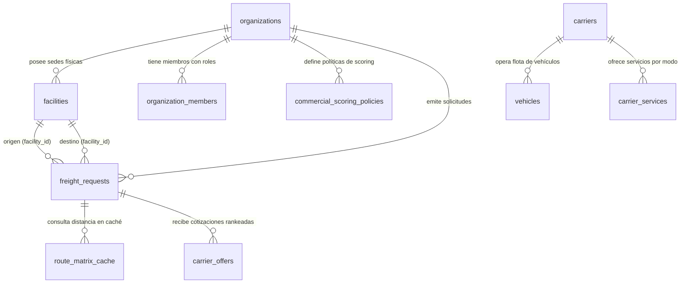

# CargoMesh V2 — Propuesta de Esquema de Base de Datos y Modelo de Datos Multimodal
## Documento Técnico de Evolución Aditiva en PostgreSQL (Supabase)

---

## 🧭 1. Principio Rector: Evolución Aditiva (Cero Regresiones)

Para garantizar la integridad del sistema actual de CargoMesh:
* **No se destruye ni se reescribe ninguna de las 20 migraciones existentes.**
* Las 17 tablas de la base de datos, los 147 tests pgTAP, las 22 políticas RLS y la idempotencia criptográfica (`20260918120000_c_draft_creation_idempotency.sql`) permanecen **100% operativos y en verde**.
* Toda la nueva funcionalidad multimodal, multi-sede, de ruteo con Google Maps y de tarifas dinámicas se introduce mediante **nuevas tablas satélite y columnas opcionales con valores por defecto (`DEFAULT`)**.

---

## 🏢 2. Módulo de Clientes (Shippers): Sedes, Gobernanza y Créditos

Actualmente, `organizations` solo contiene información básica (`name`, `code`, `default_currency`). En la logística industrial real, una empresa generadora de carga (ej. **ACME Mining Perú**) opera múltiples instalaciones físicas con requerimientos específicos.

### A. Nueva Tabla: `facilities` (Sedes y Almacenes de la Organización)
Permite al cliente registrar sus campamentos mineros, depósitos fiscales, muelles portuarios y plantas de refinación:

```sql
CREATE TYPE facility_type_enum AS ENUM (
    'MINE_SITE',           -- Campamento minero (ej. Las Bambas)
    'PORT_TERMINAL',        -- Terminal o depósito portuario (ej. APM Terminals Callao)
    'REFINERY_PLANT',       -- Planta de procesamiento o fundición (ej. Santiago)
    'CENTRAL_WAREHOUSE',    -- Almacén o centro de distribución logístico
    'SUPPLIER_DEPOT'        -- Almacén de proveedor externo (para flujos Inbound)
);

CREATE TABLE public.facilities (
    id UUID PRIMARY KEY DEFAULT gen_random_uuid(),
    organization_id UUID NOT NULL REFERENCES public.organizations(id) ON DELETE CASCADE,
    facility_code TEXT NOT NULL,
    name TEXT NOT NULL,
    facility_type facility_type_enum NOT NULL DEFAULT 'CENTRAL_WAREHOUSE',
    
    -- Georreferenciación oficial para Google Maps API
    formatted_address TEXT NOT NULL,
    city TEXT NOT NULL,
    region TEXT,
    country_code TEXT NOT NULL DEFAULT 'PE',
    latitude NUMERIC(10, 7) NOT NULL,
    longitude NUMERIC(10, 7) NOT NULL,
    geohash TEXT,
    google_place_id TEXT,

    -- Especificaciones de muelle y patio de maniobras
    has_loading_dock BOOLEAN NOT NULL DEFAULT TRUE,
    dock_bays_count INTEGER NOT NULL DEFAULT 2,
    has_weighbridge BOOLEAN NOT NULL DEFAULT FALSE,      -- Báscula para pesaje de camiones
    has_rail_spur BOOLEAN NOT NULL DEFAULT FALSE,        -- Desvío ferroviario directo a la planta
    max_vehicle_length_meters NUMERIC(5, 2) DEFAULT 22.0,-- Capacidad para camiones bi-tren o camas-bajas
    
    -- Protocolos y requerimientos de acceso
    access_protocol TEXT NOT NULL DEFAULT 'STANDARD_WAREHOUSE', 
    -- 'MINING_SCTR_REQUIRED', 'PORT_GATE_PASS_REQUIRED', 'STANDARD_WAREHOUSE'
    operating_hours JSONB NOT NULL DEFAULT '{"mon_fri": "07:00-19:00", "sat": "07:00-13:00"}'::jsonb,
    
    -- Contacto in-situ para choferes
    site_contact_name TEXT,
    site_contact_phone TEXT,
    site_contact_email TEXT,

    status TEXT NOT NULL DEFAULT 'ACTIVE' CHECK (status IN ('ACTIVE', 'INACTIVE')),
    created_at TIMESTAMPTZ NOT NULL DEFAULT NOW(),
    updated_at TIMESTAMPTZ NOT NULL DEFAULT NOW(),
    CONSTRAINT facilities_org_code_unique UNIQUE (organization_id, facility_code)
);

CREATE INDEX idx_facilities_org ON public.facilities(organization_id);
CREATE INDEX idx_facilities_coords ON public.facilities(latitude, longitude);
```

### B. Extensión Aditiva a `organizations`: Tiers y Gobernanza Financiera
```sql
ALTER TABLE public.organizations
    ADD COLUMN IF NOT EXISTS industry_sector TEXT DEFAULT 'MINING_METALS',
    ADD COLUMN IF NOT EXISTS loyalty_tier TEXT DEFAULT 'PLATINUM' CHECK (loyalty_tier IN ('STANDARD', 'GOLD', 'PLATINUM')),
    ADD COLUMN IF NOT EXISTS credit_limit_usd NUMERIC(14, 2) DEFAULT 100000.00,
    ADD COLUMN IF NOT EXISTS max_auto_approval_budget_usd NUMERIC(14, 2) DEFAULT 5000.00;
```

### C. Gobernanza RBAC en `organization_members` (Confirmación del Modelo Actual)
La tabla `organization_members` ya cuenta con el constraint `role in ('OWNER', 'REQUESTER', 'SUPERVISOR')`. Se formalizan las atribuciones:
* **`OWNER` (Dueño Único):** Configura sedes (`facilities`), fija el límite de auto-aprobación (`max_auto_approval_budget_usd`) y administra contratos de carriers.
* **`SUPERVISOR` (Jefe Logístico):** Aprueba solicitudes de flete que excedan los \$5,000 USD y autoriza reservas transfronterizas.
* **`REQUESTER` (Operador en Campo):** Crea borradores por voz (Alexa) o web; si el presupuesto supera los \$5,000 USD, queda automáticamente en estado `PENDING_SUPERVISOR_APPROVAL`.

---

## 🚛 3. Módulo de Carriers: Multimodalidad, Flotas y Tarificación Paramétrica

En V1, los carriers tenían servicios de carretera planos. En V2, el carrier se convierte en una entidad multimodal con tarificación algorítmica por distancia real.

### A. Extensión a la Tabla `carriers`: Tarifas Base y Geocercas
```sql
ALTER TABLE public.carriers
    ADD COLUMN IF NOT EXISTS transport_modes TEXT[] DEFAULT ARRAY['ROAD']::TEXT[],
    ADD COLUMN IF NOT EXISTS base_rate_per_km_usd NUMERIC(8, 4) DEFAULT 1.2500,
    ADD COLUMN IF NOT EXISTS terminal_handling_fee_usd NUMERIC(10, 2) DEFAULT 150.00,
    ADD COLUMN IF NOT EXISTS cold_chain_surcharge_pct NUMERIC(5, 2) DEFAULT 30.00,
    ADD COLUMN IF NOT EXISTS hazmat_surcharge_pct NUMERIC(5, 2) DEFAULT 25.00,
    ADD COLUMN IF NOT EXISTS oversized_surcharge_pct NUMERIC(5, 2) DEFAULT 40.00,
    ADD COLUMN IF NOT EXISTS supported_corridors TEXT[] DEFAULT ARRAY['PERU_DOMESTIC', 'CHILE_DOMESTIC', 'CROSSBORDER_PE_CL']::TEXT[],
    ADD COLUMN IF NOT EXISTS hub_ports TEXT[] DEFAULT ARRAY[]::TEXT[];
```

### B. Extensión a la Tabla `vehicles`: Categorización Multimodal y Telemetría
Actualmente, `vehicles` solo maneja camiones genéricos. Se amplía para soportar el catálogo de activos de transporte multimodal:

```sql
CREATE TYPE asset_mode_enum AS ENUM (
    'ROAD_TRUCK',          -- Tractocamión con semirremolque
    'ROAD_REEFER',         -- Furgón refrigerado
    'ROAD_FLATBED',        -- Cama-baja para maquinaria pesada
    'ROAD_HOPPER',         -- Tolva mineralera
    'MARITIME_CONTAINER',  -- Contenedor marítimo en buque (20GP, 40HC, Reefer)
    'RAIL_WAGON',          -- Vagón tolva o plataforma ferroviaria
    'AIR_FREIGHTER_CRATE'  -- Pallet aéreo consolidado (ULD)
);

ALTER TABLE public.vehicles
    ADD COLUMN IF NOT EXISTS asset_mode asset_mode_enum DEFAULT 'ROAD_TRUCK',
    ADD COLUMN IF NOT EXISTS plate_or_registration_number TEXT,
    ADD COLUMN IF NOT EXISTS max_teu_capacity NUMERIC(4, 1) DEFAULT 0.0, -- Capacidad en contenedores estándar
    ADD COLUMN IF NOT EXISTS tare_weight_kg NUMERIC(10, 2),
    ADD COLUMN IF NOT EXISTS telemetry_device_id TEXT,
    ADD COLUMN IF NOT EXISTS telemetry_protocol TEXT DEFAULT 'SIMULATED' CHECK (telemetry_protocol IN ('GEOTAB', 'SAMSARA', 'AIS_MARINE', 'SIMULATED')),
    ADD COLUMN IF NOT EXISTS last_known_latitude NUMERIC(10, 7),
    ADD COLUMN IF NOT EXISTS last_known_longitude NUMERIC(10, 7),
    ADD COLUMN IF NOT EXISTS last_telemetry_at TIMESTAMPTZ;
```

---

## 🗺️ 4. Módulo de Ruteo, Mapas y Direccionalidad de Carga

Este módulo resuelve la conexión con Google Maps API y los flujos Inbound / Outbound.

### A. Extensión a `freight_requests`: Direccionalidad y Coordenadas
```sql
CREATE TYPE freight_flow_type_enum AS ENUM (
    'OUTBOUND',            -- Envío desde sede propia a cliente/puerto externo
    'INBOUND',             -- Traída desde proveedor/puerto externo a sede propia
    'INTERNAL_TRANSFER'    -- Movimiento entre dos sedes propias de la organización
);

CREATE TYPE cargo_unit_type_enum AS ENUM (
    'PALLETS',             -- Carga paletizada estándar (120x100 cm)
    'CONTAINER_20GP',      -- Contenedor marítimo estándar 20 pies
    'CONTAINER_40HC',      -- Contenedor marítimo High Cube 40 pies
    'BULK_HOPPER',         -- Carga a granel en tolva
    'AIR_CRATE'            -- Bulto aéreo certificado
);

CREATE TYPE preferred_transport_mode_enum AS ENUM (
    'ROAD',
    'MARITIME',
    'RAIL',
    'AIR',
    'MULTIMODAL_OPTIMAL'
);

ALTER TABLE public.freight_requests
    ADD COLUMN IF NOT EXISTS flow_type freight_flow_type_enum NOT NULL DEFAULT 'OUTBOUND',
    ADD COLUMN IF NOT EXISTS origin_facility_id UUID REFERENCES public.facilities(id),
    ADD COLUMN IF NOT EXISTS destination_facility_id UUID REFERENCES public.facilities(id),
    ADD COLUMN IF NOT EXISTS origin_latitude NUMERIC(10, 7),
    ADD COLUMN IF NOT EXISTS origin_longitude NUMERIC(10, 7),
    ADD COLUMN IF NOT EXISTS destination_latitude NUMERIC(10, 7),
    ADD COLUMN IF NOT EXISTS destination_longitude NUMERIC(10, 7),
    ADD COLUMN IF NOT EXISTS calculated_distance_km NUMERIC(10, 2),
    ADD COLUMN IF NOT EXISTS estimated_transit_hours NUMERIC(6, 2),
    ADD COLUMN IF NOT EXISTS cargo_unit_type cargo_unit_type_enum NOT NULL DEFAULT 'PALLETS',
    ADD COLUMN IF NOT EXISTS transport_mode_preferred preferred_transport_mode_enum NOT NULL DEFAULT 'ROAD',
    ADD COLUMN IF NOT EXISTS approval_status TEXT NOT NULL DEFAULT 'AUTO_APPROVED' CHECK (approval_status IN ('AUTO_APPROVED', 'PENDING_SUPERVISOR_APPROVAL', 'APPROVED', 'REJECTED')),
    ADD COLUMN IF NOT EXISTS supervisor_approved_by UUID REFERENCES public.organization_members(id),
    ADD COLUMN IF NOT EXISTS supervisor_approved_at TIMESTAMPTZ;
```

### B. Nueva Tabla: `route_matrix_cache` (Caché de Rutas de Google Maps)
Para reducir la latencia de voz en Alexa a menos de 500 ms y evitar costos redundantes en Google Maps API:

```sql
CREATE TABLE public.route_matrix_cache (
    id UUID PRIMARY KEY DEFAULT gen_random_uuid(),
    origin_geohash TEXT NOT NULL,
    destination_geohash TEXT NOT NULL,
    origin_name TEXT NOT NULL,
    destination_name TEXT NOT NULL,
    road_distance_km NUMERIC(10, 2) NOT NULL,
    estimated_drive_minutes INTEGER NOT NULL,
    border_crossings TEXT[] DEFAULT ARRAY[]::TEXT[],
    elevation_max_meters NUMERIC(6, 1) DEFAULT 0.0,
    has_toll_roads BOOLEAN DEFAULT TRUE,
    encoded_polyline TEXT, -- Para renderizado instantáneo en el mapa Leaflet de la web
    hit_count INTEGER DEFAULT 1,
    created_at TIMESTAMPTZ NOT NULL DEFAULT NOW(),
    updated_at TIMESTAMPTZ NOT NULL DEFAULT NOW(),
    CONSTRAINT route_cache_unique_pair UNIQUE (origin_geohash, destination_geohash)
);

CREATE INDEX idx_route_cache_lookup ON public.route_matrix_cache(origin_geohash, destination_geohash);
```

---

## ⚖️ 5. Módulo de Políticas Comerciales: `commercial_scoring_policies`

Permite almacenar las ponderaciones MCDA de cada cliente (reemplazando heurísticas cableadas en código):

```sql
CREATE TABLE public.commercial_scoring_policies (
    id UUID PRIMARY KEY DEFAULT gen_random_uuid(),
    organization_id UUID NOT NULL REFERENCES public.organizations(id) ON DELETE CASCADE,
    policy_name TEXT NOT NULL DEFAULT 'ACME Balanced Policy',
    
    -- Vector de ponderación MCDA / TOPSIS (Suma = 1.000)
    cost_weight NUMERIC(4, 3) NOT NULL DEFAULT 0.250,
    sla_weight NUMERIC(4, 3) NOT NULL DEFAULT 0.250,
    time_weight NUMERIC(4, 3) NOT NULL DEFAULT 0.200,
    availability_weight NUMERIC(4, 3) NOT NULL DEFAULT 0.100,
    route_experience_weight NUMERIC(4, 3) NOT NULL DEFAULT 0.100,
    org_history_weight NUMERIC(4, 3) NOT NULL DEFAULT 0.100,
    
    is_active BOOLEAN NOT NULL DEFAULT TRUE,
    created_at TIMESTAMPTZ NOT NULL DEFAULT NOW(),
    updated_at TIMESTAMPTZ NOT NULL DEFAULT NOW(),
    CONSTRAINT check_weights_sum CHECK (
        (cost_weight + sla_weight + time_weight + availability_weight + route_experience_weight + org_history_weight) = 1.000
    )
);
```

---

## 📊 6. Relaciones y Diagrama Entidad-Relación (ERD)



---

## 🌱 7. Datos de Escenario Canónicos (Seed Data para Pruebas del Jurado)

Siguiendo la **Regla 1 de `AGENTS.md`** (*NUNCA agregar INSERTs de prueba en `supabase/migrations/`*), estos datos se ubicarán en `supabase/scenarios/amazon_hackathon/seed.sql`:

### A. Sedes de ACME Mining Perú (`facilities`):
1. **`FAC-CALLAO` (Sede Central & Puerto):**
   * *Nombre:* Terminal Portuario Callao — Depósito Fiscal
   * *Coordenadas:* Lat `-12.0565`, Lng `-77.1420`
   * *Capacidad:* 6 muelles, báscula 60T, acceso a muelle marítimo APM Terminals.
2. **`FAC-BAMBAS` (Campamento Minero Apurímac):**
   * *Nombre:* Minera Las Bambas — Campamento Central Challhuahuacho
   * *Coordenadas:* Lat `-14.0950`, Lng `-72.3160` (Altitud: 4,100 msnm)
   * *Requisito:* Tracción 6x4, choferes con SCTR y pase minero vigente.
3. **`FAC-AREQUIPA` (Hub Logístico Sur):**
   * *Nombre:* Centro Logístico Arequipa — Parque Industrial Río Seco
   * *Coordenadas:* Lat `-16.3988`, Lng `-71.5350`
   * *Capacidad:* Almacén de insumos químicos y repuestos de maquinaria.
4. **`FAC-SANANTONIO` (Muelle de Cabotaje Chile):**
   * *Nombre:* Terminal Portuario San Antonio (DP World)
   * *Coordenadas:* Lat `-33.5833`, Lng `-71.6167`
   * *Capacidad:* Recepción de buques portacontenedores de cabotaje costero.
5. **`FAC-SANTIAGO` (Destino Final Refinería):**
   * *Nombre:* Planta de Fundición & Refinación Santiago
   * *Coordenadas:* Lat `-33.4489`, Lng `-70.6693`
   * *Restricción:* Ventana de descarga urbana exclusiva 06:00 a 11:00 hrs.

### B. Carriers Multimodales Parametrizados:
1. **Andes Express (`CARRIER_ANDES`):**
   * *Modo:* `ROAD` (Terrestre)
   * *Tarifa Base:* \$1.20 USD/km | Manejo Muelle: \$120 USD.
   * *Flota:* Tractos Volvo FH 6x4, tolvas y camas-bajas.
   * *SLA Histórico:* 99% | *Corredor Insignia:* Callao ➔ Santiago (3,450 km = \$4,260 USD aprox).
2. **Pacific Cargo Lines (`CARRIER_PACIFIC`):**
   * *Modo:* `MARITIME` (Cabotaje)
   * *Tarifa Base:* \$0.25 USD/km equivalente náutico | Manejo Puerto: \$350 USD.
   * *Flota:* 4 Buques Feeder porta-contenedores (`20GP` y `40HC`).
   * *SLA Histórico:* 90% | *Corredor:* Callao ➔ San Antonio (1,350 MN = \$2,400 USD aprox, ahorro 40%).
3. **Transportes Inca (`CARRIER_INCA`):**
   * *Modo:* `RAIL` + `ROAD` (Intermodal Rápido)
   * *Tarifa Base:* \$1.35 USD/km | Manejo: \$180 USD.
   * *SLA Histórico:* 95% | *Tránsito:* 36h express (Alta prioridad).

---

## 🎯 8. Validación de Compatibilidad con el Código Actual

| Módulo Actual | Impacto de la Propuesta | Medida de Protección |
|---|---|---|
| **`HAC-6` Idempotencia DDL** | Cero impacto | La columna `creation_idempotency_key` y el hash SHA-256 en `freight_requests` se preservan intactos. |
| **147 Tests pgTAP** | Cero impacto | Ningún campo existente se renombra ni se cambia de tipo. Todos los tests corren sin modificación. |
| **Servidor MCP `/mcp`** | Positivo | La tool `create_freight_request` ahora puede aceptar opcionalmente `originFacilityId` y `destinationFacilityId`. |
| **Hono API `/api/v2/freight`** | Positivo | Endpoints V2 leen sedes (`/facilities`) y consultan la matriz de distancias sin alterar rutas anteriores. |
