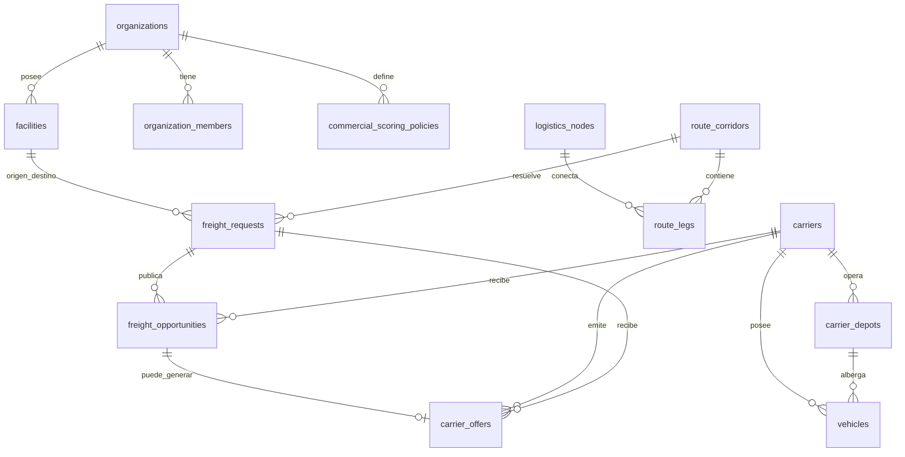

# CargoMesh V2 — Propuesta de Esquema de Base de Datos y Modelo de Datos Multimodal
## Documento Técnico de Evolución Aditiva en PostgreSQL (Supabase)

> **Estado documental:** este archivo describe la **arquitectura objetivo V2**. Las capacidades que aún no existen en el código deben tratarse como `TARGET/PLANNED`; el flujo MCP ya validado y los componentes existentes no deben reescribirse solo para coincidir con este documento.

> 📚 **Suite Documental de Arquitectura V2:**  
> • **Blueprint Maestro:** [CARGOMESH_V2_EVOLUTION_BLUEPRINT.md](./CARGOMESH_V2_EVOLUTION_BLUEPRINT.md)  
> • **Esquema de Base de Datos:** [DATABASE_SCHEMA_V2_PROPOSAL.md](./DATABASE_SCHEMA_V2_PROPOSAL.md) *(Este documento)*  
> • **Diagramas de Dominio y Persistencia:** [BACKEND_DOMAIN_AND_PERSISTENCE_DIAGRAMS.md](./BACKEND_DOMAIN_AND_PERSISTENCE_DIAGRAMS.md)  
> • **Taxonomía de Carga y Precios USD:** [CARGO_DIMENSIONS_AND_TAXONOMY_V2.md](./CARGO_DIMENSIONS_AND_TAXONOMY_V2.md)  
> • **Plan Operativo y Sprints vigente (V2):** [SPRINT_ROADMAP.md](../v2-amazon/delivery/SPRINT_ROADMAP.md) *(el `MASTER_BACKLOG.md` previsto en este borrador no existe)*

---

## 🧭 1. Principio Rector: Evolución Aditiva (Cero Regresiones)

Para garantizar la integridad del sistema actual de CargoMesh:
* **No se destruye ni se reescribe ninguna de las 20 migraciones existentes.**
* Las 17 tablas de la base de datos, los 160 pruebas SQL de regresión, las 22 políticas RLS y la idempotencia criptográfica (`20260918120000_c_draft_creation_idempotency.sql`) permanecen **100% operativos y en verde**.
* Toda la nueva funcionalidad multimodal, multi-sede (clientes y transportistas), matriz de ruteo O-D y tarificación dinámica se introduce mediante **nuevas tablas satélite y columnas aditivas con valores por defecto (`DEFAULT`)**.

---

## 🏢 2. Módulo de Clientes (Shippers): Sedes Físicas y Gobernanza

Una empresa generadora de carga industrial (ej. **ACME Mining Perú**) opera múltiples instalaciones físicas con requerimientos operacionales y de acceso específicos.

### A. Tabla: `facilities` (Sedes y Almacenes del Cliente)
Permite al cliente registrar sus campamentos mineros, depósitos fiscales, muelles portuarios y plantas de refinación:

```sql
CREATE TYPE facility_type_enum AS ENUM (
    'MINE_SITE',           -- Campamento minero (ej. Las Bambas)
    'PORT_TERMINAL',        -- Terminal o depósito portuario (ej. APM Terminals Callao)
    'REFINERY_PLANT',       -- Planta de procesamiento o fundición (ej. Santiago)
    'CENTRAL_WAREHOUSE',    -- Almacén o centro de distribución logístico
    'SUPPLIER_DEPOT'        -- Almacén de proveedor externo (para flujos Inbound)
);

CREATE TABLE public.facilities (
    id UUID PRIMARY KEY DEFAULT gen_random_uuid(),
    organization_id UUID NOT NULL REFERENCES public.organizations(id) ON DELETE CASCADE,
    facility_code TEXT NOT NULL,
    name TEXT NOT NULL,
    facility_type facility_type_enum NOT NULL DEFAULT 'CENTRAL_WAREHOUSE',
    
    -- Georreferenciación oficial para Google Maps API
    formatted_address TEXT NOT NULL,
    city TEXT NOT NULL,
    region TEXT,
    country_code TEXT NOT NULL DEFAULT 'PE',
    latitude NUMERIC(10, 7) NOT NULL,
    longitude NUMERIC(10, 7) NOT NULL,
    geohash TEXT,
    google_place_id TEXT,

    -- Especificaciones de muelle y patio de maniobras
    has_loading_dock BOOLEAN NOT NULL DEFAULT TRUE,
    dock_bays_count INTEGER NOT NULL DEFAULT 2,
    has_weighbridge BOOLEAN NOT NULL DEFAULT FALSE,      -- Báscula para pesaje de camiones 60T
    has_rail_spur BOOLEAN NOT NULL DEFAULT FALSE,        -- Desvío ferroviario directo a la planta
    max_vehicle_length_meters NUMERIC(5, 2) DEFAULT 22.0,-- Capacidad para camiones bi-tren o camas-bajas
    
    -- Protocolos y requerimientos de acceso
    access_protocol TEXT NOT NULL DEFAULT 'STANDARD_WAREHOUSE', 
    -- 'MINING_SCTR_REQUIRED', 'PORT_GATE_PASS_REQUIRED', 'STANDARD_WAREHOUSE'
    operating_hours JSONB NOT NULL DEFAULT '{"mon_fri": "07:00-19:00", "sat": "07:00-13:00"}'::jsonb,
    
    -- Contacto in-situ para choferes
    site_contact_name TEXT,
    site_contact_phone TEXT,
    site_contact_email TEXT,

    status TEXT NOT NULL DEFAULT 'ACTIVE' CHECK (status IN ('ACTIVE', 'INACTIVE')),
    created_at TIMESTAMPTZ NOT NULL DEFAULT NOW(),
    updated_at TIMESTAMPTZ NOT NULL DEFAULT NOW(),
    CONSTRAINT facilities_org_code_unique UNIQUE (organization_id, facility_code)
);

CREATE INDEX idx_facilities_org ON public.facilities(organization_id);
CREATE INDEX idx_facilities_coords ON public.facilities(latitude, longitude);
```

### B. Extensión Aditiva a `organizations`: Tiers y Gobernanza Financiera
```sql
ALTER TABLE public.organizations
    ADD COLUMN IF NOT EXISTS industry_sector TEXT DEFAULT 'MINING_METALS',
    ADD COLUMN IF NOT EXISTS loyalty_tier TEXT DEFAULT 'PLATINUM' CHECK (loyalty_tier IN ('STANDARD', 'GOLD', 'PLATINUM')),
    ADD COLUMN IF NOT EXISTS credit_limit_usd NUMERIC(14, 2) DEFAULT 100000.00,
    ADD COLUMN IF NOT EXISTS max_auto_approval_budget_usd NUMERIC(14, 2) DEFAULT 5000.00;
```

---

## 🚛 3. Módulo de Carriers: Depots, Oferta y Nodos de Infraestructura

Los carriers no son entidades abstractas: tienen bases, flota, permisos y políticas comerciales. Para el marketplace estilo inDrive se separan **compatibilidad**, **oportunidad** y **oferta**.

### A. `carrier_depots` — bases físicas propias del carrier

```sql
CREATE TYPE depot_type_enum AS ENUM (
    'MAIN_HEADQUARTERS',
    'MAINTENANCE_YARD',
    'BORDER_CROSSING_POST',
    'PORT_BERTH_OFFICE',
    'INTERMODAL_RAMP',
    'WAREHOUSE',
    'CROSS_DOCK'
);

CREATE TABLE public.carrier_depots (
    id UUID PRIMARY KEY DEFAULT gen_random_uuid(),
    carrier_id UUID NOT NULL REFERENCES public.carriers(id) ON DELETE CASCADE,
    depot_code TEXT NOT NULL,
    name TEXT NOT NULL,
    depot_type depot_type_enum NOT NULL DEFAULT 'MAINTENANCE_YARD',

    country_code TEXT NOT NULL,
    city TEXT NOT NULL,
    address TEXT NOT NULL,
    latitude NUMERIC(10, 7) NOT NULL,
    longitude NUMERIC(10, 7) NOT NULL,
    geohash TEXT,

    assigned_fleet_capacity INTEGER NOT NULL DEFAULT 0,
    has_cold_storage_plugs BOOLEAN NOT NULL DEFAULT FALSE,
    has_hazardous_permit BOOLEAN NOT NULL DEFAULT FALSE,
    customs_brokerage_enabled BOOLEAN NOT NULL DEFAULT FALSE,

    created_at TIMESTAMPTZ NOT NULL DEFAULT NOW(),
    updated_at TIMESTAMPTZ NOT NULL DEFAULT NOW(),
    CONSTRAINT carrier_depot_unique UNIQUE (carrier_id, depot_code)
);
```

La distancia entre el depot/activo disponible y el origen del `FreightRequest` se modela como **deadhead** y afecta matching, ETA y costo.

### B. `logistics_nodes` — infraestructura compartida internacional

Puertos y aeropuertos no deben modelarse necesariamente como si fueran propiedad de un carrier.

```sql
CREATE TYPE logistics_node_type_enum AS ENUM (
    'PORT_TERMINAL',
    'AIR_CARGO_TERMINAL',
    'RAIL_TERMINAL',
    'CUSTOMS_WAREHOUSE',
    'BORDER_POST',
    'DISTRIBUTION_CENTER',
    'CROSS_DOCK',
    'INLAND_CONTAINER_DEPOT'
);

CREATE TABLE public.logistics_nodes (
    id UUID PRIMARY KEY DEFAULT gen_random_uuid(),
    code TEXT NOT NULL UNIQUE,
    name TEXT NOT NULL,
    node_type logistics_node_type_enum NOT NULL,
    country_code TEXT NOT NULL,
    city TEXT NOT NULL,
    formatted_address TEXT,
    latitude NUMERIC(10, 7) NOT NULL,
    longitude NUMERIC(10, 7) NOT NULL,
    customs_enabled BOOLEAN NOT NULL DEFAULT FALSE,
    cold_chain_enabled BOOLEAN NOT NULL DEFAULT FALSE,
    hazmat_enabled BOOLEAN NOT NULL DEFAULT FALSE,
    operating_hours JSONB,
    metadata JSONB NOT NULL DEFAULT '{}'::jsonb,
    status TEXT NOT NULL DEFAULT 'ACTIVE'
        CHECK (status IN ('ACTIVE', 'INACTIVE')),
    created_at TIMESTAMPTZ NOT NULL DEFAULT NOW()
);
```

### C. Política de oferta del carrier

```sql
CREATE TYPE carrier_offer_mode_enum AS ENUM ('MANUAL', 'AUTO', 'HYBRID');

ALTER TABLE public.carriers
    ADD COLUMN IF NOT EXISTS offer_mode carrier_offer_mode_enum NOT NULL DEFAULT 'MANUAL',
    ADD COLUMN IF NOT EXISTS transport_modes TEXT[] DEFAULT ARRAY['ROAD']::TEXT[],
    ADD COLUMN IF NOT EXISTS supported_corridors TEXT[] DEFAULT ARRAY[]::TEXT[],
    ADD COLUMN IF NOT EXISTS base_rate_per_km_usd NUMERIC(8, 4),
    ADD COLUMN IF NOT EXISTS terminal_handling_fee_usd NUMERIC(10, 2),
    ADD COLUMN IF NOT EXISTS auto_offer_policy JSONB NOT NULL DEFAULT '{}'::jsonb;
```

Ejemplo de `auto_offer_policy`:

```json
{
  "maxDeadheadKm": 150,
  "maxAutoQuoteUsd": 5000,
  "manualReviewForHazmat": true,
  "manualReviewForOversized": true
}
```

### D. Flota / activos

```sql
CREATE TYPE asset_mode_enum AS ENUM (
    'ROAD_TRUCK',
    'ROAD_REEFER',
    'ROAD_FLATBED',
    'ROAD_HOPPER',
    'MARITIME_CONTAINER',
    'RAIL_WAGON',
    'AIR_FREIGHTER_CRATE'
);

ALTER TABLE public.vehicles
    ADD COLUMN IF NOT EXISTS asset_mode asset_mode_enum DEFAULT 'ROAD_TRUCK',
    ADD COLUMN IF NOT EXISTS home_depot_id UUID REFERENCES public.carrier_depots(id),
    ADD COLUMN IF NOT EXISTS plate_or_registration_number TEXT,
    ADD COLUMN IF NOT EXISTS max_teu_capacity NUMERIC(4, 1) DEFAULT 0.0,
    ADD COLUMN IF NOT EXISTS tare_weight_kg NUMERIC(10, 2),
    ADD COLUMN IF NOT EXISTS telemetry_protocol TEXT DEFAULT 'SIMULATED'
        CHECK (telemetry_protocol IN ('GEOTAB', 'SAMSARA', 'AIS_MARINE', 'SIMULATED')),
    ADD COLUMN IF NOT EXISTS last_known_latitude NUMERIC(10, 7),
    ADD COLUMN IF NOT EXISTS last_known_longitude NUMERIC(10, 7),
    ADD COLUMN IF NOT EXISTS last_telemetry_at TIMESTAMPTZ;
```

> **Regla:** el pricing paramétrico puede servir para benchmark o auto-oferta del carrier, pero CargoMesh no debe crear una `CarrierOffer` final en nombre del carrier sin una respuesta manual o una política de auto-oferta explícita.

## 🗺️ 4. Módulo de Ruteo Avanzado: Matriz Origen-Destino (O-D Matrix) y Tramos Complejos

Las rutas no son una simple línea recta: son **corredores multimodales con tramos (legs), pasos cordilleranos, aduanas y tiempos de descanso obligatorios**.

```mermaid
graph LR
    O["🏭 Sede Mina Las Bambas<br>(Apurímac, 4,100 msnm)"] -->|Tramo 1: Carretera de Montaña (950 km)| H1["🚢 Puerto del Callao<br>(Báscula y Muelle APM)"]
    H1 -->|Tramo 2: Cabotaje Marítimo (1,350 MN)| H2["🚢 Puerto San Antonio<br>(Aduana Chile)"]
    H2 -->|Tramo 3: Última Milla Vial/Tren (110 km)| D["🏢 Planta Fundición<br>(Santiago de Chile)"]
```

### A. Estructura de la Matriz Origen-Destino (O-D Matrix): `route_corridors`
Permite precargar y calcular matrices entre todas las sedes de clientes y depósitos de carriers:

```sql
CREATE TABLE public.route_corridors (
    id UUID PRIMARY KEY DEFAULT gen_random_uuid(),
    corridor_code TEXT NOT NULL UNIQUE, -- ej. 'PE_BAMBAS_TO_PE_CALLAO', 'CROSS_CALLAO_TO_SANTIAGO'
    origin_name TEXT NOT NULL,
    origin_country TEXT NOT NULL,
    origin_latitude NUMERIC(10, 7) NOT NULL,
    origin_longitude NUMERIC(10, 7) NOT NULL,
    
    destination_name TEXT NOT NULL,
    destination_country TEXT NOT NULL,
    destination_latitude NUMERIC(10, 7) NOT NULL,
    destination_longitude NUMERIC(10, 7) NOT NULL,

    -- Datos de matriz O-D
    total_road_distance_km NUMERIC(10, 2) NOT NULL,
    total_nautical_miles NUMERIC(10, 2) DEFAULT 0.0,
    estimated_driving_hours NUMERIC(6, 2) NOT NULL,
    estimated_maritime_hours NUMERIC(6, 2) DEFAULT 0.0,
    toll_booths_count INTEGER DEFAULT 8,
    estimated_tolls_cost_usd NUMERIC(8, 2) DEFAULT 120.00,
    
    -- Análisis topográfico y fronterizo
    max_elevation_meters NUMERIC(6, 1) DEFAULT 4100.0, -- Cruces de cordillera
    border_crossing_names TEXT[] DEFAULT ARRAY[]::TEXT[], -- ej. ['SANTA_ROSA_CHACALLUTA']
    border_customs_delay_hours NUMERIC(4, 1) DEFAULT 0.0,
    
    -- Polilínea codificada para trazabilidad en mapas (Leaflet / Google Maps)
    encoded_polyline_geojson JSONB NOT NULL,
    
    created_at TIMESTAMPTZ NOT NULL DEFAULT NOW()
);

CREATE INDEX idx_route_corridors_od ON public.route_corridors(origin_country, destination_country);
```

### B. Extensión a `freight_requests`: Direccionalidad Inbound/Outbound y Trazabilidad
```sql
CREATE TYPE freight_flow_type_enum AS ENUM (
    'OUTBOUND',            -- Envío desde sede propia a cliente/puerto externo
    'INBOUND',             -- Traída desde proveedor/puerto externo a sede propia
    'INTERNAL_TRANSFER'    -- Movimiento entre dos sedes propias de la organización
);

CREATE TYPE preferred_transport_mode_enum AS ENUM (
    'ROAD',
    'MARITIME',
    'RAIL',
    'AIR',
    'MULTIMODAL_OPTIMAL'
);

CREATE TYPE cargo_category_v2_enum AS ENUM (
    'MINING_BULK',         -- Concentrados y mineral a granel (tolvas 6x4, vagones)
    'HEAVY_MACHINERY',     -- Maquinaria pesada y sobredimensionada (cama-baja)
    'COLD_CHAIN',          -- Perecibles y cadena de frío (-20°C a +4°C)
    'HAZMAT',              -- Materiales peligrosos y químicos IMO 1-9
    'HIGH_VALUE',          -- Carga crítica de alto valor y repuestos express
    'GENERAL_DRY'          -- Mercadería general paletizada o consolidada
);

CREATE TYPE packaging_type_enum AS ENUM (
    'PALLET_STANDARD_WOOD',-- Pallet madera estándar 120x100 cm
    'PALLET_EURO',         -- Pallet europeo 120x80 cm
    'CONTAINER_20GP',      -- Contenedor marítimo estándar 20 pies
    'CONTAINER_40HC',      -- Contenedor marítimo High Cube 40 pies
    'BIG_BAG',             -- Saco industrial 1-2 toneladas
    'DRUM_BARREL',         -- Tambor de 200 L para químicos
    'WOODEN_CRATE'         -- Caja de madera reforzada
);

ALTER TABLE public.freight_requests
    ADD COLUMN IF NOT EXISTS flow_type freight_flow_type_enum NOT NULL DEFAULT 'OUTBOUND',
    ADD COLUMN IF NOT EXISTS origin_facility_id UUID REFERENCES public.facilities(id),
    ADD COLUMN IF NOT EXISTS destination_facility_id UUID REFERENCES public.facilities(id),
    ADD COLUMN IF NOT EXISTS matched_corridor_id UUID REFERENCES public.route_corridors(id),
    ADD COLUMN IF NOT EXISTS origin_latitude NUMERIC(10, 7),
    ADD COLUMN IF NOT EXISTS origin_longitude NUMERIC(10, 7),
    ADD COLUMN IF NOT EXISTS destination_latitude NUMERIC(10, 7),
    ADD COLUMN IF NOT EXISTS destination_longitude NUMERIC(10, 7),
    ADD COLUMN IF NOT EXISTS calculated_distance_km NUMERIC(10, 2),
    ADD COLUMN IF NOT EXISTS transport_mode_preferred preferred_transport_mode_enum NOT NULL DEFAULT 'ROAD',
    ADD COLUMN IF NOT EXISTS cargo_category_v2 cargo_category_v2_enum NOT NULL DEFAULT 'GENERAL_DRY',
    ADD COLUMN IF NOT EXISTS packaging_type packaging_type_enum NOT NULL DEFAULT 'PALLET_STANDARD_WOOD',
    ADD COLUMN IF NOT EXISTS total_cbm NUMERIC(10, 3),
    ADD COLUMN IF NOT EXISTS chargable_weight_kg NUMERIC(12, 2),
    ADD COLUMN IF NOT EXISTS is_stackable BOOLEAN DEFAULT TRUE,
    ADD COLUMN IF NOT EXISTS max_stacking_tiers INTEGER DEFAULT 1,
    ADD COLUMN IF NOT EXISTS hazmat_class TEXT,
    ADD COLUMN IF NOT EXISTS un_number TEXT,
    ADD COLUMN IF NOT EXISTS declared_value_usd NUMERIC(14, 2),
    ADD COLUMN IF NOT EXISTS approval_status TEXT NOT NULL DEFAULT 'AUTO_APPROVED' CHECK (approval_status IN ('AUTO_APPROVED', 'PENDING_SUPERVISOR_APPROVAL', 'APPROVED', 'REJECTED')),
    ADD COLUMN IF NOT EXISTS supervisor_approved_by UUID REFERENCES public.organization_members(id),
    ADD COLUMN IF NOT EXISTS supervisor_approved_at TIMESTAMPTZ;
```

---

## 📨 5. Marketplace inDrive: `freight_opportunities` y `carrier_offers`

La relación correcta es:

```text
FreightRequest
→ Carrier Matching
→ FreightOpportunity
→ Carrier Response
→ CarrierOffer
→ Decision Engine
```

### A. `freight_opportunities`

```sql
CREATE TYPE freight_opportunity_status_enum AS ENUM (
    'INVITED',
    'AUTO_EVALUATING',
    'AWAITING_RESPONSE',
    'OFFERED',
    'REJECTED',
    'EXPIRED'
);

CREATE TABLE public.freight_opportunities (
    id UUID PRIMARY KEY DEFAULT gen_random_uuid(),
    freight_request_id UUID NOT NULL REFERENCES public.freight_requests(id) ON DELETE CASCADE,
    carrier_id UUID NOT NULL REFERENCES public.carriers(id) ON DELETE CASCADE,
    orchestration_run_id UUID,
    status freight_opportunity_status_enum NOT NULL DEFAULT 'INVITED',
    response_mode carrier_offer_mode_enum NOT NULL,
    matched_depot_id UUID REFERENCES public.carrier_depots(id),
    deadhead_distance_km NUMERIC(10, 2),
    eligibility_snapshot JSONB NOT NULL DEFAULT '{}'::jsonb,
    invited_at TIMESTAMPTZ NOT NULL DEFAULT NOW(),
    responded_at TIMESTAMPTZ,
    expires_at TIMESTAMPTZ,
    UNIQUE (freight_request_id, carrier_id)
);
```

### B. `carrier_offers`

Si la tabla ya existe, la evolución debe ser aditiva:

```sql
CREATE TYPE carrier_offer_source_enum AS ENUM ('MANUAL_PORTAL', 'WEBMCP_AUTO');

ALTER TABLE public.carrier_offers
    ADD COLUMN IF NOT EXISTS opportunity_id UUID REFERENCES public.freight_opportunities(id),
    ADD COLUMN IF NOT EXISTS offer_source carrier_offer_source_enum,
    ADD COLUMN IF NOT EXISTS deadhead_distance_km NUMERIC(10, 2),
    ADD COLUMN IF NOT EXISTS route_distance_km NUMERIC(10, 2),
    ADD COLUMN IF NOT EXISTS pricing_breakdown JSONB,
    ADD COLUMN IF NOT EXISTS submitted_at TIMESTAMPTZ;
```

`MCDA`/Decision Engine **solo rankea filas de `carrier_offers` válidas**. No crea ofertas.

---

## 🏎️ 6. Ecosistema de Carriers de Demo y Marketplace

Los carriers de escenario sirven para demostrar densidad de mercado, pero deben etiquetarse con honestidad:

- **Providers WebMCP de demo:** pueden ejecutar cobertura/capacidad/auto-oferta con fixtures sintéticos.
- **Carrier manual de demo:** puede responder desde el portal carrier.
- **Roadmap carriers:** presentes en catálogo, sin fingir integración productiva.

El Golden Flow Callao → Santiago es un escenario reproducible; no constituye una restricción del dominio.

---

## 🌱 7. Sedes, Depots y Nodos Canónicos de Scenario Data

Los datos de demo deben vivir en `supabase/scenarios/...`, no en migraciones estructurales.

### Facilities del shipper
- Callao
- Las Bambas
- Arequipa
- Santiago

### Carrier depots
- Andes: Callao, Arequipa, Tacna, Santiago
- Pacific: patios/operaciones asociadas a Callao y San Antonio
- Inca: Matarani / Arequipa / La Joya

### Logistics nodes
- Puerto del Callao
- Puerto San Antonio
- Aeropuerto Jorge Chávez (LIM)
- Aeropuerto Arturo Merino Benítez (SCL)
- Paso fronterizo Santa Rosa/Chacalluta
- terminal ferroviario/intermodal de scenario

Estos nodos permiten construir rutas internacionales e intermodales sin fingir que cada terminal pertenece al carrier.

## 📊 8. Diagrama de Relaciones Completo (ERD V2)



---

## 🎯 9. Veredicto y Compatibilidad con el Código Actual

1. CargoMesh queda modelado como **marketplace de oportunidades y ofertas**, no como un motor que cotiza por todos los carriers.
2. `MANUAL`, `AUTO` y `HYBRID` permiten combinar portal carrier con WebMCP sin duplicar el modelo comercial.
3. `carrier_depots` resuelve la proximidad/deadhead; `logistics_nodes` representa infraestructura internacional compartida como puertos, aeropuertos, aduanas y terminales.
4. La evolución propuesta es aditiva: las tablas nuevas se agregan alrededor del flujo existente y las migraciones históricas no se reescriben.
5. Los datos de carrier siguen pudiendo ser sintéticos para la demo, siempre que se identifiquen como fixtures/scenario data.
