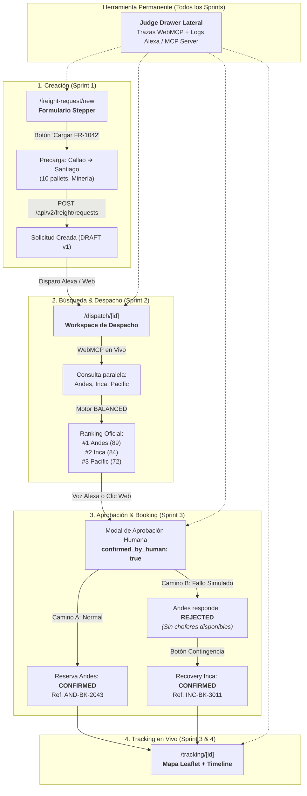

# CargoMesh V2 — Guía de Frontend, Design System y Reglas del Jurado

Este documento establece las directivas visuales, arquitectónicas y de evaluación que deben respetar **FE-1 (Luis)** y **FE-2** durante el desarrollo de la interfaz para el Amazon Developer Hackathon.

---

## 🗺️ 1. Flujograma Visual del Golden Flow (Arquitectura de Pantallas)

El jurado y el video oficial de 3 minutos recorrerán este flujo de extremo a extremo:



---

## 🎨 2. Design System Tokens (Paleta Oficial de `globals.css`)

Toda la aplicación utiliza tema oscuro con tonalidades esmeralda y acentos dorados:

| Token | Variable CSS | Valor Hex | Uso Oficial |
|---|---|---|---|
| **Background** | `var(--background)` | `#07110f` | Fondo general de la aplicación. |
| **Surface** | `var(--surface)` | `#0e1d19` | Fondo de contenedores, tablas y campos. |
| **Surface Raised** | `var(--surface-raised)` | `#142722` | Tarjetas elevadas, modales y popovers. |
| **Border** | `var(--border)` | `#29463d` | Líneas divisorias y bordes de inputs. |
| **Text Main** | `var(--text)` | `#f3f7f5` | Texto principal (títulos, valores clave). |
| **Text Muted** | `var(--muted)` | `#a8bbb4` | Etiquetas, descripciones secundarias. |
| **Accent (Oro)** | `var(--accent)` | `#d2a95f` | Botones de acción principal (CTA), highlights. |
| **Success** | `var(--success)` | `#57c79a` | Confirmado, estado óptimo, checks verdes. |
| **Danger** | `var(--danger)` | `#ff8a78` | Rechazado, errores, alertas de fallo. |

---

## 🔘 3. Estándar de Componentes de UI

Para evitar que Luis y FE-2 diseñen botones o controles incompatibles:

### A. Botón Principal (Primary CTA)
Usado para: *"Confirmar Reserva"*, *"Crear Solicitud"*, *"Buscar Transportistas"*.
```css
/* Clase estándar */
background: #d2a95f;
color: #07110f;
font-weight: 600;
border-radius: 8px; /* rounded-lg */
padding: 10px 18px;
border: none;
cursor: pointer;
transition: opacity 0.15s ease;
```

### B. Botón Secundario / Filtro
Usado para: *"Volver"*, *"Cancelar"*, *"Cargar Escenario Canónico"*, *"Filtros"*.
```css
/* Clase estándar */
background: #142722;
color: #f3f7f5;
font-weight: 500;
border-radius: 8px;
padding: 10px 16px;
border: 1px solid #29463d;
cursor: pointer;
```

### C. Campos de Entrada (Inputs y Selects)
```css
background: #0e1d19;
color: #f3f7f5;
border: 1px solid #29463d;
border-radius: 8px;
height: 40px; /* h-10 */
padding: 0 12px;
```

### D. Iconografía Obligatoria
- **Librería Exclusiva:** `lucide-react` (v0.475.0 ya instalada).
- **Prohibido:** FontAwesome o SVGs sueltos sin estandarizar.
- Iconos típicos: `Truck`, `CheckCircle2`, `AlertTriangle`, `MapPin`, `Calendar`, `ShieldCheck`, `ArrowRight`.

### E. Badges de Estado
Usar obligatoriamente el componente existente:
```tsx
import { StatusBadge } from "@/components/status-badge";
<StatusBadge status={request.status} locale={locale} />
```

---

## ⚖️ 4. Reglas Innegociables para el Jurado de Amazon

1. **Jueces en Inglés (Soporte Bilingüe):**
   - Los jurados de Devpost son de habla inglesa (`chris-trag`, `knmeiss`).
   - Toda etiqueta, botón o mensaje de error debe usar:
     ```tsx
     import { useLocale } from "@/features/i18n/locale-provider";
     import { translate } from "@/features/i18n/config";

     const { locale } = useLocale();
     <span>{translate(locale, "Buscar transportistas", "Find freight options")}</span>
     ```
2. **Botón de 1 Clic (Escenario Canónico FR-1042):**
   - En `/freight-request/new`, el botón *"Cargar Escenario Canónico (Callao ➔ Santiago)"* debe estar siempre disponible para que el jurado pueda probar sin escribir datos manuales.
3. **Honestidad Técnica de Carriers:**
   - **Solo 3 carriers están en vivo:** Andes Freight, Inca Logistics, Pacific Express.
   - Polaris, Apex y Velocity son datos de escenario/roadmap y nunca deben mostrarse como WebMCP activos.
4. **Judge Drawer:**
   - Debe permanecer accesible en la esquina lateral derecha mediante su botón flotante. En Sprint 1, FE-2 agregará la pestaña *"Alexa / MCP Logs"* para registrar eventos en tiempo real.

---

## 🔍 5. Checklist de Validación para Reviewers (Cristhian o Axel)

Antes de dar **Merge** a un Pull Request de Frontend:
- [ ] ¿El código pasa `pnpm typecheck` sin errores?
- [ ] ¿Los botones y colores respetan la paleta (`#d2a95f`, `#0e1d19`, etc.)?
- [ ] ¿Todos los textos tienen su traducción al inglés (`translate(locale, ...)`?
- [ ] ¿No se añadieron librerías externas de UI sin consultar?
- [ ] ¿Los tests existentes de frontend siguen pasando (`pnpm test:freight-intake`, `pnpm test:i18n`)?
