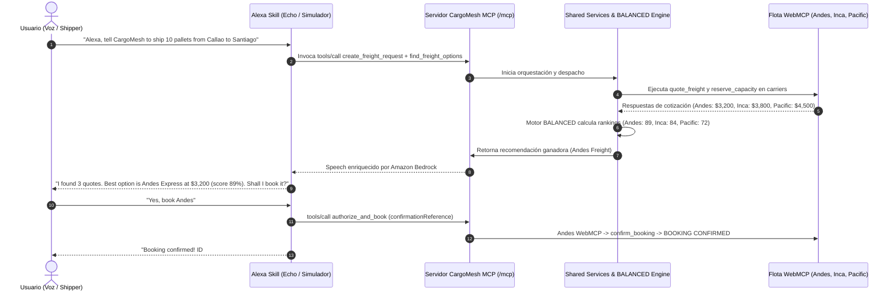

# CargoMesh V2 — Master Backlog & Operational Plan
## Amazon Developer Hackathon (Track Alexa+)
**Periodo:** Sábado 19 de Septiembre al Lunes 19 de Octubre de 2026  
**Rama Base:** `codex/c-mcp-contracts` (⚠️ **Regla de Oro:** ¡NUNCA hacer ramas ni merge directo a `main`!)

---

## 👥 1. Asignaciones por Desarrollador (2 Tareas por Integrante - Sprint 1)
Cada miembro tiene asignada 1 tarea técnica pesada + 1 tarea de soporte/gestión:

### 🔴 Cristhian Chujutalli — BE-2 & Tech Lead
- **Tarea 1 (Técnica):** `HAC-6` — Aplicar migración SQL de idempotencia y servicio backend `DRAFT ➔ PENDING` (Límite: Miércoles 23 Sep).  
  🌿 **Rama:** `feat/be2-hac-6-draft-idempotency`
- **Tarea 2 (Liderazgo):** `HAC-10` — [GATE-1] Coordinar sesión de integración conjunta y Demo Interna (Límite: Viernes 25 Sep).  
  🌿 **Rama:** `feat/cycle-1-integration` ➔ Merge final a `codex/c-mcp-contracts`.

### 🟠 Axel Arista — BE-1 / Alexa & Cloud Lead
- **Tarea 1 (Técnica):** `HAC-5` — Configurar Skill en Alexa Developer Console y verificar servidor `/mcp` local (Límite: Miércoles 23 Sep).  
  🌿 **Rama:** `feat/be1-hac-5-alexa-skill-base`
- **Tarea 2 (Soporte):** `HAC-17` — Llenar formulario oficial de Devpost para solicitar $150 de créditos AWS gratuitos (Límite: Lunes 21 Sep).  
  ⚡ **Tipo:** Gestión externa / AWS Console (No requiere rama).

### 🟣 Jean Paul — BE-3 / CI, QA & Automation Lead
- **Tarea 1 (Técnica):** `HAC-7` — Asegurar suite CI Baseline (147 pgTAP tests en verde) y arnés de Hono V2 (Límite: Miércoles 23 Sep).  
  🌿 **Rama:** `feat/be3-hac-7-ci-baseline-runner`
- **Tarea 2 (Soporte):** `HAC-18` — Crear estructura de carpetas en Google Drive para evidencias de Kiro Crew y videos (Límite: Lunes 21 Sep).  
  ⚡ **Tipo:** Gestión en Google Drive (No requiere rama).

### 🔵 Luis — FE-1 / Enterprise Shipper Lead
- **Tarea 1 (Soporte previo):** `HAC-19` — Estandarizar componentes base (Botón Dorado `#d2a95f`, inputs, badges) según `FRONTEND_GUIDELINES.md` (Límite: Martes 22 Sep).  
  🌿 **Rama:** `feat/fe1-hac-19-design-tokens-components`
- **Tarea 2 (Técnica):** `HAC-8` — Migrar formulario stepper `/freight-request/new` a endpoints Hono V2 (Límite: Miércoles 23 Sep).  
  🌿 **Rama:** `feat/fe1-hac-8-intake-stepper-hono`

### 🟡 Juan Antonio Coronado — FE-2 / Carrier Surface & Audit Lead
- **Tarea 1 (Técnica):** `HAC-9` — Auditar las 5 tools en `/providers/*` y habilitar pestaña MCP en Judge Drawer (Límite: Miércoles 23 Sep).  
  🌿 **Rama:** `feat/fe2-hac-9-carrier-tools-audit`
- **Tarea 2 (Auditoría):** `HAC-20` — [QA / AUDIT] Ejecutar Auditoría Estricta de Reglas del Jurado antes del Gate 1 (Límite: Jueves 24 Sep).  
  ⚡ **Tipo:** Auditoría en local (Reportar blockers a Cristhian).

---

## 📁 Detalle de Definición de Tarea: HAC-18 (Google Drive & Evidencias)
**Asignado:** Jean Paul (BE-3) | **Límite:** Lunes 21 de Septiembre  
**Objetivo:** Crear la carpeta compartida en Google Drive para el equipo de 5 integrantes con las 4 subcarpetas oficiales para almacenar los archivos pesados (videos, audios, capturas y transcripciones de Kiro Crew) y anclar el enlace en Linear.

### Estructura Requerida de Carpetas en Drive:
```text
📁 CargoMesh - Amazon Hackathon 2026/
├── 📁 01_Kiro_Crew_Evidencias/    --> Transcripciones y capturas para el premio AWS Builder ($5K)
│   ├── 📁 Axel_Arista_BE1/
│   ├── 📁 Cristhian_Chujutalli_BE2/
│   ├── 📁 Jean_Paul_BE3/
│   ├── 📁 Luis_FE1/
│   └── 📁 Juan_Antonio_FE2/
├── 📁 02_Friction_Logs_Borradores/ --> Incidentes y workarounds para el +10% bonus del jurado
├── 📁 03_Audio_y_Locucion_Alexa/   --> Pruebas de voz y diálogos grabados
└── 📁 04_Video_Raw_y_Clips/       --> Grabaciones de pantalla en 1080p para el video final
```

### Criterios de Aceptación (Definition of Done):
- [ ] Carpeta principal y las 4 subcarpetas creadas en Google Drive.
- [ ] Acceso de edición compartido con los correos de los 5 integrantes del equipo.
- [ ] Enlace al Drive anclado en Linear:
  - En Linear, ir al proyecto **CargoMesh V2 — Alexa Hackathon**.
  - En la barra lateral derecha, en **Links** -> presionar `+ Add link` -> pegar la URL del Drive.
- [ ] Dejar el enlace como comentario en el ticket `HAC-18` y mover a Done.
- [ ] *Nota operativa:* Para la siguiente semana ya debe estar implementada y utilizada correctamente para todas las asignaciones del equipo.

---

## 💻 2. Cómo arrancar tu rama en Git (Comandos para Terminal)
Para iniciar tu trabajo técnico sin errores de ramas ni colisiones:

```bash
# 1. Asegúrate de tener los últimos cambios de la base
git fetch origin
git checkout codex/c-mcp-contracts
git pull origin codex/c-mcp-contracts

# 2. Crea tu rama con tu nombre asignado arriba
git checkout -b <nombre-de-tu-rama>

# 3. Abre tu Draft PR inmediatamente en GitHub
gh pr create --base codex/c-mcp-contracts --draft
```

---

## 🤖 3. Matriz de Automatización GitHub ➔ Linear
El tablero de Linear se actualiza automáticamente según tus acciones en GitHub:

| Acción en Git / GitHub | Comando / Evento | Estado en Linear | Explicación |
|---|---|---|---|
| **1. Abres tu Draft PR** | `gh pr create --draft` | 🟡 **In Progress** | Linear detecta el borrador y pasa tu tarea a "En Progreso". |
| **2. Haces commits de avance** | `git commit -m "feat: avance Part of HAC-X"` | 🟡 **In Progress** | El commit queda registrado en el historial de la tarea. |
| **3. Terminas y pides revisión** | Marcar "Ready for review" y poner `Closes HAC-X` | 🟢 **In Review** | Linear le notifica a Cristhian y Axel para revisar tu código. |
| **4. Cristhian o Axel hacen Merge** | Se fusiona a `codex/c-mcp-contracts` | 🟣 **Done** | Linear cierra automáticamente tu tarea con check verde. |

---

## ⚖️ 4. Checklist de Auditoría del Jurado (GATE-1: Jueves 24 / Viernes 25)
Juan Antonio (`HAC-20`), Cristhian y Axel verificarán estos 6 puntos antes de cerrar el Sprint 1:

1. **Honestidad de Carriers:** Solo Andes, Inca y Pacific son WebMCP live. Polaris y Apex rotulados explícitamente como *"Dato de escenario / Roadmap"*.
2. **Escenario Canónico en 1 Clic:** El botón Callao ➔ Santiago en `/freight-request/new` llena los datos en 1 clic sin errores de validación.
3. **Inglés para Jueces:** Al poner el selector de idioma en `en`, toda la interfaz se visualiza en inglés correcto sin textos quemados en español.
4. **Judge Drawer Operativo:** El panel lateral registra eventos con timestamps y estado 200.
5. **Evidencias Kiro Crew:** Prompts y transcripciones de la semana guardados en `01_Kiro_Crew_Evidencias/` en Google Drive.
6. **Pipeline Verde:** `pnpm release:verify` pasando con 0 errores de TypeScript y 147/147 tests pgTAP en verde.

---

## 🛠️ 5. Herramientas Exactas de Backend (Stack de Desarrollo Local)
Para que Axel, Cristhian y Jean Paul no duden de qué software o comandos usar:

| Componente Backend | Herramienta Oficial | Entorno / Acceso Local |
|---|---|---|
| **Base de Datos & RLS** | Supabase CLI Local (PostgreSQL 15) | Comandos: `npx supabase start`, `npx supabase db reset`.<br>Interfaz visual: Supabase Studio en `http://127.0.0.1:54323`. |
| **Testing de Base de Datos** | pgTAP | Comando: `npx supabase test db` (147 pruebas automatizadas). |
| **API Backend V2** | Hono v4 + TypeScript + Zod | En `cargomesh/src/server/hono/`. Tipado estricto con schemas compartidos. |
| **Servidor MCP** | `@modelcontextprotocol/sdk: 1.30.0` | Streamable HTTP en `src/server/mcp/http.ts`. Se prueba con `pnpm test:mcp`. |
| **Simulador de Alexa** | Alexa Developer Console | Consola web oficial (`developer.amazon.com/alexa/console/ask`) en pestaña Test con el simulador de voz y texto. |
| **AI Tooling & Prompts** | Kiro Crew | Para generar esquemas y prompts. Exportar el `.jsonl` o `.md` de cada sesión al Drive. |

---

## 🔗 6. Enlaces Clave del Proyecto
- 🎨 **Guía Oficial de Frontend & Paleta:** [`docs/architecture-v2/FRONTEND_GUIDELINES.md`](file:///c:/Users/HP/Documents/cargomesh/docs/architecture-v2/FRONTEND_GUIDELINES.md)
- ☁️ **Solicitud de $150 Créditos AWS:** [Google Forms Oficial de Amazon](https://forms.gle/GaHFxSbBQNG9Kti6A)
- 🐙 **Pull Request Activo #74:** [GitHub PR #74](https://github.com/Chujutak2024/cargomesh/pull/74)

---

## 🎙️ 7. ¿Cómo se conecta Alexa con la Flota WebMCP? (Arquitectura Dual)
> **Principio de Diseño:** Alexa **NO descarta** WebMCP; **Alexa comanda a WebMCP**.  
> El servidor MCP (`/mcp`) es la interfaz ejecutiva que Alexa invoca por voz; por debajo, CargoMesh orquesta a los navegadores de los carriers (Andes, Inca, Pacific) usando sus 5 tools WebMCP para cotizar y reservar en tiempo real.



---

## 📁 8. Ubicaciones Exactas de Exportación y Entregables
| Artefacto | Responsable | Dónde se Genera / Exporta | Dónde se Guarda en el Repositorio / Drive |
|---|---|---|---|
| **Alexa Interaction Model** | Axel (BE-1) | Alexa Developer Console ➔ Interaction Model ➔ JSON Editor ➔ Export | `cargomesh/docs/architecture-v2/alexa-interaction-model.json` |
| **Payload Mapeo Alexa ➔ MCP** | Axel (BE-1) | Simulador de Alexa / Curl payload | `cargomesh/docs/architecture-v2/alexa-mcp-mapping-payload.json` |
| **Formulario Créditos AWS ($150)** | Axel (BE-1) | Formulario oficial Devpost | `https://forms.gle/GaHFxSbBQNG9Kti6A` |
| **Transcripciones Kiro Crew** | Todo el equipo | Kiro Crew Chat ➔ Exportar historial de prompts | Google Drive: `01_Kiro_Crew_Evidencias/<tu_nombre>/` |
| **Friction Logs (+10% Bonus)** | Jean Paul (BE-3) | Registro de bugs/bloqueos en AWS/Kiro | `cargomesh/docs/04-execution/FRICTION_LOGS.md` y Drive `02_Friction_Logs_Borradores/` |
| **Reporte de Auditoría Sprint 1** | Juan Antonio (FE-2) | Auditoría de reglas del jurado | `cargomesh/docs/04-execution/SPRINT1_AUDIT_REPORT.md` |
| **Guion Demo Interna (2 min)** | Juan Antonio (FE-2) | Flujo dual Web + Alexa | `cargomesh/docs/04-execution/SPRINT1_DEMO_SCRIPT.md` |
| **Componentes Base UI** | Luis (FE-1) | Código fuente frontend | `cargomesh/src/components/ui/button.tsx`, `input.tsx`, `status-badge.tsx` |

---

## 🏆 9. Matriz de Premios Oficiales Devpost ($190K Pool)
| Categoría | Premio | Requisito Oficial | Estrategia CargoMesh |
|---|---|---|---|
| **Primary Track: Alexa+** | **1º: $25K cash + $15K AWS**<br>2º: $15K cash + $5K AWS<br>3º: $4K cash + $1K AWS | Servidor MCP (spec `2025-11-25+`, Streamable HTTP) o Skill en acción. Video ≤ 3 min en inglés. | `/mcp` con `@modelcontextprotocol/sdk: 1.30.0` + Alexa Skill Kit + Flujo Golden Flow Callao ➔ Santiago con compuerta humana. |
| **Mini Challenge: AWS Builder** | **$5K cash + $5K AWS** | *"Building with Kiro Crew qualifies on its own"*. O servicios AWS (Bedrock). | Doble validación: Kiro Crew (transcripciones) + Amazon Bedrock Claude 3 Haiku en `lib/bedrock.ts`. |
| **Mini Challenge: Open Source** | **$5K cash + $5K AWS** | Proyecto open source o paquete nuevo con licencia MIT durante el hackathon. | Publicación de `packages/cargomesh-mcp` (npm/GitHub) con esquemas y compuerta humana. |
| **⭐ Multiplicador: +10% Bonus** | **Hasta +10% en puntaje jurado** | Friction Logs documentados: Tarea, pasos, esperado vs real, severidad, workaround y sugerencia. | 3 Friction Logs detallados durante Sprints 1 a 4 (Kiro Crew, MCP SDK y Bedrock). |

---

## 🗓️ 10. Hoja de Ruta de Sprints (Sprints 2 al 5)

### 🗓️ CYCLE 2 (Sprint 2): Orquestación de Búsqueda y Despacho WebMCP
**Fechas:** Sábado 26 Sep — Viernes 02 Oct 2026  
**Meta:** Búsqueda disparada por Alexa (`find_freight_options`), runner consulta a los 3 carriers en vivo y el motor BALANCED entrega las ofertas rankeadas en tiempo real.
- **BE-1 (`HAC-201`):** Tool MCP `find_freight_options` e Intent de búsqueda en Alexa.
- **BE-2 (`HAC-202`):** Endpoints Hono de candidatos y evaluación BALANCED (scores: Andes 89, Inca 84, Pacific 72).
- **BE-3 (`HAC-203`):** Puente de despacho durable Node ➔ WebMCP Runner.
- **FE-1 (`HAC-204`):** Workspace de despacho `/dispatch/[id]` con tarjetas de cotización en vivo.
- **FE-2 (`HAC-205`):** Visualización en tiempo real de llamadas de carriers en Judge Drawer.
- **GATE-2:** Prueba conjunta E2E de búsqueda por voz.

### 🗓️ CYCLE 3 (Sprint 3): Aprobación Humana, Booking y Flujo de Recuperación
**Fechas:** Sábado 03 Oct — Viernes 09 Oct 2026  
**Meta:** Flujo comercial seguro completado: confirmación por voz (`authorize_and_book` con compuerta humana) y recovery automático ante rechazo simulado de Andes ➔ Inca CONFIRMED.
- **BE-1 (`HAC-301`):** Tools MCP `authorize_and_book`, `get_booking_status` y `recover_booking`.
- **BE-2 (`HAC-302`):** Persistencia de bookings en PostgreSQL y transiciones de estado.
- **BE-3 (`HAC-303`):** Coordinador de reservas WebMCP y captura de veredicto (Confirmed vs Rejected).
- **FE-1 (`HAC-304`):** Modal de autorización humana y pantalla `/tracking/[id]` con Leaflet map.
- **FE-2 (`HAC-305`):** Toggle de rechazo simulado en Andes Freight.
- **GATE-3:** Release tag `v2.0.0-rc1`.

### 🗓️ CYCLE 4 (Sprint 4): Bedrock Haiku, Open Source & Feature Freeze
**Fechas:** Sábado 10 Oct — Viernes 16 Oct 2026  
**Meta:** Integración de Amazon Bedrock Claude 3 Haiku para locución natural, empaquetado del módulo `cargomesh-mcp` (licencia MIT) y congelamiento de código.
- **BE-1 (`HAC-401`):** Integración de AWS Bedrock Claude 3 Haiku en `lib/bedrock.ts`.
- **BE-3 (`HAC-402`):** Publicación del paquete open source `packages/cargomesh-mcp/`.
- **BE-2 & FE-1 (`HAC-403`):** Sincronización en tiempo real Web 🠚 Alexa (WebSockets/Polling reactivo).
- **FE-2 (`HAC-404`):** Pulido visual en 1080p/4K para la grabación.
- **GATE-4 (15-16 Oct):** FEATURE FREEZE. Verificación `pnpm release:verify` limpia.

### 🗓️ CYCLE 5 (Sprint 5): Video Demo, Revisores Amazon y Postulación Devpost
**Fechas:** Sábado 17 Oct — Lunes 19 Oct 2026 (Sprint corto de entrega)  
**Meta:** Video de demostración en inglés (≤ 2:40 min), Friction Logs (+10% bonus) y envío oficial en Devpost.
- **Sábado 17 Oct:** Ensayo general del Golden Flow y seteo de cámaras/audio.
- **Domingo 18 Oct:** Grabación del video en inglés, edición en 1080p a 60fps y redacción de Devpost (Product Feedback y Friction Logs).
- **Lunes 19 Oct (10:00):** Invitar a los 6 revisores de Amazon en GitHub si el repo es privado (`chris-trag`, `knmeiss`, `giolaq`, `anishamalde`, `mosesroth`, `emersonsklar`).
- **Lunes 19 Oct (14:00):** ENVÍO OFICIAL EN DEVPOST 🏆.
