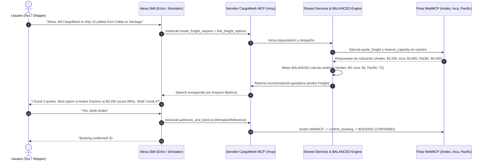

# CargoMesh V2 — Master Backlog Plan (Amazon Developer Hackathon)
## Periodo: 19 de Septiembre al 19 de Octubre de 2026 (Track Alexa+)
**Rama Base:** `codex/c-mcp-contracts` (Regla de oro: ¡NUNCA hacer ramas ni merge directo a `main`!)

---

## 👥 Equipo y Asignaciones (5 Integrantes)
- **BE-1 (Axel Arista):** Alexa+ Skill & Servidor MCP (AWS Bedrock, `@modelcontextprotocol/sdk: 1.30.0`).
- **BE-2 (Cristhian Chujutalli):** Tech Lead, Base de Datos, Capa Hono V2 e Idempotencia.
- **BE-3 (Jean Paul):** CI Baseline, QA Automation (147 pgTAP tests) y Gestor de Evidencias Drive.
- **FE-1 (Luis):** Enterprise Shipper UI, Formulario Stepper y Componentes Base.
- **FE-2 (Juan Antonio Coronado):** Carrier WebMCP Surface, Visual Judge Drawer & Auditoría del Jurado.

---

## 🏆 Matriz de Premios Oficiales Devpost ($190K Pool)
| Categoría | Premio | Requisito Oficial | Estrategia CargoMesh |
|---|---|---|---|
| **Primary Track: Alexa+** | **1º: $25K cash + $15K AWS**<br>2º: $15K cash + $5K AWS<br>3º: $4K cash + $1K AWS | Servidor MCP (spec `2025-11-25+`, Streamable HTTP) o Skill en acción. Video ≤ 3 min en inglés. | `/mcp` con `@modelcontextprotocol/sdk: 1.30.0` + Alexa Skill Kit + Flujo Golden Flow Callao ➔ Santiago con compuerta humana. |
| **Mini Challenge: AWS Builder** | **$5K cash + $5K AWS** | *"Building with Kiro Crew qualifies on its own"*. O servicios AWS (Bedrock). | Doble validación: Kiro Crew (transcripciones) + Amazon Bedrock Claude 3 Haiku en `lib/bedrock.ts`. |
| **Mini Challenge: Open Source** | **$5K cash + $5K AWS** | Proyecto open source o paquete nuevo con licencia MIT durante el hackathon. | Publicación de `packages/cargomesh-mcp` (npm/GitHub) con esquemas y compuerta humana. |
| **⭐ Multiplicador: +10% Bonus** | **Hasta +10% en puntaje jurado** | Friction Logs documentados: Tarea, pasos, esperado vs real, severidad, workaround y sugerencia. | 3 Friction Logs detallados durante Sprints 1 a 4 (Kiro Crew, MCP SDK y Bedrock). |

---

## 🎙️ ¿Cómo se conecta Alexa con la Flota WebMCP? (Arquitectura Dual)
> **Principio de Diseño:** Alexa **NO descarta** WebMCP; **Alexa comanda a WebMCP**.  
> El servidor MCP (`/mcp`) es la interfaz ejecutiva que Alexa invoca por voz; por debajo, CargoMesh orquesta a los navegadores de los carriers (Andes, Inca, Pacific) usando sus 5 tools WebMCP para cotizar y reservar en tiempo real.



---

## 📁 Ubicaciones Exactas de Exportación y Entregables
Para que ningún miembro del equipo se pierda, estos son los directorios y archivos oficiales donde se exporta y guarda cada artefacto:

| Artefacto | Responsable | Dónde se Genera / Exporta | Dónde se Guarda en el Repositorio / Drive |
|---|---|---|---|
| **Alexa Interaction Model** | Axel (BE-1) | Alexa Developer Console ➔ Interaction Model ➔ JSON Editor ➔ Export | `cargomesh/docs/architecture-v2/alexa-interaction-model.json` |
| **Payload Mapeo Alexa ➔ MCP** | Axel (BE-1) | Simulador de Alexa / Curl payload | `cargomesh/docs/architecture-v2/alexa-mcp-mapping-payload.json` |
| **Formulario Créditos AWS ($150)** | Axel (BE-1) | Formulario oficial Devpost | `https://forms.gle/GaHFxSbBQNG9Kti6A` |
| **Transcripciones Kiro Crew** | Todo el equipo | Kiro Crew Chat ➔ Exportar historial de prompts | Google Drive: `01_Kiro_Crew_Evidencias/<tu_nombre>/` |
| **Friction Logs (+10% Bonus)** | Jean Paul (BE-3) | Registro de bugs/bloqueos en AWS/Kiro | `cargomesh/docs/04-execution/FRICTION_LOGS.md` y Drive `02_Friction_Logs/` |
| **Reporte de Auditoría Sprint 1** | Juan Antonio (FE-2) | Auditoría de reglas del jurado | `cargomesh/docs/04-execution/SPRINT1_AUDIT_REPORT.md` |
| **Guion Demo Interna (2 min)** | Juan Antonio (FE-2) | Flujo dual Web + Alexa | `cargomesh/docs/04-execution/SPRINT1_DEMO_SCRIPT.md` |
| **Componentes Base UI** | Luis (FE-1) | Código fuente frontend | `cargomesh/src/components/ui/button.tsx`, `input.tsx`, `status-badge.tsx` |

---

## ☁️ Estructura Oficial de Google Drive & Anclaje en Linear
**Responsable:** Jean Paul (HAC-18)  
**Carpeta Raíz Compartida:** `CARGOMESH_AMAZON_HACKATHON_EVIDENCIAS/`

```text
📁 CARGOMESH_AMAZON_HACKATHON_EVIDENCIAS/
├── 📁 01_Kiro_Crew_Evidencias/          <-- Evidencias obligatorias de prompts semanales
│   ├── 📁 Axel_Arista_BE1/
│   ├── 📁 Cristhian_Chujutalli_BE2/
│   ├── 📁 Jean_Paul_BE3/
│   ├── 📁 Luis_FE1/
│   └── 📁 Juan_Antonio_FE2/
├── 📁 02_Friction_Logs/                <-- Borradores y notas de fricción (+10% bonus)
├── 📁 03_Audio_Recordings/             <-- Ensayos de locución en inglés para la demo
└── 📁 04_Video_Final/                  <-- Capturas de pantalla 1080p, B-rolls y export final (≤ 2:40 min)
```

### 📌 ¿Cómo tener el Google Drive a la mano en Linear?
1. Ir al espacio de trabajo Linear: **HackatonTeamCargoMesh**.
2. Entrar al proyecto: **`CargoMesh V2 — Alexa Hackathon`**.
3. En el panel lateral derecho, buscar la sección **Links** y pulsar `+ Add link`.
4. Ingresar:
   - **Title:** `📁 Google Drive Evidencias Oficiales`
   - **URL:** Enlace para compartir de la carpeta de Drive con permisos de edición para los 5 miembros.
5. De esta manera, cualquier miembro del equipo abre el Drive a un solo clic desde Linear.

---

## 🗓️ CYCLE 1 (Sprint 1): Cimientos V2, Schemas y Creación Dual
**Fechas:** Sábado 19 Sep — Viernes 25 Sep 2026  
**Meta:** Endpoint MCP local verificado, Hono `/api/v2/freight` activo, Skill base de Alexa creada, componentes UI estandarizados y evidencias de Kiro Crew inicializadas.

### 📋 Asignaciones del Sprint 1 (10 Tareas Oficiales en Linear):
1. **`HAC-17` [BE-1 / Axel]:** Llenar formulario oficial de Devpost para solicitar los $150 de créditos AWS gratuitos (Límite: Lunes 21 Sep).
2. **`HAC-18` [OPS / Jean Paul]:** Crear estructura en Google Drive para evidencias (`01_Kiro_Crew`, `02_Friction_Logs`, `03_Audio`, `04_Video`) y anclar enlace en Linear (Límite: Lunes 21 Sep).
3. **`HAC-19` [FE / Luis & Juan Antonio]:** Crear componentes base (`button.tsx`, `input.tsx`, `status-badge.tsx`) según `FRONTEND_GUIDELINES.md` (Límite: Martes 22 Sep).
4. **`HAC-5` [BE-1 / Axel]:** Invocación *"cargomesh"*, slots de origen/destino y verificación de servidor `/mcp` local + export `alexa-interaction-model.json` y payload de mapeo (Límite: Miércoles 23 Sep).
5. **`HAC-6` [BE-2 / Cristhian]:** Migración SQL de idempotencia y servicio backend `DRAFT ➔ PENDING` en Hono (Límite: Miércoles 23 Sep).
6. **`HAC-7` [BE-3 / Jean Paul]:** Harness de Hono V2 (`test:hono` en `package.json`) y verificación de 147 tests pgTAP en verde (Límite: Miércoles 23 Sep).
7. **`HAC-8` [FE-1 / Luis]:** Conectar formulario stepper con `/api/v2/freight/requests` y botón canónico Callao ➔ Santiago (Límite: Miércoles 23 Sep).
8. **`HAC-9` [FE-2 / Juan Antonio]:** Auditar 5 tools en `/providers/*` y habilitar pestaña *"Alexa / MCP Logs"* en Judge Drawer (Límite: Miércoles 23 Sep).
9. **`HAC-20` [QA / Juan Antonio]:** Auditoría estricta de reglas del jurado, demo script de 2 min y generación del reporte `docs/04-execution/SPRINT1_AUDIT_REPORT.md` (Límite: Jueves 24 Sep).
10. **`HAC-10` [GATE-1 / Cristhian & Equipo]:** Sesión sincrónica de merge a `codex/c-mcp-contracts` y Demo Interna Dual (Web + Voz) (Límite: Viernes 25 Sep).

---

## 🗓️ CYCLE 2 (Sprint 2): Orquestación de Búsqueda y Despacho WebMCP
**Fechas:** Sábado 26 Sep — Viernes 02 Oct 2026  
**Meta:** Búsqueda disparada por Alexa (`find_freight_options`), runner consulta a los 3 carriers en vivo y el motor BALANCED entrega las ofertas rankeadas en tiempo real.
- **BE-1 (`HAC-201`):** Tool MCP `find_freight_options` e Intent de búsqueda en Alexa.
- **BE-2 (`HAC-202`):** Endpoints Hono de candidatos y evaluación BALANCED (scores: Andes 89, Inca 84, Pacific 72).
- **BE-3 (`HAC-203`):** Puente de despacho durable Node ➔ WebMCP Runner.
- **FE-1 (`HAC-204`):** Workspace de despacho `/dispatch/[id]` con tarjetas de cotización en vivo.
- **FE-2 (`HAC-205`):** Visualización en tiempo real de llamadas de carriers en Judge Drawer.
- **GATE-2:** Prueba conjunta E2E de búsqueda por voz.

---

## 🗓️ CYCLE 3 (Sprint 3): Aprobación Humana, Booking y Flujo de Recuperación
**Fechas:** Sábado 03 Oct — Viernes 09 Oct 2026  
**Meta:** Flujo comercial seguro completado: confirmación por voz (`authorize_and_book` con compuerta humana) y recovery automático ante rechazo simulado de Andes ➔ Inca CONFIRMED.
- **BE-1 (`HAC-301`):** Tools MCP `authorize_and_book`, `get_booking_status` y `recover_booking`.
- **BE-2 (`HAC-302`):** Persistencia de bookings en PostgreSQL y transiciones de estado.
- **BE-3 (`HAC-303`):** Coordinador de reservas WebMCP y captura de veredicto (Confirmed vs Rejected).
- **FE-1 (`HAC-304`):** Modal de autorización humana y pantalla `/tracking/[id]` con Leaflet map.
- **FE-2 (`HAC-305`):** Toggle de rechazo simulado en Andes Freight.
- **GATE-3:** Release tag `v2.0.0-rc1`.

---

## 🗓️ CYCLE 4 (Sprint 4): Bedrock Haiku, Open Source & Feature Freeze
**Fechas:** Sábado 10 Oct — Viernes 16 Oct 2026  
**Meta:** Integración de Amazon Bedrock Claude 3 Haiku para locución natural, empaquetado del módulo `cargomesh-mcp` (licencia MIT) y congelamiento de código.
- **BE-1 (`HAC-401`):** Integración de AWS Bedrock Claude 3 Haiku en `lib/bedrock.ts`.
- **BE-3 (`HAC-402`):** Publicación del paquete open source `packages/cargomesh-mcp/`.
- **BE-2 & FE-1 (`HAC-403`):** Sincronización en tiempo real Web 🠚 Alexa (WebSockets/Polling reactivo).
- **FE-2 (`HAC-404`):** Pulido visual en 1080p/4K para la grabación.
- **GATE-4 (15-16 Oct):** FEATURE FREEZE. Verificación `pnpm release:verify` limpia.

---

## 🗓️ CYCLE 5 (Sprint 5): Video Demo, Revisores Amazon y Postulación Devpost
**Fechas:** Sábado 17 Oct — Lunes 19 Oct 2026 (Sprint corto de entrega)  
**Meta:** Video de demostración en inglés (≤ 2:40 min), Friction Logs (+10% bonus) y envío oficial en Devpost.
- **Sábado 17 Oct:** Ensayo general del Golden Flow y seteo de cámaras/audio.
- **Domingo 18 Oct:** Grabación del video en inglés, edición en 1080p a 60fps y redacción de Devpost (Product Feedback y Friction Logs).
- **Lunes 19 Oct (10:00):** Invitar a los 6 revisores de Amazon en GitHub si el repo es privado (`chris-trag`, `knmeiss`, `giolaq`, `anishamalde`, `mosesroth`, `emersonsklar`).
- **Lunes 19 Oct (14:00):** ENVÍO OFICIAL EN DEVPOST 🏆.
