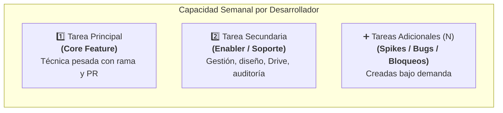

# Guía Oficial de Gobernanza de Sprints e Issues
## CargoMesh V2 — Amazon Developer Hackathon 2026

Este documento establece el marco operativo oficial para la planificación de Sprints, el ciclo de vida de estados en Linear, la redacción estructurada de Issues y el protocolo de delegación entre los integrantes del equipo.

---

# 🏃 1. El Sprint

## 1.1 Estructura General del Sprint (Modelo 1 + 1 + N)
Cada ciclo de Sprint tiene una duración semanal (7 días) y organiza la carga de trabajo de los 5 integrantes bajo el principio de **foco y predictibilidad**:



1. **Tarea Principal (Core):** 1 sola por integrante. Funcionalidad de alto impacto para el jurado. Requiere rama Git aislada, suites de pruebas locales y PR.
2. **Tarea Secundaria (Soporte / Enabler):** 1 sola por integrante. Tarea de soporte operativo que destraba a otros o genera evidencias del hackathon (debe terminarse en los primeros 2 días).
3. **Tareas Adicionales (`+ N`):** Tareas emergentes creadas durante el sprint para atender imprevistos, bloqueos o investigaciones técnicas.

---

## 1.2 Concepto de Estados en Linear (Con Rama vs. Sin Rama)

El comportamiento de los estados en Linear varía según la naturaleza técnica de la tarea:

```text
⚪ Backlog  ──➔  🟡 In Progress  ──➔  🟢 In Review (Preview)  ──➔  🟣 Done
  (Asignada)      (En desarrollo)        (EL DESARROLLADOR)        (SOLO TECH LEAD)
```

| Estado en Linear | Tareas Técnicas (Emplean Rama y PR) | Tareas de Soporte (No emplean Rama) |
|---|---|---|
| ⚪ **Backlog / Todo** | Tarea definida y lista para comenzar. | Tarea asignada y lista para gestión. |
| 🟡 **In Progress** | Desarrollador crea su rama `feat/...` y abre su **Draft PR** en GitHub. | Desarrollador inicia la gestión externa (Drive, Devpost, diseño). |
| 🟢 **In Review (Preview)** | **ESTADO FINAL DEL DESARROLLADOR.** El código está completo, la suite local pasa (`160 pgTAP`, `366 Node`, `0 TS`), el PR pasa a `Ready for review` y se llena el resumen en la issue. **El desarrollador SE DETIENE AQUÍ.** | **ESTADO FINAL DEL DESARROLLADOR.** La gestión está lista y se pega el link/evidencia como comentario en la issue. |
| 🟣 **Done** | **EXCLUSIVO DEL TECH LEAD EN EL GATE:** Pasan a `Done` únicamente el viernes durante la sesión del **Gate-1**, cuando el Tech Lead aprueba el PR y realiza el merge sincrónico a `codex/c-mcp-contracts`. | **EXCLUSIVO DEL TECH LEAD:** El Tech Lead verifica el link/acceso y él mismo mueve el ticket a `Done`. |

> 🛑 **REGLA SAGRADA:**  
> **Ningún desarrollador ni agente de IA puede mover una issue a `Done` por su cuenta.**  
> El límite de entrega del desarrollador es siempre **`In Review` (Preview)**. El Tech Lead es el único facultado para validar y cerrar en `Done`.

---

# 📋 2. La Issue

Toda issue en Linear debe redactarse siguiendo la estructura canónica de tres bloques definida en [`LINEAR_ISSUE_TEMPLATE.md`](file:///c:/Users/HP/Documents/cargomesh/docs/architecture-v2/LINEAR_ISSUE_TEMPLATE.md):

### Bloque A: Metadatos Básicos
- **Título:** Conforme a la regla de estructura verbal (ver sección 3).
- **Asignado a:** Nombre del desarrollador responsable (o delegado).
- **Proyecto & Hito:** `CargoMesh V2` | `Sprint X`.
- **Prioridad & Labels:** `Urgente / Alta / Media` | `Backend`, `Frontend`, `CI/QA`, `Alexa-MCP`, `Governance`.

### Bloque B: Contexto Operativo
1. **Objetivo:** Qué problema resuelve, para quién y qué comportamiento habilita en el sistema.
2. **Herramientas:** Stack exacto requerido (CLIs: `gh`, `supabase`; libs: `hono`, `zod`, `pgtap`; puertos locales: `127.0.0.1:54322`, `localhost:3000/mcp`).
3. **Flujo Sugerido:** Pasos recomendados de implementación (desacoplamiento en `*-policy.ts` puro para pruebas veloces).
4. **Entrega Final (Definition of Done - DoD):** Checklist taxativo de entregables exigidos.
5. **Checklist de Avance:** Casillas `[ ]` interactivas para marcar el progreso día a día.

### Bloque C: Gobernanza, Ramas y Cierre
6. **Principales Restricciones:**
   - 🛑 Cero merges o pushes a `main` (congelada).
   - 🔒 Merges a `codex/c-mcp-contracts` reservados al Tech Lead en sesión de Gate.
   - 🗄️ Cero datos sintéticos en `supabase/migrations/` (solo DDL y RLS).
   - 📦 Concurrencia optimista obligatoria (`draft_version + 1`).
7. **Ramas de Trabajo:** Rama asignada (`feat/...`) y PR target (`codex/c-mcp-contracts`).
8. **Coordinación y Dependencias:** Punto explícito: *"🤝 Coordinación requerida con: @PersonaX"*, bloqueantes y a quién desbloquea.
9. **Resumen de lo Elaborado (Para el Orquestador / Tech Lead):** Commits realizados, archivos modificados y métricas verdes obtenidas.
10. **Registro de Fallas (Friction Log):** Checkbox de registro dual en Google Drive (`02_Friction_Logs_Borradores/FL-XX.md`) y local (`docs/04-execution/friction-logs/FL-XX.md`).

---

# ✍️ 3. Regla de Estructura Verbal de una Issue

El título de una issue es su contrato de identidad. Debe redactarse obligatoriamente bajo esta fórmula sintáctica:

$$\mathbf{[PREFIJO/ROL]} + \mathbf{Verbo\ en\ Infinitivo} + \mathbf{Objeto\ Directo\ /\ Componente} + \mathbf{Resultado\ Esperado\ /\ Condici\acute{o}n}$$

### Verbos de Acción Recomendados por Tipo de Tarea:

| Categoría | Verbos Sugeridos | Ejemplo Correcto |
|---|---|---|
| **Backend / DB** | Implementar, Aplicar, Habilitar, Integrar, Desacoplar | `[BE-2] Implementar servicio de idempotencia y habilitar transición DRAFT a PENDING` |
| **Frontend / UI** | Estandarizar, Migrar, Maquetar, Conectar, Adaptar | `[FE-1] Migrar formulario stepper de fletes a endpoints Hono V2` |
| **CI / QA / Infra** | Asegurar, Configurar, Validar, Aislar, Auditar | `[BE-3] Asegurar suite CI Baseline con 160 aserciones pgTAP en verde` |
| **Soporte / Ops** | Crear, Solicitar, Documentar, Estructurar, Publicar | `[OPS] Crear estructura en Google Drive para evidencias de Kiro Crew` |
| **Spikes / Fixes** | Investigar, Corregir, Resolver, Refactorizar | `[SPIKE] Investigar resolución de paquetes en runner tsx sin server-only` |

### ❌ Lo que NO se debe hacer vs. ✅ Lo correcto:
- ❌ *Mal:* `Cosas de Alexa y mcp` (Vago, sin rol, sin verbo de acción).
- ✅ *Bien:* `[BE-1] Configurar Skill base en Alexa Console y verificar servidor /mcp local`.
- ❌ *Mal:* `Arreglar el botón` (Sin contexto ni alcance).
- ✅ *Bien:* `[FE-1] Estandarizar componentes base con Botón Dorado #d2a95f según guía`.

---

# 👥 4. Recomendaciones (Issues Adicionales) e Integrantes

## 4.1 Cuándo y Cómo Crear Issues Adicionales
Si durante el sprint un integrante detecta un problema que excede el alcance de su tarea principal:
1. **No mezclar código:** No meter refactors imprevistos dentro del PR de la tarea principal.
2. **Crear la issue emergente en Linear:**
   - Usar prefijo claro: `[SPIKE]` (investigación), `[BUG]` (error colateral), `[BLOCKER]` (traba a otro) o `[CHORE]` (ajuste menor).
   - Vincularla en Linear: Establecer relación `Blocked by` o `Blocking` con la tarea madre.
   - Definir su DoD específico.

---

## 4.2 Directorio Oficial de Integrantes y Especialidades para Delegación
En caso de que una tarea adicional deba ser delegada a otro miembro del equipo (porque terminó antes su carga o tiene la especialidad requerida), consultar esta matriz oficial:

| Integrante | Rol Oficial | Especialidad Técnica | GitHub User | Linear Mention | Rama Asignada Base |
|---|---|---|---|---|---|
| **Cristhian Chujutalli** | **BE-2 & Tech Lead** / Integrador de Ciclo | Lógica de Dominio, Concurrencia Optimista, Idempotencia, Merges de Gate-1 y Arbitraje de PRs | `@Chujutak2024` | `@Cristhian` | `feat/be2-*`<br>`feat/cycle-*-integration` |
| **Axel Arista** | **BE-1** / Alexa & Cloud Lead | Alexa Skills Kit (ASK), Endpoint `/mcp`, Model Context Protocol, JSON-RPC, AWS Console y Créditos | `@AxelArista` | `@Axel` | `feat/be1-*` |
| **Jean Paul** | **BE-3** / CI, QA & Automation Lead | Suites pgTAP (160 tests), GitHub Actions Workflows, Arnés Hono V2, Google Drive (HAC-18) y QA Baseline | *(Por vincular)* | `@JeanPaul` | `feat/be3-*` |
| **Luis** | **FE-1** / Enterprise Shipper Lead | Formularios Next.js, Stepper Intake, Tokens de Diseño (`#d2a95f`), Tailwind CSS y Consumo de Hono V2 | *(Por vincular)* | `@Luis` | `feat/fe1-*` |
| **Juan Antonio Coronado** | **FE-2** / Carrier Surface & Audit Lead | Judge Drawer, Pestaña MCP Inspector, Auditoría de 5 Tools de Carriers (`/providers/*`) y Reglas de Jurado | *(Por vincular)* | `@JuanAntonio` | `feat/fe2-*` |

### Reglas para Delegar una Tarea Adicional:
1. **Acuerdo de Capacidad:** Antes de asignar en Linear, confirmar que el compañero haya dejado su Tarea Principal en `In Review`.
2. **Aislamiento de Ramas:** El integrante delegado crea una rama propia para la tarea adicional (ej: `feat/fe2-hac-21-spike-...`) y abre su propio PR contra `codex/c-mcp-contracts`. **Nunca commitea directo en la rama de otro compañero.**
3. **Mismo Flujo de Cierre:** El delegado solo mueve la tarea a `In Review`. Cristhian (Tech Lead) es quien audita y cierra a `Done`.
