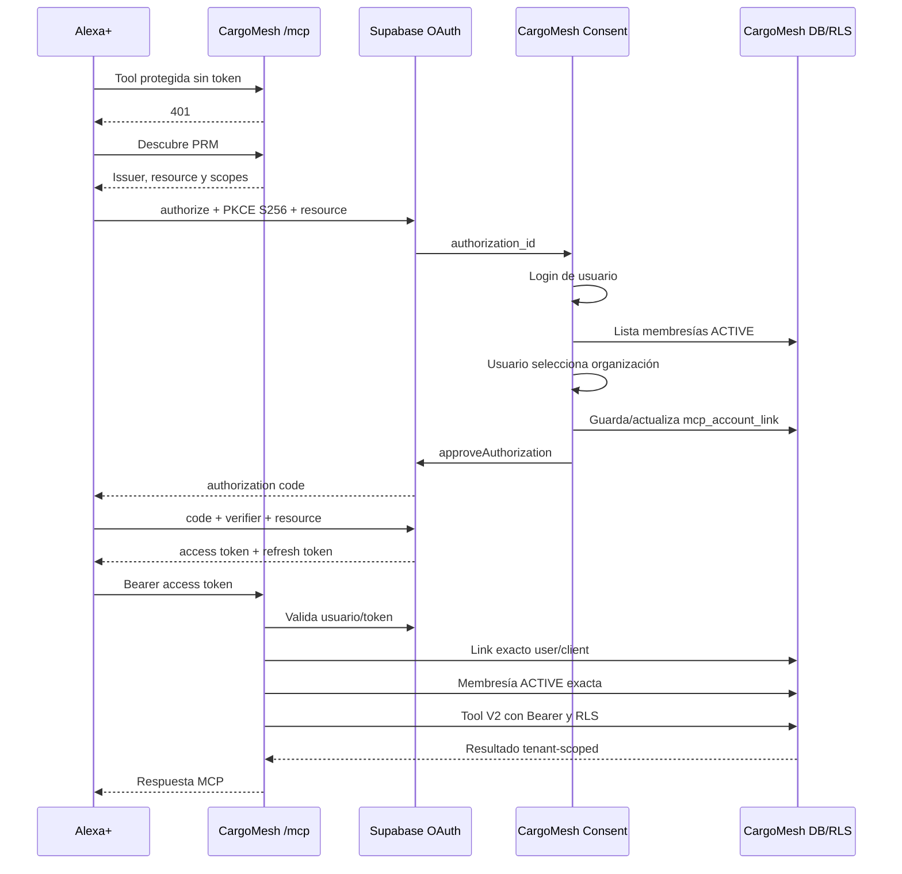

# Alexa+ Deployment and Account-Linking Readiness

**Fecha de revisión:** 2026-09-22

**Baseline analizada:** `feat/be1-v2-alexa-mcp-security` @ `2eae3c50b52e8922363b2dc6761e6c80233c5c94`

**Estado del plan:** `ALEXA_DEPLOYMENT_PLAN_READY`

**Estado de producto:** `ALEXA_LIVE_BLOCKED`

## 1. Resumen ejecutivo

CargoMesh ya tiene una base MCP remota compatible con el modelo de ejecución requerido por Alexa+: protocolo MCP `2025-11-25`, Streamable HTTP stateless, HTTPS configurable, autenticación Tier 1 de servicio, perfiles MCP V1/V2, identidad por solicitud y preservación de RLS.

La ruta más pequeña hacia Alexa+ live es mantener la aplicación Next.js y `/mcp` en Vercel, usar Supabase alojado como Authorization Server OAuth 2.1 y conservar la selección de organización en CargoMesh mediante `mcp_account_links`.

La integración live todavía está bloqueada por:

- persistencia `mcp_account_links` y contratos FreightRequest V2 de HAC-21;
- verificación alojada de `resource`, scopes, issuer, JWKS y refresh tokens de Supabase;
- registro real del cliente y redirect URIs de Alexa+;
- disponibilidad de al menos una tool comercial V2;
- UAT real desde Alexa+.

El worker Chrome WebMCP, Result Bridge y BALANCED_V1 permanecen como regresión V1. No forman parte del despliegue Alexa V2.

## 2. Auditoría de runtime y despliegue

`/mcp` se ejecuta como un Route Handler de Next.js:

- runtime Node.js;
- renderizado dinámico;
- SDK MCP `1.30.0`;
- `WebStandardStreamableHTTPServerTransport`;
- respuesta JSON;
- sin sesiones MCP persistentes;
- sin SSE standalone;
- servidor y transporte nuevos por solicitud;
- `AsyncLocalStorage` limitado a la vida de cada solicitud.

La implementación no depende de sticky sessions, disco local o estado durable en memoria. Es compatible conceptualmente con Vercel Functions. El proyecto declara Node `>=22`; Vercel ofrece Node 22 y 24. Si se requiere reproducibilidad estricta debe fijarse posteriormente `22.x`.

Fuentes:

- [Versiones Node.js soportadas por Vercel](https://vercel.com/docs/functions/runtimes/node-js/node-js-versions)
- [Duración de Vercel Functions](https://vercel.com/docs/functions/configuring-functions/duration)

### Rendimiento

Alexa+ exige actualmente una latencia round trip inferior a 500 ms. La evidencia local con compilación Next dev demuestra funcionalidad, pero no cumplimiento de latencia pública. Deben medirse cold start, warm start, p50 y p95 en preview y producción.

Fuente: [Alexa+ MCP QuickStart](https://www.developer.amazon.com/docs/alexaplus/add-ons/mcp-toolkit-quickstart.html)

### Procesos separados

El perfil V2 publica únicamente `get_cargomesh_capabilities` mientras HAC-21 entrega los contratos de negocio. No registra `find_freight_options` ni `get_freight_options`; por ello no necesita Chrome, Fargate ni el worker WebMCP V1.

## 3. Contrato público MCP

Forma canónica futura:

```text
https://<CARGOMESH_PUBLIC_HOST>/mcp
```

| Propiedad | Requisito |
|---|---|
| Transporte | HTTPS público |
| Método MCP | `POST` |
| Protocolo | MCP `2025-11-25` |
| Transporte MCP | Streamable HTTP |
| Modalidad | Stateless con respuesta JSON |
| Payload | Máximo 64 KiB |
| Autenticación | `Authorization: Bearer <token>` |
| Sin autenticación | HTTP 401, sin `WWW-Authenticate` para Alexa+ |
| Token en query string | Prohibido |
| Cache | `Cache-Control: no-store` |
| Host | Coincidencia exacta con el origen canónico |
| Origin | Ausente para server-to-server o incluido en la allowlist exacta |
| `Origin: null` / cross-site | Rechazado |
| GET/DELETE | 405 |
| Tiempo objetivo | Menos de 500 ms round trip |

Los logs pueden incluir request ID, método, estado, duración, versión de protocolo y tipo de principal. No deben incluir tokens, cookies, client secrets, JWT completos, cuerpos completos ni PII.

Amazon exige URL remota, Streamable HTTP, Bearer header, Protected Resource Metadata y OAuth Authorization Code con PKCE S256. También indica que Alexa+ no soporta actualmente `WWW-Authenticate` en respuestas 401.

Fuente: [Alexa+ MCP QuickStart](https://www.developer.amazon.com/docs/alexaplus/add-ons/mcp-toolkit-quickstart.html)

## 4. Superficie OAuth pública

### 4.1 Implementado

CargoMesh publica actualmente:

```text
GET  /.well-known/oauth-protected-resource
GET  /.well-known/oauth-authorization-server
POST /oauth/token
```

Esta superficie Tier 1 anuncia únicamente:

- `client_credentials`;
- `client_secret_basic`;
- scope `mcp:service`;
- recurso MCP canónico;
- token de servicio de 900 segundos;
- sin refresh token.

Sirve para smoke tests técnicos y principals de servicio. No satisface account linking de usuario Alexa+.

### 4.2 Parcial

Existe:

- validación de Bearer Supabase;
- `McpPrincipal.user`;
- validación de `client_id` o `azp`;
- cliente Supabase por solicitud;
- propagación de `auth.uid()` y RLS;
- contrato de account link;
- fallo cerrado mientras falta persistencia.

### 4.3 Superficie Supabase futura

La superficie de usuario esperada es:

```text
Authorization:
https://<SUPABASE_AUTH_HOST>/auth/v1/oauth/authorize

Token:
https://<SUPABASE_AUTH_HOST>/auth/v1/oauth/token

JWKS:
https://<SUPABASE_AUTH_HOST>/auth/v1/.well-known/jwks.json

Authorization-server metadata:
https://<SUPABASE_AUTH_HOST>/.well-known/oauth-authorization-server/auth/v1

Issuer:
https://<SUPABASE_AUTH_HOST>/auth/v1
```

Supabase OAuth Server soporta Authorization Code con PKCE, refresh tokens, clientes confidenciales mediante `client_secret_basic`, consent UI y JWKS. El servicio continúa documentado como beta y debe verificarse en el proyecto alojado real.

Fuentes:

- [Supabase OAuth Server](https://supabase.com/docs/guides/auth/oauth-server/getting-started)
- [Supabase OAuth flows](https://supabase.com/docs/guides/auth/oauth-server/oauth-flows)

### 4.4 Incompatibilidades que requieren spike alojado

1. Alexa envía obligatoriamente `resource` tanto en authorization como en code exchange. Supabase no documenta este parámetro entre sus parámetros OAuth soportados.
2. Supabase todavía no ofrece scopes OAuth personalizados generales. `mcp:tools` no debe anunciarse como scope nativo sin evidencia alojada.
3. Alexa+ no soporta actualmente OIDC para MCP add-ons. El flujo no debe depender de `openid` ni de un ID token.
4. Debe comprobarse que Alexa utiliza correctamente `client_secret_basic` a partir de la metadata Supabase.
5. Debe comprobarse que Alexa descubre correctamente un issuer con path `/auth/v1`.

La estrategia es probar primero Supabase directamente. Solo si `resource`, scopes o discovery son incompatibles se justifica un adaptador mínimo CargoMesh. No se debe construir un servidor paralelo de authorization codes y refresh tokens.

## 5. Checklist Supabase alojado

| Elemento | Verificación requerida |
|---|---|
| OAuth Server | Disponible y habilitable en el proyecto correcto |
| Versión Auth | Incluye OAuth Server, consent APIs y clientes confidenciales |
| Estado beta | Aceptado para el entorno del hackathon |
| Authorization path | `https://<CARGOMESH_PUBLIC_HOST>/oauth/consent` |
| Site URL | Host CargoMesh HTTPS correcto |
| Custom domain | Opcional; decidir antes de registrar Alexa |
| External URL | Endpoints y redirects anuncian el dominio definitivo |
| JWT issuer | Claim `iss` coincide con el issuer descubierto |
| JWKS | Endpoint accesible y contiene la clave activa |
| Firma | RS256 o ES256 |
| Access Token Hook | Instalado y probado |
| Audience | `aud=https://<CARGOMESH_PUBLIC_HOST>/mcp` |
| Client ID | Presente en access y refreshed tokens |
| Claims RLS | Preservar `sub`, `role`, `session_id`, `aal` y claims obligatorios |
| Scopes | Verificar el scope real aceptado por Supabase y Alexa |
| Resource | Probar authorize, exchange y refresh por separado |
| Refresh | Emisión, rotación y revocación |
| Redirect URIs | Registrar todas las URIs exactas proporcionadas por Alexa |
| Consent | Login, cliente, permisos, organizaciones y approve/deny |
| `auth.uid()` | Coincide con `sub` bajo PostgREST |
| RLS | Acceso propio permitido y cross-tenant denegado |
| Revocación OAuth | Invalida refresh/session según Supabase |
| Revocación CargoMesh | Link revocado se rechaza en cada solicitud |

Supabase recomienda firma asimétrica y expone JWKS para validación y rotación:

- [JWT Signing Keys](https://supabase.com/docs/guides/auth/signing-keys)
- [Custom Access Token Hook](https://supabase.com/docs/guides/auth/auth-hooks/custom-access-token-hook)
- [Token Security and RLS](https://supabase.com/docs/guides/auth/oauth-server/token-security)

El hook puede establecer audience y claims dependientes del cliente, pero debe preservar los claims obligatorios. La organización no debe depender exclusivamente del JWT: el account link y la membresía deben revalidarse para que una revocación sea efectiva inmediatamente.

Los custom domains de Supabase son opcionales, requieren un add-on de pago y cambian las URLs usadas por Auth. El host estándar del proyecto puede utilizarse si resulta aceptado por Alexa.

Fuente: [Supabase Custom Domains](https://supabase.com/docs/guides/platform/custom-domains)

## 6. Valores futuros para Alexa+

| Entrada | Valor futuro | Fuente |
|---|---|---|
| MCP endpoint | `https://<CARGOMESH_PUBLIC_HOST>/mcp` | Dominio final CargoMesh |
| PRM URL | `https://<CARGOMESH_PUBLIC_HOST>/.well-known/oauth-protected-resource` | CargoMesh |
| OAuth issuer | `https://<SUPABASE_AUTH_HOST>/auth/v1` o issuer del adaptador verificado | Metadata alojada |
| Authorization endpoint | `https://<SUPABASE_AUTH_HOST>/auth/v1/oauth/authorize` | Metadata Supabase |
| Token endpoint | `https://<SUPABASE_AUTH_HOST>/auth/v1/oauth/token` | Metadata Supabase |
| JWKS | `https://<SUPABASE_AUTH_HOST>/auth/v1/.well-known/jwks.json` | Supabase |
| Resource | Exactamente `https://<CARGOMESH_PUBLIC_HOST>/mcp` | PRM y manifest |
| Scope | Scope Supabase verificado; no anunciar aún `mcp:tools` como nativo | Spike alojado |
| Redirect URIs | Todas las entregadas por Alexa Developer Hub/CLI | Alexa |
| Client ID | Cliente OAuth Alexa registrado en Supabase | Supabase |
| Client secret | Secreto del cliente confidencial | Supabase |
| Client auth | Preferido `client_secret_basic`, sujeto a prueba real | Metadata Supabase |
| PKCE | `S256` | Obligatorio |
| Grants | `authorization_code`, `refresh_token` | Supabase/Alexa |

Amazon exige registrar todas sus redirect URIs, utilizar exactamente el valor recibido en cada solicitud, incluir `resource` en authorization y code exchange y emitir refresh tokens.

Fuente: [Account Linking for MCP Add-ons](https://www.developer.amazon.com/docs/alexaplus/add-ons/mcp-toolkit-account-linking.html)

## 7. Flujo futuro de account linking



Supabase entrega `getAuthorizationDetails`, `approveAuthorization` y `denyAuthorization`. CargoMesh construye la UI y selección organizacional; Supabase genera los códigos y tokens.

El paso bloqueado por HAC-21 es persistir y consultar:

```text
auth_user_id + oauth_client_id -> organization_id
```

También faltan tools create/submit V2 que permitan una demostración comercial Alexa.

## 8. Comparación de hosting

| Opción | Vercel + Supabase | AWS Amplify + Supabase | ECS/Fargate + Supabase |
|---|---|---|---|
| Compatibilidad actual | Alta | Alta para respuesta JSON | Alta |
| Next.js 15 | Nativo | Compatible | Requiere contenedor |
| `/mcp` stateless | Adecuado | Adecuado | Adecuado |
| OAuth routes | Adecuado | Adecuado | Adecuado |
| Streaming futuro | Soportado | Next streaming no soportado actualmente | Control completo |
| Secretos | Variables cifradas | Configuración/IAM | Secrets Manager/IAM |
| HTTPS/domain | Gestionado | Gestionado | ALB/CloudFront/ACM |
| Latencia | Medir región y cold start | Medir compute y cold start | Predecible con tareas activas |
| Observabilidad | Runtime logs y métricas | CloudWatch | CloudWatch/X-Ray/OTel |
| Operación | Baja | Media | Alta |
| Costo inicial | Bajo | Bajo/medio | Mayor y continuo |
| Ajustes del repo | Mínimos | Build/config AWS | Docker, ALB, autoscaling e IAM |

### Recomendación

Mantener el Next.js público en Vercel y Supabase alojado. La aplicación ya sigue esta forma y `/mcp` no necesita procesos persistentes.

Fuentes Vercel:

- [Environment variables](https://vercel.com/docs/environment-variables)
- [Runtime logs](https://vercel.com/docs/functions/logs)
- [Custom domains and project settings](https://vercel.com/docs/project-configuration/project-settings)

AWS Amplify es una alternativa válida si se exige hospedaje AWS: admite Next.js 15, Node 22, SSR y API routes. Actualmente no soporta Next.js streaming, pero CargoMesh utiliza respuesta JSON stateless.

Fuente: [AWS Amplify support for Next.js](https://docs.aws.amazon.com/amplify/latest/userguide/ssr-amplify-support.html)

ECS/Fargate solo se justifica posteriormente si aparecen conexiones largas, workers persistentes, networking privado o requisitos que Vercel/Amplify no satisfagan. No debe adoptarse únicamente por branding del hackathon.

## 9. Plan de smoke remoto

### 9.1 Transporte y service auth

1. Consultar PRM por HTTPS.
2. Consultar metadata Tier 1.
3. Obtener token `client_credentials`.
4. Ejecutar `initialize`.
5. Ejecutar `tools/list`.
6. Confirmar únicamente `get_cargomesh_capabilities` en V2.
7. Invocar la capability.
8. Enviar Bearer inválido y exigir 401 sin detalles.
9. Enviar `Origin` ajeno y exigir 403.
10. Verificar host y URL canónicos.
11. Confirmar `Cache-Control: no-store`.
12. Registrar cold/warm, p50/p95 y verificar el objetivo menor de 500 ms.

### 9.2 Usuario después de HAC-21

1. PRM anuncia el authorization server de usuario.
2. Metadata anuncia `authorization_code`, `refresh_token` y S256.
3. Alexa inicia authorize con resource, state y challenge.
4. Login real.
5. Consent real.
6. Selección explícita de organización.
7. Link ACTIVE persistido.
8. Exchange con verifier y resource.
9. Refresh sin resource, como espera Alexa.
10. `/mcp` acepta el Bearer.
11. Principal contiene usuario, cliente y organización correctos.
12. `tools/list` devuelve la superficie V2.
13. Una tool V2 válida opera bajo RLS.
14. Otro tenant es rechazado.
15. Link revocado es rechazado.
16. Grant/refresh revocado exige relink.

## 10. Gate Alexa live

No se debe cambiar a `ALEXA_LIVE_VERIFIED` hasta reunir evidencia de:

- endpoint HTTPS público y estable;
- PRM descubierto por Alexa;
- metadata S256 aceptada por `alexa-ai`;
- add-on real desplegado en stage development;
- account linking iniciado desde Alexa;
- login CargoMesh real;
- consentimiento real;
- organización elegida explícitamente;
- `mcp_account_links` persistente y ACTIVE;
- authorization code intercambiado con PKCE;
- access y refresh tokens reales;
- invocación MCP originada por Alexa;
- `McpPrincipal.user` con cliente y organización correctos;
- `tools/list` real;
- al menos una tool comercial V2 válida;
- RLS y aislamiento cross-tenant;
- refresh y revocación;
- cumplimiento de latencia;
- privacy policy y terms públicos mediante HTTPS;
- capturas y logs sanitizados con fecha, entorno, request IDs y resultado;
- ausencia de tokens, secretos, cookies y PII en la evidencia.

`get_cargomesh_capabilities` por sí sola no demuestra una integración comercial Alexa V2.

## 11. Variables y configuración

### MCP

```text
CARGOMESH_MCP_MODE=remote
CARGOMESH_MCP_REMOTE_ENABLED=true
CARGOMESH_MCP_CANONICAL_ORIGIN
CARGOMESH_MCP_ALLOWED_ORIGINS
CARGOMESH_MCP_CANONICAL_RESOURCE
CARGOMESH_MCP_PROFILE=V2
```

### OAuth Tier 1 de servicio

```text
CARGOMESH_OAUTH_ISSUER
CARGOMESH_MCP_SERVICE_CLIENT_ID
CARGOMESH_MCP_SERVICE_CLIENT_SECRET
CARGOMESH_MCP_JWT_SIGNING_SECRET
CARGOMESH_MCP_TOKEN_TTL_SECONDS
```

### OAuth de usuario

```text
CARGOMESH_MCP_USER_BEARER_ENABLED
CARGOMESH_MCP_USER_OAUTH_CLIENT_ID
```

Después del spike alojado puede ser necesaria una variable separada para el issuer Supabase de usuario. No debe reutilizarse automáticamente el issuer Tier 1, que actualmente está acoplado al origen CargoMesh.

### Supabase

```text
NEXT_PUBLIC_SUPABASE_URL
NEXT_PUBLIC_SUPABASE_ANON_KEY
SUPABASE_SERVICE_ROLE_KEY
```

`SUPABASE_SERVICE_ROLE_KEY` permanece server-only para servicios internos existentes. No representa ni autoriza al usuario Alexa.

Configuración alojada adicional:

- OAuth Server enabled;
- authorization path;
- Site URL;
- OAuth client y redirects;
- signing key asimétrica;
- Custom Access Token Hook;
- token lifetime y refresh behavior;
- custom domain opcional.

### Alexa

```text
ALEXA_CLIENT_SECRET
```

Client ID, Add-on ID, stage, redirect URIs y endpoint MCP deben provenir del Developer Hub/CLI. El secreto debe ingresarse mediante prompt enmascarado o variable segura, nunca como argumento visible.

### Bedrock opcional

```text
CARGOMESH_BEDROCK_NARRATION_ENABLED=false
CARGOMESH_BEDROCK_REGION
CARGOMESH_BEDROCK_MODEL_ID
```

Bedrock no es requisito para Alexa live y permanece deshabilitado mientras continúe `BEDROCK_BLOCKED`.

## 12. Dependencia de HAC-21

HAC-21 bloquea directamente:

- tabla y RLS de `mcp_account_links`;
- escritura idempotente del vínculo;
- revocación persistente;
- selección organizacional durable;
- FreightRequest V2 canónico;
- create/submit V2;
- una invocación comercial V2 demostrable desde Alexa.

HAC-21 no bloquea:

- preview remoto;
- smoke del transporte;
- medición de latencia;
- verificación de metadata;
- spike Supabase `resource`;
- registro preliminar del cliente OAuth en desarrollo;
- construcción de la consent UI sin persistir todavía la selección.

## 13. Orden mínimo de implementación

### Puede realizarse ahora

1. Preparar preview Vercel con dominio estable de desarrollo.
2. Configurar únicamente variables de preview.
3. Ejecutar smoke Tier 1 remoto.
4. Medir latencias cold/warm, p50 y p95.
5. Comprobar versión y disponibilidad de Supabase OAuth Server.
6. Ejecutar spike de `resource` en authorize, exchange y refresh.
7. Confirmar qué scope no OIDC acepta Alexa con Supabase.
8. Verificar `client_secret_basic` con Alexa CLI.
9. Decidir Supabase directo o adaptador mínimo usando evidencia.

### Esperando HAC-21

1. Conectar el repositorio real `mcp_account_links`.
2. Implementar selección y revocación de organización.
3. Activar user Bearer en preview.
4. Registrar create/submit V2.
5. Ejecutar aislamiento tenant completo.

### Configuración alojada

1. Habilitar OAuth Server.
2. Elegir issuer final.
3. Configurar Site URL y consent path.
4. Registrar cliente Alexa confidencial.
5. Registrar todas las redirect URIs.
6. Activar firma asimétrica y JWKS.
7. Instalar el hook de audiencia preservando RLS.
8. Cargar secretos en el entorno correspondiente.
9. Ejecutar code, refresh y revocation smoke.

### Acceso externo Alexa

1. Crear el add-on de desarrollo.
2. Configurar account linking.
3. Revisar el discovery producido por CLI.
4. Registrar redirects revelados por Alexa.
5. Desplegar al stage development.
6. Probar en Alexa/Web Simulator.
7. Capturar evidencia sanitizada.
8. Cambiar de estado solamente al cumplir todo el gate.

## 14. Topología recomendada

```text
Alexa+
  -> CargoMesh Next.js en Vercel
      -> /mcp stateless
      -> servicios V2
      -> Supabase alojado + RLS

Account linking
  -> Supabase OAuth 2.1
      -> CargoMesh consent/organization UI
      -> mcp_account_links
```

El único motivo válido para agregar un adaptador OAuth CargoMesh es demostrar que Supabase no acepta la combinación Alexa de `resource`, scopes o discovery. No existe una razón técnica actual para mover `/mcp` a Fargate.

## 15. Conclusión

El plan de despliegue, los gates, los riesgos y las decisiones pendientes están definidos. La integración live continúa bloqueada por HAC-21 y por verificaciones alojadas deliberadamente no ejecutadas durante este análisis.

**ALEXA_DEPLOYMENT_PLAN_READY**
