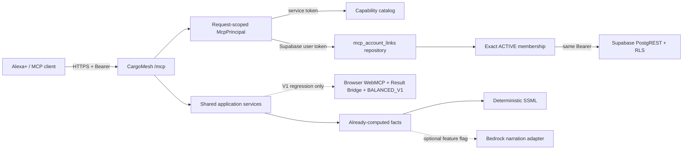

# Sprint 1 — Seguridad MCP para Alexa+ y decisión Bedrock

## 1. Alcance y estado

HAC-22 protege el límite MCP remoto, separa capacidades V1/V2, conserva identidad organizacional y entrega narración determinística. No implementa discovery, serviceability, TransportPlan, Opportunity, ScoringPolicy ni booking V2.

Estado del corte:

- transporte MCP: `REMOTE_MCP_READY` (código y prueba local controlada);
- service auth: `SERVICE_AUTH_READY`;
- user auth: `USER_AUTH_PARTIAL`;
- Alexa+: `ALEXA_LIVE_BLOCKED`;
- Bedrock: `BEDROCK_BLOCKED`;
- fallback SSML: `LOCAL`, probado.
- clasificación al abrir PR #85: `HAC22_PARTIAL_BLOCKED_BY_HAC21` (etiqueta histórica corregida en la rama de Gate-1; no describe la dependencia actual).

**Nota de Gate-1 (25 sep):** PR #83 de HAC-21 y PR #85 de HAC-22 ya están en `codex/v2-amazon-contracts`. HAC-21 entregó esquema ROAD, no `mcp_account_links` ni servicios de creación/envío V2. La rama de Gate-1 sustituye `BLOCKED_BY_HAC21` por bloqueos de capacidad y conserva las tools cerradas; [PR #86](https://github.com/Chujutak2024/cargomesh/pull/86) continúa cerrado sin merge por un bloqueo de permisos para reabrirlo. Hasta integrarlo, el código de la base aún muestra la etiqueta histórica; una tabla ROAD no desbloquea OAuth de usuario.

## 2. Límite de confianza

## 3. Perfiles y capacidades MCP

`V1_REGRESSION` conserva `create_freight_request`, `submit_freight_request`, `find_freight_options` y `get_freight_options`. Sus descripciones declaran las restricciones V1 y las dependencias WebMCP/BALANCED.

`V2` expone solamente `get_cargomesh_capabilities`. Los contratos V2 de create/submit permanecen `BLOCKED` por ausencia de `V2_FREIGHT_REQUEST_SERVICE`; el reporte también señala `MCP_ACCOUNT_LINK_PERSISTENCE`. En la base PR #85 aún se observa el identificador histórico `HAC-21` hasta mergear Gate-1. Find/get V1 no aparecen en el perfil V2.

## 4. Transporte Streamable HTTP

- SDK MCP `1.30.0`;
- protocolo verificado `2025-11-25`;
- Streamable HTTP stateless con respuesta JSON;
- modo local loopback y same-origin;
- modo remoto opt-in, HTTPS canónico y allowlist exacta;
- sin sesión MCP persistente ni SSE standalone;
- límite de payload MCP: 64 KiB;
- endpoint de token: 8 KiB.

## 5. Autenticación de servicio

`POST /oauth/token` admite únicamente `client_credentials`, `client_secret_basic`, `scope=mcp:service` y el recurso MCP canónico. El JWT tiene `iss`, `sub`, `aud`, `scope`, `iat`, `exp`, `jti`, TTL por defecto 900 segundos y no emite refresh token. El client secret y el signing secret son distintos.

## 6. Autenticación de usuario

El seam de usuario valida el access token con Supabase, exige `client_id`/`azp` igual al cliente configurado, resuelve el vínculo exacto `(auth_user_id, oauth_client_id)`, exige scope autorizado `mcp:tools` y membresía ACTIVE en la organización vinculada. El access token se conserva solo dentro de `AsyncLocalStorage` durante el request y crea un cliente Supabase no global con `Authorization: Bearer`.

La implementación persistente de `mcp_account_links` no existe en la base V2. El repositorio productivo falla cerrado; Gate-1 aporta un mensaje genérico que no culpa a HAC-21. No se elige la primera membresía.

El comportamiento de custom domain/issuer de Supabase permanece `NEEDS_HOSTED_VERIFICATION`.

## 7. Matriz de autorización

| Principal | initialize | initialized | tools/list | Capability status | Business tools |
|---|---:|---:|---:|---:|---:|
| Anónimo | DENY | DENY | DENY | DENY | DENY |
| Service `mcp:service` | ALLOW | ALLOW | ALLOW | ALLOW | DENY |
| User cookie | ALLOW | ALLOW | ALLOW | ALLOW | Solo perfil V1 y controles de rol/RLS |
| User Supabase OAuth | ALLOW cuando link exista | ALLOW | ALLOW | ALLOW | Solo perfil explícito y contrato implementado |

Autenticación nunca sustituye autorización comercial.

## 8. Aislamiento organizacional

- organización derivada del vínculo, nunca del argumento de una tool;
- vínculo ACTIVE y membresía ACTIVE comprobados por request;
- cliente Supabase request-scoped con identidad real del usuario;
- RLS conserva `auth.uid()`;
- Bearer inválido no cae a cookies;
- service principal no usa `service_role` para negocio.

## 9. Prueba negativa cross-tenant

Evidencia de aplicación: los tests del resolver rechazan vínculo ausente/revocado, cliente incorrecto, scope ausente, membresía inactiva y una membresía de organización B cuando el vínculo fija organización A.

Evidencia RLS local: `test:mcp:local` usa un access token Supabase real de un segundo tenant; PostgREST no puede leer ni modificar el FreightRequest del primer tenant. Los tools find/get/submit tampoco pueden operar sobre ese recurso.

## 10. Límite V1 WebMCP

El worker autónomo, provider pages, `document.modelContext`, Result Bridge y BALANCED_V1 permanecen como regresión/demo V1. No son eliminados y no se anuncian como discovery V2. No se implementa worker remoto ni Fargate.

## 11. Estado del contrato V2

El perfil V2 es seguro y verificable, pero los business tools canónicos siguen bloqueados porque faltan servicios FreightRequest V2 y account linking persistente fuera del alcance cerrado de HAC-21. `get_cargomesh_capabilities` devuelve profile, source, status y dependencias legacy sin leer datos de tenant; Gate-1 corrige la etiqueta de capacidad sin activarla, pendiente de merge a la base.

## 12. Matriz Alexa+

| Nivel | Estado | Evidencia |
|---|---|---|
| Local | READY | Cliente MCP oficial contra endpoint Next real |
| Controlled remote | NOT_RUN | No hay preview HTTPS autorizado en HAC-22 |
| Simulated | NOT_CLAIMED | No se presenta simulación como Alexa |
| Live | BLOCKED | No existe invocación real Alexa+ |

Bloqueos externos: acceso partner/developer, endpoint HTTPS hospedado, cliente Alexa registrado, issuer/domain productivo, redirect URI, account linking persistente y UAT.

## 13. Bedrock

`BEDROCK_BLOCKED`. El 22 de septiembre de 2026 AWS STS confirmó una identidad válida, pero `bedrock:ListFoundationModels` en `us-east-1` devolvió `AccessDeniedException`: ninguna identity-based policy autoriza esa acción. No se intentaron más llamadas y no se presenta un mock como integración.

El adapter usa el SDK oficial, está detrás de `CARGOMESH_BEDROCK_NARRATION_ENABLED` y solo recibe hechos ya calculados. Si falla configuración o invocación, devuelve fallback determinístico con estado `BLOCKED`.

## 14. Fallback determinístico

El fallback produce texto y SSML escapado desde resultado, explicación, fuente/estado, restricciones y campos pendientes. No acepta entradas para calcular elegibilidad, score, precio, selección o autorización de booking.

## 15. Modelo de amenazas

| Amenaza | Control |
|---|---|
| Host/origin spoofing | Origen HTTPS canónico, Host exacto y allowlist |
| Bearer inválido con cookie válida | Sin fallback a cookies |
| Service token ejecuta negocio | `requireMcpUser` antes del servicio |
| Selección arbitraria de organización | Link user/client exacto; org fuera de argumentos |
| Cross-tenant | Membresía exacta + access token real + RLS |
| Confusión V1/V2 | Perfil/catálogo explícito y V2 sin find/get legacy |
| Exfiltración por errores | Mensajes sanitizados y `Cache-Control: no-store` |
| Payload DoS | Límites 64 KiB y 8 KiB |
| Bedrock altera decisión | Input de hechos cerrado; adapter solo narra |
| XML/SSML injection | Escape XML determinístico |

## 16. Límites de payload y request

Solo `POST` opera MCP; GET/DELETE responden 405. El transporte falla cerrado cuando falta configuración, rechaza orígenes cruzados y no conserva sesiones entre requests.

## 17. Secretos y configuración

Secretos de service auth, Supabase y AWS son server-only. `.env.example` contiene placeholders. Nunca registrar access tokens, client secrets, JWT signing keys o credenciales AWS.

## 18. Comandos y resultados

- `pnpm test:mcp`: 74/74 PASS tras corregir la mutación JWT por byte.
- `pnpm test:narration`: 4/4 PASS.
- `pnpm test:release`: 367/367 PASS.
- `pnpm test:mcp:local`: 2/2 PASS con Supabase local y Chrome WebMCP.
- `pnpm typecheck`: PASS.
- `pnpm build`: PASS.
- `pnpm evidence:mcp-client` sobre el corte original de PR #85: `LOCAL_CONTROLLED_MCP_CLIENT`, protocolo `2025-11-25`, catálogo V2 `PARTIAL` con etiqueta histórica `HAC-21`, Bearer inválido `401`, token `900s`; latencias observadas 1406.88 ms para token y 1800.51 ms para initialize/list/capability/negative check durante compilación dev bajo demanda. No se presenta como una ejecución nueva tras Gate-1.

Los resultados finales de release/build se registran al cerrar la rama.

## 19. Bloqueos conocidos

- `mcp_account_links` persistente y GET/POST V2 corresponden a HAC-11; el servicio ROAD compartido corresponde a HAC-12. La etiqueta de código se corrigió en la rama Gate-1 para expresar capacidades pendientes, sin habilitar herramientas; HAC-21 no abarcó esos entregables.
- `NEEDS_HOSTED_VERIFICATION`: issuer/custom domain, OAuth client y user Bearer en Supabase hosted.
- `ALEXA_LIVE_BLOCKED`: accesos y UAT externos ausentes.
- `BEDROCK_BLOCKED`: IAM sin permiso Bedrock.

## 20. Recomendación Sprint 2

Consumir el contrato ROAD ya mergeado de HAC-21 sin atribuirle `mcp_account_links`; HAC-11 tiene el contrato/repositorio de account links y GET/POST V2, y HAC-12 el servicio ROAD compartido. Mantener las tools comerciales cerradas hasta implementación, pruebas y autorización por organización. Verificar issuer/client en Supabase hosted. Reconsiderar Bedrock únicamente si hay permisos/cuota y su narración aporta valor medible.

## 21. Referencias de evidencia

- Código: `cargomesh/src/server/mcp/`, `cargomesh/src/server/narration/`.
- Cliente controlado: `cargomesh/scripts/mcp-external-client-evidence.mjs`.
- Contratos: `docs/v2-amazon/ALEXA_MCP_AWS.md`, `ARCHITECTURE.md`, `V1_BOUNDARY_AND_MIGRATION.md`.
- Evidencia V1 preservada: `docs/04-execution/REL02_Public_WebMCP_UAT_Evidence.md`.
