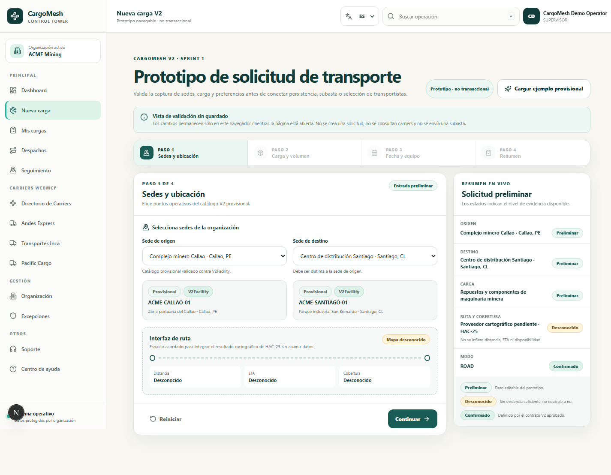
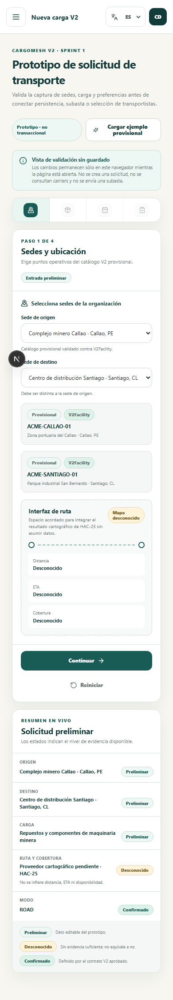

# CargoMesh V2 · Sprint 1 UI prototype (HAC-24)

Status: implementation complete on `feat/fe1-v2-design-system-prototype`; [PR #88](https://github.com/Chujutak2024/cargomesh/pull/88) is open for review against `codex/v2-amazon-contracts`. Team feedback received on 2026-09-23 is addressed below; merge and issue closure remain Gate-1 decisions.

Date: 2026-09-22 · review update: 2026-09-23

Owner: Luis (FE-1)

Entry route: `Dashboard → /freight-request/new`

## 1. Scope and product boundary

This deliverable validates the V2 intake information architecture and interaction model. It is deliberately **non-transactional**:

- it does not create or update a freight request;
- it does not submit an auction, discover carriers, rank offers, or invoke WebMCP;
- it keeps prototype state only in React memory while the page is open;
- it consumes the `V2Facility` contract from HAC-21, while the displayed facility records remain clearly marked as provisional fixtures;
- it does not infer route coverage, distance, ETA, equipment availability, price, or offers.

The V1 intake implementation remains in the repository as regression material, but `/freight-request/new` now renders the V2 prototype. No global V1 refactor is part of HAC-24.

## 2. Visual audit and reuse/replace matrix

The audit compared the operational shell, Dashboard, provider directory, the former freight intake, and their page-local CSS modules. The useful V1 identity is the light canvas, white cards, deep green headings/actions, mint highlights, compact labels, and restrained gold accent. The main defect was not the identity itself, but duplicated rules and divergent dark/light implementations.

| Area | Before / evidence | Decision | After / example |
| --- | --- | --- | --- |
| Primary buttons | Dashboard, provider cards, intake and error states each declared their own green action styles; the canceled HAC-19 branch also used a dark/gold definition | **Replace duplicated rules; reuse visual intent** | Shared `Button` with `primary`, `accent`, `secondary`, and `ghost` variants. Primary uses the existing operational green; gold is retained as a bounded accent for the final prototype validation action, not as a global primary. |
| Inputs | Freight intake used page-specific dark controls while the rest of the app is a light operational surface | **Replace** | Shared labeled `Input` and `Select`: 44 px target height, light surface, visible hover/focus, hint/error association, and `aria-invalid`. |
| Badges/status | Status pills were implemented independently and often used color without a shared semantic vocabulary | **Replace** | Shared `Badge` tones: `preliminary`, `unknown`, `confirmed`, and `neutral`; every pill contains an explicit text label. |
| Modals | Existing flows use one-off overlays and action styles | **Replace for target flow** | Shared native `Dialog` using `<dialog>`, native focus containment, Escape handling, backdrop, close control, and explicit `aria-labelledby` / `aria-describedby` relationships. |
| Colors | `globals.css` exposes a V1 dark root palette while target operational pages redefine a separate light palette locally | **Keep both boundaries; add isolated V2 tokens** | New `--cm-*` tokens centralize only the V2 target surface and do not silently recolor the whole application. |
| Typography | Existing app uses compact sans-serif labels, uppercase eyebrows, and dark green headings | **Reuse** | Prototype preserves those patterns and standardizes hierarchy through the target page module. |
| Spacing/radius | Cards and controls varied between modules | **Replace duplicate values** | `--cm-control-height`, `--cm-radius-*`, and `--cm-shadow-card` provide the target baseline. |
| Errors | Some existing errors were visual-only or implemented with inline styles | **Replace for target flow** | Field-level messages are associated through `aria-describedby`; step errors also produce a focusable `role="alert"` summary. |
| Loading | Loading rules were scattered and spinners could differ | **Replace for target components** | `Button isLoading` disables the control, exposes `aria-busy`, and uses the repository-standard Lucide `Loader2`; reduced-motion is respected. |
| Empty/unknown | Missing data could be presented as a false negative or substituted demo value | **Replace semantics** | `unknown` is an explicit status, with copy stating that it is not equivalent to “no”. Route, ETA, distance, coverage and availability remain unknown. |

### Token catalog

Tokens are declared in `cargomesh/src/app/globals.css` with the `--cm-` prefix so the prototype can coexist with preserved V1 surfaces.

| Token group | Purpose |
| --- | --- |
| `--cm-color-canvas`, `surface`, `surface-subtle` | Operational page and card hierarchy |
| `--cm-color-ink`, `heading`, `muted`, `line` | Text and structural contrast |
| `--cm-color-primary`, `primary-hover`, `focus` | Actions and keyboard focus |
| `--cm-color-accent` | Bounded gold accent retained from the existing identity |
| `--cm-color-positive-surface` | Confirmed state |
| `--cm-color-warning-*` | Unknown state |
| `--cm-color-danger-*` | Validation and error state |
| `--cm-radius-*`, `--cm-shadow-card`, `--cm-control-height` | Geometry and density |

## 3. Shared component contract

Target components live in `cargomesh/src/components/ui/` and extend native HTML attributes rather than hiding them.

- `Button`: typed native button props, four variants, loading/disabled state, focus-visible ring and reduced-motion behavior.
- `Input`: native input props, required label, optional hint/error, stable generated id, `aria-invalid`, and `aria-describedby`.
- `Select`: the same accessible field contract while preserving native keyboard behavior.
- `Badge`: semantic status tone plus visible text; status is never represented by color alone.
- `Dialog`: native dialog semantics, Escape/close behavior, title and description linked through `aria-labelledby` and `aria-describedby`, and reusable actions.

The prototype uses these components for all form controls and workflow actions. Specialized step navigation and route-placeholder visuals remain local because they are composed patterns, not atomic controls.

## 4. Navigable V2 flow

```text
Dashboard
  └─ Nueva carga / New shipment
      ├─ 1. Sedes y ubicación
      │    ├─ origin facility
      │    ├─ destination facility
      │    └─ map interface placeholder (HAC-25 pending)
      ├─ 2. Carga y volumen
      │    ├─ cargo taxonomy
      │    ├─ packaging
      │    ├─ description
      │    └─ weight + CBM
      ├─ 3. Fecha y equipo
      │    ├─ pickup date
      │    ├─ equipment preference
      │    └─ optional notes
      └─ 4. Resumen
           ├─ preliminary user inputs
           ├─ confirmed V2 contract facts
           ├─ unknown operational/map facts
           └─ validation dialog (no submit)
```

The stepper supports keyboard focus, previous/next navigation, validation before advancing, direct return to already visited steps, a reset action, and a one-click provisional example. Entering the summary and activating the final confirmation both revalidate the complete draft; if a previously valid field was cleared, the flow returns to the first invalid step and focuses its error summary. The final action is intentionally named **Validate prototype**, not Submit.

## 5. Evidence semantics

| Status | Meaning | Examples in this prototype |
| --- | --- | --- |
| `preliminary` | User-editable or synthetic input that has not been persisted or operationally verified | facility choice, cargo details, weight, CBM, date, equipment preference |
| `unknown` | There is not enough evidence; it must not be converted into false, unavailable, zero, or an invented estimate | route, coverage, distance, ETA, carrier/equipment availability, price, offers |
| `confirmed` | An approved contract or product constraint defines the value | `V2Facility` shape from HAC-21; transport mode `ROAD` |

The fixture facilities are parsed with `v2FacilitySchema` at module initialization and covered by an automated contract test. This validates their **shape**, not their operational existence.

## 6. Responsive and accessibility review

Desktop behavior:

- four-column step navigation;
- form plus sticky live-summary rail;
- two-column data entry where the content benefits from comparison.

Mobile behavior (320 px minimum):

- step navigation collapses to icon/number targets;
- form, unknown-state metrics, review data, and summary become one column;
- action buttons become full width;
- the summary returns to document flow and no horizontal overflow is required.

Accessibility behavior:

- all inputs and selects have programmatic labels;
- hints/errors are linked to controls;
- invalid steps announce a `role="alert"` and move focus to the summary;
- focus is visible on controls, buttons, step navigation and dialog close;
- disabled future steps cannot be activated;
- the final modal uses the browser-native dialog focus model and Escape behavior, with its title and description explicitly referenced by the dialog;
- status is communicated by text in addition to color;
- animation is disabled under `prefers-reduced-motion: reduce`.

## 7. HAC-25 / Google Stitch decision log

As of 2026-09-22, HAC-25 remains pending and its Linear issue contains no Stitch link, screenshots, attachment, or written handoff. HAC-24 therefore did not wait for generated code and did not attribute any implementation to Juan. The integration boundary is present and clearly unknown.

| Proposed/expected input from HAC-25 | Status | HAC-24 decision | Reason |
| --- | --- | --- | --- |
| Google Stitch screen/link | Not delivered | **Pending review** | No stable artifact was available to evaluate. |
| Map provider pilot | Not delivered | **Adjusted into an interface placeholder** | The intake needs the layout and evidence semantics now, but must not claim a provider or live route. |
| Distance/ETA/coverage presentation | Not delivered | **Explicitly unknown** | HAC-21 defines evidence-aware coverage; invented values would violate the V2 contract. |
| Generated UI/code | Not delivered | **Not adopted** | Generated code is never incorporated without repository review, accessibility checks, and tests. |

When the handoff exists, Luis must append its stable link and record each proposal as adopted, adjusted, or discarded with rationale. Visual corrections remain FE-1 responsibility.

## 8. Verification evidence

Executed from `cargomesh/` on 2026-09-22:

| Check | Result |
| --- | --- |
| `pnpm install --frozen-lockfile` | Pass; synchronized already-declared `jose` and AWS SDK packages locally, no manifest or lockfile change |
| `pnpm typecheck` | Pass; 0 TypeScript errors |
| `pnpm exec tsx --test src/features/v2-intake/prototype-model.test.ts` | Pass; 7/7 tests, including revalidation after clearing a previously valid field |
| `pnpm check:architecture` | Pass; 222 modules and 25 client entry points checked |
| `pnpm test:release` | Pass; 367/367 regression tests across 17 existing suites |
| `pnpm build` | Pass; production build completed and `/freight-request/new` compiled as a dynamic route |
| Desktop visual QA | Pass; Dashboard entry, empty state, validation errors, provisional example, four-step navigation, summary and final dialog inspected in Chrome |
| Mobile visual QA | Pass at 390 × 844; one-column layout, compact stepper, readable actions and `scrollWidth` ≤ `clientWidth` (no horizontal overflow) |
| Keyboard/accessibility QA | Pass; validation summary receives focus, future steps stay disabled, final dialog focuses its close control and closes with Escape |
| Bilingual QA | Pass; the full target route changes between Spanish and English and was restored to Spanish after verification |
| Browser console | Pass; 0 warnings and 0 errors during the complete flow |

Automated prototype tests cover HAC-21 facility-schema compatibility, origin/destination uniqueness, required cargo fields, positive weight/volume, full-scenario navigation readiness, review revalidation after an earlier step is edited, and protection of unknown facts.

### Screenshots linked to PR #88

Desktop · 1440 px viewport:



Mobile · 390 × 844 viewport (full-page capture):



### Team feedback resolved on 2026-09-23

| Review request | Resolution | Evidence |
| --- | --- | --- |
| Revalidate after returning from summary, clearing a field, and jumping back to review | Entering step 4 and confirming now execute a complete-draft validation. The user is redirected to the first invalid step and the error summary receives focus. | `validatePrototypeReview`, UI handlers, and the seventh model test reproduce the reported sequence. |
| Connect the dialog's accessible name and description | `Dialog` now assigns stable React IDs and exposes `aria-labelledby` and `aria-describedby`. | `cargomesh/src/components/ui/dialog.tsx`; `pnpm typecheck` passes. |
| Link desktop/mobile evidence, team feedback, and current PR state | The two reviewed captures are versioned above, this table records the feedback, and the document now links PR #88 instead of claiming that the PR is pending. | This guide and PR #88. |

### Vercel preview boundary

The failed Vercel deployment is not treated as a passing gate. The repository's existing [FL-01](../04-execution/friction-logs/FL-01.md) records the cause: production still builds `main` from `frontend/`, while the V2 base and this branch contain the Next.js application under `cargomesh/`. Local `pnpm build` passes from the correct directory. HAC-24 does not change Vercel `rootDirectory`, `productionBranch`, aliases, or production; the integrator owns the separate preview strategy.

## 9. Files and ownership

Main implementation:

- `cargomesh/src/features/v2-intake/v2-intake-prototype.tsx`
- `cargomesh/src/features/v2-intake/v2-intake-prototype.module.css`
- `cargomesh/src/features/v2-intake/prototype-model.ts`
- `cargomesh/src/features/v2-intake/prototype-model.test.ts`
- `cargomesh/src/components/ui/`
- `cargomesh/src/app/(cargomesh)/freight-request/new/page.tsx`

Integration points:

- Dashboard action: `cargomesh/src/app/(cargomesh)/dashboard/page.tsx`
- Shell navigation/context: `cargomesh/src/components/app-shell.tsx`
- V2 tokens: `cargomesh/src/app/globals.css`

## 10. Pending decisions outside this implementation

- Review the eventual HAC-25 Stitch/map handoff and append the adopt/adjust/discard decision.
- Confirm which provisional facility catalog will be replaced by persisted HAC-21 data in a later sprint.
- Define the Sprint 2/3 API/persistence boundary before enabling submit.
- Tech Lead revalidates PR #88 and decides Gate-1 integration; only the Tech Lead may move HAC-24 to `Done`.

No Vercel `rootDirectory`, production setting, deployment, or merge was changed by this delivery. PR #88 remains open and HAC-24 remains `In Review` pending Gate-1 acceptance.
