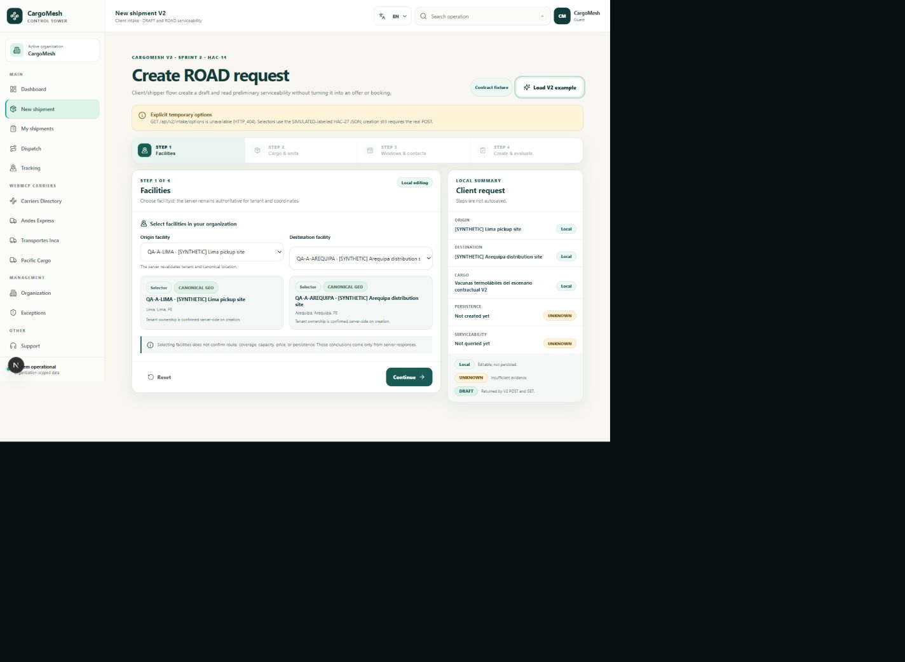
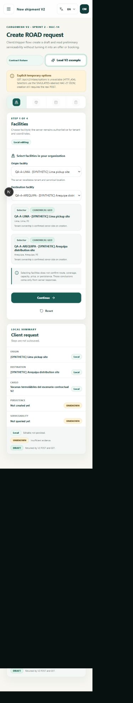

# CargoMesh V2 · HAC-14 client intake and ROAD preview

Status: frontend implementation and the combined HAC-12/HAC-15 validation are being closed on `feat/fe1-v2-intake-eligibility`. The PR is stacked on PR #91 and PR #92 until those dependencies reach the declared integration base.

Date: 2026-10-02

Owner: Luis (FE-1, client/shipper application)

Entry route: `Dashboard → /freight-request/new`

Declared PR target: `feat/cycle-2-integration`

## 1. Ownership and product boundary

HAC-14 implements the client/shipper intake. It does not redesign the carrier/company portals owned by FE-2 and it does not change the global role architecture.

The connected workflow is deliberately bounded:

1. Load the organization-scoped selector catalog from `GET /api/v2/intake/options`.
2. Keep all four intake steps in local React state. There is no autosave.
3. On the explicit final action, create one request with `POST /api/v2/freight/requests` and an `Idempotency-Key`.
4. Read the created `DRAFT` through `GET /api/v2/freight/requests/:id`.
5. Request ROAD serviceability through `GET /api/v2/freight/requests/:id/serviceability?expectedDraftVersion=...`.

The client does not send `organizationId` as authorization data. Session cookies authenticate the request and the server remains authoritative for tenant membership, facility ownership, canonical coordinates, the returned `draftVersion`, and every serviceability conclusion.

No frontend code computes carrier eligibility, coverage, lane validity, capacity, price, ETA, ranking, offer, or booking. The result area preserves `eligible`, `ineligible`, and `unknown` and displays the contractual boundary `EVALUATION_ONLY_NO_OFFER_OR_BOOKING`.

## 2. HAC-27 selector coverage audit

The five-group response was closed in the HAC-27 Linear document on 2026-09-28. The client now consumes the exact names and shapes: `facilities`, `cargoCategories`, `equipmentOptions`, `packagingOptions`, and `requirementOptions`.

API mode is fail-closed:

- `401`, `403`, network failures, non-JSON responses, and incompatible contracts are displayed as blocking errors with retry;
- none of those failures activate a fixture;
- `facilities: []` is a valid authenticated empty state, displayed without inventing facilities or enabling POST;
- a missing or empty non-facility catalog group blocks the form as an incomplete catalog;
- the development fixture can only be selected explicitly with `NEXT_PUBLIC_V2_INTAKE_OPTIONS_SOURCE=fixture` while `NODE_ENV !== production`;
- the explicit fixture remains labelled `SIMULATED` and never simulates successful persistence or serviceability.

The catalog covers every selector currently displayed by HAC-14:

| Selector group | Client field | HAC-27 payload field | Fixture coverage |
| --- | --- | --- | --- |
| `facilities` | origin and destination facility | `facilities[].id → facilityId` and `origin` / `destination` | Tenant-scoped IDs and canonical location fields |
| `cargoCategories` | cargo taxonomy | `cargoCategories[].code → cargoSpecification.categoryCode` | Eight canonical categories; the structured `guidance` object is preserved and only converted to copy at render time |
| `equipmentOptions` | required equipment | `equipmentOptions[].code → requiredEquipment` | Backend-provided ROAD codes only; `DRY_VAN` and `LOWBOY` were removed |
| `packagingOptions` | cargo package type | `packagingOptions[].code → cargoSpecification.packaging` and `units[0].packageType` | `verification: CAPTURE_ONLY` is visible; compatibility is not claimed |
| `requirementOptions` | special handling options | `requirementOptions[].code → cargoSpecification.requirements[]` | `RESOURCE_EVIDENCE` and `REQUIRES_REVIEW` are visible per option |

The option parser now executes HAC-12's published `IntakeOptionsV2ResponseSchema`. It rejects an API response unless all five groups, enum codes, UUIDs, coordinates, guidance objects, labels, modes, and verification values conform to the shared schema. This prevents a `200` response with a partially compatible catalog from silently becoming usable UI.

## 3. UI-to-contract mapping

| UI data | HAC-27 request path | Mapping rule and server boundary |
| --- | --- | --- |
| Origin facility | `origin.*` | Selected `facilityId` maps to the option's label/country/region/city/coordinates. The server revalidates tenant ownership and canonical geography. |
| Destination facility | `destination.*` | Same rule; origin and destination must differ. |
| Pickup window | `pickupWindow.startsAt/endsAt` | Local date-time values are validated as an increasing range and serialized to ISO timestamps. |
| Delivery window | `deliveryWindow.startsAt/endsAt` | Must be increasing and start no earlier than pickup-window end. |
| Transport mode | `acceptedModes` | Fixed to `['ROAD']` for the Sprint 2 contract. |
| Equipment | `requiredEquipment` | Exact `equipmentOptions[].code` from the backend; no “no preference” or unpublished code is invented. |
| Cargo category | `cargoSpecification.categoryCode` | Exact `cargoCategories[].code`; `name` is presentation data. `guidance` remains an object containing `recommendedEntryMethods`, `intakeSpecificationSchema`, `suggestedRequirements`, and `recommendedVehicleClasses`; the UI derives display text without flattening the normalized contract. |
| Cargo description | `cargoSpecification.description` | Required free text. |
| Packaging | `cargoSpecification.packaging` | Exact `packagingOptions[].code`; `CAPTURE_ONLY` remains visible and does not assert handling compatibility. |
| Total weight and volume | `cargoSpecification.totalWeightKg/totalVolumeM3` | Required positive numbers and must equal the sum of `quantity × per-unit measurement` within HAC-12's `0.000001` tolerance; no capacity inference. |
| Divisibility | `cargoSpecification.divisible` | Explicit client choice. |
| Requirements | `cargoSpecification.requirements[]` | Exact checked `requirementOptions[].code` values. Temperature fields become mandatory for `TEMP_CONTROLLED`; resource evidence/review remains a server/operational conclusion. |
| Temperature | `cargoSpecification.temperatureRange` | `{ minCelsius, maxCelsius }` or `null`; minimum cannot exceed maximum. |
| Cargo unit | `cargoSpecification.units[0]` | Quantity, per-unit weight/volume, dimensions, indivisible, and stackable are sent as one typed unit. |
| Pickup contact | `contacts.pickup` | Name, E.164 phone, and email are validated locally, then revalidated by the API. |
| Recipient contact | `contacts.recipient` | Same rule. |

Fields intentionally not mapped:

- The old prototype `notes` field was removed because the HAC-27 create contract has no equivalent. Mapping it would require guessing.
- The old `NO_PREFERENCE` equipment value was removed because `requiredEquipment` is required and no canonical “no preference” code is published.
- Budget is not requested by the current HAC-14 UI. It is not needed to evaluate the ROAD integration boundary and the UI must not suggest a price or offer flow.
- The explicit development fixture contains only `REEFER_TRUCK`, the ROAD equipment code demonstrated by the normative POST. Other equipment options come exclusively from the authenticated backend response.

## 4. Screen states and interaction

The route covers:

- empty/local editing;
- selector loading, authenticated empty facilities, blocking auth/network/contract errors, and explicit development fixture mode;
- field and step validation errors;
- create/evaluate loading;
- recoverable API failure with retry;
- persisted `DRAFT` summary;
- zero candidates;
- mixed eligible/unknown candidates;
- ineligible/unknown checks;
- selected candidate synchronized with the typed map boundary;
- dirty local edits after creation, explicitly marked as not autosaved.

The form revalidates the complete draft before entering review and again before the POST. Future steps remain disabled until reached. Errors are linked to fields, announced through a focusable alert summary, and keyboard navigation is supported. The responsive layout has no horizontal overflow at 390 px or 1440 px.

## 5. HAC-15 map handoff

The frontend exposes a pure mapper at:

`cargomesh/src/features/v2-intake/mappers/road-map-props.mapper.ts`

It creates `RoadCandidateMapViewProps` with origin, destination, overall status, nested carrier/service data, compatibility aliases, nullable route preview, selected candidate ID, and selection callback. It preserves `null`, `UNKNOWN`, open provider severity strings, and empty legs instead of inventing a line between endpoints.

The HAC-14 mount boundary now imports Juan's actual `<RoadCandidateMapView />` from PR #92. Candidate cards and the map receive the same parent-owned `selectedCandidateId` and callback; the child does not own a second selection. A refreshed evaluation preserves a still-existing selection, otherwise chooses the first eligible candidate, then the first returned candidate, or `null` for zero candidates. Missing geometry renders canonical endpoint pins and the explicit no-geometry state; it never fabricates a route line.

### `/v2-workspace` overlap decision

PR #92 also contains a polished `/v2-workspace` scenario shell. Its current draft is a separate `WorkspaceDraft`, uses a local city catalog and `localStorage`, and can request a local Google route preview. It is intentionally labelled `V2-LOCAL-01`; it is not the organization-scoped HAC-12 `DRAFT` and cannot be treated as an API fallback.

To avoid two contradictory sources of truth, HAC-14 does **not** copy the connected controller into that workspace or expose workspace autosave as persisted CargoMesh data. The live HAC-14 controller remains on `/freight-request/new` and owns one API draft plus one card↔map selection state. A future presentation integration may render the workspace shell around this controller after the FE-2 owner and Tech Lead agree the boundary; it must replace the local draft adapter rather than synchronize two drafts. No defect or ownership from HAC-15 was absorbed into this PR.

Coordination source: `docs/v2-amazon/delivery/HAC15_HAC14_INTEGRATION_HANDOFF.md` from PR #92 and the HAC-15 validated head `2fcc9b4`.

## 6. Automated and visual evidence

The branch-only checks were first executed from `cargomesh/` on 2026-09-28. On
2026-10-03 the complete gate was repeated in a disposable integration worktree
created from `feat/cycle-2-integration@f2a8e3e` and containing these exact heads:

- HAC-12 / PR #91: `0c79a00`;
- HAC-15 / PR #92: `2fcc9b4`;
- HAC-14 / PR #93: `a056f5b`.

The resulting local-only validation tree was `3c297b6`. It was not pushed,
merged, or deployed and does not replace the Tech Lead's integration decision.

| Check | Result |
| --- | --- |
| `pnpm test:v2-intake` | Pass; 39/39 model, exact five-group Zod contract, eight-category structured guidance, auth/network/contract error, explicit fixture-mode, correlated POST→GET→serviceability, total consistency, deterministic facility-code selection, timezone-stable example windows, shared selection, provenance, and map-mapper tests |
| `pnpm exec tsx scripts/verify-hac15-contract.ts` | Pass; the real HAC-15 mapper and component contract cover candidate selection, zero candidates, nullable geometry, and endpoint pins without a fabricated polyline |
| `pnpm typecheck` | Pass; 0 TypeScript errors |
| `pnpm check:architecture` | Pass; 264 modules and 33 client entry points checked |
| `pnpm test:release` | Pass; 458/458 release tests completed with 0 failures |
| `pnpm build` | Pass; `/freight-request/new` compiles as a dynamic route (36.3 kB) and `/v2-workspace` as 19.3 kB |
| `python supabase-v2/gate.py v2 ...` | Pass; immutable V1 controls 9/9, baseline drift check, seven V2 migrations, 191/191 pgTAP assertions in seven files, and scenario cleanup |
| `node scripts/hac12-http-smoke.mjs` | Pass against local authenticated Supabase/API; Cookie and Bearer auth, tenant isolation, exact five-group catalog, POST→GET→serviceability, quantities/totals, coordinates, eligible/unknown/zero-candidate/stale states, and cleanup |
| Desktop visual QA | Pass at 1440 px; no horizontal overflow |
| Mobile visual QA | Pass at 390 px; single-column form and summary, no horizontal overflow |
| Keyboard regression | Pass; after clearing a previously valid field and jumping to review, the UI returns to the invalid step and focuses the alert |

The visual QA was repeated after the five-group contract alignment. Explicit fixture mode displayed backend-shaped IDs/codes, the four structured cargo-guidance sections as separate readable rows, and the `CAPTURE_ONLY`, `RESOURCE_EVIDENCE`, and `REQUIRES_REVIEW` notices. A final authenticated API-mode pass against the three exact heads above loaded the real catalog, created and reread a `DRAFT v1`, and rendered one eligible and one unknown candidate using the HAC-15 map component. `observedAt: null` appeared as `UNKNOWN`, missing geometry remained explicit, and selecting either card updated the pressed state and map detail from the same parent-owned `selectedCandidateId`. Switching back to the eligible card restored the corresponding map detail. The browser console contained no errors.

The authenticated HTTP smoke covered Cookie and Bearer sessions, tenant isolation, the five option groups, catalog codes, quantities, totals, coordinates, POST→GET→serviceability correlation, eligible/unknown/zero-candidate states, stale-version rejection, and cleanup. The first database-gate attempt found Docker Desktop unavailable because of a stale local engine socket; after restarting the existing local runtime, the exact same gate completed successfully. No application fallback or source change was introduced for that machine-only incident.

That final browser pass exposed and closed two integration defects before the PR:

- the server sorts facilities by label, so the provisional example now selects the intended `QA-A-LIMA → QA-A-AREQUIPA` lane by backend code rather than array position;
- `datetime-local` values now derive from the canonical UTC example instants in the browser's local timezone, preventing a Bogotá browser from shifting the intended `08:00Z` pickup to `13:00Z` and changing eligibility.

Desktop evidence:

Mobile evidence:

Visual-capture note: the committed desktop/mobile images predate the final authenticated smoke and were captured with the route guard removed only in an uncommitted working tree; the guard was restored immediately afterward. The 2026-10-03 final pass used the real local Supabase Auth session with `requireOperationalRouteAccess()` intact. No auth fallback is included.

## 7. DTO/UML fields not conserved by the current API

The current HAC-12 DTO intentionally does not preserve every richer UML field. HAC-14 does not invent mappings for them:

- `ShipmentContact.company` and other organization/contact details beyond name, E.164 phone, and optional email;
- multiple cargo unit groups in the UI (the DTO supports an array, while this intake currently captures one complete group), plus UML concepts such as `unitsPerPackage` that have no distinct DTO field;
- rich route-condition fields such as condition kind, location, `observedAt`, `validUntil`, source, and confidence; the returned preview only exposes code, open severity text, description, and provenance status;
- waypoint kinds, tolls, border costs, permit assertions, and confirmed truck restrictions;
- offer, price, ranking, booking, and carrier acceptance;
- location confirmation/reevaluation workflow, deferred to HAC-35. Facility selection still does not confirm route, coverage, capacity, price, or persistence.

These gaps are presentation constraints, not missing client defaults. They remain visible as unknown/unavailable whenever the API does not provide evidence.

## 8. Dependencies and integration order

- **PR #91 / HAC-12:** supplies the real five-group options endpoint, `POST`, request `GET`, serviceability `GET`, shared executable Zod schemas, and tenant enforcement now consumed by HAC-14.
- **PR #92 / HAC-15:** supplies the actual `<RoadCandidateMapView />` now mounted by HAC-14. The provider and workspace implementation remain FE-2 ownership.
- **Merge order:** #91 and #92 must reach `feat/cycle-2-integration` before HAC-14 can compile directly against that base. HAC-14's combined worktree validation proves the three heads together without merging or deploying any PR.

Current integration limits recorded on 2026-10-03:

- HAC-12 has QA technical conformity at `0c79a00`, but its final confirmation and authorized integration remain external to HAC-14.
- HAC-15 has the XSS fix and independent PASS at `2fcc9b4`; its truck/MTC pilot and joint owner smoke remain open, so it is not yet fully accepted or integrated.
- The combined worktree required a temporary conflict resolution in shared migration-manifest metadata and in the duplicate `FL-03` friction-log filename. Those resolutions were used only to run the gate and are not proposed as HAC-14 source changes; the integration owner must resolve them on the declared base.
- PR #93 remains **Draft**. After #91 and #92 are accepted and integrated into `feat/cycle-2-integration`, this branch must update from that base and repeat the gate before it may become Ready for review.

HAC-14 must not move to `Done`; the Tech Lead owns the gate. Until #91/#92 merge, its PR must make the stacked dependencies explicit rather than hide them with fixtures or copied code.

No merge, production deployment, Vercel root-directory change, carrier/company screen refactor, or Linear closure is part of this delivery.
