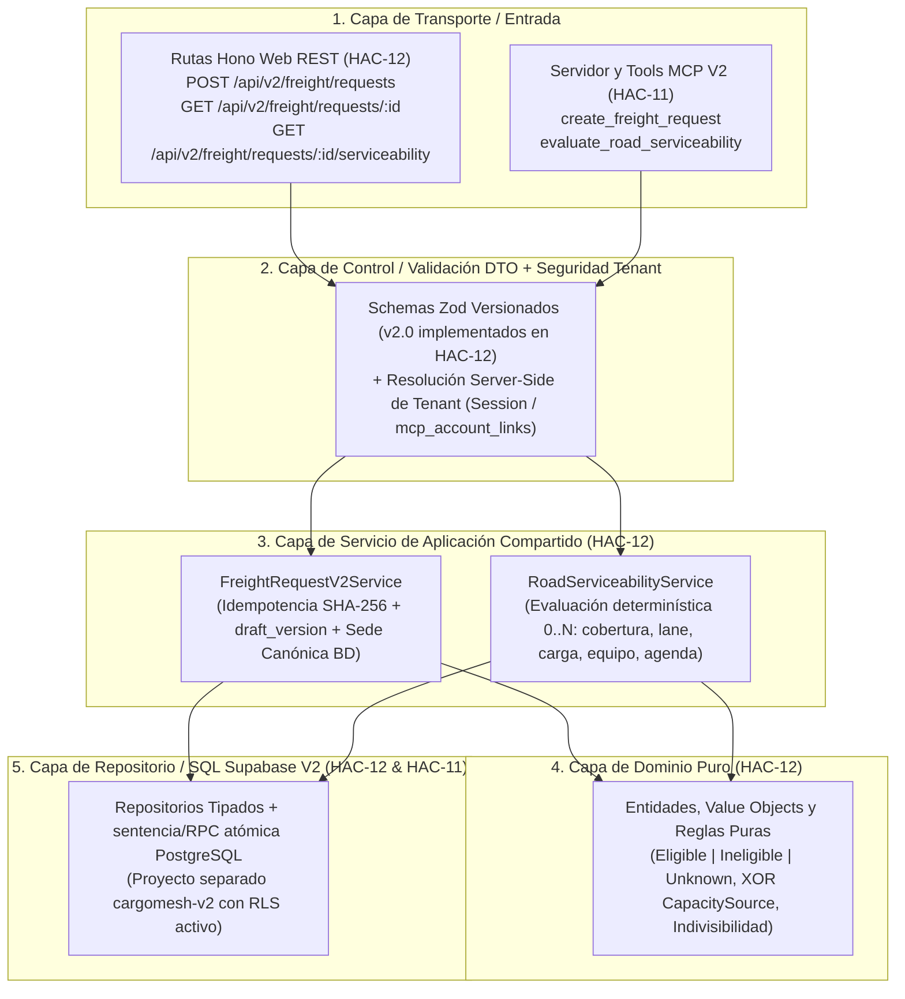

# HAC-27 — Mapeo de 57 Clases V2 a BD/API, Patrones de Diseño, Atomicidad y Contrato Temprano (Sprint 2)

- **Issue:** [HAC-27](https://linear.app/hackatonteamcargomesh/issue/HAC-27/contract-mapear-clases-v2-a-bdapi-y-entregar-contrato-temprano-al) (`[CONTRACT] Mapear clases V2 a BD/API y entregar contrato temprano al frontend`)
- **Responsable (R/A):** Cristhian Chujutalli (Tech Lead / BE-2)
- **Consultados (C):** Axel Arista (`HAC-11`), Jean Paul (`HAC-29`, `HAC-28`, `HAC-13`), Luis (`HAC-14`), Juan Antonio Coronado (`HAC-15`)
- **Fecha de corte:** 25–26 de septiembre de 2026 (entrega temprana para arranque de Sprint 2: 26 sep – 2 oct 2026)
- **Estado de publicación y referencia activa:**
  - **Contrato activo en Linear (referencia inmediata para arrancar en paralelo):** [Documento Maestro HAC-27 (`d2a9ef6d0876`)](https://linear.app/hackatonteamcargomesh/document/hac-27-mapeo-57-clases-v2-a-bdapi-patrones-atomicidad-y-contratos-v20-d2a9ef6d0876).
  - **Espejo en repositorio y editable UML `07`:** [`docs/v2-amazon/delivery/SPRINT2_HAC27_CLASS_DB_API_CONTRACT.md`](./SPRINT2_HAC27_CLASS_DB_API_CONTRACT.md) y [`docs/v2-amazon/diagrams/review-2026-09-24/07-complete-classes-sprint2-reviewed.drawio`](../diagrams/review-2026-09-24/07-complete-classes-sprint2-reviewed.drawio) (`57` clases únicas, `93` relaciones conectadas, `sha256: 104b126cc17565b57064fca0c6a8efd5cf43a076c1cb041355e5174cbe68dc88`) se incluyen en la entrega revisable de PR #91 desde `feat/be2-v2-road-serviceability` hacia `feat/cycle-2-integration`; revisión y merge de HAC-16 pendientes. Publicar la rama no equivale a integrar el contrato en la base V2.
  - **Delta de contrato 27 sep (Lima):** el Documento Maestro en Linear ya incluye `GET /api/v2/intake/options` con cinco grupos y la diferencia entre captura, evidencia de recurso y revisión pendiente. Este espejo local y el fixture se actualizaron con la misma decisión; su entrega al PR #91 está descrita en el addendum del 2 oct; integración y confirmación de consumo pendientes. HAC-12 debe cerrar pruebas de su respuesta y HAC-14 debe adaptar el parser/fixture antes de afirmar integración.
- **Ciclo de cierre de `HAC-27`:** `In Progress` (ajuste de bordes de contrato) $\rightarrow$ revisión técnica breve de Axel/Jean Paul y confirmación de consumo de Luis/Juan + publicación del espejo/UML por flujo aprobado $\rightarrow$ `In Review` $\rightarrow$ `Done` tras verificar evidencia.

---

## Decisiones CP-1 de HAC-29 (26 sep; implementación pendiente)

- Una sola cadena V2 en `supabase-v2/supabase/migrations/`, preparada por HAC-29 y extendida por HAC-12/HAC-11. Sin `db push` remoto por esta decisión.
- Conservar IDs `c230–c238` y extender el escenario con `c239–c23f`. Los UUID de ejemplo de este documento son ilustrativos hasta que HAC-29/13 publique el mapeo al fixture ejecutable.
- El ejemplo de evaluación tiene dos candidatos: total 2, eligible 1, unknown 1, ineligible 0.
- Piura→Arequipa sin cobertura declarada en el baseline debe devolver `200`, `ineligible`, cero candidatos y conteos cero; sede ajena al tenant, `403 FORBIDDEN_TENANT`. Datos de cobertura ausentes siguen siendo `unknown`, no una exclusión inventada.
- El recibo idempotente y `draft_version` ya existen en `freight_requests`; HAC-12 entrega el writer V2 y sus pruebas de reintento/conflicto y rollback posterior a escritura. No se exige tabla duplicada `idempotency_keys`, nombre de RPC prefijado ni interruptor de fallo en producción. La re-revisión independiente en 605435b confirmó los controles de idempotencia/rollback; los resultados nuevos están en la evidencia HAC-12. QA conserva certificación del corte integrado pendiente.

---

## 1. Separación de Entornos Supabase (V1 vs. V2) y Frontera de Responsabilidades

### 1.1 Dos proyectos Supabase físicamente separados
1. **Proyecto Supabase V1 (Legado WebMCP — Congelado):**
   - Conserva el esquema histórico y los seeds del demo V1 (`FR-1042`, `ACME`, `Andes`, `Inca`, `Pacific`).
   - **Prohibido** ejecutar limpiezas destructivas, alterar tablas o usarlo como base de ensayo de nuevas migraciones V2.
2. **Proyecto Supabase V2 (`cargomesh-v2` — Nuevo y Limpio):**
   - Recibe únicamente migraciones estructurales limpias (`supabase-v2/supabase/migrations/`, cadena única preparada por HAC-29), el catálogo de referencia de 8 categorías (`cargo_categories`) y escenarios sintéticos V2 aislados en `supabase/scenarios/v2-*/`.
   - Toda capacidad de base de datos que se deje preparada para hitos posteriores se rotula **`schema-ready`** y jamás **`feature-live`** hasta contar con servicio, adaptador, pruebas y evidencia.

### 1.2 Frontera de implementación Backend y Canal en Sprint 2
Para evitar conflictos de archivos, duplicación de reglas o saltos HTTP internos, la superficie de Sprint 2 se divide por **canal de transporte sobre un único servicio de aplicación compartido**:

| Issue | Dueño | Alcance exacto en Sprint 2 |
|---|---|---|
| **`HAC-27`** | Cristhian | Este contrato documental normativo: mapeo de las 57 clases UML, patrones de diseño, límites transaccionales/rollback, reglas de seguridad de `organizationId`/`facilityId`, contratos JSON/TS `v2.0` y contrato del mapper hacia el mapa. |
| **`HAC-29`** | Jean Paul | Bootstrap local V2 desde cero sin seeds V1, preservación de las 8 `cargo_categories` de referencia y separación de perfiles CI/pgTAP V1 vs. V2. |
| **`HAC-12`** | Cristhian | **Esquema persistente V2** (migraciones + aplicación controlada a `cargomesh-v2`), **schemas Zod ejecutables** (`cargomesh/src/shared/schemas/v2/`), **servicios de aplicación compartidos** (`FreightRequestV2Service` + `RoadServiceabilityService` con escritura atómica en BD) **y rutas Hono Web REST GET/POST V2** (`POST /api/v2/freight/requests` sin adaptador legado, `GET /api/v2/freight/requests/:id`, `GET /api/v2/freight/requests/:id/serviceability` y lectura autenticada de opciones del intake, los cuatro endpoints ya implementados en la entrega HAC-12). |
| **`HAC-11`** | Axel | **Persistencia de identidad MCP (`mcp_account_links`)** con RLS/scopes/revocación y **servidor/tools MCP V2 (`/mcp`)** invocando directamente los servicios compartidos de `HAC-12` (sin salto REST interno) con paridad 1:1 Web $\leftrightarrow$ MCP. |
| **`HAC-14`** | Luis | Atomización de componentes UI V2, integración del flujo de intake, tarjetas, estado de selección (`selectedCandidateId`) y **mapper puro `mapServiceabilityToMapViewProps(request, evaluation)`** en Next.js/React contra los endpoints GET/POST de `HAC-12`, reemplazando el espacio provisional de ruta del prototipo `HAC-24` con el mapa de `HAC-15` en un layout adaptable. |
| **`HAC-15`** | Juan | Primer mapa ROAD V2 encapsulado (`<RoadCandidateMapView />`) en React con ADR de proveedor, props tipadas `RoadCandidateMapViewProps` sincronizadas con `HAC-14`, estados (`VERIFIED`, `ESTIMATED`, `SIMULATED`, `UNKNOWN`), soporte de geometría ausente (`routePreview: null` / `legs: []` sin inventar ni interpolar trazas cuando es `UNKNOWN`) y procedencia visible (sin reutilizar coordenadas legadas `Callao -> Santiago` de HTMLs de referencia). |
| **`HAC-28`** | Jean Paul | Desconexión de WebMCP V1 (`supports_webmcp`, runner V1, 3 carriers fijos) del runtime activo V2 una vez integrados `HAC-12` y `HAC-11` (sin bloquear `HAC-16` en su totalidad por limpieza física pendiente, documentando honestamente cualquier remanente). |
| **`HAC-13`** | Jean Paul | Certificación QA transversal de esquema V2, RLS, validación canónica de `organizationId`/`facilityId`, round-trip POST→GET, idempotencia/concurrencia, rollback de escrituras compuestas, elegibilidad `eligible/ineligible/unknown`, paridad Web $\leftrightarrow$ MCP y smoke de UI/mapa. |
| **`HAC-16`** | Cristhian | Gate-2 de integración sobre `feat/cycle-2-integration` $\rightarrow$ `codex/v2-amazon-contracts`. |

### 1.3 Fronteras de Archivos Compartidos para Evitar Colisiones en Paralelo
Como varias tareas corren en paralelo sin bloqueos artificiales en cascada, se fijan dueños explícitos sobre las zonas de posible solape antes de abrir PRs hacia `feat/cycle-2-integration`:
- **`supabase-v2/supabase/migrations/`** (sin duplicar la cadena V1):
  - `HAC-12` (Cristhian) es dueño de la migración de esquema ROAD y solicitud V2 (`freight_requests` V2 reutilizando su recibo `creation_*`, `transport_assets`, `asset_cargo_capabilities`, `capacity_pools`, `capacity_calendars`, `capacity_reservations`, `scheduled_maintenances`, `repositioning_blocks` + la función transaccional que resulte necesaria). No agregar una tabla `idempotency_keys` solo por duplicar el recibo existente.
  - `HAC-11` (Axel) es dueño de la migración dedicada de identidad MCP (`mcp_account_links` + políticas RLS y funciones de vínculo/revocación) con prefijo/timestamp acordado para no pisar la migración de `HAC-12`.
  - `HAC-29` (Jean Paul) gobierna el bootstrap/verificación de entorno limpio y las suites `supabase/tests/`, sin reescribir migraciones históricas.
- **`cargomesh/src/shared/` y `cargomesh/src/features/v2-intake/mappers/`**:
  - **`HAC-27` fija el contrato documental normativo** (JSON payloads e interfaces TS).
  - **`HAC-12` (Cristhian)** implementa y prueba los **schemas Zod ejecutables** y tipos DTO canónicos en `cargomesh/src/shared/schemas/v2/` (`CreateFreightRequestV2Input`, `FreightRequestV2Response`, `RoadServiceabilityEvaluationV2Response`, `RoadCandidateMapViewProps`), consumidos por `HAC-12`, `HAC-11`, `HAC-14` y `HAC-15`.
  - **`HAC-14` (Luis)** implementa y prueba el mapper puro `mapServiceabilityToMapViewProps(request, evaluation)` en `cargomesh/src/features/v2-intake/mappers/road-map-props.mapper.ts`.
- **`cargomesh/src/server/`**:
  - `HAC-12` (Cristhian) es dueño de `src/server/services/` (`FreightRequestV2Service`, `RoadServiceabilityService`) y `src/server/hono/routes/freight/`.
  - `HAC-11` (Axel) es dueño de `src/server/mcp/` y los adaptadores de tools MCP que invocan los servicios de `HAC-12`.
  - `HAC-28` (Jean Paul) ejecuta el retiro/aislamiento de referencias WebMCP V1 (`supports_webmcp`, runner V1) después del corte de `HAC-12` y `HAC-11`, pudiendo adelantar inventario sin tocar los archivos activos de `HAC-12`/`HAC-11` mientras están en vuelo.

---

## 2. Matriz vigente de las 57 clases — recuperación integral, 5 oct 2026

El plan del 3 de octubre incorpora las 57 clases al alcance. La antigua división de 21 clases diferidas queda sustituida por esta matriz. Una clase puede ser tabla, valor embebido, proyección o puerto; su presencia no acredita implementación completa.

Observación independiente de HAC-44 sobre `abba805`, 17 migraciones: **2 completas / 43 parciales / 2 faltantes / 10 divergentes**, sin diferidos aprobados. Las correcciones posteriores requieren una nueva prueba. El detalle atributo/relación se conserva en el [diccionario vigente](./HAC27_UML_ATTRIBUTE_DICTIONARY_2026-10-02.md), [baseline QA](../models/FULL_MODEL_QA_BASELINE.json) y [DER](../models/FULL_MODEL_DER.md).

| Clase UML | Representación | Destino observado | Estado QA | Límite pendiente |
|---|---|---|---|---|
| Organization | TABLE_OR_SUBTYPE | organizations | PARCIAL | Class complete only with all attributes, related associations and explicit semantic method evidence; green suites alone never promote rows |
| Facility | TABLE_OR_SUBTYPE | facilities | PARCIAL | Class complete only with all attributes, related associations and explicit semantic method evidence; green suites alone never promote rows |
| FreightRequest | TABLE_OR_SUBTYPE | freight_requests | PARCIAL | Class complete only with all attributes, related associations and explicit semantic method evidence; green suites alone never promote rows |
| CargoSpecification | EMBEDDED_VALUE | freight_requests.v2_snapshot.cargoSpecification | DIVERGENTE | Class complete only with all attributes, related associations and explicit semantic method evidence; green suites alone never promote rows |
| CargoUnit | EMBEDDED_VALUE | freight_requests.v2_snapshot.cargoSpecification.units[] | PARCIAL | Class complete only with all attributes, related associations and explicit semantic method evidence; green suites alone never promote rows |
| Carrier | TABLE_OR_SUBTYPE | carriers | PARCIAL | Class complete only with all attributes, related associations and explicit semantic method evidence; green suites alone never promote rows |
| CarrierDepot | TABLE_OR_SUBTYPE | carrier_depots | PARCIAL | Class complete only with all attributes, related associations and explicit semantic method evidence; green suites alone never promote rows |
| CarrierService | TABLE_OR_SUBTYPE | carrier_services | PARCIAL | Class complete only with all attributes, related associations and explicit semantic method evidence; green suites alone never promote rows |
| ServiceLane | TABLE_OR_SUBTYPE | service_lanes | COMPLETO | Class complete only with all attributes, related associations and explicit semantic method evidence; green suites alone never promote rows |
| ResponseIntegration | TABLE_OR_SUBTYPE | response_integrations | FALTANTE | Class complete only with all attributes, related associations and explicit semantic method evidence; green suites alone never promote rows |
| CapacitySource | PORT_OR_PROJECTION | /capacity_source_projection | PARCIAL | Class complete only with all attributes, related associations and explicit semantic method evidence; green suites alone never promote rows |
| TransportAsset | TABLE_OR_SUBTYPE | transport_assets | DIVERGENTE | Class complete only with all attributes, related associations and explicit semantic method evidence; green suites alone never promote rows |
| RoadVehicle | TABLE_OR_SUBTYPE | transport_assets | DIVERGENTE | Class complete only with all attributes, related associations and explicit semantic method evidence; green suites alone never promote rows |
| CapacityPool | TABLE_OR_SUBTYPE | capacity_pools | DIVERGENTE | Class complete only with all attributes, related associations and explicit semantic method evidence; green suites alone never promote rows |
| CapacityCalendar | TABLE_OR_SUBTYPE | capacity_calendars | DIVERGENTE | Class complete only with all attributes, related associations and explicit semantic method evidence; green suites alone never promote rows |
| CapacityReservation | TABLE_OR_SUBTYPE | capacity_reservations | DIVERGENTE | Class complete only with all attributes, related associations and explicit semantic method evidence; green suites alone never promote rows |
| ScheduledMaintenance | TABLE_OR_SUBTYPE | scheduled_maintenances | DIVERGENTE | Class complete only with all attributes, related associations and explicit semantic method evidence; green suites alone never promote rows |
| Driver | TABLE_OR_SUBTYPE | drivers | PARCIAL | Class complete only with all attributes, related associations and explicit semantic method evidence; green suites alone never promote rows |
| DriverAssignment | TABLE_OR_SUBTYPE | driver_assignments | COMPLETO | Class complete only with all attributes, related associations and explicit semantic method evidence; green suites alone never promote rows |
| VehicleAssignment | TABLE_OR_SUBTYPE | vehicle_assignments | PARCIAL | Class complete only with all attributes, related associations and explicit semantic method evidence; green suites alone never promote rows |
| AssetStatusEvent | TABLE_OR_SUBTYPE | asset_status_events | PARCIAL | Class complete only with all attributes, related associations and explicit semantic method evidence; green suites alone never promote rows |
| RoutePlan | TABLE_OR_SUBTYPE | route_plans | PARCIAL | Class complete only with all attributes, related associations and explicit semantic method evidence; green suites alone never promote rows |
| RouteLeg | TABLE_OR_SUBTYPE | route_legs | PARCIAL | Class complete only with all attributes, related associations and explicit semantic method evidence; green suites alone never promote rows |
| RouteCondition | TABLE_OR_SUBTYPE | route_conditions | PARCIAL | Class complete only with all attributes, related associations and explicit semantic method evidence; green suites alone never promote rows |
| RouteWaypoint | TABLE_OR_SUBTYPE | route_waypoints | PARCIAL | Class complete only with all attributes, related associations and explicit semantic method evidence; green suites alone never promote rows |
| RoutePlanningPolicy | TABLE_OR_SUBTYPE | route_planning_policies | PARCIAL | Class complete only with all attributes, related associations and explicit semantic method evidence; green suites alone never promote rows |
| TransportPlanCandidate | TABLE_OR_SUBTYPE | transport_plan_candidates | PARCIAL | Class complete only with all attributes, related associations and explicit semantic method evidence; green suites alone never promote rows |
| PlanResource | TABLE_OR_SUBTYPE | plan_resources | DIVERGENTE | Class complete only with all attributes, related associations and explicit semantic method evidence; green suites alone never promote rows |
| CarrierOpportunity | TABLE_OR_SUBTYPE | carrier_opportunities | PARCIAL | Class complete only with all attributes, related associations and explicit semantic method evidence; green suites alone never promote rows |
| CarrierOffer | TABLE_OR_SUBTYPE | v2_carrier_offers | PARCIAL | Class complete only with all attributes, related associations and explicit semantic method evidence; green suites alone never promote rows |
| RankedOption | TABLE_OR_SUBTYPE | ranked_options | PARCIAL | Class complete only with all attributes, related associations and explicit semantic method evidence; green suites alone never promote rows |
| ScoringPolicy | TABLE_OR_SUBTYPE | scoring_policies | PARCIAL | Class complete only with all attributes, related associations and explicit semantic method evidence; green suites alone never promote rows |
| Booking | TABLE_OR_SUBTYPE | v2_bookings | PARCIAL | Class complete only with all attributes, related associations and explicit semantic method evidence; green suites alone never promote rows |
| TransportExecution | TABLE_OR_SUBTYPE | transport_executions | PARCIAL | Class complete only with all attributes, related associations and explicit semantic method evidence; green suites alone never promote rows |
| OperationalIncident | TABLE_OR_SUBTYPE | operational_incidents | PARCIAL | Class complete only with all attributes, related associations and explicit semantic method evidence; green suites alone never promote rows |
| IncidentUpdate | TABLE_OR_SUBTYPE | incident_updates | PARCIAL | Class complete only with all attributes, related associations and explicit semantic method evidence; green suites alone never promote rows |
| LogisticsNode | TABLE_OR_SUBTYPE | logistics_nodes | PARCIAL | Class complete only with all attributes, related associations and explicit semantic method evidence; green suites alone never promote rows |
| RouteCorridor | TABLE_OR_SUBTYPE | route_corridors | PARCIAL | Class complete only with all attributes, related associations and explicit semantic method evidence; green suites alone never promote rows |
| CargoProfile | TABLE_OR_SUBTYPE | organization_cargo_profiles | PARCIAL | Class complete only with all attributes, related associations and explicit semantic method evidence; green suites alone never promote rows |
| CargoCategory | TABLE_OR_SUBTYPE | cargo_categories | DIVERGENTE | Class complete only with all attributes, related associations and explicit semantic method evidence; green suites alone never promote rows |
| LoadAllocation | TABLE_OR_SUBTYPE | load_allocations | PARCIAL | Class complete only with all attributes, related associations and explicit semantic method evidence; green suites alone never promote rows |
| OrganizationMember | TABLE_OR_SUBTYPE | organization_members | PARCIAL | Class complete only with all attributes, related associations and explicit semantic method evidence; green suites alone never promote rows |
| McpAccountLink | TABLE_OR_SUBTYPE | mcp_account_links | PARCIAL | Class complete only with all attributes, related associations and explicit semantic method evidence; green suites alone never promote rows |
| RepositioningBlock | TABLE_OR_SUBTYPE | repositioning_blocks | DIVERGENTE | Class complete only with all attributes, related associations and explicit semantic method evidence; green suites alone never promote rows |
| OrganizationPreferences | TABLE_OR_SUBTYPE | organization_preferences | PARCIAL | Class complete only with all attributes, related associations and explicit semantic method evidence; green suites alone never promote rows |
| CarrierMetric | TABLE_OR_SUBTYPE | v2_carrier_metrics | PARCIAL | Class complete only with all attributes, related associations and explicit semantic method evidence; green suites alone never promote rows |
| VehicleCombination | TABLE_OR_SUBTYPE | vehicle_combinations | PARCIAL | Class complete only with all attributes, related associations and explicit semantic method evidence; green suites alone never promote rows |
| ServiceArea | TABLE_OR_SUBTYPE | service_areas | PARCIAL | Class complete only with all attributes, related associations and explicit semantic method evidence; green suites alone never promote rows |
| FulfilmentPartner | TABLE_OR_SUBTYPE | fulfilment_partners | PARCIAL | Class complete only with all attributes, related associations and explicit semantic method evidence; green suites alone never promote rows |
| PlanLegAssignment | TABLE_OR_SUBTYPE | plan_leg_assignments | PARCIAL | Class complete only with all attributes, related associations and explicit semantic method evidence; green suites alone never promote rows |
| OfferCostComponent | EMBEDDED_VALUE | v2_carrier_offers.breakdown[] | PARCIAL | Class complete only with all attributes, related associations and explicit semantic method evidence; green suites alone never promote rows |
| ShipmentContact | EMBEDDED_VALUE | freight_requests.v2_snapshot.contacts | PARCIAL | Class complete only with all attributes, related associations and explicit semantic method evidence; green suites alone never promote rows |
| CarrierOperator | TABLE_OR_SUBTYPE | carrier_operators | PARCIAL | Class complete only with all attributes, related associations and explicit semantic method evidence; green suites alone never promote rows |
| AssetCargoCapability | TABLE_OR_SUBTYPE | cargo_capability_definitions | PARCIAL | Class complete only with all attributes, related associations and explicit semantic method evidence; green suites alone never promote rows |
| RouteSimulationScenario | PORT_OR_PROJECTION | /scenario_files | PARCIAL | Class complete only with all attributes, related associations and explicit semantic method evidence; green suites alone never promote rows |
| RoutePlanner | PORT_OR_PROJECTION | /route_planner_port | FALTANTE | Class complete only with all attributes, related associations and explicit semantic method evidence; green suites alone never promote rows |
| SelectionDecision | TABLE_OR_SUBTYPE | selection_decisions | PARCIAL | Class complete only with all attributes, related associations and explicit semantic method evidence; green suites alone never promote rows |

## 3. Arquitectura en Capas y Patrones de Diseño de Software (Backend V2)

### 3.0 Corte de arquitectura: monolito modular, no copia funcional de V1

Hono (`/api/v2/*`), MCP (`/mcp`) y la UI React/Next.js viven en **un despliegue y repositorio**; Hono y MCP son adaptadores de entrada, no servicios de negocio independientes. Los módulos de aplicación del vertical son `freight-requests` (agregado/creación/lectura), `road-serviceability` (evaluación pura), `identity/account-linking` (principal/tenant/scopes) y `intake/map` en frontend. Cada módulo publica contratos tipados y mantiene su lógica interna privada. La dirección permitida es `transport -> DTO/controller -> application service -> domain policy + repository port -> Supabase/PostgreSQL`; `service -> transport`, `domain -> Supabase` y `MCP -> HTTP Hono interno` están prohibidos. La regla se coteja también con `pnpm check:architecture` al implementar HAC-12/11/14.

**Reutilización V1 explícita:** se conservan únicamente tablas/columnas y patrones auditados (p. ej. `freight_requests`, `cargo_categories`, `organization_members`, `facilities` y las columnas `freight_requests.creation_idempotency_key` / `creation_payload_hash` con su índice único). La API V2 **no** conserva el DTO plano `CreateFreightRequestSchema`, el sobre `{ok,data}` ni el adaptador `adaptV2ToLegacyService` como contrato de negocio. Son el estado transitorio actual, no compatibilidad prometida. HAC-12 adapta migraciones de forma aditiva y crea schemas Zod `v2.0`; V1 sigue en rutas/regresiones históricas. `57` clases UML no significan `57` tablas ni `57` endpoints.

### 3.1 Convención de Capas y Nomenclatura (`HAC-12` y `HAC-11`)
Tanto el canal Web Hono (`HAC-12`) como el canal MCP (`HAC-11`) convergen en la capa 3 (**Application Service**), prohibiendo duplicar filtros en las rutas o hacer llamadas HTTP internas de MCP a REST:



### 3.2 Los 6 Patrones de Diseño de Software aplicados en CargoMesh V2
1. **Strategy / Policy Pattern (`RoadServiceabilityService` en S2 y `ScoringPolicy` en HITO 3):**
   - Encapsula las reglas de evaluación de elegibilidad ROAD (cobertura `INCLUDE`/`EXCLUDE`, dirección de `ServiceLane`, compatibilidad de `CargoSpecification` y ventana en `CapacityCalendar`) como políticas puras e intercambiables, libres de código HTTP o SQL.
2. **Ports & Adapters / Hexagonal (`CapacitySource` en S2 y `ResponseIntegration` en HITO 3):**
   - El UML propone el puerto `CapacitySource.availability(window): AvailabilityResult`; **no está implementado como esa interfaz en S2**. El evaluador consume el tipo TS `Capacity`, con fuentes de activo/cupo y XOR persistido. Esta representación es parcial; no acredita implementación del puerto UML ni de sus métodos.
3. **Aggregate Root (`FreightRequest`):**
   - `FreightRequest` gobierna el ciclo de vida de `CargoSpecification`, `CargoUnit[]` y `ShipmentContact`. Ningún consumidor externo modifica unidades sueltas sin pasar por la raíz del agregado y verificar `draft_version`.
4. **Repository + Unit of Work (sentencia única o RPC PostgreSQL):**
   - Una operación PostgREST se ejecuta en una transacción; **dos llamadas sucesivas no forman una sola transacción**. El recibo de creación ya cabe en la fila `freight_requests`, por lo que no se inventa una tabla `idempotency_keys` para el corte. Si HAC-12 necesita snapshot canónico de sedes y otras escrituras inseparables, las agrupa en **una sentencia SQL o una RPC** invocada una vez. La función no captura un error para devolver éxito parcial: propaga la excepción y se revierte todo el request. Se prefiere `SECURITY INVOKER` y RLS; cualquier `SECURITY DEFINER` exige justificación, esquema no expuesto, privilegios `EXECUTE` mínimos y prueba de aislamiento por tenant.
5. **Idempotent Receiver + Optimistic Offline Lock (`creation_*` + `draft_version`):**
   - Toda creación reintentable (`POST /api/v2/freight/requests` y tool MCP `create_freight_request`) usa el mismo contrato canónico `v2.0`, `Idempotency-Key` UUID y SHA-256 de campos normalizados (orden estable, valores y tiempos normalizados; sin campos propios de HTTP/MCP). El índice existente `(organization_id, requested_by_member_id, creation_idempotency_key)` arbitra carreras. Igual clave/hash devuelve la **misma solicitud**; igual clave/hash diferente responde `409 IDEMPOTENCY_CONFLICT`, también tras una respuesta de red perdida.
   - Toda mutación futura sobre un borrador existente verifica `WHERE id = $1 AND draft_version = $2`; si la versión cambió, rechaza con `409 STALE_DRAFT`. Sprint 2 no publica aún un endpoint de autosave/revisión: esta guarda no autoriza al frontend a prometer guardado por paso.
6. **Factory / Builder (`TransportPlanCandidate` + `RoadServiceabilityEvaluation`):**
   - Ensambla de forma determinística el resultado de evaluación para cada `CarrierService` candidato junto con sus razones (`reasons[]`), estado (`eligible | ineligible | unknown`), procedencia (`source`, `observed_at`, `valid_until`) y traza para el mapa.

---

## 4. Matriz de Operaciones de Escritura, Límites de Atomicidad y Rollback

> **Criterio de Ingeniería:** No todas las operaciones requieren una RPC. Una sola sentencia/llamada a PostgREST es transaccional; una secuencia de llamadas HTTP no lo es. **Toda escritura compuesta** debe garantizar atomicidad Todo-o-Nada en PostgreSQL y propagar errores para provocar rollback. **Toda lectura/evaluación pura** no escribe. El rollback de datos locales no revierte una llamada a un proveedor externo; esa compensación queda fuera del corte ROAD.

| Operación | Canal / Endpoint / Tool | Dueño | Tablas Afectadas | Límite de Atomicidad y Mecanismo de Rollback | Idempotencia / Concurrencia | Códigos de Error Estables | Prueba de Fallo y Recuperación (QA `HAC-13`) |
|---|---|---|---|---|---|---|---|
| **1. Crear Solicitud V2 + recibo idempotente** | `POST /api/v2/freight/requests` (`HAC-12`) y MCP `create_freight_request` (`HAC-11`) | `HAC-12` | `public.freight_requests` (`creation_idempotency_key`, `creation_payload_hash`, `draft_version`, JSONB V2) leyendo `public.facilities` y `cargo_categories`; **no existe una tabla `idempotency_keys` aprobada** | Hono/MCP resuelve un actor verificado; **la operación SQL/RPC única vuelve a imponer pertenencia/tenant**, verifica sedes y toma ubicación canónica, e inserta agregado y recibo en la misma fila. Si hacen falta varias escrituras, una RPC las contiene. Constraint/FK/error propagado = **ROLLBACK total**. Si el DTO requiere snapshot de sede, leerlo y escribirlo en el mismo límite; no hacer `GET` de sede seguido de `INSERT` como garantía transaccional. | `Idempotency-Key` UUID + SHA-256 de payload `v2.0` normalizado; índice único existente por organización/miembro/clave. Inicializa `draft_version = 1`; reintento idéntico devuelve el mismo `id`/`referenceCode`. | `400 VALIDATION_ERROR`, `403 FORBIDDEN_TENANT`, `409 IDEMPOTENCY_CONFLICT`. | Forzar sede ajena o unidad inválida y comprobar ausencia de solicitud/recibo parcial; reintentar misma clave/huella tras respuesta perdida y confirmar un solo registro (`QA-13-23`). |
| **2. Actualizar / Enviar Borrador V2 (`revise` / `submit`)** | **No se expone endpoint en Sprint 2**; solo diseño para un hito posterior si se aprueba | Futuro issue aprobado | `public.freight_requests` | Si se añade, usar una sentencia atómica `UPDATE ... WHERE id = $1 AND organization_id = $2 AND draft_version = $3` que incremente `draft_version` y valide la transición. Cualquier fallo aborta; no devolver éxito parcial. | `expected_draft_version` obligatorio en esa futura mutación. | `409 STALE_DRAFT`, `422 INCOMPLETE_DRAFT` cuando exista el endpoint. | Prueba de dos revisiones concurrentes al implementar el endpoint; **no se exige fingir una API de autosave en HAC-12**. |
| **3. Vincular / Revocar Cuenta MCP (`McpAccountLink`)** | Servicio interno de Account Linking MCP (`HAC-11`) | `HAC-11` | `public.mcp_account_links` | **Transacción ACID en BD / Upsert condicional**: al emitir un nuevo vínculo activo para el mismo `(organization_id, member_id, client_id)`, revoca el vínculo activo previo e inserta/actualiza el nuevo de forma atómica. | Unicidad parcial por vínculo activo + timestamp `revoked_at`. | `401 MCP_LINK_REVOKED`, `403 MCP_SCOPE_INSUFFICIENT`, `403 FORBIDDEN_TENANT`. | Simular fallo al registrar nuevo vínculo y comprobar que el estado anterior no quede corrupto ni con dos vínculos activos simultáneos (`QA-13-23`). |
| **4. Evaluar Elegibilidad y Capacidad ROAD (`0..N` candidatos)** | **Canónico Web:** `GET /api/v2/freight/requests/:id/serviceability` (`HAC-12`) + **Tool MCP:** `evaluate_road_serviceability` (`HAC-11`) | `HAC-12` (Servicio) / `HAC-11` (Tool MCP) | Solo lectura sobre `freight_requests`, `facilities`, `carrier_services`, `service_areas`, `service_lanes`, `transport_assets`, `capacity_pools`, `capacity_calendars`, `capacity_reservations`, `scheduled_maintenances`, `repositioning_blocks` | **Sin transacción de escritura (Read-Only determinístico)**. No muta capacidades ni crea holds/bookings al consultar. Si falta agenda o la fuente está vencida, degrada limpiamente a `unknown`. | Consulta determinística referenciada por `freight_request_id` y query opcional `expectedDraftVersion`. | `404 REQUEST_NOT_FOUND`, `403 FORBIDDEN_TENANT`, `409 STALE_DRAFT` (si `expectedDraftVersion` no coincide). | Consultar solicitud con calendario ausente/vencido $\rightarrow$ retorna `status: "unknown"` sin escribir filas ni lanzar 500 (`QA-13-06`). |
| **5. Reserva / Hold de Capacidad y Booking Comercial** | Diferido a **HITO 4** | HITO 4 | `bookings`, `capacity_reservations`, `selection_decisions` | **Fuera de alcance en Sprint 2.** En HITO 4 usará RPC transaccional + compensación de dominio `CapacityReservation.release(reason)` ante cancelación. | Diferido a HITO 4. | N/A en Sprint 2. | En Sprint 2 se prueban las restricciones de no-solape de `capacity_reservations` en pgTAP (`BEGIN ... ROLLBACK`). |

---

## 5. Contratos Versionados de API Web (`HAC-12`) y Tools MCP (`HAC-11`) — Schema `v2.0`

> **Alcance documental vs. implementación ejecutable:** Los ejemplos JSON y firmas TypeScript de esta sección constituyen el **contrato documental normativo (`HAC-27`)** para desbloquear el trabajo en paralelo. La **implementación ejecutable de los schemas Zod (`cargomesh/src/shared/schemas/v2/`) y sus pruebas unitarias pertenecen a `HAC-12` (Cristhian)**.

### 5.1 Inventario de Superficie, Auditoría del `POST` Existente y Semántica `GET` vs `POST` en Serviceability
1. **Auditoría de `POST /api/v2/freight/requests` actual ([`requests.ts`](../../../cargomesh/src/server/hono/routes/freight/requests.ts) + [`freight-request-adapter.ts`](../../../cargomesh/src/server/hono/adapters/freight-request-adapter.ts)):**
   - **Estado real verificado en el checkout local:** Hono valida el DTO **plano** `CreateFreightRequestSchema` (`originCity`, `destinationCity`, `cargoWeightKg`, `packageCount`, etc.), llama a `adaptV2ToLegacyService()` y devuelve el sobre antiguo `{ok:true,data}`. El adaptador **sí** transmite país/ciudad de la entrada; no los fija a `PE/CL`. Convierte peso a pallets y solo mapea presupuesto/descripción/flags. No puede representar ni conservar `CargoUnit[]`, volumen exacto, sedes, ventanas, dos contactos, categoría + guía o equipo requerido del DTO anidado `v2.0`. El servicio heredado conserva decisiones ROAD/FTL/BALANCED que no deben pasar silenciosamente por contrato V2.
   - **Acción en `HAC-12`:** Sustituir el DTO plano y el adaptador **solo en la ruta V2** por schemas Zod `v2.0`, `FreightRequestV2Service.createDraft()` y un mapper de respuesta versionada `{schemaVersion:"2.0",data,meta}` / error `{schemaVersion:"2.0",error}`. Preservar `CargoUnit[]`, volumen, categoría, ventanas, sedes y contactos en POST→GET. Mantener los endpoints V1 históricos separados para regresión; no cambiarles su contrato como efecto colateral.
2. **Decisión sobre `GET` vs `POST` en `/api/v2/freight/requests/:id/serviceability`:**
   - Como en Sprint 2 la evaluación ROAD **solo recalcula de forma determinística en memoria sobre datos persistidos y NO escribe snapshots ni reservas en BD**, tener `GET` y `POST` haciendo exactamente lo mismo sería ambiguo.
   - **Operación canónica en Sprint 2 (`HAC-12` y `HAC-14`):** **`GET /api/v2/freight/requests/:id/serviceability`** (con query param opcional `?expectedDraftVersion=<int>`). Es una lectura pura (`Read-Only`), segura e idempotente sobre el `FreightRequest` `:id` ya creado con `POST /api/v2/freight/requests`.
   - **Reserva de `POST .../serviceability` para HITO 3:** El verbo `POST` queda reservado para HITO 3 únicamente si se introduce el comando de congelar/persistir un snapshot de `TransportPlanCandidate` al abrir `CarrierOpportunity`. En Sprint 2 no se expone un `POST` duplicado de solo lectura.
3. **Endpoints Web Hono entregados por `HAC-12` (Cristhian):**
   - `GET /api/v2/intake/options` — Lectura autenticada de sedes del tenant, ocho categorías de referencia con guía y opciones de equipo ROAD soportadas. Este **borde de selector** se añade al contrato HAC-27 para que el frontend no invente listas; sincronizarlo con el alcance/DoD de HAC-12 y HAC-14 antes de implementarlo.
   - `POST /api/v2/freight/requests` — Crea solicitud V2 con idempotencia SHA-256, resolución server-side de tenant/sedes y round-trip fiel.
   - `GET /api/v2/freight/requests/:id` — Obtiene solicitud V2 autorizada por organización (`organization_id` RLS).
   - `GET /api/v2/freight/requests/:id/serviceability` — Ejecuta/obtiene la evaluación determinística Read-Only ROAD (`0..N` candidatos + geometría/procedencia para mapa).
4. **Tools MCP V2 entregadas por `HAC-11` (Axel) sobre el mismo servicio:**
   - `create_freight_request` — Invoca `FreightRequestV2Service.createDraft()` resolviendo tenant/miembro vía `mcp_account_links`.
   - `evaluate_road_serviceability` — Invoca `RoadServiceabilityService.evaluateByRequestId()` y devuelve la misma estructura semántica que `GET /api/v2/freight/requests/:id/serviceability`.

### 5.1.1 Origen de los selectores del intake — contrato de lectura `GET /api/v2/intake/options`

El frontend **no consulta tablas Supabase directamente** ni toma como catálogo operativo una lista del HTML de Stitch. Hono resuelve sesión/miembro/organización y entrega un DTO `IntakeOptionsV2Response` con cinco grupos: `facilities`, `cargoCategories`, `equipmentOptions`, `packagingOptions` y `requirementOptions`. La ausencia de sedes devuelve `facilities: []`, no sedes ajenas ni cobertura inferida. El endpoint lee `public.facilities` activas **de la organización autorizada** y `public.cargo_categories` activas con la guía de captura preservada por HAC-29. Los otros tres grupos son vocabularios versionados de captura del servidor, no filas de flota ni promesas de disponibilidad. `equipmentOptions` indica códigos ROAD aceptados por el DTO, no activos libres para la fecha; esa disponibilidad solo sale de `serviceability`. Los `recommended_vehicle_classes` heredados de la guía son sugerencias y no se convierten sin mapeo explícito en `requiredEquipment` (por ejemplo `REFRIGERATED_TRUCK` en la guía no equivale automáticamente a `REEFER_TRUCK` del DTO).

`packagingOptions[].verification = CAPTURE_ONLY`: el código se conserva en la solicitud, pero el evaluador ROAD de este corte aún no acredita compatibilidad de manipulación por embalaje. Este pendiente no se convierte en capacidad confirmada. `requirementOptions[].verification = RESOURCE_EVIDENCE` para `TEMP_CONTROLLED` y `SECURITY_SEAL`: la evaluación exige evidencia del **mismo recurso portador**, además del rango térmico cuando aplica. `FRAGILE` y `HAZARDOUS` llevan `REQUIRES_REVIEW`; en este corte producen `unknown` para requisitos, incluso si aparece una etiqueta de certificación, hasta contar con reglas y evidencia suficientes. El selector de requisitos no concede permisos ni habilitaciones legales.

**Alcance de lectura del modelo completo:** se mapean las 57 clases a tabla, valor embebido, regla/resultado, escenario o diferido, pero eso no equivale a 57 rutas GET. Los cinco grupos de captura se agrupan en `intake/options`; los valores de carga y contactos salen dentro de `freight/requests/:id`; las áreas, lanes, calendarios, reservas, bloqueos y recursos son insumos internos del evaluador ROAD, cuyo resultado explicable se consulta por `freight/requests/:id/serviceability`. Datos de identidad, carrier o flota sensibles no se exponen al navegador como CRUD genérico. Los agregados comerciales diferidos tendrán contratos de lectura cuando se activen con datos y autorización verificables.

**Sin tope artificial de carriers:** el servicio evalúa `0..N` servicios ROAD publicados del universo soportado, no los tres fixtures V1 ni un `LIMIT` que descarte silenciosamente alternativas. Para proteger memoria, red y tiempo de función, el repositorio podrá leer en lotes y la respuesta de UI paginar/proyectar candidatos conservando conteos y razones globales; paginar la presentación no altera el universo evaluado. Un catálogo no disponible o parcialmente cargado no se anuncia como evaluación completa.

| Lectura V2 de Sprint 2 | Fuente autoritativa | Cálculo en backend | Frontend recibe |
|---|---|---|---|
| `GET /api/v2/intake/options` | `facilities` del tenant, `cargo_categories` con guía y tres vocabularios de captura versionados | Autorización, filtro de sedes activas, validación de las 8 categorías, códigos de equipo/embalaje/requisito y estado de verificación | Cinco grupos tipados; nunca consulta Supabase directamente |
| `GET /api/v2/freight/requests/:id` | `freight_requests` + sedes/categoría canónicas | Tenant/RLS y reconstrucción de unidades, ventanas, contactos y versión desde filas/JSONB | El agregado de solicitud, no filas SQL |
| `GET /api/v2/freight/requests/:id/serviceability` | Solicitud y catálogo ROAD/cobertura/capacidad vigentes | Filtros duros, exclusión antes de inclusión, lane dirigida, compatibilidad y agenda por ventana; `eligible/ineligible/unknown` con razones | Proyección explicable, procedencia y geometría solo si existe; sin precio ni booking |

**Orden de reglas ROAD:** (1) resolver solicitud, tenant, sedes y fecha; (2) enumerar todos los `CarrierService` ROAD publicados sin nombres hardcodeados; (3) verificar áreas de recojo/entrega y sus exclusiones vigentes; (4) verificar lane dirigida del mismo servicio; (5) comprobar categoría/equipo, peso, volumen y unidad indivisible sobre activo/cupo portador; (6) descontar reservas, mantenimiento y reposicionamiento en la misma ventana; (7) devolver `ineligible` ante un incumplimiento demostrado, `unknown` si falta evidencia necesaria y `eligible` solo si todos los filtros duros están probados. No se deriva cobertura de `CarrierDepot` ni capacidad de la mera existencia de `CarrierService`. Una traza de mapa simulada lleva rótulo `SIMULATED`; ausencia de geometría deja `routePreview: null` y nunca produce una línea inventada.

**Preflight de integración para HAC-12:** la rama local `feat/be2-v2-road-serviceability` implementa las cuatro rutas descritas, incluido el GET de cinco grupos; todavía no se ha integrado ni desplegado. El gate debe verificar los tipos contra el esquema V2, el GRANT de acceso a Data API y la RLS de cada tabla nueva; tener RLS no concede acceso a una tabla que la API no expone. Ninguna capacidad se etiqueta `feature-live` por existir en este contrato o en una rama local.

```json
{
  "schemaVersion": "2.0",
  "data": {
    "facilities": [{"id":"11111111-2222-4333-8444-555555555555","code":"CALLAO-NORTE","label":"Planta Callao Norte","countryCode":"PE","region":"Lima","city":"Callao","lat":-12.0464,"lng":-77.1181}],
    "cargoCategories": [{"id":"c0000000-0000-0000-0000-000000000003","code":"PHARMA","name":"Pharmaceuticals","guidance":{"recommendedEntryMethods":["PACKAGES","PALLETS","LOTS"],"intakeSpecificationSchema":{"fields":["temperature_min_c","temperature_max_c","lot_number","expiration_date","handling_protocol"]},"suggestedRequirements":{"requires_temperature_validation":true,"suggest_fragile":true,"suggest_high_value":true},"recommendedVehicleClasses":["REFRIGERATED_TRUCK","SECURE_BOX_TRUCK"]}}],
    "equipmentOptions": [{"code":"REEFER_TRUCK","label":"Camión refrigerado","mode":"ROAD"}],
    "packagingOptions": [{"code":"PALLET","labelEs":"Pallet","labelEn":"Pallet","verification":"CAPTURE_ONLY"}],
    "requirementOptions": [{"code":"TEMP_CONTROLLED","labelEs":"Temperatura controlada","labelEn":"Temperature controlled","verification":"RESOURCE_EVIDENCE"},{"code":"HAZARDOUS","labelEs":"Material peligroso","labelEn":"Hazardous material","verification":"REQUIRES_REVIEW"}]
  }
}
```

El JSON anterior abrevia la lista a una categoría para mostrar la forma; el [fixture de opciones](./fixtures/hac27/intake-options.json) contiene las ocho referencias. Los IDs de sedes y coordenadas son **fixtures de contrato**, no registros confirmados del Supabase V2. El ID/código `PHARMA` sí corresponde al dato de referencia definido por la migración histórica; HAC-29 verifica que las ocho referencias lleguen al bootstrap limpio. Luis puede usar los fixtures locales al arrancar, pero antes de aceptar HAC-14 debe consumir la lectura real, gestionar `loading/error/[]` y enviar `facilityId`/`categoryCode` del catálogo autorizado. Si el equipo decide no implementar esta ruta adicional, debe aprobar y documentar otra fuente autenticada equivalente; no se acepta dejar selectores hardcodeados como integración final.

---

### 5.2 Contrato 1: `POST /api/v2/freight/requests` y `GET /api/v2/freight/requests/:id`

#### Reglas de Seguridad y Autorización del DTO (Obligatorias en `HAC-12` y `HAC-11`)
1. **`organizationId` del cliente NO autoriza acceso:**
   - La organización efectiva (`organization_id`) y el miembro actor se resuelven **exclusivamente en el servidor** desde la sesión autenticada + membresía activa en `public.organization_members` (canal Web `HAC-12`) o desde el vínculo activo verificado en `public.mcp_account_links` + `organization_members` (canal MCP `HAC-11`).
   - El campo `organizationId` en el body de entrada es **opcional** (solo sirve como aserción de guardia del cliente): si se envía y **no coincide** con la organización resuelta por el servidor, la petición se rechaza de inmediato con **`403 FORBIDDEN_TENANT`**.
2. **Integridad de `facilityId` y Ubicación Canónica desde BD (No confiar ciegamente en el navegador):**
   - Cuando el cliente envía `origin.facilityId` o `destination.facilityId`:
     - El servidor **comprueba en `public.facilities`** que la sede exista y pertenezca a la `organization_id` resuelta por el servidor (además de la FK compuesta `(origin_facility_id, organization_id)` en PostgreSQL). Si pertenece a otro tenant, responde **`403 FORBIDDEN_TENANT`** (o `400 VALIDATION_ERROR` si no existe).
     - El servidor **toma la ubicación canónica (`label`, `countryCode`, `region`, `city`, `lat`, `lng`) directamente de `public.facilities` en BD**, sin confiar ciegamente en las coordenadas o textos enviados por el navegador. Si el cliente envía coordenadas contradictorias con la sede registrada, prevalece el registro canónico de BD (o se rechaza si se intenta suplantar otra ciudad/país).
   - **Forma mínima del corte ROAD:** `{ "facilityId": "<uuid>" }` basta para cada extremo; los demás campos del ejemplo largo son aserciones opcionales del cliente, no obligatorios ni autoritativos en el `POST` cuando hay `facilityId`. La respuesta siempre contiene la ubicación canónica. Para ubicación manual sin sede se requieren `label`, `countryCode`, `city` y procedencia verificable de coordenadas antes de afirmar traza/cobertura; si no se dispone de esa validación en HAC-12, se rotula `UNKNOWN` y no se la ofrece como caso positivo del Sprint 2. No convertir una dirección escrita por el usuario en coordenadas verificadas por defecto.

#### Request Headers (`POST`)
- `Authorization: Bearer <supabase_jwt>`
- `Idempotency-Key: <uuid-v4>` (Obligatorio en creación reintentable; coincide con `creation_idempotency_key uuid` existente)
- `Content-Type: application/json`

#### Request Body (`POST /api/v2/freight/requests`) — DTO `CreateFreightRequestV2Input`
```json
{
  "schemaVersion": "2.0",
  "organizationId": "8f5b7d42-3c1a-4b9e-8d2f-1a2b3c4d5e6f",
  "origin": {
    "facilityId": "11111111-2222-4333-8444-555555555555",
    "label": "Planta Callao Norte",
    "countryCode": "PE",
    "region": "Lima",
    "city": "Callao",
    "lat": -12.0464,
    "lng": -77.1181
  },
  "destination": {
    "facilityId": "66666666-7777-4888-8999-000000000000",
    "label": "Centro Distribución Arequipa",
    "countryCode": "PE",
    "region": "Arequipa",
    "city": "Arequipa",
    "lat": -16.4090,
    "lng": -71.5375
  },
  "pickupWindow": {
    "startsAt": "2026-10-05T08:00:00Z",
    "endsAt": "2026-10-05T18:00:00Z"
  },
  "deliveryWindow": {
    "startsAt": "2026-10-07T08:00:00Z",
    "endsAt": "2026-10-07T20:00:00Z"
  },
  "acceptedModes": ["ROAD"],
  "requiredEquipment": "REEFER_TRUCK",
  "cargoSpecification": {
    "categoryCode": "PHARMA",
    "description": "Vacunas termolábiles en pallets controlados",
    "packaging": "PALLET",
    "totalWeightKg": 4800,
    "totalVolumeM3": 19.2,
    "divisible": false,
    "requirements": ["TEMP_CONTROLLED", "SECURITY_SEAL"],
    "temperatureRange": {
      "minCelsius": 2,
      "maxCelsius": 8
    },
    "units": [
      {
        "packageType": "PALLET",
        "quantity": 8,
        "weightPerUnitKg": 600,
        "volumePerUnitM3": 2.4,
        "dimensionsCm": { "length": 120, "width": 100, "height": 200 },
        "indivisible": true,
        "stackable": false
      }
    ]
  },
  "contacts": {
    "pickup": {
      "name": "Elena Vargas",
      "phoneE164": "+51987654321",
      "email": "despachos.callao@shipper-v2.example"
    },
    "recipient": {
      "name": "Carlos Medina",
      "phoneE164": "+51912345678",
      "email": "recepcion.aqp@shipper-v2.example"
    }
  },
  "budget": {
    "amount": 3200.00,
    "currency": "USD"
  }
}
```

#### Response Body (`201 Created` / `200 OK` en `GET /api/v2/freight/requests/:id`) — DTO `FreightRequestV2Response`
```json
{
  "schemaVersion": "2.0",
  "data": {
    "id": "a9c4e112-84b1-47d0-91e3-52f8c7a6b501",
    "referenceCode": "CM-V2-2026-0001",
    "organizationId": "8f5b7d42-3c1a-4b9e-8d2f-1a2b3c4d5e6f",
    "status": "DRAFT",
    "draftVersion": 1,
    "origin": {
      "facilityId": "11111111-2222-4333-8444-555555555555",
      "label": "Planta Callao Norte",
      "countryCode": "PE",
      "region": "Lima",
      "city": "Callao",
      "lat": -12.0464,
      "lng": -77.1181
    },
    "destination": {
      "facilityId": "66666666-7777-4888-8999-000000000000",
      "label": "Centro Distribución Arequipa",
      "countryCode": "PE",
      "region": "Arequipa",
      "city": "Arequipa",
      "lat": -16.4090,
      "lng": -71.5375
    },
    "pickupWindow": {
      "startsAt": "2026-10-05T08:00:00Z",
      "endsAt": "2026-10-05T18:00:00Z"
    },
    "deliveryWindow": {
      "startsAt": "2026-10-07T08:00:00Z",
      "endsAt": "2026-10-07T20:00:00Z"
    },
    "acceptedModes": ["ROAD"],
    "requiredEquipment": "REEFER_TRUCK",
    "cargoSpecification": {
      "categoryCode": "PHARMA",
      "description": "Vacunas termolábiles en pallets controlados",
      "packaging": "PALLET",
      "totalWeightKg": 4800,
      "totalVolumeM3": 19.2,
      "divisible": false,
      "requirements": ["TEMP_CONTROLLED", "SECURITY_SEAL"],
      "temperatureRange": { "minCelsius": 2, "maxCelsius": 8 },
      "units": [
        {
          "packageType": "PALLET",
          "quantity": 8,
          "weightPerUnitKg": 600,
          "volumePerUnitM3": 2.4,
          "dimensionsCm": { "length": 120, "width": 100, "height": 200 },
          "indivisible": true,
          "stackable": false
        }
      ]
    },
    "contacts": {
      "pickup": {
        "name": "Elena Vargas",
        "phoneE164": "+51987654321",
        "email": "despachos.callao@shipper-v2.example"
      },
      "recipient": {
        "name": "Carlos Medina",
        "phoneE164": "+51912345678",
        "email": "recepcion.aqp@shipper-v2.example"
      }
    },
    "budget": { "amount": 3200.00, "currency": "USD" },
    "createdAt": "2026-09-26T14:00:00Z",
    "updatedAt": "2026-09-26T14:00:00Z"
  },
  "meta": {
    "idempotentReplay": false,
    "environmentProfile": "v2-clean"
  }
}
```

---

### 5.3 Contrato 2: Evaluación de Elegibilidad ROAD y Vista de Mapa (`HAC-12`, `HAC-11`, `HAC-14`, `HAC-15`)

- **Endpoint Web Canónico en Sprint 2 (`HAC-12`):**
  - `GET /api/v2/freight/requests/:id/serviceability` (opcional `?expectedDraftVersion=1`) — Operación determinística `Read-Only` e idempotente sobre el estado persistido de `:id`. No muta capacidades ni guarda snapshots en BD.
  - *(Nota de semántica HTTP: no se duplica con un `POST .../serviceability` en Sprint 2 porque ambos solo recalcularían sin persistir; el verbo `POST` queda reservado para HITO 3 únicamente si se introduce la materialización persistida de snapshots al abrir `CarrierOpportunity`).*
- **Tool MCP (`HAC-11`):**
  - `evaluate_road_serviceability` (recibe `{ "freightRequestId": "<uuid>", "expectedDraftVersion": 1 }` y devuelve exactamente el mismo objeto `data`).

#### Response Body (`200 OK`) — DTO `RoadServiceabilityEvaluationV2Response`
Incluye el resumen global (`overallStatus`: `eligible | ineligible | unknown`), la lista de `0..N` planes candidatos (`candidates[]`) con `carrier.commercialName`, `service.code`, desglose de chequeos (`coverage`, `lane`, `cargoAndEquipment`, `capacityWindow`) y el bloque `routePreview` (que puede ser `null` o tener `legs: []` cuando la geometría sea `UNKNOWN`, prohibiendo inventar líneas):

```json
{
  "schemaVersion": "2.0",
  "data": {
    "freightRequestId": "a9c4e112-84b1-47d0-91e3-52f8c7a6b501",
    "evaluatedDraftVersion": 1,
    "evaluatedAt": "2026-09-26T14:01:10Z",
    "overallStatus": "eligible",
    "summaryCounts": {
      "totalEvaluated": 2,
      "eligibleCount": 1,
      "unknownCount": 1,
      "ineligibleCount": 0
    },
    "commercialNotice": "EVALUATION_ONLY_NO_OFFER_OR_BOOKING",
    "candidates": [
      {
        "candidateId": "cand-road-01",
        "status": "eligible",
        "carrier": {
          "id": "c1000000-0000-4000-8000-000000000001",
          "code": "SUR-FRIO-LOG",
          "commercialName": "SurFrío Logística Vial S.A.C."
        },
        "service": {
          "id": "d2000000-0000-4000-8000-000000000001",
          "code": "ROAD-REEFER-PE-SUR",
          "mode": "ROAD",
          "serviceClass": "FTL",
          "responseChannels": []
        },
        "checks": {
          "coverage": {
            "status": "eligible",
            "pickupAreaCode": "PE-LIM-CALLAO-INC",
            "deliveryAreaCode": "PE-AQP-METRO-INC",
            "exclusionTriggered": false,
            "reasonCode": "PICKUP_AND_DELIVERY_INCLUDED"
          },
          "lane": {
            "status": "eligible",
            "laneId": "e3000000-0000-4000-8000-000000000001",
            "kind": "DIRECT",
            "borderReviewRequired": false,
            "reasonCode": "DIRECTED_LANE_ACTIVE"
          },
          "cargoAndEquipment": {
            "status": "eligible",
            "matchedCategory": "PHARMA",
            "requiredEquipment": "REEFER_TRUCK",
            "indivisibleUnitsFit": true,
            "reasonCode": "CARGO_AND_TEMP_COMPATIBLE"
          },
          "capacityWindow": {
            "status": "eligible",
            "sourceType": "TRANSPORT_ASSET",
            "sourceId": "f4000000-0000-4000-8000-000000000001",
            "calendarId": "a5000000-0000-4000-8000-000000000001",
            "availableWeightKg": 12000,
            "availableVolumeM3": 42.0,
            "windowChecked": {
              "startsAt": "2026-10-05T08:00:00Z",
              "endsAt": "2026-10-07T20:00:00Z"
            },
            "provenance": {
              "dataSource": "CARRIER_CALENDAR_V2_SCENARIO",
              "provenanceStatus": "SIMULATED",
              "observedAt": "2026-09-26T12:00:00Z",
              "validUntil": "2026-10-10T00:00:00Z"
            },
            "reasonCode": "WINDOW_FREE_NO_OVERLAP_OR_MAINTENANCE"
          }
        },
        "reasons": [
          "Áreas de recojo (Callao) y entrega (Arequipa) incluidas sin exclusión activa.",
          "Lane dirigida ROAD vigente entre Callao y Arequipa.",
          "Activo REEFER_TRUCK admite PHARMA (2°C–8°C) y soporta 8 pallets indivisibles (4,800 kg / 19.2 m³).",
          "Calendario de capacidad libre en la ventana solicitada sin mantenimiento ni bloqueos de reposicionamiento."
        ],
        "routePreview": {
          "corridorCode": "PE-PANAM-SUR-1S",
          "distanceKm": 1015,
          "estimatedTransitHours": 18.5,
          "geometrySource": "SCENARIO_SYNTHETIC_GEOMETRY",
          "provenanceStatus": "SIMULATED",
          "legs": [
            {
              "sequence": 1,
              "mode": "ROAD",
              "originLabel": "Planta Callao Norte",
              "destinationLabel": "Centro Distribución Arequipa",
              "waypoints": [
                { "lat": -12.0464, "lng": -77.1181, "label": "Callao" },
                { "lat": -14.0678, "lng": -75.7286, "label": "Ica (Corredor 1S)" },
                { "lat": -16.4090, "lng": -71.5375, "label": "Arequipa" }
              ],
              "conditions": [
                {
                  "code": "PE-1S-NORMAL",
                  "severity": "INFO",
                  "description": "Corredor vial pavimentado; datos de escenario V2 simulado.",
                  "provenanceStatus": "SIMULATED"
                }
              ]
            }
          ]
        }
      },
      {
        "candidateId": "cand-road-02",
        "status": "unknown",
        "carrier": {
          "id": "c1000000-0000-4000-8000-000000000002",
          "code": "CORDILLERA-CARGO",
          "commercialName": "Cordillera Cargo Terrestre S.A."
        },
        "service": {
          "id": "d2000000-0000-4000-8000-000000000002",
          "code": "ROAD-SUR-MULTI",
          "mode": "ROAD",
          "serviceClass": "FTL",
          "responseChannels": []
        },
        "checks": {
          "coverage": {
            "status": "eligible",
            "pickupAreaCode": "PE-LIM-CALLAO-INC",
            "deliveryAreaCode": "PE-AQP-METRO-INC",
            "exclusionTriggered": false,
            "reasonCode": "PICKUP_AND_DELIVERY_INCLUDED"
          },
          "lane": {
            "status": "eligible",
            "laneId": "e3000000-0000-4000-8000-000000000002",
            "kind": "DIRECT",
            "borderReviewRequired": false,
            "reasonCode": "DIRECTED_LANE_ACTIVE"
          },
          "cargoAndEquipment": {
            "status": "eligible",
            "matchedCategory": "PHARMA",
            "requiredEquipment": "REEFER_TRUCK",
            "indivisibleUnitsFit": true,
            "reasonCode": "CARGO_AND_TEMP_COMPATIBLE"
          },
          "capacityWindow": {
            "status": "unknown",
            "sourceType": "CAPACITY_POOL",
            "sourceId": "f4000000-0000-4000-8000-000000000002",
            "calendarId": null,
            "availableWeightKg": null,
            "availableVolumeM3": null,
            "windowChecked": {
              "startsAt": "2026-10-05T08:00:00Z",
              "endsAt": "2026-10-07T20:00:00Z"
            },
            "provenance": {
              "dataSource": "MISSING_CALENDAR_WINDOW",
              "provenanceStatus": "UNKNOWN",
              "observedAt": "2026-09-26T14:01:10Z",
              "validUntil": null
            },
            "reasonCode": "AVAILABILITY_UNKNOWN"
          }
        },
        "reasons": [
          "Cobertura, lane dirigida y compatibilidad de carga verificadas.",
          "Estado UNKNOWN: el carrier no tiene agenda de capacidad vigente ni geometría de corredor verificada para la ventana 05–07 oct; no se asume disponibilidad ni se inventa línea de ruta."
        ],
        "routePreview": {
          "corridorCode": null,
          "distanceKm": null,
          "estimatedTransitHours": null,
          "geometrySource": "NONE_UNVERIFIED",
          "provenanceStatus": "UNKNOWN",
          "legs": []
        }
      }
    ]
  }
}
```

#### Caso Cero Candidatos (`0 candidates`)
Cuando ningún servicio cubre la ruta o modo, el endpoint responde `200 OK` (no `404`) con:
- `"overallStatus": "ineligible"`
- `"summaryCounts": { "totalEvaluated": 0, "eligibleCount": 0, "unknownCount": 0, "ineligibleCount": 0 }`
- `"candidates": []`
- El frontend (`HAC-14` y `HAC-15`) renderiza el estado vacío explícito (`Cero candidatos elegibles para la ruta/ventana solicitada`) mostrando los pines de origen/destino (si tienen coordenadas) sin inventar una polilínea ni afirmar cobertura.

---

### 5.4 Contrato de Errores Estándar (`ErrorEnvelopeV2`)
```json
{
  "schemaVersion": "2.0",
  "error": {
    "code": "IDEMPOTENCY_CONFLICT",
    "message": "La clave Idempotency-Key ya fue utilizada con un payload diferente.",
    "details": {
      "idempotencyKey": "6c84fb90-12c4-11e1-840d-7b25c5ee775a"
    },
    "retryable": false
  }
}
```
Códigos normativos del corte:
- `400 VALIDATION_ERROR` (Zod field errors detallados)
- `401 UNAUTHORIZED` / `401 MCP_LINK_REVOKED`
- `403 FORBIDDEN_TENANT` / `403 MCP_SCOPE_INSUFFICIENT`
- `404 REQUEST_NOT_FOUND`
- `409 IDEMPOTENCY_CONFLICT` (misma clave, distinto hash SHA-256)
- `409 STALE_DRAFT` (versión esperada `draftVersion` obsoleta)

### 5.5 Formulario por pasos, reintentos y fixtures de integración

En Sprint 2 el stepper mantiene **estado local no persistido** mientras se editan pasos. Al pulsar **«Crear solicitud»**, valida el DTO completo y ejecuta **un** `POST /api/v2/freight/requests` con `Idempotency-Key` estable para ese intento; el resultado es un `DRAFT`, no envío comercial, oferta ni booking. Un reintento por timeout conserva la **misma** clave y payload. Si el usuario modifica el payload, genera una nueva clave; nunca reutiliza la anterior con distinto contenido. Después del `201` o replay `200`, consulta `GET /api/v2/freight/requests/:id` y `GET /api/v2/freight/requests/:id/serviceability`. Salir antes del POST no guarda un borrador en servidor. No mostrar “guardado automáticamente” ni implementar `PATCH` implícito; autosave/revisión exige contrato, endpoint y prueba de concurrencia de una issue posterior.

El paquete de [fixtures HAC-27](./fixtures/hac27/README.md) entrega JSON consumible por Luis/Juan para opciones de intake, solicitud, resultado positivo, resultado negativo, resultado `unknown`, cero candidatos y error. Son **contrato simulado**, no respuestas obtenidas del Supabase nuevo. Antes de HAC-14/15 `Done`, sustituir mocks por la API de HAC-12 y el escenario reproducible de HAC-29. Los estados `loading`, error recuperable, sesión caducada, 409 de idempotencia y `0 candidates` son distintos; un `200` con lista vacía no es `404`.

**Protecciones del backend que acompañan el handoff (HAC-12/11):** normalización y hash de payload compartidos entre Web/MCP; índice único de recibo y recuperación tras respuesta perdida; RLS + validación de miembro activo + FK compuesta de sede; errores tipados que no filtran SQL/PII; `correlationId` en logs sin registrar contactos/tokens; timeout explícito y prueba de rollback. En Web, la RPC/sentencia se ejecuta con identidad autorizada y `SECURITY INVOKER` cuando sea viable. En MCP, Axel debe acordar con HAC-12 cómo transportar el principal verificado al repositorio sin tomar `organizationId` del cliente ni usar `service_role` como sustituto de autorización. Cualquier función `SECURITY DEFINER` requiere revisión de privilegios, `search_path`, checks de actor/tenant y pgTAP de acceso cruzado antes de aplicarse. La elegibilidad GET no escribe ni reserva, y no requiere saga/compensación de booking en este sprint.

---

## 6. Matriz Pantalla / Campo UI $\rightarrow$ Contrato API $\rightarrow$ Clase UML $\rightarrow$ Persistencia BD

Esta tabla gobierna la integración de **Luis (`HAC-14`)** y **Juan (`HAC-15`)** para que ningún componente del navegador invente campos o recalcule reglas:

| Pantalla / Componente UI | Campo / Estado Visual | Ruta / Propiedad en DTO API (`v2.0`) | Clase y Atributo UML (`07`) | Persistencia en `cargomesh-v2` (`HAC-12`) |
|---|---|---|---|---|
| **Intake — Origen y Destino (`HAC-14`)** | Selector de Sede o Ubicación + Coordenadas | `GET /api/v2/intake/options` → `facilities[]`; `POST` → `origin.facilityId`, `destination.facilityId` (coordenadas de navegador no autoritativas) | `FreightRequest.origin`, `FreightRequest.destination`, `Facility.id/location` | `freight_requests.origin_facility_id`, `destination_facility_id` (coordenadas canónicas leídas de `public.facilities` en BD) |
| **Intake — Ventanas Temporales (`HAC-14`)** | Fecha/Hora de Recojo y Entrega | `pickupWindow.startsAt/endsAt`, `deliveryWindow.startsAt/endsAt` | `FreightRequest.pickupWindow`, `FreightRequest.deliveryDeadline` | `freight_requests.pickup_window_start/end`, `delivery_window_start/end` |
| **Intake — Especificación de Carga (`HAC-14`)** | Categoría (8 opciones), Embalaje, Peso Total, Volumen Total, Indivisible | `GET /api/v2/intake/options` → `cargoCategories[]` con guía y `packagingOptions[]` de captura; `POST` → `cargoSpecification.categoryCode`, `packaging`, `totalWeightKg`, `totalVolumeM3`, `divisible` | `CargoSpecification.category`, `packaging`, `totalWeightKg`, `totalVolumeM3`, `divisible` | `freight_requests.cargo_category_id`, `cargo_weight_kg`, `cargo_volume_m3`, `cargo_specifications` JSONB |
| **Intake — Unidades de Carga (`HAC-14`)** | Lista de Pallets/Cajas (cantidad, peso/u, dimensiones, indivisible) | `cargoSpecification.units[]` | `CargoUnit.quantity`, `weightPerUnitKg`, `dimensions`, `indivisible` | `freight_requests.cargo_specifications -> 'units'` (JSONB validado) |
| **Intake — Equipo y Temperatura (`HAC-14`)** | Tipo de Equipo ROAD, requisitos y Rango °C | `GET /api/v2/intake/options` → `equipmentOptions[]` y `requirementOptions[]` con verificación; `POST` → `requiredEquipment`, `cargoSpecification.temperatureRange`, `requirements[]` | `FreightRequest.requiredEquipment`, `CargoSpecification.temperatureRange` | `freight_requests.required_equipment`, `cargo_specifications -> 'temperatureRange'` |
| **Intake — Contactos (`HAC-14`)** | Contacto de Recojo y Destinatario | `contacts.pickup`, `contacts.recipient` | `ShipmentContact` (`PICKUP`, `RECIPIENT`) | Columnas/JSONB de contacto en `freight_requests` |
| **Preview Elegibilidad (`HAC-14`)** | Badge Triestado (`ELEGIBLE`, `NO ELEGIBLE`, `DESCONOCIDO`) + Motivos | `candidates[].status`, `candidates[].checks.*`, `candidates[].reasons[]` | `TransportPlanCandidate`, `CarrierService`, `CapacityCalendar` | Resultado derivado por `RoadServiceabilityService` sobre tablas V2 |
| **Preview Elegibilidad (`HAC-14`)** | Fuente y Vigencia de Capacidad | `candidates[].checks.capacityWindow.provenance` (`dataSource`, `provenanceStatus`, `observedAt`, `validUntil`) | `CapacityCalendar.source`, `validUntil` | `capacity_calendars` + evaluación de `capacity_reservations` / `scheduled_maintenances` |
| **Mapa ROAD V2 (`HAC-15`)** | Traza de Corredor, Pines Origen/Destino, Selección Sincronizada y Leyenda de Procedencia | `candidates[].candidateId`, `candidates[].carrier.commercialName`, `candidates[].service.code`, `candidates[].routePreview` (`corridorCode`, `geometrySource`, `provenanceStatus`, `legs[].waypoints[]`) | `RoutePlan`, `RouteLeg`, `RouteWaypoint`, `RouteCorridor`, `RouteCondition` | Derivado del servicio ROAD y escenario `v2-road-baseline` (rotulado `SIMULATED` / `VERIFIED` / `UNKNOWN`) |

### 6.1 Contrato de Props Tipadas y Mapper Explícito entre `HAC-14` (Luis) y `HAC-15` (Juan)
Para garantizar desacoplamiento limpio y cerrar cualquier desfase entre la respuesta de la API (`carrier.commercialName`, `service.code`) y las props del mapa:
- **Luis (`HAC-14`)** es dueño de la página, formulario de intake, llamadas a `POST /api/v2/freight/requests`, `GET /api/v2/freight/requests/:id` y `GET /api/v2/freight/requests/:id/serviceability`, tarjetas de candidatos, el estado `selectedCandidateId` y **el mapper puro `mapServiceabilityToMapViewProps(request, evaluation)`** (ubicado en `cargomesh/src/features/v2-intake/mappers/road-map-props.mapper.ts`). En lugar del bloque provisional de ruta que dejó en su prototipo de `HAC-24` (`v2-intake-prototype.tsx`), monta `<RoadCandidateMapView />` mediante un **layout adaptable** (sin imponer split-view rígido en pantallas móviles).
- **Juan (`HAC-15`)** entrega el componente encapsulado `<RoadCandidateMapView />` que recibe estas props tipadas sin mutar el formulario ni recalcular elegibilidad:

```ts
export type ProvenanceStatusV2 = 'VERIFIED' | 'ESTIMATED' | 'SIMULATED' | 'UNKNOWN';

export interface RoadRoutePreviewDto {
  corridorCode: string | null;
  distanceKm: number | null;
  estimatedTransitHours: number | null;
  geometrySource: string;
  provenanceStatus: ProvenanceStatusV2;
  legs: Array<{
    sequence: number;
    mode: 'ROAD';
    originLabel: string;
    destinationLabel: string;
    waypoints: Array<{ lat: number; lng: number; label?: string }>;
    conditions: Array<{
      code: string;
      severity: string; // Zod actual: texto no vacío; no enum cerrado de proveedor.
      description: string;
      provenanceStatus: ProvenanceStatusV2;
    }>;
  }>;
}

export interface RoadCandidateMapViewProps {
  origin: {
    facilityId?: string | null;
    label: string;
    city: string;
    region?: string;
    countryCode: string;
    lat: number | null;
    lng: number | null;
  };
  destination: {
    facilityId?: string | null;
    label: string;
    city: string;
    region?: string;
    countryCode: string;
    lat: number | null;
    lng: number | null;
  };
  overallStatus: 'eligible' | 'ineligible' | 'unknown';
  candidates: Array<{
    candidateId: string;
    status: 'eligible' | 'ineligible' | 'unknown';
    carrier: {
      id: string;
      code: string;
      commercialName: string;
    };
    service: {
      id: string;
      code: string;
      mode: 'ROAD';
    };
    /** Alias planos derivados por el mapper de HAC-14 desde carrier.commercialName y service.code */
    carrierName: string;
    serviceCode: string;
    routePreview: RoadRoutePreviewDto | null;
  }>;
  selectedCandidateId: string | null;
  onSelectCandidate: (candidateId: string) => void;
}
```

#### Mapper Canónico (`Dueño: HAC-14 — Luis`)
```ts
export function mapServiceabilityToMapViewProps(
  request: FreightRequestV2Response['data'],
  evaluation: RoadServiceabilityEvaluationV2Response['data'],
  selectedCandidateId: string | null,
  onSelectCandidate: (candidateId: string) => void
): RoadCandidateMapViewProps {
  return {
    origin: request.origin,
    destination: request.destination,
    overallStatus: evaluation.overallStatus,
    candidates: evaluation.candidates.map((c) => ({
      candidateId: c.candidateId,
      status: c.status,
      carrier: c.carrier,
      service: { id: c.service.id, code: c.service.code, mode: c.service.mode },
      carrierName: c.carrier.commercialName,
      serviceCode: c.service.code,
      routePreview: c.routePreview ?? null,
    })),
    selectedCandidateId,
    onSelectCandidate,
  };
}
```

- **Guardas de UI y Geometría obligatorias (`HAC-14` y `HAC-15`):**
  1. **Sin precio, oferta ni booking:** jamás mostrar montos de cotización, ranking ni CTA de reserva confirmada (`commercialNotice: "EVALUATION_ONLY_NO_OFFER_OR_BOOKING"`).
  2. **Prohibido inventar línea cuando la ruta/coordenadas sean `UNKNOWN` o ausentes:** cuando `routePreview === null`, `routePreview.provenanceStatus === 'UNKNOWN'` con `legs: []` / `waypoints: []`, o cuando `origin.lat/lng` o `destination.lat/lng` sean `null`, **`<RoadCandidateMapView />` NO dibuja una polilínea ni interpola una línea recta inventada**. Si existen coordenadas de origen/destino válidas, muestra únicamente los pines y la etiqueta explícita `UNKNOWN` / `Sin traza vial verificada`; si faltan coordenadas, muestra el estado vacío informativo del mapa.
  3. **Geometría $\neq$ Cobertura:** en el caso negativo (`Piura -> Arequipa`, `B -> A` o `candidates: []`), el mapa no afirma servicio ROAD disponible.
  4. **Higiene contra textos legados de Stitch:** no reutilizar coordenadas ni textos residuales `Callao -> Santiago` presentes en algunos HTML de referencia de Stitch; consumir únicamente `origin`, `destination` y `candidates[].routePreview` del contrato V2.


## Addendum 2 oct — C-01/C-02 y re-revisión HAC-12

- [Diccionario completo: 57 clases / 397 atributos / 93 relaciones](./HAC27_UML_ATTRIBUTE_DICTIONARY_2026-10-02.md). Conserva diferencias de obligatoriedad, aliases físicos, campos ausentes y límites por capacidad; no certifica todas las clases como implementadas.
- Espejo, UML `07` sin alterar su hash y diccionario incluidos en la entrega de `feat/be2-v2-road-serviceability`, PR #91 → `feat/cycle-2-integration`. Estado: candidato publicado para revisión al enviar la rama; **no integrado** hasta merge autorizado HAC-16. El estado local histórico del encabezado queda sustituido por este addendum.
- Nombres físicos corregidos: `cargo_weight_kg`, `cargo_volume_m3`, `auth_user_id/status`, `area_role/coverage`, `temperature_min_c/temperature_max_c`, XOR `transport_asset_id/capacity_pool_id`. Roles de área PICKUP/DELIVERY; INCLUDE/EXCLUDE. No hay BOTH persistido.
- Catálogo físico del corte: `serviceClass: FTL`, `responseChannels: []`. Los JSON de interfaz siguen siendo fixtures SIMULATED independientes, sin acreditar canales, geometría ni oferta live. El baseline desconocido usa los reasonCodes reales de evaluate-road; el texto de razón ilustrativo no habilita capacidad.
- R-06/R-07/R-08/R-09: migración aditiva `20261002073853` valida INSERT canónico, DTO completo de RPC, estructura de ventanas y no-solape de reservas HELD/CONFIRMED por calendario en [inicio,fin). Booking y cupo residual LTL siguen pendientes.
- RouteCondition faltante (C-03) va dentro de **HAC-13 / Jean**: fixture SIMULATED con fuente/vigencia/ubicación explícitas, controles de expiración/ausencia y proyección del mapa coordinada con HAC-15. HAC-29 cerrada no se reabre; no fabricar feed de tráfico ni cambiar ETA/elegibilidad sin regla aprobada.
- `mcp_account_links` (D-01) sigue siendo entrega HAC-11/Axel. Las 20 tablas UML esperadas no equivalen a API pública GET/POST por clase; cada CRUD requiere contrato/seguridad propios. No se aplicó esta cadena al Supabase alojado.

## Correcciones C-01 y proyección RouteCondition — 2 oct 2026

- C-04: [correspondencia explícita de los fixtures](./fixtures/hac27/SCENARIO_MAPPING.md); categorías de referencia conservan c000 y se distinguen ejemplos sin fila equivalente. No presentar JSON ilustrativos como respuestas del escenario.
- C-05: `asset_role`, cobertura `INCLUDE`/`EXCLUDE` y tipo ejecutable `Capacity`; `CapacitySource.availability` permanece parcial y pendiente.
- C-06: la BD representa **un activo con 0..N capacidades; cada capacidad pertenece a un activo**. La relación 77 del UML tiene multiplicidad inversa y se registra como divergencia; una FK no acredita esa cardinalidad UML. El UML original se conserva sin modificar.
- C-07: `CargoProfile.requirements: CargoRequirement[]` no corresponde directamente a `default_requirements`, que exige objeto JSONB. Se marca parcial. No existe transformación array↔objeto contractual ni round-trip implementado; no convertir ni afirmar equivalencia sin contrato posterior.

### Proyección de fixture RouteCondition a conditions[] (HAC-13 / PR #95)

Se confirma para el **fixture simulado S2** `code = RC_<KIND>`, `severity = INFO`, `provenanceStatus = SIMULATED`. INFO es presentación informativa del fixture, no gravedad real de un incidente. El schema ejecutable conserva `severity` como texto no vacío; INFO/WARNING/CRITICAL son ejemplos, no un enum cerrado.

El fixture conserva los seis atributos UML `kind`, `location`, `observedAt`, `validUntil`, `source`, `confidence`. La proyección a cuatro campos no sustituye ese registro: `description` informa kind, lugar, fechas y límite exclusivo, y declara que es sintético; source/confidence deben ser ambos SIMULATED para esta proyección. Caso vigente: `observedAt <= referenceAt < validUntil`; expirado o ausente produce `[]`. Esta regla requiere límites explícitos en los casos del fixture; la semántica de vigencia sin `validUntil` permanece pendiente para un feed real, sin cambiar la opcionalidad UML.

Solo se adjunta la condición a una leg ya existente con geometría del escenario. Con `routePreview: null` o `legs: []` no se fabrica leg ni traza para mostrarla. No cambia ETA, cobertura, disponibilidad, elegibilidad ni frontera. No habilita incidentes live o un feed externo. HAC-13 debe actualizar su metadato SUPUESTO para citar esta confirmación y conservar sus casos activo/expirado/ausente; HAC-15 debe verificar la presentación al integrar. La confirmación del contrato no aprueba ni mergea PR #95.
