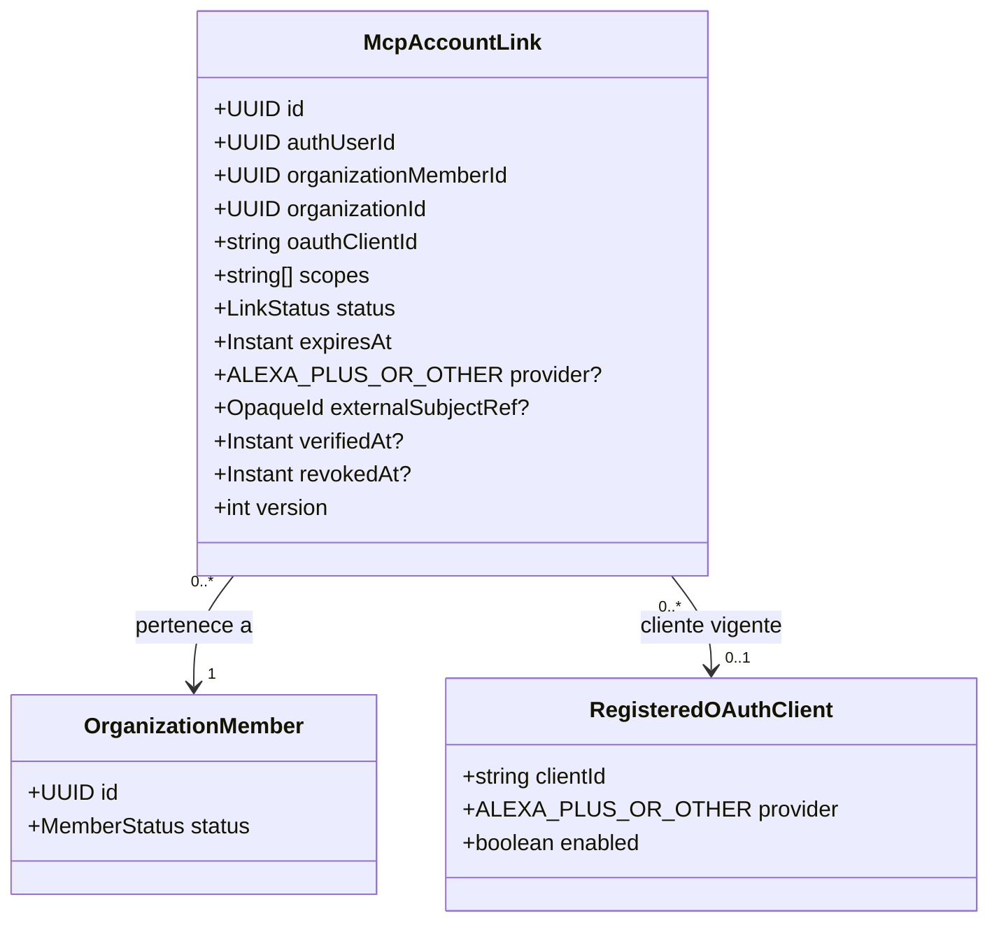

# McpAccountLink — revisión UML/diccionario 2026-10-09

Revisión identificada de HAC-27/HAC-41 sobre `main` `42a4fde`. Conserva intactos el UML 07 original y el diccionario QA del 5 de octubre; no modifica esquema, permisos ni entorno alojado. La [reconciliación histórica](../delivery/HAC27_UML_ATTRIBUTE_DICTIONARY_2026-10-02.md) permanece como evidencia de aquel corte.

## UML de lectura y uso

`provider?`, `externalSubjectRef?` y `verifiedAt?` son **nullable en la lectura de registros históricos**. En un vínculo utilizable por MCP, los tres son obligatorios y verificados; la nulabilidad de almacenamiento no rebaja esa guarda. El cliente registrado no convierte un link histórico en verificado por sí solo.

## Diccionario revisado

| Atributo | Persistencia / lectura | Historia anterior a HAC-41 | Link utilizable para MCP |
|---|---|---|---|
| `id`, `authUserId`, `organizationMemberId`, `organizationId`, `oauthClientId`, `scopes`, `status`, `expiresAt`, `version` | `mcp_account_links` / `GET /api/v2/identity/mcp/links` | Se conserva el valor persistido | Deben coincidir usuario Auth, membresía/organización activas, cliente habilitado, scope, estado `ACTIVE` y vigencia |
| `provider` | `provider text NULL` | `null` permitido; proveedor desconocido | No nulo e igual al proveedor del cliente registrado |
| `externalSubjectRef` | `external_subject_ref text NULL` | `null` permitido; sujeto externo desconocido | No nulo e igual al UUID del usuario Auth autenticado |
| `verifiedAt` | `verified_at timestamptz NULL` | `null` permitido; no hay prueba de verificación | No nulo y no futuro; se registra tras consentimiento propio ligado al cliente |
| `revokedAt` | `revoked_at timestamptz NULL` | Se preserva la revocación histórica | Debe ser `null`; un replay no reactiva link revocado o expirado |

La lectura por RPC `read_v2_identity('links', …)` incluye historial del propio usuario aunque no sea utilizable. La evaluación `private.identity_link_active` requiere además cliente habilitado, miembro/organización activos, coincidencia de proveedor y sujeto, verificación y expiración futura. Las tools revalidan identidad y correo actual. No se rellenan retroactivamente campos desconocidos ni se declara Alexa+ live por ver `ALEXA_PLUS` en un registro.

## Certificación pendiente, por separado

- **OAuth real:** registrar y habilitar un cliente real en el entorno autorizado; probar autorización/denegación, consentimiento explícito, token y `client_id`, expiración, revocación y aislamiento con el proveedor externo. Las pruebas locales del SDK no certifican el proveedor alojado.
- **Alexa+ live:** obtener acceso al canal, configurar el endpoint MCP HTTPS y probar descubrimiento, linking, tools y revocación con una cuenta Alexa+ habilitada. No se infiere de la implementación del servidor.
- **Bedrock:** probar credenciales y modelo permitidos, región, cuota, streaming/fallback, costes y p50/p95 sobre un dataset reproducible de conversación. La selección de un modelo en código no certifica acceso ni calidad en producción.
