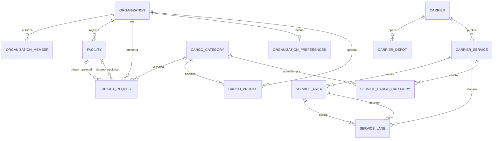
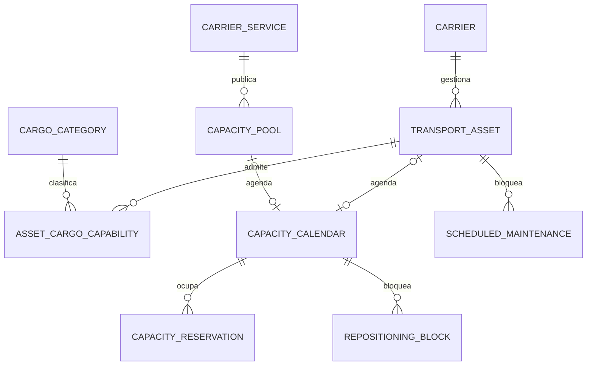
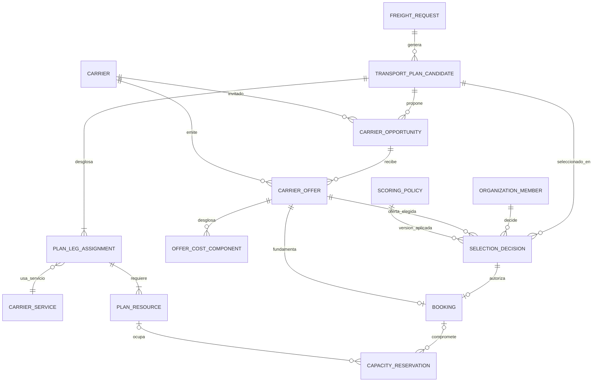

# DER lógico V2 — corte ROAD y contraste físico

**Estado:** propuesta de modelo lógico para revisión, no migración, esquema remoto certificado ni aprobación del UML manual. **Corte:** 24 sep 2026. La decisión comercial del MVP está en [PRODUCT_SCOPE](../contracts/PRODUCT_SCOPE.md); las cardinalidades de negocio completas están en [DOMAIN_UML_MODEL](./DOMAIN_UML_MODEL.md) y la revisión de clases en [CLASS_DIAGRAM_DESIGN](./CLASS_DIAGRAM_DESIGN.md).

## Alcance y fuente del contraste

Este DER separa **entidad persistente**, **valor/resultado derivado** y **objeto de aplicación o fixture**. Los nombres de entidades propuestas son lógicos: **no** reservan nombres finales de tabla ni autorizan una migración. La columna «físico» se comprobó contra las migraciones versionadas del repositorio, en particular [baseline legacy](../../../supabase/migrations/20260828200000_baseline_legacy_schema.sql), [identidad/intake](../../../supabase/migrations/20260828233233_add_cargomesh_identity_and_intent_contract.sql), [perfiles de carga](../../../supabase/migrations/20260829005625_add_organization_cargo_profiles_and_unitized_intake.sql), [idempotencia](../../../supabase/migrations/20260918120000_c_draft_creation_idempotency.sql) y [ROAD HAC-21](../../../supabase/migrations/20260922053512_v2_road_facilities_services.sql). **No se consultó el proyecto remoto `cargomesh-v2`**: no está disponible en la conexión Supabase de esta tarea. La existencia de una tabla legacy tampoco certifica semántica V2, datos V2 ni flujo live.

## 1. Núcleo lógico aprovechable hoy

`FREIGHT_REQUEST` tiene dos relaciones **distintas y opcionales** con `FACILITY`; sus FKs compuestas incluyen `organization_id` para impedir una sede de otro tenant. `SERVICE_LANE` exige un área incluida de `PICKUP` y otra de `DELIVERY`, del **mismo servicio** y en orden dirigido. Cero áreas/lanes no concede cobertura. La pareja `carrier_services.origin_* / destination_*` heredada **no** sustituye a `SERVICE_AREA` + `SERVICE_LANE` V2.

| Concepto lógico | Físico versionado | Resultado del contraste |
|---|---|---|
| `Organization`, `OrganizationMember`, preferencias | `organizations`, `organization_members`, `organization_preferences` | Existen; identidad y preferencias requieren evaluación de permisos/semántica V2. `allow_auto_booking` y `BALANCED` son herencia V1, no autorización V2. |
| `FreightRequest`, categoría, perfil y contacto | `freight_requests`, `cargo_categories`, `organization_cargo_profiles`; campos de contacto en `freight_requests` | Existen solicitud, categoría y campos de contacto. `CargoSpecification`/unidades viven en columnas y `cargo_specifications` JSONB; `ShipmentContact` no es tabla. Una solicitud enviada requiere unidades válidas, pero un borrador puede estar incompleto. |
| `Facility` y `CarrierDepot` | `facilities`, `carrier_depots` | Existen desde HAC-21, con RLS e índices; un depot no acredita cobertura. |
| `Carrier`, `CarrierService`, categorías admitidas | `carriers`, `carrier_services`, `carrier_service_cargo_categories` | Existen, pero conservan columnas/fixtures V1. La relación de categorías del servicio ya tiene tabla puente; no inferir capacidades de un activo concreto. |
| `ServiceArea`, `ServiceLane` | `service_areas`, `service_lanes` | Existen desde HAC-21 con RLS, FKs y validaciones ROAD; procedencia/vigencia son datos, no un motor de elegibilidad implementado. |
| `TransportAsset` ROAD | `vehicles` | Solo base legacy parcial: estado `AVAILABLE` no demuestra ventana libre, capacidad efectiva ni agenda. No asignar flota V1 al catálogo V2 por semejanza de nombres. |

## 2. Delta lógico para HITO 2 — elegibilidad y capacidad ROAD

`CAPACITY_CALENDAR` pertenece a **un activo o a un cupo, exclusivamente**; las dos asociaciones opcionales del dibujo requieren una guarda XOR en el diseño lógico/físico. `CAPACITY_RESERVATION` registra ocupación/hold por ventana, no un booking comercial. La respuesta `available / unavailable / unknown` es **derivada** de ventana, fuente y vigencia, reservas, mantenimiento, reposicionamiento y restricciones; no es una fila booleana de disponibilidad.

| Delta a resolver | Persistencia y seguridad necesarias | Issue/corte |
|---|---|---|
| Activo ROAD/cupo y capacidad física por tipo de carga | Reutilización controlada o extensión de `vehicles`, o nueva entidad; `CapacityPool` y capacidades de activo si el contrato lo requiere. Decidir sin mezclar catálogo V1 con V2. | [HAC-12](https://linear.app/hackatonteamcargomesh/issue/HAC-12/be-2-implementar-elegibilidad-road-y-capacidad-por-ventana-como), alcance mínimo de un recurso portador verificable. |
| Calendario, reservas, mantenimiento y reposicionamiento | Tablas/constraints por fuente y ventana, índices para consulta temporal y bloqueo de solapes; RLS y escritura por rol/servicio. Si no se entrega alguna fuente, devolver `unknown`, no afirmar capacidad. | HAC-12 + QA [HAC-13](https://linear.app/hackatonteamcargomesh/issue/HAC-13/qa-certificar-elegibilidad-road-identidad-mcp-y-paridad-webmcp-v2). |
| Vínculo de identidad MCP | `mcp_account_links` con organización, usuario, cliente, scopes/revocación, RLS y pruebas cross-tenant. **No es entidad comercial del DER**. | [HAC-11](https://linear.app/hackatonteamcargomesh/issue/HAC-11/be-1-persistir-account-linking-y-exponer-consulta-mcp-v2-de). |

## 3. Delta lógico comercial para Hitos 3–4

Este diagrama muestra el **objetivo lógico**, no que todas las asociaciones deban ser FKs simples. Una oferta debe referir **la misma** solicitud, plan, carrier, servicios y asignaciones que la oportunidad; no basta con cinco IDs independientes válidos. Una `SelectionDecision` del MVP ROAD selecciona **exactamente una** oferta USD y un plan, aunque la cardinalidad general permita una extensión futura. Cada `BOOKING` conserva decisión y oferta vigente; el shipper autoriza y el carrier confirma por separado. Una reserva interna puede ser un hold previo sin booking; para declarar capacidad comprometida se necesita reserva interna válida **o** compromiso externo verificable. La elección `0..1 Booking` por decisión es una propuesta para el primer corte, a ratificar con reglas de reintento/cancelación.

| Concepto | Físico actual | Decisión de transición |
|---|---|---|
| Plan candidato, asignación por tramo/recurso, oportunidad | Sin tablas V2 equivalentes en migraciones versionadas. | Diseñar identidad/snapshot, FKs y RLS antes de HITO 3. `RoutePlan`/`RouteLeg` podrían ser snapshot tipado o tablas si se requiere consulta/versionado; no crear ambos sin necesidad. |
| `CarrierOffer` y componentes | `carrier_offers` existe como tabla **V1**, con precio/moneda, `quote_breakdown` JSONB y scores heredados. | No tratarla como oferta V2 por existir. Exigir emisor, oportunidad, plan, servicios/tramos, fuente, vigencia y USD; decidir migración aditiva o estructura nueva, guardas de atribución, RLS e inmutabilidad/versionado. Desglose tipado puede persistirse en tabla hija o JSONB validado. |
| `ScoringPolicy`, `RankedOption` | `freight_decisions` guarda estrategia/score/snapshot V1; no hay política V2 versionada. | Política persistida/versionada para HITO 3. `RankedOption` es **resultado derivado**; solo guardar snapshot/auditoría si se necesita reproducibilidad, no tabla obligatoria. |
| `SelectionDecision`, `Booking`, compromiso | `freight_decisions` y `bookings` existen, pero con estados/campos de auto-selección y provider V1; no hay vínculo booking–reserva de capacidad V2. | HITO 4: decisión/autorización auditada, consistencia oferta-plan-carrier, idempotencia, concurrencia, confirmación y liberación. No activar `allow_auto_booking` heredado como autorización V2. |

## 4. No convertir cada clase UML en tabla

| Tratamiento | Ejemplos |
|---|---|
| Valores u objetos embebidos | `Money`, `TimeWindow`, `GeoLocation`, `CargoSpecification`, `ShipmentContact` y posiblemente `CargoUnit` en el primer corte. Sus invariantes siguen requiriendo validación, aunque no tengan tabla propia. |
| Resultado calculado / aplicación | `RankedOption`, `EligibilityDecision`, `RoutePlanner`, `CapacitySource` (interfaz), disponibilidad triestado. No son tablas por aparecer como caja UML. |
| Fixture aislado | `RouteSimulationScenario` y red/condiciones sintéticas: escenario V2 con seed/cleanup/verify y rótulo **simulado**; no migración de datos de demo ni geometría presentada como proveedor externo. |
| Diseño diferido | Flotas AIR/RAIL/SEA, multi-carrier/multi-oferta contractual, ratings de conductor, ejecución/incidencias automáticas, optimizador global, tarifas automáticas y `LogisticsNode`/`RouteCorridor` productivos. Se implementan solo con issue, datos, adaptador y pruebas. |

## 5. Reglas de aceptación antes de migraciones comerciales

1. Corregir conectores y nomenclatura del XML manual de clases; ratificar multiplicidades de revisiones de oferta, ruta alternativa y booking/hold. Hasta entonces el [editable `06`](../diagrams/review-2026-09-24/06-complete-classes-commercial-reviewed.drawio) es la última revisión versionada, no un DER aprobado.
2. Para cada tabla V2 nueva: dueño de escritura, tenant/rol, RLS, índices para FKs/ventanas, restricciones de unicidad y vigencia, pruebas negativas y limpieza del escenario. Para relaciones entre tenant y recursos, comprobar igualdad de organización además de existencia de UUID.
3. Probar disponibilidad positiva, negativa y desconocida; sede sin cobertura, lane inversa, reserva solapada, dato vencido, oferta ausente/vencida, USD inválido, emisor distinto y booking sin autorización. Una fila V1 o un mapa no satisface esos oráculos.
4. Separar `as-is` **de Git**, `as-is` del Supabase V2 remoto (pendiente de acceso/consulta) y `to-be` lógico. No modificar migraciones históricas ni hacer `db push` por este DER.
